# 发送没有后端的电子邮件

> 原文：<https://blog.devgenius.io/send-emails-without-backend-in-flutter-48d0c506ab4c?source=collection_archive---------0----------------------->

我试图建立一个与旋舞的联系形式，我正在寻找一个自由和简单的方式，通知发送者和接收者都通过电子邮件的联系信息。虽然有两种方法可以实现这一点，但我发现这是最简单的一种，它也适用于 Android、iOS 和 Web，因此我想把它分享给大家。

首先，我准备了这个基本的`**Form**` UI，其中有三个`**TextFormField**` s，分别是 Name、Email 和 Message，后面跟一个`**TextButton**`。

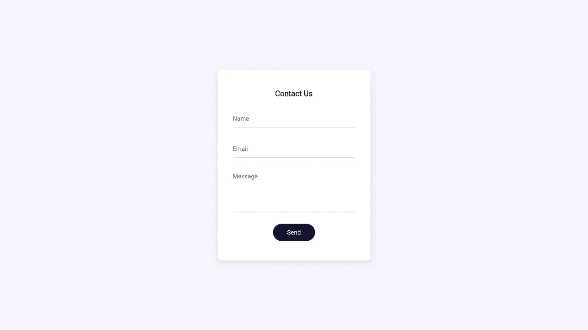

```
class MyHomePage extends StatelessWidget {
  MyHomePage({Key? key}) : super(key: key);final _formKey = GlobalKey<FormState>();
  final nameController = TextEditingController();
  final emailController = TextEditingController();
  final messageController = TextEditingController();
  [@override](http://twitter.com/override)
  Widget build(BuildContext context) {
    return Scaffold(
      backgroundColor: const Color(0xfff5f5fd),
      body: Center(
        child: Container(
          height: 450,
          width: 400,
          margin: const EdgeInsets.symmetric(
            horizontal: 40,
            vertical: 20,
          ),
          padding: const EdgeInsets.symmetric(
            horizontal: 40,
            vertical: 20,
          ),
          decoration: BoxDecoration(
              color: Colors.white,
              borderRadius: BorderRadius.circular(10),
              boxShadow: [
                BoxShadow(
                    offset: const Offset(0, 5),
                    blurRadius: 10,
                    spreadRadius: 1,
                    color: Colors.grey[300]!)
              ]),
          child: Form(
            key: _formKey,
            child: Column(
              mainAxisAlignment: MainAxisAlignment.spaceEvenly,
              children: [
                const Text('Contact Us',
                    style:
                        TextStyle(fontSize: 20, fontWeight: FontWeight.bold)),
                TextFormField(
                  controller: nameController,
                  decoration: const InputDecoration(hintText: 'Name'),
                  validator: (value) {
                    if (value == null || value.isEmpty) {
                      return '*Required';
                    }
                    return null;
                  },
                ),
                TextFormField(
                  controller: emailController,
                  decoration: const InputDecoration(hintText: 'Email'),
                  validator: (email) {
                    if (email == null || email.isEmpty) {
                      return 'Required*';
                    } else if (!EmailValidator.validate(email)) {
                      return 'Please enter a valid Email';
                    }
                    return null;
                  },
                ),
                TextFormField(
                  controller: messageController,
                  decoration: const InputDecoration(hintText: 'Message'),
                  maxLines: 5,
                  validator: (value) {
                    if (value == null || value.isEmpty) {
                      return '*Required';
                    }
                    return null;
                  },
                ),
                SizedBox(
                  height: 45,
                  width: 110,
                  child: TextButton(
                    style: TextButton.styleFrom(
                        primary: Colors.white,
                        backgroundColor: const Color(0xff151534),
                        shape: RoundedRectangleBorder(
                            borderRadius: BorderRadius.circular(40))),
                    onPressed: () {
                      if (_formKey.currentState!.validate()) {
                        //TODO: send email
                        nameController.clear();
                        emailController.clear();
                        messageController.clear();
                      }
                    },
                    child: const Text('Send', style: TextStyle(fontSize: 16)),
                  ),
                ),
              ],
            ),
          ),
        ),
      ),
    );
  }
}
```

我们有三个`TextEditingControllers`即`nameController`、`emailController`和`messageController`来处理对各自 TextFormFields 的更改。此外，我们还有一个名为`_formkey`的`GlobalKey`，它唯一标识表单并将帮助验证表单。

你可以参考这本烹饪书来了解更多关于在旋舞中构建一个具有验证的表单。

[](https://docs.flutter.dev/cookbook/forms/validation) [## 生成具有验证的表单

### 应用程序通常要求用户在文本字段中输入信息。例如，您可能要求用户使用…

docs . vout . dev](https://docs.flutter.dev/cookbook/forms/validation) 

注意:为了验证电子邮件字段，为了简单起见，我使用了[*email _ validator*](https://pub.dev/packages/email_validator)。

在发送电子邮件方面，我们将使用名为 EmailJS 的服务，该服务每月向 [*提供 200 个免费的*](https://www.emailjs.com/pricing/) 请求。

## 设置 EmailJS

1.  首先，你必须前往[*emailjs.com*](https://www.emailjs.com/)T21 并创建一个免费账户。

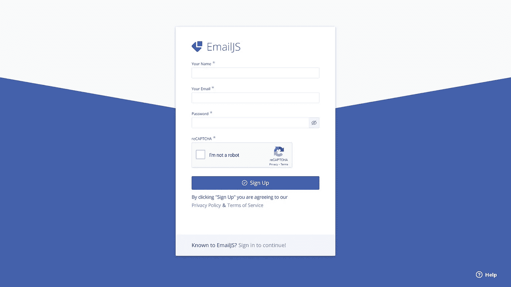

填写您的详细信息，然后点击“注册”

这样做之后，你会在仪表板上着陆。

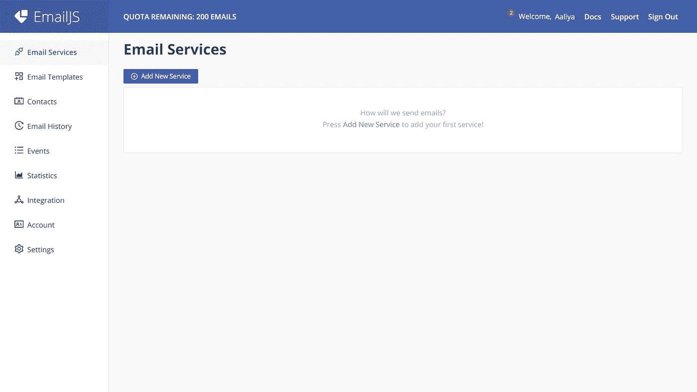

2.点击**新增服务**选择服务提供商，我会选择 Gmail **。**

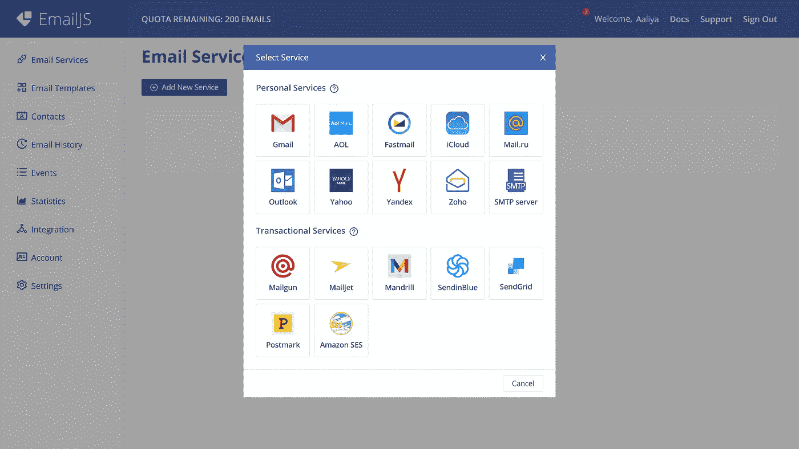

3.然后点击**连接账户**，选择你的账户，勾选“代发邮件”框，点击【继续】。然后单击“创建服务”。

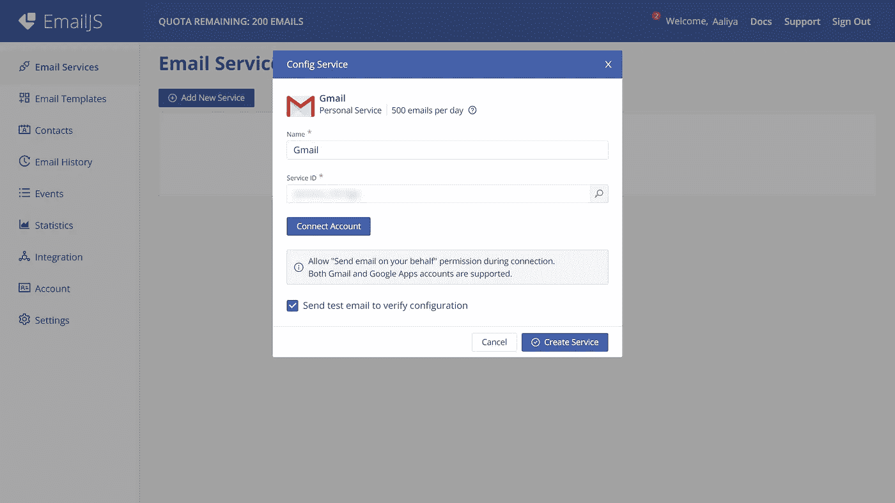

点击**连接账户**

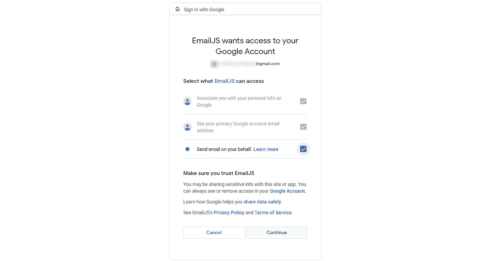

4.接下来，转到电子邮件模板标签，然后**创建新模板**。

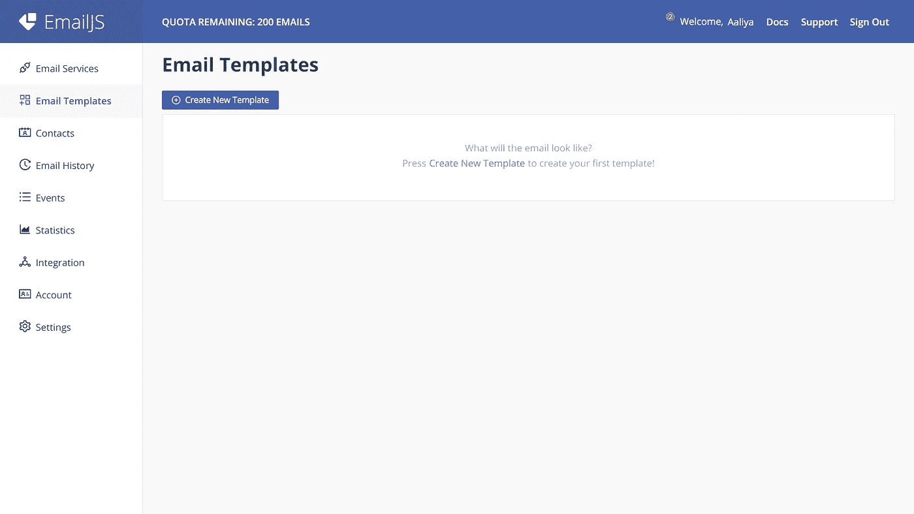

5.自定义此电子邮件模板的方式，你想。例如，我在“答复”部分中添加了发件人的电子邮件。然后点击**保存。**

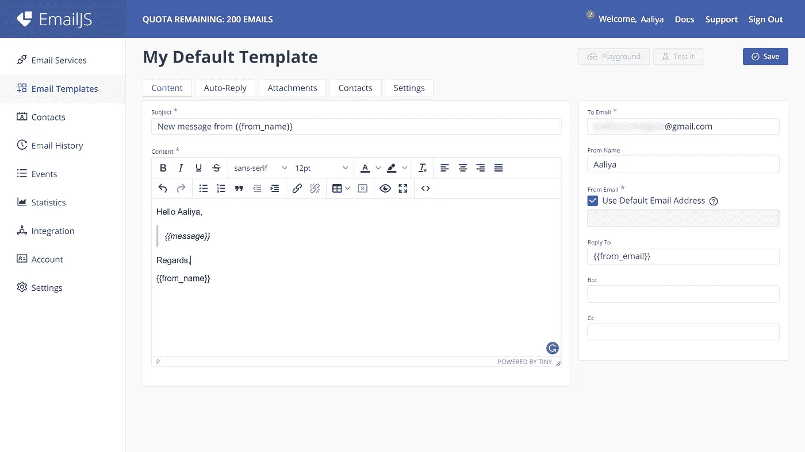

## 回归准则

现在我们将创建一个名为`sendEmail()`的新函数，它将返回一个`Future`，我们将调用发送按钮的`onPressed`内部。

```
Future sendEmail(String name, String email, String message) async {
  final url = Uri.parse('[https://api.emailjs.com/api/v1.0/email/send'](https://api.emailjs.com/api/v1.0/email/send'));
  const serviceId = 'YOUR_SERVICE_ID';
  const templateId = 'YOUR_TEMPLATE_ID';
  const userId = 'YOUR_USER_ID';
  final response = await http.post(url,
      headers: {'Content-Type': 'application/json'},//This line makes sure it works for all platforms.
      body: json.encode({
        'service_id': serviceId,
        'template_id': templateId,
        'user_id': userId,
        'template_params': {
          'from_name': name,
          'from_email': email,
          'message': message
        }
      }));
  return response.statusCode;
}
```

在 template_params 中，请确保指定模板中包含的所有参数。我的情况是`from_name`、`from_email`和`message`。

用各自的 id 替换`serviceId`、`templateId`和`userId`。你可以在这里找到它们:

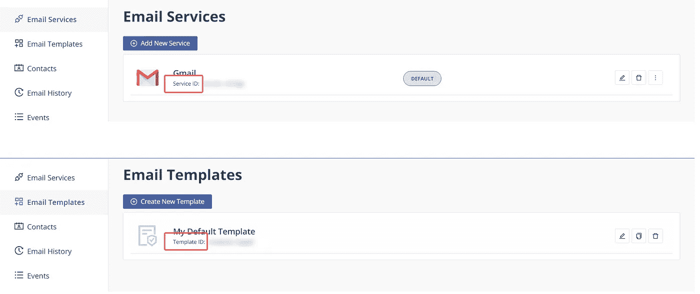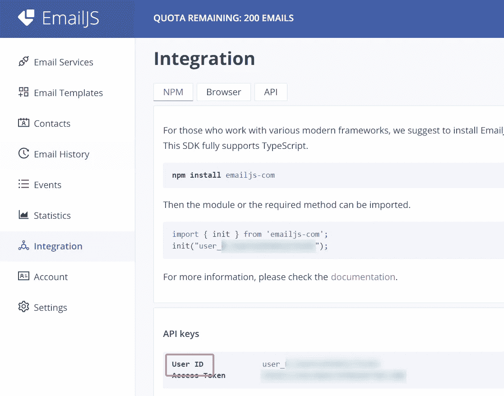

> **更新**:‘整合’页面已从仪表板中移除。API 键移至“帐户”页面。“用户 ID”重命名为“公钥”。已将“访问令牌”重命名为“私钥”。

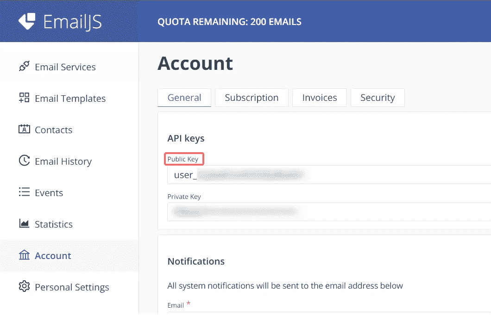

更新了查找用户 ID 的 SS

*为了增加安全性，您可以将域列入白名单，这将限制 API 调用到指定的域，然而，这碰巧是一个付费功能。*

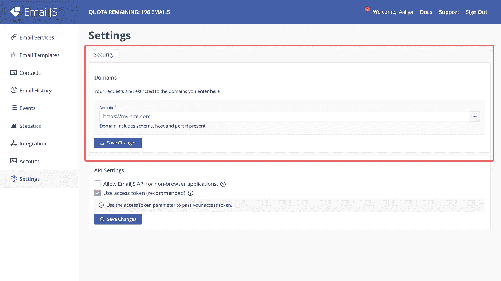

不要忘记在`pubspec.yaml`文件的依赖项下添加`http`，我们将需要它来发出 post 请求。

现在在`onPressed`中，如果所有的字段都被验证，我们将调用`sendEmail()`函数，该函数将发出 post 请求并返回`statusCode`。我们将检查请求是否成功，即`statusCode==200`，并显示一个带有成功消息的 SnackBar，否则，显示一个带有失败消息的 SnackBar。

```
onPressed: () async {
                      if (_formKey.currentState!.validate()) {
                        final response = await sendEmail(
                            nameController.value.text,
                            emailController.value.text,
                            messageController.value.text);
                        ScaffoldMessenger.of(context).showSnackBar(
                          response == 200
                              ? const SnackBar(
                                  content: Text('Message Sent!'),
                                  backgroundColor: Colors.green)
                              : const SnackBar(
                                  content: Text('Failed to send message!'),
                                  backgroundColor: Colors.red),
                        );
                        nameController.clear();
                        emailController.clear();
                        messageController.clear();
                      }
                    },
```

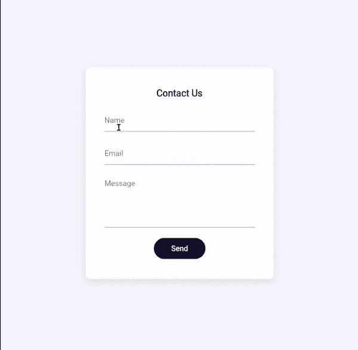

我们完事了。本教程到此为止。你可以在我的 GitHub 上找到完整的代码。

[](https://github.com/Aaliya-Ali/contact_form_flutter) [## GitHub-aa liya-Ali/contact _ form _ flutter

### 一个新的颤振项目。这个项目是颤振应用的起点。一些帮助您入门的资源…

github.com](https://github.com/Aaliya-Ali/contact_form_flutter) 

详细解释参考约翰内斯·米尔克的惊艳视频。

我希望这篇文章能帮助你学到一些新东西，如果有的话，别忘了留下一些掌声，它激励我继续写作。有建议？请在评论中告诉我。快乐学习！