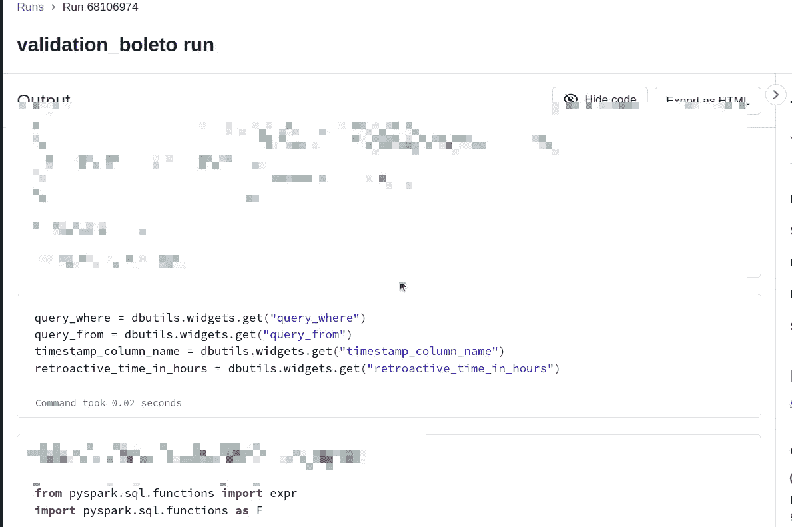

# 将信息从气流发送到数据块

> 原文：<https://blog.devgenius.io/send-information-from-airflow-to-databricks-bbcbbd827120?source=collection_archive---------9----------------------->


是的。我对此有些纠结。所以我写在这里是为了节省你寻找它的时间。如果你正在寻找逆流(最困难的)点击[这里](https://minhadona.medium.com/send-information-from-databricks-to-airflow-810a7d49ff81)阅读。

# 从气流到数据块

## **最简单的**

还记得您用来从气流任务中触发数据块作业的数据块操作符吗？为了将信息从 Airflow 传递到 Databricks 作业，有一个参数可以帮您做到这一点。是 notebook_task 的 json 参数里面的 base_parameters。

还记得 D [atabricks 操作符](https://airflow.apache.org/docs/apache-airflow-providers-databricks/2.5.0/_api/airflow/providers/databricks/operators/databricks/index.html)吗？您用它来触发气流任务中的数据块任务？为了将信息从 Airflow 传递到 Databricks 作业，有一个参数可以帮您做到这一点。是`notebook_task`的 json 参数里面的`base_parameters`。

为了举例说明这个动作，**记住**:

—此任务触发笔记本(即 **ipynb** 和**不是** a . **py** 文件)，所以要记住你设置的任何参数和配置都必须引用一个笔记本作业，而不是 Python 作业(大部分参数区分两者，只是一个提示)。

—此任务将触发一个将在现有集群上运行的笔记本。

—收到的参数/信息将作为 json 存储在 data brick 上，就像您通过 UI 在 data brick 工作流部分创建作业时在高级设置中设置的 json 参数一样。

使用 SubmitRunOperator 的代码段:

```
variable_validation = { 
    "pix": {
        "identification": "pix",
        "query_from": "table_name",
        "query_where": "where accountId in ('blabla')",
        "retroactive_time_in_hours": 24,
        "timestamp_column_name": "date"},

    "boleto": {
        "identification": "boleto",
        "query_from": "table_name",
        "query_where": "where accountId in ('blabla')",
        "retroactive_time_in_hours": 24,
        "timestamp_column_name": "date"}
    }

# --------------------
run_validation_for_boleto = DatabricksSubmitRunOperator(
        task_id=f'validation_boleto', 
        existing_cluster_id=DATABRICKS_DEFAULT_CLUSTER_ID,
        databricks_conn_id="CONNECTION_ID_TO_YOUR_DATABRICKS",
        notebook_task = {
            'notebook_path': '/Users/minhadona/GDP-2073',
            'base_parameters': variable_validation['boleto'] # dictionary
                                },
        do_xcom_push = True
        )
```

收到的参数显示在执行界面的“参数”部分。


实例化 DatabricksSubmit 运算符时 base_parameters 参数收到的运行 ID 和参数

在 Airflow 中触发作业后，接收到的值(在数据块上)可用于数据处理/转换，语法如下:



因此，要检索数据，使用 dbutils 库并获取值，就好像它们是分配给一个键的环境变量一样(dbutils.widgets.get)。您可以使用完全相同的方法从 [widgets](https://docs.databricks.com/dev-tools/databricks-utils.html) 、**中手动检索数据，但是请记住:出于这个目的，您不能使用从 AIRFLOW 接收的相同密钥来创建 WIDGET！否则收到的值会被 WIDGET 值覆盖！这一点很重要！**

所以请记住，您不能在笔记本中创建与接收到的 json 中包含的键相同的小部件(在这种情况下，您不能创建 id 为‘identificati on’，‘query _ from’，‘query _ where’等的小部件。)，否则小部件的默认值将覆盖从 json 接收的所有值。您只能对这些键使用“get”方法。不要用 json 中的相同键创建“测试”小部件。

> *如果你需要创建小部件只是为了*测试*你的笔记本，不要忘记使用*dbutils . widgets . remove all()*删除它们，并在触发 Airflow 上的这个笔记本之前删除/注释这个 remove 语句。*

如果您想在 Airflow 作业中进行不同的调用，迭代一个字典或做其他事情，您只需要传递不同的参数(在 for 循环中)。然后，每个调用再次为该笔记本触发一个新的数据块作业，该作业处理通过 Airflow 的 base_parameters 接收的新数据/json！

要将笔记本的结果/输出返回到 Airflow，请参见我的文章 [**将信息从数据块发送到 Airflow**](https://minhadona.medium.com/send-information-from-databricks-to-airflow-810a7d49ff81) **。**