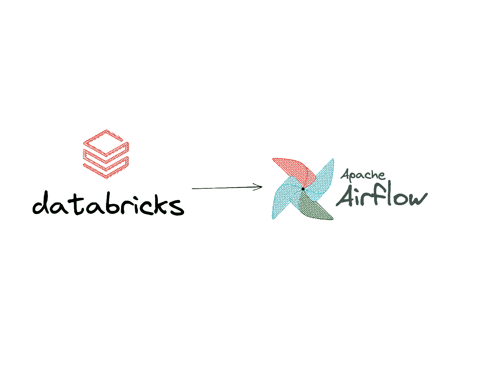
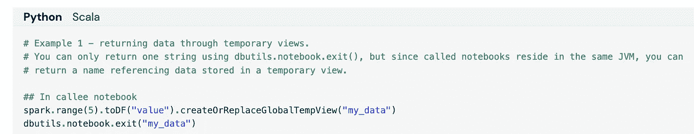
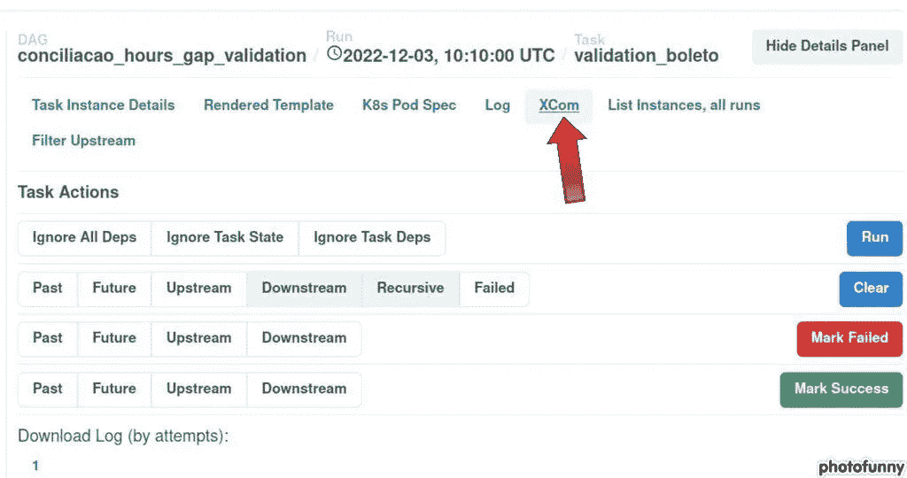
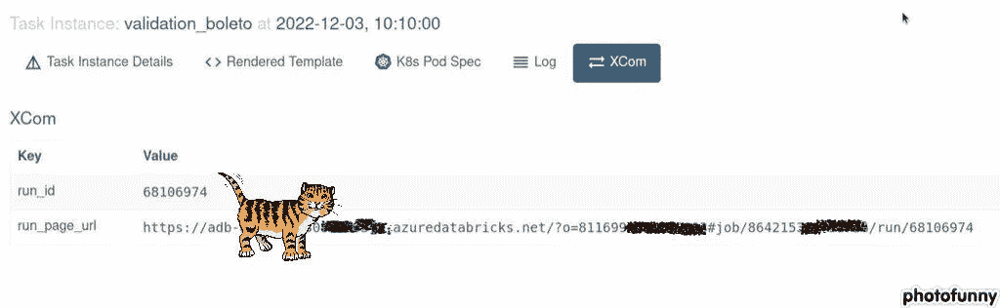
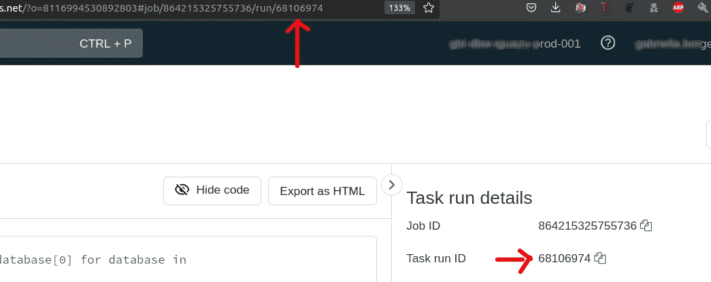
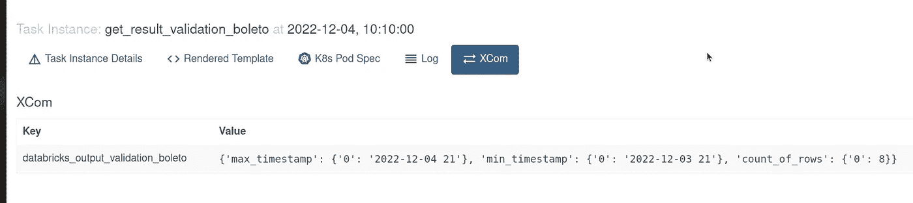
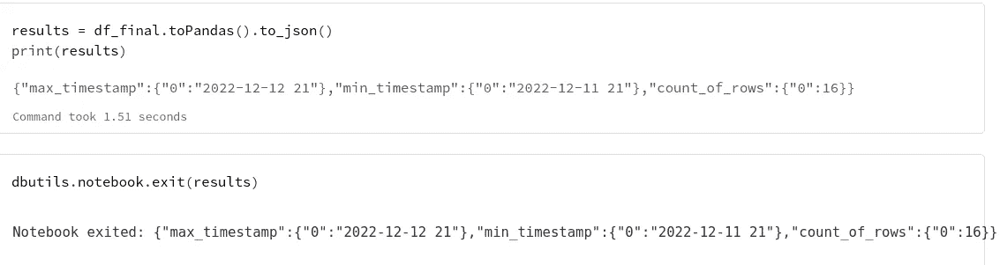

# 将信息从数据块发送到气流

> 原文：<https://blog.devgenius.io/send-information-from-databricks-to-airflow-810a7d49ff81?source=collection_archive---------2----------------------->



# 从数据块到气流

有时，我们需要将 Databricks 作业的输出发送到 Airflow，并采取行动(或不采取行动)，根据此 Databricks 作业上发生的情况分支 dag 的后续步骤。

我已经寻找，我已经阅读了许多文件，我找不到比这个更好的解决方案。所以开始了。

## 退出方法

仍然是在 [dbutils](https://docs.databricks.com/notebooks/notebook-workflows.html) 库中，您可以选择从笔记本中退出，并不完全是一个错误，即使它是意想不到的。因此，您可以使用下面的场景和选项来避免在运行时出现“失败”状态，而不是引发错误:

案例:您的作业运行来转换数据批次，这个特定的小批次带有一个完整的空列。嗯，这是有可能发生的。这不是错误。如果你用微型手表工作，这只是一件很随意的事情。让我们假设这不值得为您的业务规则发出警告，(并且仍然需要出现在日志中)。所以你可以用这种方式轻轻放下你的死刑:

```
dbutils.notebook.exit('received the x null column')
```

在 exit 函数中，您可以发送一条消息。在这种情况下，您的跑步将作为成功退出。你的信息会出现在日志上。

碰巧…

*   你有且只有一个**一个** **对象**可以通过 exit 方法发送。一个数字，一个字符串，一个布尔，一个字典等。因此，您可以发送/使用:

-exit(1)
-exit(' string message ')
-exit(False)
-exit(dictionary)
或者 exit(dataframe？？我还是没考)

*   但实际上这个**唯一的**对象将强制成为一个字符串。Databricks **将把这个对象转换成一个字符串。似乎他们已经鼓励我们以字符串形式发送了:**



“使用 dbutils.notebook.exit()[…]，只能返回**一个字符串**”。来源:[https://docs . databricks . com/notebooks/notebook-workflows . html](https://docs.databricks.com/notebooks/notebook-workflows.html)

嗯，不是这样的。我发了一个 json，number，bool，Databricks 没有抱怨。他们只是把我的信息转换成一个字符串，不管它以前是什么。*所以当你在你的 airflow 作业*中处理这个输出时，你需要注意它，无论你发送什么，当它到达 Airflow 时，它将是一个字符串。

## 正在检索退出消息

为了检索 Databricks 作业的输出，您需要向 Databricks API 发出 GET 请求。为此，有一个“操作符”(这个操作符实际上可以处理 Databricks 的 API 支持的几乎所有类型的请求)。

为了获得运行的输出，我们需要来自作业 jun 的唯一信息，即它的 RUN_ID。每个 Databricks 操作符(submit、run 等)都有一个参数，指定它是否应该推送包含该作业的 run_id 和 url_page 的 xcoms。url_page 是包含整个运行的 url(您可以通过 UI 获得这个 URL，并读取输出/日志/输入 JSON/日期和时间/持续时间等)。run_id 是曾经在数据块上运行的每个作业的唯一 id，它标识每个单独的运行。

此代码片段显示了一个 SubmitRunOperator，它触发一个名为 GDP-2073 的笔记本，将一个字典传递给 base_parameters 作为作业要使用的信息，并将 do_xcom_push 设置为 True:

```
from airflow.providers.databricks.operators.databricks import DatabricksSubmitRunOperator
from dag_validation_conciliacao.templates.variables import variable_validation

run_validation_for_boleto = DatabricksSubmitRunOperator(
        task_id=f'validation_boleto', 
        existing_cluster_id=DATABRICKS_DEFAULT_CLUSTER_ID,
        databricks_conn_id="iguazu_databricks",
        notebook_task = {
            'notebook_path': '/Users/minhadona/GDP-2073',
            'base_parameters': variable_validation['boleto'] # https://docs.databricks.com/dev-tools/api/2.0/jobs.html#jobsnotebooktask
                                },
        do_xcom_push = True
        )
```

运行成功后，单击您提交的 Databricks 操作符任务，并找到它的 Xcoms:



您可以看到该任务已经创建了两个 xcom:**run _ id**和 **run_page_url** 。



如果您复制并粘贴此 URL，您将在每次单元执行此运行(以及由 base_parameters 获得的参数)后找到带有代码+日志的数据块页面 UI:


实例化 DatabricksSubmit 运算符时 base_parameters 参数收到的运行 ID 和参数

附注:你也可以看到 URL 包含了 run_id:



## 数据块提供程序:数据块钩子

为了获得这个笔记本的输出(exit 对象)，我们将向这个 run URL 发出一个请求 ***。为此，您可以通过调用 [*_do_api_call*](https://airflow.apache.org/docs/apache-airflow-providers-databricks/1.0.0/_api/airflow/providers/databricks/hooks/databricks/index.html#airflow.providers.databricks.hooks.databricks.DatabricksHook._do_api_call) 方法，使用**请求库**来操作数据块 API 端点或**自己的数据块钩子库**。***

唯一需要的参数是 run_id。这正是因为 **run_id 是**一个已执行的笔记本/python 作业的唯一标识符。如下面的代码所示:

```
from airflow import DAG
from airflow.providers.databricks.hooks.databricks import DatabricksHook
from airflow.decorators import task

@task(task_id=f'get_result_validation_boleto', retries=2)
    def get_result_boleto(ti=None):
            run_id = ti.xcom_pull('validation_boleto', key='run_id') # pull the run_id pushed from another task
            print(f'|run_id|: {run_id}')
            run_page_url = ti.xcom_pull('validation_boleto', key='run_page_url')
            print(f'|run_page_url|: {run_page_url}')
            databricks_hook = DatabricksHook(databricks_conn_id="CONNECTION_ID_TO_YOUR_DATABRICKS")
            result = databricks_hook._do_api_call(("GET", f"api/2.0/jobs/runs/get-output?run_id={run_id}"), {} )
            print(f'|result|: {result}')
            output_run = result["notebook_output"]["result"]
            print(f'|output_run|: {output_run}\n |output_run_type|: {type(output_run)}') #always string
            import json 
            output_run = json.loads(output_run) # now the string will be pushed as json to a xcom
            print(f'|output_run max_timestamp|: {output_run["max_timestamp"]["0"]}')
            ti.xcom_push(key=f'databricks_output_validation_boleto',value = output_run) 
    get_result_boleto = get_result_boleto()
```

这段代码检索笔记本输出，将其转换为 json(它被转换为 string)并使用键*data bricks _ output _ validation _ boleto*推送到另一个 Xcom，这样我们就可以在下一个任务中使用它了！

通过点击这个*get _ result _ validation _ boleto*任务，我们将能够看到作为 json 推送的 XCOM(它是使用我想要作为 Databricks 笔记本上的输出发送的 dataframe 生成的，因此下一步将取决于 *count_of_rows* 列的值)。



向 Databricks run_id 发出 GET 请求并接收通过 dbutils.exit()方法传递的值作为答案后，推送的 Xcom。

因此，如果你迭代一个字典，对于每个键，你通过 base_parameters，一个新的任务被创建，因此一个新的作业运行将…嗯…用新获得的参数运行。这个新的运行将有一个惟一的 run_id，下一个也是，下一个也是……对于每个运行，您可以使用这个方法来检索 Databricks 输出，评估或推送到可用于其他任务的新 Xcoms。

## 我是这样把表作为 json 发送回去的:



我们的目的是简单地将这个 json 文件转换成 Pandas dataframe，然后返回到 Airflow，这样我们就可以操作/查阅甚至通过电子邮件发送这个最后的小表格。