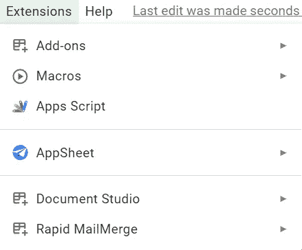
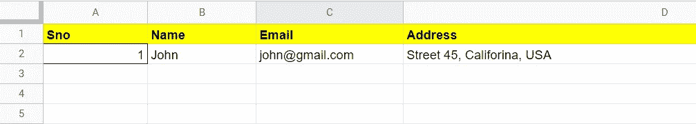

# 使用 Google 电子表格中的 Google Apps 脚本发送大量电子邮件

> 原文：<https://blog.devgenius.io/send-mass-emails-using-google-apps-script-from-a-google-spreadsheet-fc2f79c9febd?source=collection_archive---------2----------------------->


图片来源:Enginemailer

你好，学习者，

在当今世界，每个人都时间紧迫，他们希望尽快完成任务。在这期间，我们必须给那群人发电子邮件，邀请他们参加会议，以及其他因人而异的细节。所以给一群人一个一个发这样的详细信息的邮件，会非常耗费时间，也会增加发送的详细信息出错的几率。

在本文中，我们将看到—“**如何使用 Google Apps 脚本**从 Google 电子表格发送批量电子邮件”。

# 你会从中得到什么好处？

1.  基于您需求的个性化电子邮件
2.  向群组发送电子邮件时节省的工作量
3.  用正确的细节与正确的观众互动

# 使用 Google 电子表格批量发送电子邮件的 Google Apps 脚本实现

我们将按照这些步骤来开发批量电子邮件模板。

1.  在你的硬盘上创建一个新的谷歌电子表格。
2.  为栏提供您需要的数据，如电子邮件、姓名、个性化信息等。
3.  打开 Google Apps 脚本编辑器编写脚本。

脚本编辑路径:**扩展= > Apps 脚本** *(来自电子表格菜单选项)*



谷歌电子表格扩展菜单栏

当我们继续进行脚本开发时，让我们回顾一下这些步骤。

**步骤 1:** 在这一步中，我们将创建一个包含所需列的 Google 电子表格。对于这个示例，我添加了三列——姓名、电子邮件和地址。请参见下图中的示例。



谷歌电子表格演示图片

**第二步:**创建电子表格模板后打开脚本编辑器，编写下面的**sendmeil()**函数。

```
function sendEmail(){var ss = SpreadsheetApp.openById("Your_Spreadsheet_ID");var sheet = ss.getSheetByName("Your_SheetName");var json_data = getData(sheet);for(var j=0;j<json_data.length;j++) {var message="Dear "+json_data[j].name+",<br><br> I am glad to invite you at the following address: "+ json_data[j].address +".<br><br>";message=message+"Best wishes,<br>"+"Team<br><br>";MailApp.sendEmail({to: json_data[j].email, cc: 'Your_CC_email_ID', subject: "Invitation", htmlBody: message, noReply:true} );}}
```

我们已经在示例发送电子邮件函数中定义了**电子表格 id** 和**工作表名称**。我们的下一节将描述调用 **getData()** 函数后会发生什么，该函数以 JSON 格式返回电子表格数据。之后我们编写了一个邮件模板，其中设置了 JSON 参数，如姓名、电子邮件、邮件内容之间的地址，并且调用了 **MailApp** 库函数来发送邮件。整个过程会在一个等于 JSON 数组长度的循环中被调用，这个长度就是 Google 电子表格中的总人数。

第三步:我们需要定义 **getData()** 函数，让我们看看它的代码。编写 **getData()** 函数来获取 JSON 格式的 Google 电子表格数据。

```
function getData(sheet){ var jo = {}; var dataArray = [];// collecting data from 2nd Row , 1st column to last row and last    // column sheet.getLastRow()-1var rows = sheet.getRange(2,1,sheet.getLastRow()-1, sheet.getLastColumn()).getValues();for(var i = 0, l= rows.length; i<l ; i++){ var dataRow = rows[i];
     var record = {};
      record['sno'] = dataRow[0];
      record['name'] = dataRow[1];
      record['email'] = dataRow[2];
      record['address']=dataRow[3];
      dataArray.push(record);
   } jo = dataArray;
   var result = JSON.stringify(jo);return jo;
}
```

我们上面声明的函数已经定义了如下几个参数:工作表、最后一行和最后一列的范围，以及数组形式的范围值，它将以 JSON 格式返回完整的范围值。

**步骤 4:** 这是**奖励**步骤，如果你想运行这个功能或从谷歌电子表格的前端调用发送电子邮件功能，你可以在谷歌应用程序脚本的顶部使用下面的脚本。

```
function onOpen(e) {// Add a custom menu to the spreadsheet.SpreadsheetApp.getUi() // Or DocumentApp, SlidesApp, or FormApp.
.createMenu('Custom Menu')
.addItem('Send Emails', 'sendEmail'
.addToUi();}
```

在上面的代码中，当执行 **onOpen()** 函数时，一个名为“**自定义菜单**的自定义菜单被添加到电子表格菜单选项的右侧。**senemail()**函数需要在自定义菜单下定义，方法是添加 **addItem** 库函数，作为另一个选项从前端调用它。

如果你有兴趣学习 Google Apps 脚本和自动化你的 Google Workspace？必须试试这本**电子书**上的“ [**谷歌应用套件脚本:初学者指南**](https://www.amazon.com/dp/B0BTJC9X5R) ”

希望这篇文章能帮助你了解如何发送个性化的群发邮件。如有疑问，欢迎留言评论。我很乐意帮助你。

快乐学习！