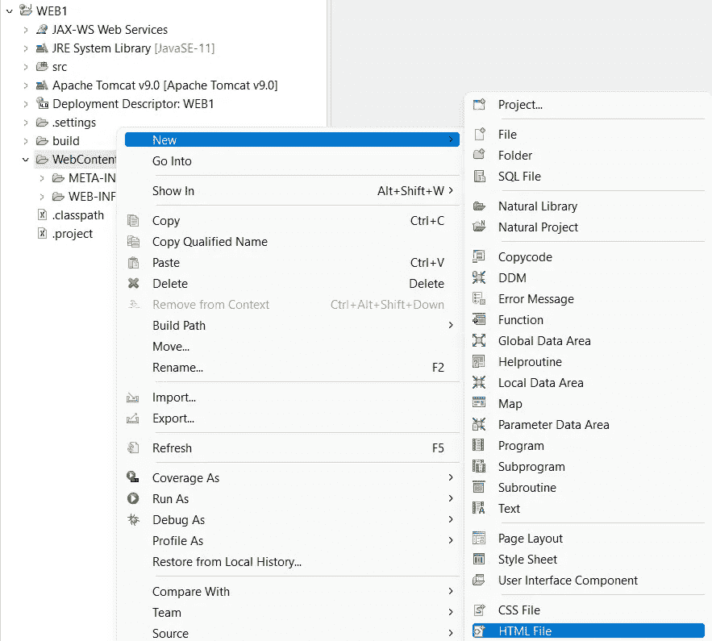

# 发送带有 JWT 令牌的 AJAX 请求来访问 ADABAS REST Web 服务

> 原文：<https://blog.devgenius.io/sending-ajax-request-with-jwt-token-to-access-adabas-rest-web-services-28baa254e9ae?source=collection_archive---------2----------------------->

## REST、JWT 和 AJAX 的实际例子


帕万·特里库塔姆在 [Unsplash](https://unsplash.com?utm_source=medium&utm_medium=referral) 上的照片

REST(**RE**presentational**S**tate**T**transfer)是由 [Fielding (2000)](https://dl.acm.org/doi/10.5555/932295) 创造的一个术语，指的是一种描述 web 环境中客户端和服务器之间的请求/响应消息的架构风格(参见 [TechTarget REST](https://www.techtarget.com/searchapparchitecture/definition/REST-REpresentational-State-Transfer) )。REST 请求通常包含以下组件:(1)唯一资源标识符(URI)，(GET、POST PUT 和 DELETE 等方法，(3)头，(4)有效负载和(5)参数(参考 [Amazon Restful API](https://aws.amazon.com/what-is/restful-api/) )。REST 还包括一个认证机制来证明发送者的身份，以及一个授权令牌，发送者在访问某些受保护的 API 时必须提供这个令牌。这篇文章展示了一个使用 JWT 令牌发送 AJAX 请求来访问 ADABAS REST web 服务的实例。AJAX 请求将使用 jQuery 实现(参考 [jQuery AJAX](https://api.jquery.com/jQuery.ajax/) )，而页面样式采用 Bootstrap 库(参考 [Bootstrap 介绍](https://getbootstrap.com/docs/5.0/getting-started/introduction/))。

```
PRE-REQUISITE:
(1) ADABAS Server Community Edition (Docker Version). 
(2) NATURAL ONE IDE v.9.1.4.
(refer [here](https://medium.com/@mohamad.razzi.my/getting-started-with-adabas-natural-part-1-6597688406ad) for the [setup guide](https://medium.com/@mohamad.razzi.my/getting-started-with-adabas-natural-part-1-6597688406ad)).
(3) Postman REST client application.
(4) Firefox web browser with CORS-disabled plugin (refer [here](https://addons.mozilla.org/en-US/firefox/addon/cors-everywhere/) for the [setup guide](https://addons.mozilla.org/en-US/firefox/addon/cors-everywhere/))
```

# (1)创建一个动态 Web 项目

在 IDE 中，转到菜单并选择文件/新建/其他…然后，在“选择向导”对话框中，选择 Web/动态 Web 项目。单击下一步按钮。


在下一个对话窗口中，开发人员需要指定一个目标运行时。NATURAL ONE IDE 已经捆绑了 Tomcat 版本 9。单击新建运行时。在新的服务器运行时环境窗口中，在服务器列表中选择 Tomcat version 9，单击 Next 按钮。然后，浏览位于自然的 ONE IDE 根文件夹的一个子文件夹中的 Tomcat 包。单击完成按钮。


在这个阶段，Apache Tomcat v9.0 已经被设置为目标运行时，动态 web 模块版本已经被设置为 4.0。单击完成按钮。


继续使用建议的选项来打开 Java EE 透视图。


已经创建了一个新项目，其中 **WEB1** 作为**上下文根**，而 **WebContent** 作为**内容目录**。


# (2)创建登录页面

右键单击 WebContent 文件夹，选择新建/HTML 文件。



按如下方式编辑文件。

```
<!DOCTYPE html>
<html lang="en">
<head>
  <title>Login</title>
  <meta charset="utf-8">
  <meta name="viewport" content="width=device-width, initial-scale=1">
  <script src="[https://ajax.googleapis.com/ajax/libs/jquery/3.6.0/jquery.min.js](https://ajax.googleapis.com/ajax/libs/jquery/3.6.0/jquery.min.js)"></script>
  <link href="[https://cdn.jsdelivr.net/npm/bootstrap@5.2.2/dist/css/bootstrap.min.css](https://cdn.jsdelivr.net/npm/bootstrap@5.2.2/dist/css/bootstrap.min.css)" rel="stylesheet">
  <script src="[https://cdn.jsdelivr.net/npm/bootstrap@5.2.2/dist/js/bootstrap.bundle.min.js](https://cdn.jsdelivr.net/npm/bootstrap@5.2.2/dist/js/bootstrap.bundle.min.js)"></script>
</head>
<body><div class="container mt-3" style="width:400px;">
  <h2>User login</h2>
  <div>
    <div class="mb-3 mt-3">
      <label for="usr">Username:</label>
      <input type="text" class="form-control" id="usr" placeholder="Enter username" name="usr">
    </div>
    <div class="mb-3">
      <label for="pwd">Password:</label>
      <input type="password" class="form-control" id="pwd" placeholder="Enter password" name="pwd">
    </div><button onclick="prepLogin()" class="btn btn-primary">Login</button>
  </div>
</div></body>
</html>
```

保存。

运行项目，即右键单击项目，选择运行方式/在服务器上运行。


IDE 可能会要求选择服务器。确认选择 Tomcat v9.0 服务器，然后单击 Finish。


登录页面可以通过网址[https://localhost:8080/web 1/log in . html](https://localhost:8080/WEB1/login.html)浏览。如今，大多数网络浏览器都有阻止 AJAX 功能的 CORS 保护。建议使用带有 [CORS 禁用插件](https://addons.mozilla.org/en-US/firefox/addon/cors-everywhere/)的 Firefox 来测试该项目的网页。


接下来，添加 JavaScript 代码。将增加两个功能，即 **prepLogin()** 和 **reqsLogin()** 。 **prepLogin()** 将获得用户名和密码的输入。输入将被编码为 base64 字符串，以遵循基本的 REST auth 格式。编码后的字符串将被发送到函数 **reqsLogin()** 。函数 **reqsLogin()** 将把编码后的字符串附加到 XHR 对象上，然后向服务器发送一个请求。在本练习中，服务器将是运行在端口 8190 上的 ADABAS REST 服务(参见[设置指南](https://medium.com/@mohamad.razzi.my/getting-started-with-adabas-natural-part-1-6597688406ad)中的[)。](https://medium.com/@mohamad.razzi.my/getting-started-with-adabas-natural-part-1-6597688406ad)

```
<!DOCTYPE html>
<html lang="en">
<head>
  <title>Login</title>
  <meta charset="utf-8">
  <meta name="viewport" content="width=device-width, initial-scale=1">
  <script src="[https://ajax.googleapis.com/ajax/libs/jquery/3.6.0/jquery.min.js](https://ajax.googleapis.com/ajax/libs/jquery/3.6.0/jquery.min.js)"></script>  
  <link href="[https://cdn.jsdelivr.net/npm/bootstrap@5.2.2/dist/css/bootstrap.min.css](https://cdn.jsdelivr.net/npm/bootstrap@5.2.2/dist/css/bootstrap.min.css)" rel="stylesheet">
  <script src="[https://cdn.jsdelivr.net/npm/bootstrap@5.2.2/dist/js/bootstrap.bundle.min.js](https://cdn.jsdelivr.net/npm/bootstrap@5.2.2/dist/js/bootstrap.bundle.min.js)"></script>
</head>
<body><div class="container mt-3" style="width:400px;">
  <h2>User login</h2>
  <div>
    <div class="mb-3 mt-3">
      <label for="usr">Username:</label>
      <input type="text" class="form-control" id="usr" placeholder="Enter username" name="usr">
    </div>
    <div class="mb-3">
      <label for="pwd">Password:</label>
      <input type="password" class="form-control" id="pwd" placeholder="Enter password" name="pwd">
    </div><button onclick="**prepLogin()**" class="btn btn-primary">Login</button>
  </div>
</div><script>
**function prepLogin(){
 var usr=document.getElementById("usr").value||"-";
 var pwd=document.getElementById("pwd").value||"-";
 var encodedUsrPwd=btoa(usr+":"+pwd);
 reqsLogin(encodedUsrPwd);
}
function reqsLogin(encodedUsrPwd){
 var request = $.ajax({
    url:      "**[**http://localhost:8190/login**](http://localhost:8190/login)**",
    contentType: "application/json; charset=utf-8",
    dataType: "json",
    method: "POST",
    headers: {
       authorization: "Basic "+encodedUsrPwd
     }, 
    cache:    false,     
    data: {},
  }); 

 request.done(function(responseText) {
  console.log("done");
  console.log(responseText);
  });
 request.fail(function( jqXHR,statusText ) {
  console.log("fail");
  console.log( "Fail: " + statusText );
  }); 
 request.always(function() {****}); 
}**
</script>
</body>
</html>
```

保存文件。刷新页面。输入`username=admin`和`password=manage`。控制台窗口应显示从服务器收到的 JSON 响应。


添加一个引导模式以在登录请求期间显示旋转图标，如下所示。模态将被 jQuery 回调函数“always”隐藏。

```
<!DOCTYPE html>
<html lang="en">
<head>
  <title>Login</title>
  <meta charset="utf-8">
  <meta name="viewport" content="width=device-width, initial-scale=1">
  <script src="[https://ajax.googleapis.com/ajax/libs/jquery/3.6.0/jquery.min.js](https://ajax.googleapis.com/ajax/libs/jquery/3.6.0/jquery.min.js)"></script>  
  <link href="[https://cdn.jsdelivr.net/npm/bootstrap@5.2.2/dist/css/bootstrap.min.css](https://cdn.jsdelivr.net/npm/bootstrap@5.2.2/dist/css/bootstrap.min.css)" rel="stylesheet">
  <script src="[https://cdn.jsdelivr.net/npm/bootstrap@5.2.2/dist/js/bootstrap.bundle.min.js](https://cdn.jsdelivr.net/npm/bootstrap@5.2.2/dist/js/bootstrap.bundle.min.js)"></script>
</head>
<body><div class="container mt-3" style="width:400px;">
  <h2>User login</h2>
  <div>
    <div class="mb-3 mt-3">
      <label for="usr">Username:</label>
      <input type="text" class="form-control" id="usr" placeholder="Enter username" name="usr">
    </div>
    <div class="mb-3">
      <label for="pwd">Password:</label>
      <input type="password" class="form-control" id="pwd" placeholder="Enter password" name="pwd">
    </div><button onclick="prepLogin()" class="btn btn-primary" **data-bs-toggle="modal" data-bs-target="#myModal"**>Login</button>
  </div>
</div>
**<!-- The Modal -->
<div class="modal" id="myModal">
  <div class="modal-dialog">
    <div class="modal-content">
      <!-- Modal Header -->
      <div class="modal-header">
        <h4 class="modal-title">Wait...</h4>
        <button type="button" class="btn-close" data-bs-dismiss="modal"></button>
      </div>
      <!-- Modal body -->
      <div class="modal-body" style="text-align:center;">
        <div class="spinner-border"></div>
      </div>
    </div>
  </div>
</div>**<script>
function prepLogin(){
 var usr=document.getElementById("usr").value||"-";
 var pwd=document.getElementById("pwd").value||"-";
 var encodedUsrPwd=btoa(usr+":"+pwd);
 reqsLogin(encodedUsrPwd);
}
function reqsLogin(encodedUsrPwd){
 var request = $.ajax({
     url:      "[http://localhost:8190/login](http://localhost:8190/login)",
        contentType: "application/json; charset=utf-8",
        dataType: "json",
  method: "POST",
  headers: {
       authorization: "Basic "+encodedUsrPwd
     }, 
    cache:    false,     
    data: {},
  }); 

 request.done(function(responseText) {
  console.log("done");
  console.log(responseText);
  });
 request.fail(function( jqXHR,statusText ) {
  console.log("fail");
  console.log( "Fail: " + statusText );
  }); 
 **request.always(function() {
  $('#myModal').modal('hide');
  });** 
}
</script>
</body>
</html>
```


添加代码以将令牌保存到会话存储中。

```
...
 request.done(function(responseText) {
  console.log("done");
  console.log(responseText);
  **sessionStorage.setItem("token",responseText.token)**
  });
...
```


# (3)创建第二页

创建一个新的 HTML 文件，manage.html

```
<!DOCTYPE html>
<html lang="en">
<head>
  <title>Manage</title>
  <meta charset="utf-8">
  <meta name="viewport" content="width=device-width, initial-scale=1">
  <script src="[https://ajax.googleapis.com/ajax/libs/jquery/3.6.0/jquery.min.js](https://ajax.googleapis.com/ajax/libs/jquery/3.6.0/jquery.min.js)"></script>  
  <link href="[https://cdn.jsdelivr.net/npm/bootstrap@5.2.2/dist/css/bootstrap.min.css](https://cdn.jsdelivr.net/npm/bootstrap@5.2.2/dist/css/bootstrap.min.css)" rel="stylesheet">
  <script src="[https://cdn.jsdelivr.net/npm/bootstrap@5.2.2/dist/js/bootstrap.bundle.min.js](https://cdn.jsdelivr.net/npm/bootstrap@5.2.2/dist/js/bootstrap.bundle.min.js)"></script>
</head>
<body>
<nav class="navbar navbar-expand-sm navbar-dark bg-dark">
  <div class="container-fluid">
    <a class="navbar-brand" href="javascript:void(0)">Logo</a>
    <button class="navbar-toggler" type="button" data-bs-toggle="collapse" data-bs-target="#mynavbar">
      <span class="navbar-toggler-icon"></span>
    </button>
    <div class="collapse navbar-collapse" id="mynavbar">
      <ul class="navbar-nav me-auto">
        <li class="nav-item" style="margin-top:-12px;">
          <a class="nav-link active" href="javascript:void(0)">Link</a>
        </li>
        <li class="nav-item" style="margin-top:-12px;">
          <a class="nav-link" href="javascript:void(0)">Link</a>
        </li>
        <li class="nav-item" style="margin-top:-12px;">
          <a class="nav-link" href="javascript:void(0)">Link</a>
        </li>
      </ul>
      <div class="d-flex">
        <input class="form-control me-2" type="text" placeholder="Search" **id="empid"**>
        <button class="btn btn-primary" type="button" onclick="**prepSearch()**">Search</button>
      </div>
    </div>
  </div>
</nav>
<script>
**function prepSearch(){****}**
</body>
</html>
```


给文件**index.html**中的函数 **reqsLogin()** 添加代码，将其重定向到**manage.html**。

```
...
 request.done(function(responseText) {
  console.log("done");
  console.log(responseText);
  sessionStorage.setItem("token",responseText.token);
  **window.location = './manage.html';**
  });
...
```

在**<>**标签中添加一个 **onload** 属性，在 **< body >** 加载时调用函数 **checkToken()** ，并将 **< body >** 样式设置为**【无】**(隐藏)，直到检查令牌的有效性。

```
<body **onload="checkToken()"** style="display:none;">
```

向函数 checkToken()添加代码，以检查令牌并执行后续操作，即:
(1)从**会话存储中检索令牌数据**。
(2)提取**到期时间**。
(3)将**到期时间**与**当前时间**进行比较。将结果保存在 **isExpired** 中。
(4)如果 isExpired 为真，重定向到**登录页面**。否则，显示页面**正文<页面>正文**内容。

```
<script>
function checkToken(){
 const JWT = sessionStorage.getItem("token");
 const jwtPayload = JSON.parse(window.atob(JWT.split('.')[1]))
 const datetime=new Date(jwtPayload.exp*1000);
 console.log("expiry time (epoch):",jwtPayload.exp * 1000);
 console.log("expiry time (ISO):", datetime.toISOString());
 const isExpired = Date.now() >= jwtPayload.exp * 1000;
 console.log("token is expired:",isExpired);
 if (isExpired==true){
  window.location = './login.html';
 }else{
  document.getElementsByTagName("body")[0].style.display = "block";
 }
}
</script>
```

为了访问受保护的 API，REST 请求中包含了有效的令牌。下面的代码演示了一个 REST 请求，该请求基于包含授权令牌的雇员 id 来查找雇员。

```
 ...
function prepSearch(){
 var empid=document.getElementById("empid").value||"-";
 reqsSearch(empid);
}
function reqsSearch(empid){
 console.log(empid); 
 const JWT = sessionStorage.getItem("token");
 var request = $.ajax({
  url:      "http://localhost:8190/rest/map/EmployeeMap?search=Id="+empid,
    method: "GET",
    timeout: 0,
  headers: {
        **authorization: "Bearer "+JWT**
     }
  });  
 request.done(function(responseText) {
  console.log("done");
  console.log(responseText);
  });
 request.fail(function( jqXHR,statusText ) {
  console.log("fail");
  console.log( "Fail: " + statusText );
  }); 
 request.always(function() {
  $('#myModal').modal('hide');
  }); 
}
...
```


上面的代码演示了 REST、JWT 和 AJAX 在实践中如何工作的一个简单例子。它们只是基本的想法。进一步的编码工作需要做，以使这个项目完美。

REST 的替代方案是简单对象访问协议(SOAP)。

未完待续。

本帖是“Adabas & Natural 入门”系列的一部分，该系列包括:
(1) [设置 Adabas & Natural 社区版(Docker 版)](https://medium.com/@mohamad.razzi.my/getting-started-with-adabas-natural-part-1-6597688406ad)。
(2) [通过 Adabas REST Web app 访问 Adabas 数据库](https://medium.com/@mohamad.razzi.my/getting-started-with-adabas-natural-part-2-34621e576fa4)。
(3) [Adabas“周期组”和 JSON 数据格式的“多值”表示](/getting-started-with-adabas-natural-part-3-a334822db12)。
(4) [使用 Adabas TCP-IP 节点包访问 Adabas 数据库](https://medium.com/@mohamad.razzi.my/getting-started-with-adabas-natural-part-4-728e6977ad4f)。
(5) [使用 NaturalONE IDE 的大型机编程(Natural)介绍](https://medium.com/@mohamad.razzi.my/getting-started-with-adabas-natural-part-5-1665a0be42ab)。
(6) [使用自然编程和自然 IDE 访问 Adabas 数据库](https://medium.com/@mohamad.razzi.my/getting-started-with-adabas-natural-part-6-48b4b2fd3e6d)。
(7) [大型机数据库编程基础](https://medium.com/@mohamad.razzi.my/mainframe-database-programming-fundamentals-b34fd88acf6e)。
(8) [大型机数据库编程中级](https://medium.com/@mohamad.razzi.my/mainframe-database-programming-27803b92a3a3)。
(9) [使用自然 AJAX 框架开发 AJAX 网页](https://medium.com/@mohamad.razzi.my/developing-ajax-web-pages-e270eb59fc92)。
(10)[AJAX 实际上是如何工作的](https://medium.com/@mohamad.razzi.my/how-does-ajax-actually-work-2f57cf4ddc55)？
(11) [向 ADABAS REST Web app 发送带有 JWT 令牌的 AJAX 请求](https://medium.com/dev-genius/how-does-ajax-actually-work-2f57cf4ddc55)。
(12)通过 Java Servlets 和 Java Web Services (SOAP)向 ADABAS REST 服务发送 HTTP 请求。