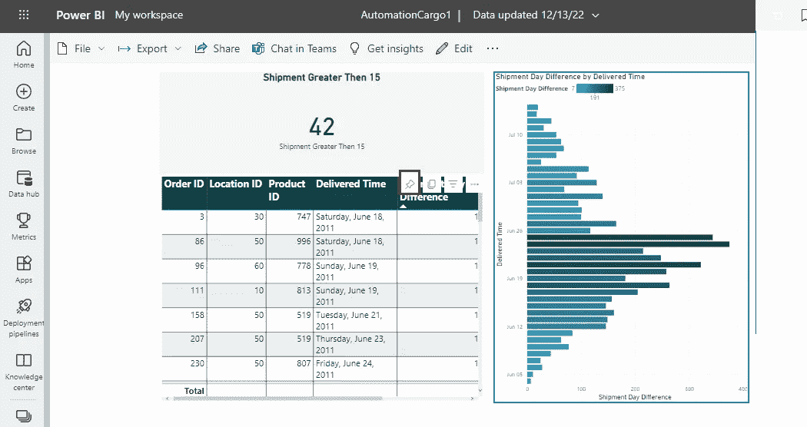

# 通过 Power Automate 发送电子邮件，解决 Power BI 中的发货延迟问题

> 原文：<https://blog.devgenius.io/sending-an-email-by-power-automate-for-shipment-latency-in-power-bi-eb9890375a6e?source=collection_archive---------5----------------------->

在这篇文章中，通过 Power BI 仪表板执行的 Power Automate 发送电子邮件。该仪表板包含装运可视信息，其中包括位置 ID、产品 ID、订单 ID 和装运时间属性。首先，完成数据准备和从 excel 源收集数据。然后，在 Power BI visual 上用一些统计工具对数据进行分析并发布。之后，在 Power Automate 中描述了邮件警报后，在 Power BI 服务屏幕上创建了警报。

# **1。数据准备和从源调用**

首先，为这个例子生成的表以 excel 格式从数据源调用。在 Power BI 中单击上传数据文件获取数据选项。

第二种方法是向现有表中添加列。该列包含 DATEDIFF 函数。您可以在 Microsoft Power BI Guide 网站中调查 DATEDIFF 函数。[【1】](https://learn.microsoft.com/en-us/sql/t-sql/functions/datediff-transact-sql?view=sql-server-ver16)。函数计算的发货开始时间和交付时间列的时间间隔。

然后，利用 chard、table 和 cards 可视化工具设计 BI 仪表盘。
在表格的左上角，大于 15 天的订单计数显示在卡片上。之后，仪表板发布以便查看 Power BI 服务。

# **2。描述电源 BI 服务的警报**

该步骤包含在发送电子邮件之前创建提醒。警报定义是在 Power Automate 中调整邮件发送所必需的。提醒 ID 将用于邮件设置偏好设置。

在“我的工作区”中，如您所见，AutomationCargo 报告类型单击。

之后，点击红色图标中的 pin 首选项。它提供调谐警报。

在打开的屏幕上，保存以将选择放入新仪表板。

最后，管理警报可以点击此页面。

管理警报首选项包括按重要性划分的条件和阈值。在这个例子中，延迟货物计数大于 20 或 15(如您所愿)订单在那里调整。警报时间表最多每 24 小时一次。您将在仪表板右侧的通知区域看到此警报。

# **3。使用 Power Automate 发送电子邮件**

在本节的中，根据 Power BI 点击 Power Automate 屏幕发送电子邮件。本章步骤包括选择邮件模块、在邮件模块中实施警报 ID 以及创建特定时间段的作业计划。

在 Power BI 服务上创建警报时，您描述 Power Automate 上的 ID。触发数据驱动警报时添加的 ID。

第二个是选择发送电子邮件选项。有三个必须填写的区域。

> 定义向谁发送邮件
> 
> 定义主题到哪个主题
> 
> 将消息正文定义为详细信息。

作为最后一步，保存按钮点击和发送邮件取决于预定的时间。

# **结论**

分别作为，执行数据收集和准备(包括一些列更改)、可视化、定义 Power BI 服务警报以及最后通过 Power Automate 流程发送邮件。[【二】](https://learn.microsoft.com/en-us/power-automate/email-top-scenarios)。这些微软工具用于装运的一个例子。自动邮件发送根据货件等待时间调整为特定周期。如果延期装运的订单数量超过 Power BI 服务警报功能上的警报中定义的数量，将向用户发送一封包含延期装运邮件详细信息的电子邮件。

# **参考文献**

[1][https://learn . Microsoft . com/en-us/SQL/t-SQL/functions/datediff-transact-SQL？view=sql-server-ver16](https://learn.microsoft.com/en-us/sql/t-sql/functions/datediff-transact-sql?view=sql-server-ver16)

[2][https://learn . Microsoft . com/en-us/power-automate/email-top-scenarios](https://learn.microsoft.com/en-us/power-automate/email-top-scenarios)