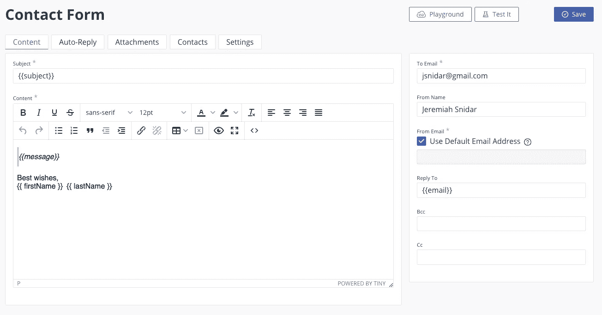
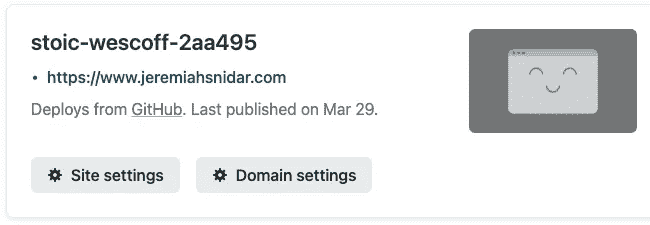
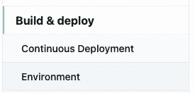

# 使用部署了 Netlify 的 React 和 EmailJS 发送客户端电子邮件

> 原文：<https://blog.devgenius.io/sending-client-side-emails-using-react-and-emailjs-deployed-with-netlify-965429e34441?source=collection_archive---------1----------------------->


当我创建我的[个人网站](https://www.jeremiahsnidar.com/)时，我想包含一个联系表单，用户可以给我发电子邮件。如果我有一个 Rails API，我可以使用[动作邮件](https://guides.rubyonrails.org/action_mailer_basics.html)。到目前为止，我还不需要这个项目的后端，所以我想探索只有前端的选项。我决定用电子邮件。**在本教程中，我将解释我如何创建带有电子邮件集成的联系表单。**

EmailJS 有很棒的[教程](https://www.emailjs.com/docs/tutorial/overview/)和使用 [React](https://www.emailjs.com/docs/examples/reactjs/) 的例子。我使用了他们的文档并做了一些调整。**在他们的例子中，他们使用了**[**useRef**](https://reactjs.org/docs/hooks-reference.html#useref)**hook 和**[**sendForm**](https://www.emailjs.com/docs/sdk/send-form/)**SDK。我喜欢使用 useState 创建受控表单，并发送包含表单数据的对象。**本教程使用**[**useState**](https://reactjs.org/docs/hooks-state.html)**和**[**send**](https://www.emailjs.com/docs/sdk/send/)**SDK。如果你上过熨斗学校，本教程将遵循你在那里学到的模式。****

## 关于客户端电子邮件的说明

在本教程中，我描述了使用。这只对 Github 隐藏了这些信息。**当您发送表单**的获取请求时，您的 id 仍然可以通过开发工具访问，这意味着有人可以使用该信息向您发送垃圾邮件。这就是 API 密钥必须存储在后端的原因，也是客户端发邮件很少的原因。我还是用了。环境和。gitignore 来防止有人从 Github 获取这些信息，但是这会给你一种错误的安全感。

**有办法减轻暴露这些信息的影响，但你无法阻止。只需支付少量费用(每月 5 美元)，你就可以将你的域名列入白名单，使其成为唯一可接受的请求源。你也可以免费使用验证码，这样人们每次都需要填写表单。**

总结:

1.  创建一个 EmailJS 帐户，并设置电子邮件服务和电子邮件模板。
2.  安装节点包并设置环境变量。
3.  使用 state 和 emailjs.send SDK 创建一个受控制的表单来跟踪表单数据，并使用表单数据创建一封电子邮件。

# 设置电子邮件

## 注册一个账户

首先，我[在 EmailJS 注册了一个免费账户](https://dashboard.emailjs.com/sign-up)，并按照他们的[教程](https://www.emailjs.com/docs/tutorial/overview/)添加了一个电子邮件服务并创建了一个电子邮件模板。

## 添加电子邮件服务

然后，我通过选择“添加新服务”按钮添加了一个电子邮件服务，并将我的电子邮件添加到帐户中。添加电子邮件后，您将拥有一个与该帐户关联的服务 ID。稍后你们会引用这个。

## 创建电子邮件模板



您可以将{{ }}放在任何输入的周围，这些输入将使用从应用程序中的表单传入的变量来填充。当我发送此对象时:

```
{
  subject: "Example",
  message: "This is an example",
  firstName: "Jeremiah",
  lastName: "Snidar",
  email: "jsnidar@gmail.com"
}
```

它会生成以下电子邮件:


# 安装软件包和设置环境变量

在我的项目的`src`文件夹中，我创建了一个`[contact](https://github.com/jsnidar/jeremiah-snidar-portfolio/tree/main/src/contact)` [文件夹](https://github.com/jsnidar/jeremiah-snidar-portfolio/tree/main/src/contact)来保存与联系人表单相关联的组件，您可以将其用作参考。

## 安装软件包

我开始在应用程序的根文件夹中安装 npm 包。

```
$ npm install @emailjs/browser --save
```

## 创建和隐藏环境变量

为了使用 EmailJS SDK，您必须在 HTTP 请求中发送您的服务 ID、模板 ID 和用户 ID。最佳实践是通过将信息保存在. env 文件中并使用。gitignore 将该文件从 Github 存储库中排除。**这并不能在浏览器中隐藏这些信息，所以有人仍然可以在浏览器中窃取这些信息，并使用它们向您发送垃圾邮件。**

下面是如何做到这一点:

1.  在根目录中创建一个. env 文件。
2.  在您的`.gitignore`文件中的`# misc`下添加`.env`。你这样做的原因是为了确保你的。env 文件不会被推送到 git。如果文件被推送到 git，那么任何有权访问您的回购的人都可以看到这些信息。我建议在向`.env`文件添加信息之前这样做，以防万一。


3.按照 [react 的规范](https://create-react-app.dev/docs/adding-custom-environment-variables/)将您的环境变量添加到您的`.env`文件中。React 要求每个环境变量以`REACT_APP_`开头。完成后，您的环境变量应该如下所示:

```
REACT_APP_EMAILJS_SERVICE_ID="your_service_id_wrapped_in_quotes"REACT_APP_EMAILJS_TEMPLATE_ID="your_template_id_wrapped_in_quotes"REACT_APP_EMAILJS_USER_ID=""your_user_id_wrapped_in_quotes""
```

登录您的 EmailJS 帐户。

*   您可以通过点击[此处](https://dashboard.emailjs.com/admin)找到您的电子邮件服务 ID，或者在登录您的 EmailJS 帐户时点击“电子邮件服务”选项卡。
*   您可以通过点击此处的[或点击电子邮件模板选项卡找到您的模板 ID。](https://dashboard.emailjs.com/admin/templates)
*   要查找您的用户 ID，请点击此处的[或转到“集成”选项卡。](https://dashboard.emailjs.com/admin/integration)

## 将环境变量添加到您的版本中

我使用 [Netlify](https://www.netlify.com/?utm_source=google&utm_medium=paid_search&utm_campaign=12755510784&adgroup=118788138897&utm_term=netlify&utm_content=kwd-371509120223&creative=514583565825&device=c&matchtype=e&location=9028316&gclid=CjwKCAjwopWSBhB6EiwAjxmqDSL_4U9mw319An5OEV85DrK8S6ucJrTAX7-4544o6Npl7J9CdAnX8BoCS2QQAvD_BwE) 来部署我的应用程序。这里是关于网络生活环境变量的[文档](https://docs.netlify.com/configure-builds/environment-variables/)。在 Netlify 中，您可以:

1.  点击你的网站
2.  选择网站设置



3.从侧栏中选择 build and deploy


4.选择环境



5.选择编辑变量


6.单击新变量。


7.密钥将是变量的名称，并且应该与您的。环境文件。**该值将与您的中的值相同。env 文件，只是该字符串没有用引号括起来。完成后点击保存。**


# 创建受控表单

我使用 React Bootstrap 创建了我的[表单](https://github.com/jsnidar/jeremiah-snidar-portfolio/blob/main/src/contact/ContactForm.js)。


## 设置状态和处理更改

我使用 useState 来跟踪与表单相关的数据。

```
const [ formData, setFormData ] = useState({
  email: '', 
  firstName: '', 
  lastName: '', 
  subject: '', 
  message: ''
});
```

我创建了一个函数来处理表单输入的变化。

```
const handleChange = (e) => setFormData({...formData, [e.target.id]: e.target.value})
```

在`formData`对象中有一个与每个键相关联的输入，当用户填写表单时，使用`handleChange`更新值。我不会深入讨论表单设计的细节，但是如果你愿意的话，你可以参考这里的。

## 导入电子邮件

将电子邮件导入表单文件:

```
import emailjs from '@emailjs/browser';
```

## 提交表单

我写了一个函数`sendEmail`来处理使用 [emailjs.send](https://www.emailjs.com/docs/sdk/send/) SDK 提交表单。在 React 中，当引用环境变量时，使用`process.env.VARIABLE_NAME`。

`email.send`的语法是:

```
emailjs.send(
  serviceID, 
  templateID, 
  templateParams, 
  userID
);
```

下面是它在我的函数中的样子:

```
const sendEmail = (e) => {
  e.preventDefault(); emailjs.send(
    process.env.REACT_APP_EMAILJS_SERVICE_ID,
    process.env.REACT_APP_EMAILJS_TEMPLATE_ID,
    formData, process.env.REACT_APP_EMAILJS_USER_ID
  )
  .then((result) => {
    setFormData({
      email: '', 
      firstName: '', 
      lastName: '', 
      subject: '', 
      message: ''
    })
    setAlertContent({
      heading: "Thank you for contacting me.", 
      message: "I will respond to your message as soon as I can."
    })
    setShowAlert(true)
  }, (error) => {
    setAlertContent({
      heading: "Something went wrong.", 
      message: error.text
    })
    setShowAlert(true)
  });};
```

提交表单时，如果成功，则会出现一条警告，显示:


如果有问题，则会显示错误警告。

# 回顾

在这篇文章中，我演示了如何:

1.  创建一个 EmailJS 帐户，并设置电子邮件服务和电子邮件模板。
2.  安装节点包并设置环境变量。
3.  使用 state 和 emailjs.send SDK 创建一个受控制的表单来跟踪表单数据，并使用表单数据创建一封电子邮件。

调试提示:在 React 中，你将把环境变量的值用引号括起来，但是在 Netlify 中你不会用引号括起来。

我希望你觉得这很有用。如果这篇文章对你有帮助，请喜欢它，并留下你的评论！