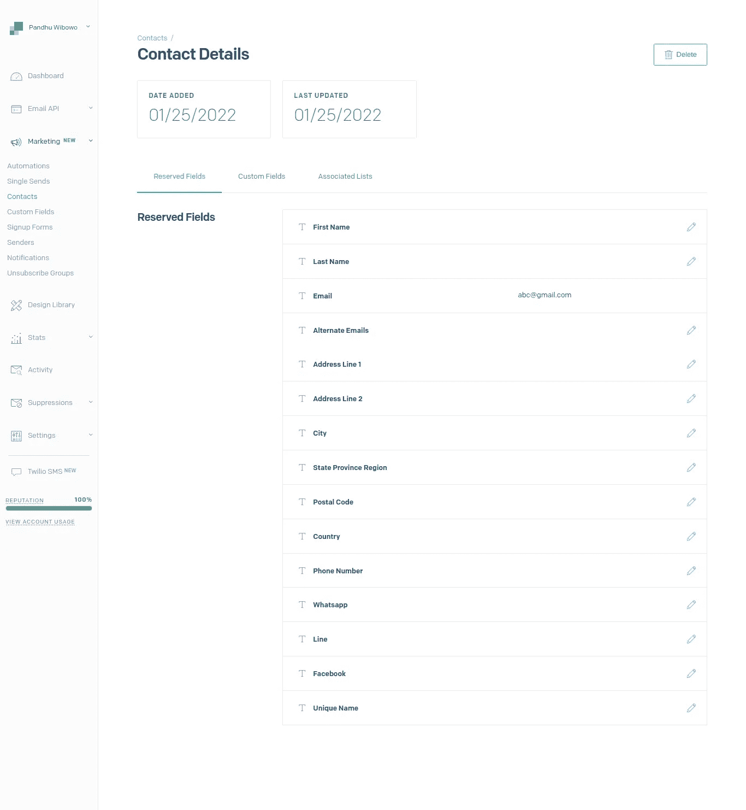

# 通过 NestJS 中的 Sendgrid 营销活动 API 发送联系人表单

> 原文：<https://blog.devgenius.io/sends-contact-form-via-sendgrid-marketing-campaigns-api-in-nestjs-4fa6c096e1df?source=collection_archive---------20----------------------->

## 在 Sendgrid 营销活动 API 中收集潜在客户数据


[Melanie Deziel](https://unsplash.com/@storyfuel?utm_source=medium&utm_medium=referral) 在 [Unsplash](https://unsplash.com?utm_source=medium&utm_medium=referral) 上拍摄的照片

# 介绍

Sendgrid 是一种电子邮件递送服务。根据 Sendgrid 官员的说法，

> **SendGrid 是一个基于云的 SMTP 提供商，允许您发送电子邮件，而无需维护电子邮件服务器。SendGrid 管理所有技术细节，从扩展基础设施到 ISP 拓展和信誉监控，再到白名单服务和实时分析。**


Sendgrid 可以帮助你发送电子邮件。那边主要有两个产品。

## **1。电子邮件 API**

在那里，你可以发送电子邮件，创建电子邮件模板等。

## **2。电子邮件营销**

对于此功能，您可以创建一个联系表单、选择细分、标记您的客户的订阅，等等。

现在，我将和你们一起讨论电子邮件营销。

哦，看看这个。

*   首先，如果你还没有在 Sendgrid 上创建帐户，我建议你创建它。
*   如果已经完成，登录并访问设置上的 API 键子菜单。

`Settings > API Keys`。


并创建您的 API 密钥，在这一节中，我不会分享如何创建它，我假设您已经有了 API 密钥。

*   然后，转到营销菜单，然后转到自定义字段子菜单。


请点击`New Custom Field`。


字段名就像 html 标签上的`name`。我还没有试过这个单词在一个字段名上有 2 个或更多。比如`firstname`，我不知道这个词应该是`first_name`、`firstName`还是 like，因为原来的词只是打字`firstname`。

确定之后，选择字段类型。有`text`、`number`、`date`。

然后，点击`Create Field`。

为你想要的做那些步骤。创建自定义字段后的下一步是代码会话。

*   `Disclaimer`:这个环节是为了解 Nestjs 行为的你们准备的。因为我只穿我觉得重要的衣服。

所以，打开你的文本编辑器，让我们来做魔术表演吧。

*   创建`env`文件。添加`SENDGRID_API_KEY`和`SENDGRID_BASE_URL`。因为 API 的 url 是 https://api.sendgrid.com/[的](https://api.sendgrid.com/)
*   然后，创建控制器文件，

```
import { Controller, Post } from "@nestjs/common";
const client = require('@sendgrid/client');
require('dotenv').config();@Controller('sendgrid')
export class SendgridController {
    @Post('contacts/store')
        async store() {
            client.setApiKey(process.env.SENDGRID_API_KEY);
            client.setDefaultRequest({baseUrl: 'https://api.sendgrid.com/'});
            const request = {
                url: `/v3/marketing/field_definitions`,
                method: 'GET',
            }
            let newCustomFields: any[] = []
            let newReservedFields: any[] = []
            return client.request(request)
              .then(([response, body]) => {
                  const { custom_fields: customFields, reserved_fields: reservedFields } = body
                  newCustomFields = [...customFields]
                  newReservedFields = [...reservedFields]
                  return {
                      newCustomFields,
                      newReservedFields
                  }
               }).then(response => {
                  const { newCustomFields, newReservedFields } = response
                  const customFieldsPayload = {
                      "harga_unit": "2000000000",
                      "lokasi_unit": "Jakarta, Indonesia"
                  } const newObjPayload = {}
                  newCustomFields.forEach(field => newObjPayload[field.id] = customFieldsPayload[field.name])
                  return newObjPayload
               }).then(response => {
                  const data = {
                      "contacts": [
                          {
                              "last_name": "Pandhu",
                              "first_name": "Wibowo",
                              "email": "pandhuspace@gmail.com",
                              "custom_fields": {...response}
                          }
                      ]
                  };
                  const request = {
                      url: `/v3/marketing/contacts`,
                      method: 'PUT',
                      body: data
                  }
                  return client.request(request)
                    .then(([response, body]) => {
                        console.log(response.statusCode);
                        console.log(response.body);
                        return 'OK'
                    }).catch(error => {
                        console.error(error.response.body);
                        return error.response.body
                    });
                }).catch(error => {
                    console.error(error);
                    return error.response.body
                });
            }
        }
```

不要忘记将您的控制器分配给模块。让我们试试你的邮差/失眠或者别的什么。

*   最后一步，检查`Contacts`子菜单中的数据。然后，单击全局类型。


如果你选择一个，细节会是这样的。



所有步骤都已经完成。现在，轮到你来试试了。感谢阅读，快乐的编码伙伴们！！！

# 警惕！

如果你们来自**印度尼西亚**并且想要支持我更多的写作，希望你们能从钱包里拿出一点来。你可以通过一些方式分享你的天赋，

## 萨韦里亚

[https://saweria.co/pandhuwibowo](https://saweria.co/pandhuwibowo)


## 特拉克特尔

[https://trakteer.id/goodpeopletogivemoney](https://trakteer.id/goodpeopletogivemoney)

