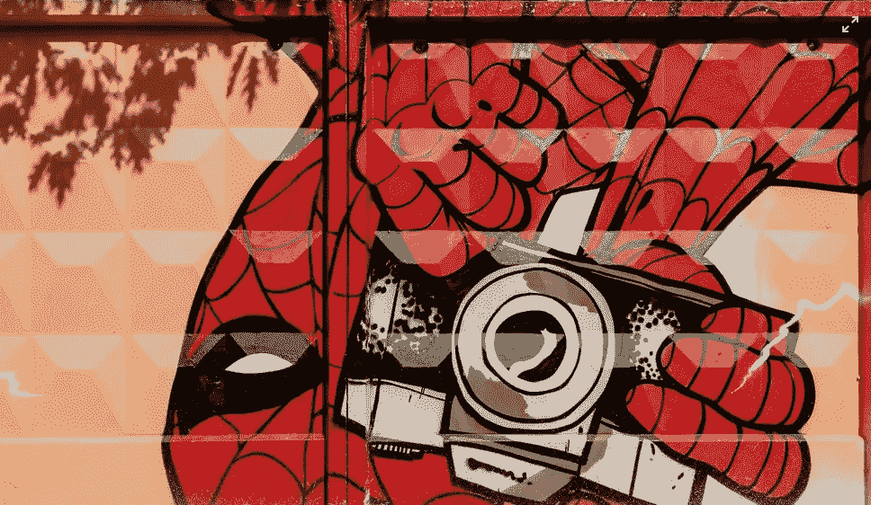

# 高级开发人员有一种蜘蛛的感觉

> 原文：<https://blog.devgenius.io/senior-developers-have-a-spidey-sense-52fc510e19da?source=collection_archive---------6----------------------->

## 蜘蛛侠的感觉来自经验、知识和技能

马尔詹·布兰

> “通常，某人的工作做得越好，看起来就越容易。你很少会意识到这有多难，直到你自己去尝试。”詹姆斯·克利尔

当 BA/顾问、客户和经理认为某个特性简单明了时，高级开发人员的敏锐感觉就会被触动。他们能感觉到潜在的危险，而其他人看到一帆风顺。

高级开发人员可以保持头脑清醒，而其他人则昏了头。

高级开发人员会倾听。他们问问题；他们思考，但不承诺任何事情。

高级开发人员感觉事情并不像看上去的那样。他们不知道它是什么，但他们不会错误地认为软件开发中的任何事情都很简单。

**写代码很简单，创作软件很难。**

# 蜘蛛侠的感觉

事情听起来越简单，高级开发人员就越怀疑。

即使很简单，你也从不大声说出来。这可能比我们想象的要难。

高级开发人员有一种蜘蛛的感觉。在你创建伟大的软件之前，你必须避免犯错误，避免把自己置于不利的境地。

**不该做的事**

*   永远不要说事情简单
*   永远不要给出有帮助的低/粗略估计
*   当不该由你决定的时候，永远不要决定
*   不要在没有签署需求的情况下编写代码
*   在你想好之前，不要承诺任何事情

**该做的事**

*   遵循流程
*   澄清所有假设
*   想想什么可能会出错
*   想想依赖和联系

不要走得太快，精度比速度更重要。质量是创建软件的最快方法。

# 看起来很容易

高级开发人员让创建复杂的软件看起来很容易，但实际上很难。

经验有助于避免问题，防止他们搬起石头砸自己的脚。他们避免错误，因为他们以前犯过错误，并且已经学会不再犯同样的错误。

他们以平稳的速度前进。不要太快错过细节和犯错误。不要因为慢下来而拖累其他人。

> 他们的第一步是避免问题，了解情况，然后制定解决方案。

高级开发人员创建软件更快，但不匆忙。

专家简单地解释事情，通常知道该怎么做。当他们遇到新的情况时，他们会冷静地制定计划，毫无戏剧性地向前推进。

人们很容易低估优秀的高级开发人员，因为这看起来很简单。直到你用一个不太熟练的开发人员取代了一个高级开发人员，你才会意识到他们有多好。

优秀的高级开发人员让创建软件看起来毫不费力，几乎没有戏剧性，也很少出现停滞或惊讶。

他们的蜘蛛侠意识是经验、知识和技能。已经研究多年的技能。

# 结论

如果你认为我在胡说八道，想想你工作过的成功项目，那个项目的核心是一个或多个优秀的高级开发人员。我从来没有见过一个成功的软件项目没有优秀的资深软件开发人员。

另一方面，当你在混乱中发现一个软件项目时，它通常会有糟糕的领导和糟糕的技术领导。

优秀的开发人员让开发看起来容易，但是让软件开发看起来容易需要技巧。