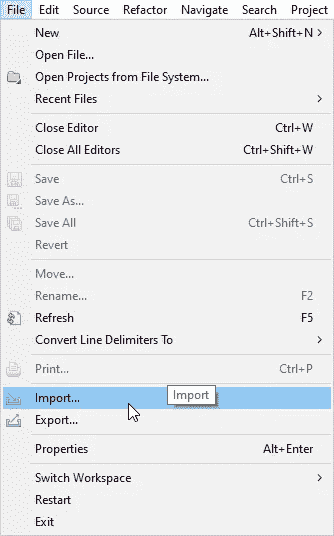
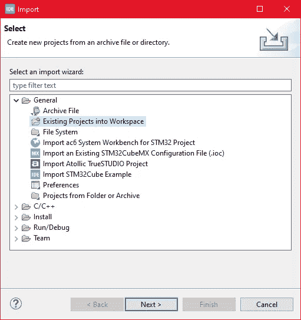
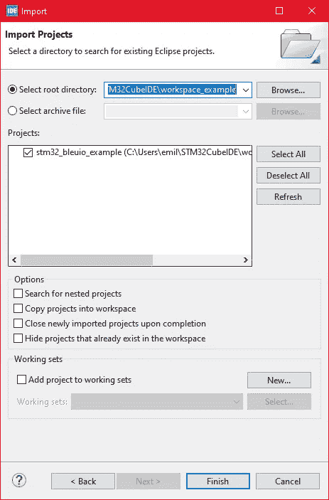
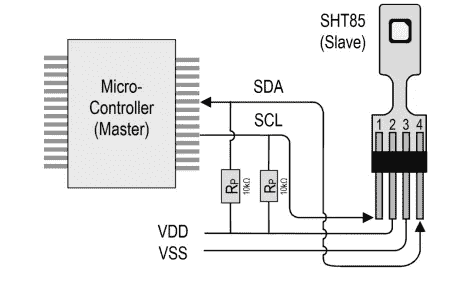
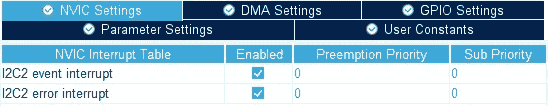
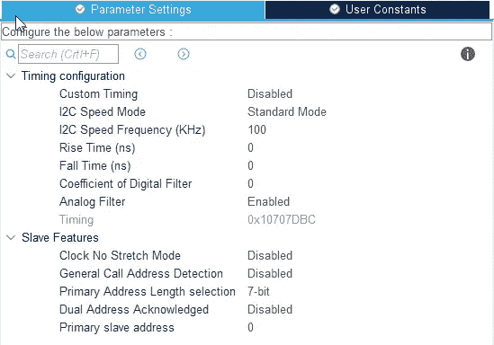
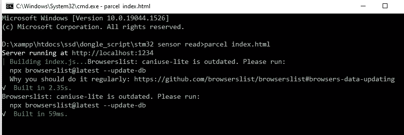
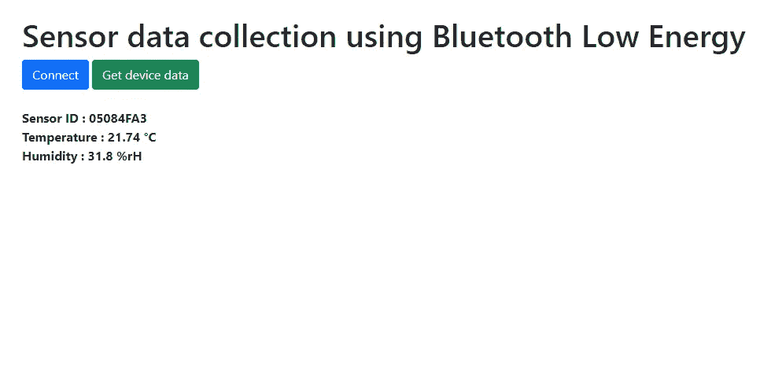

# 使用蓝牙低功耗从 STM32 和 SHT85 收集传感器数据

> 原文：<https://blog.devgenius.io/sensor-data-collection-from-stm32-and-sht85-using-bluetooth-low-energy-1af9073ccc9?source=collection_archive---------19----------------------->


罗宾·格劳泽在 [Unsplash](https://unsplash.com?utm_source=medium&utm_medium=referral) 上的照片

该项目展示了一种使用 BleuIO 加密狗来宣传 STM32 从连接到 STM32 Nucleo-144 的传感器读取的数据的简单方法。

# 要求:

*   https://www.bleuio.com/ Bluetooth 低能耗 usb 转换器(T4)
*   SHT85 传感器(https://sensirion.com/products/catalog/SHT85/)
*   带有带 USB 端口的 STM32 微控制器的电路板。(使用 Nucleo-144 开发板:NUCLEO-H743ZI2 来开发本示例。(https://www.st.com/en/evaluation-tools/nucleo-h743zi.html)
*   为了将加密狗连接到 Nucleo 板，我们使用了“USB A 到 Micro USB B”电缆和 USB A 母到母适配器。)
*   STM 32 库贝德语(https://www.st.com/en/development-tools/stm32cubeide.html)

当 BleuIO 加密狗连接到 Nucleo boards USB 端口时，STM32 将识别它，并开始公布它从 SHT85 读取的传感器值以及传感器序列号。它将每 10 秒更新一次这些值。

# 设置项目

## 第 1 部分:下载项目

**获取项目** [**此处**](https://github.com/smart-sensor-devices-ab/stm32_bleuio_SHT85_example)

https://github . com/smart-sensor-devices-ab/STM 32 _ bleu io _ sht 85 _ example

要么克隆这个项目，要么将其下载为 zip 文件并解压缩到您的 STM32CubeIDE 工作空间中。

## 第 2 部分:作为现有项目导入

从 STM32CubeIDE 中选择文件>导入…



然后选择常规>将现有项目放入工作区，然后单击“下一步>”



确保您已经在“选择根目录:”中选择了您的工作空间

您应该看到项目“stm32_bleuio_SHT85_example”，选中它并单击“Finish”。



如果您将项目下载为 zip 文件，您需要将项目文件夹从“stm32_bleuio_SHT85_example-master”重命名为“STM 32 _ bleu io _ sht 85 _ example”



将 SDA 连接到 Nucleo 板上的 PF0，将 SCL 连接到 PF1。

然后像这样在 STM32Cube ioc 文件中设置 I2C2:



# 运行示例

在 STMCubeIDE 中，单击锤子图标来构建项目。

*   使用 TeraTerm、Putty 或 CoolTerm 等串行终端仿真程序打开“STMicroelectronics STLink VI virtual COM 端口”。

> *波特率:115200*
> 
> *数据位:8 个*
> 
> *奇偶校验:无*
> 
> *停止位:1*
> 
> *流量控制:无*

*   在 STMCubeIDE 中，单击绿色的 play 按钮，在您的板上刷新并运行它。第一次点击时，将出现“运行配置”窗口。您可以让它保持原样，然后单击运行。
*   连接 BleuIO 加密狗。

# 从 web 浏览器访问传感器数据

我们编写了一个简单的脚本，连接到 BleuIO 加密狗并从 STM32 读取广告数据。

为了让这个脚本工作，我们需要

*   [BleuIO USB 加密狗](https://www.bleuio.com/)连接到电脑。
*   [BleuIO javascript 库](https://www.npmjs.com/package/bleuio)
*   Chrome 78 或更高版本，并且需要启用 chrome://flags 中的**# enable-experimental-we B- platform-features**标志
*   卷筒纸捆扎机— ( [包裹 js](https://parceljs.org/) )

**步骤**

创建一个名为 index.html 的简单 Html 文件，它将作为脚本的前端。这个 Html 文件包含一些按钮，帮助连接和读取来自连接到 stm32 的远程加密狗的广告数据。

```
<!DOCTYPE html>
<html lang="en">
  <head>
    <!-- Required meta tags -->
    <meta charset="utf-8" />
    <meta name="viewport" content="width=device-width, initial-scale=1" /> <!-- Bootstrap CSS -->
    <link
      href="https://cdn.jsdelivr.net/npm/bootstrap@5.1.3/dist/css/bootstrap.min.css"
      rel="stylesheet"
      integrity="sha384-1BmE4kWBq78iYhFldvKuhfTAU6auU8tT94WrHftjDbrCEXSU1oBoqyl2QvZ6jIW3"
      crossorigin="anonymous"
    /> <title>STM32 Read sensor value</title>
  </head>
  <body>
    <div class="container mt-5">
      <h1>Sensor data collection from stm32 using Bluetooth Low Energy</h1>
      <button id="connect" class="btn btn-primary">Connect</button>
      <button id="getdata" class="btn btn-success">Get device data</button>
      <div id="loader"></div>
      <br />
      <div id="response" class="fw-bold"></div> <script src="./index.js"></script>
    </div>
  </body>
</html>
```

创建一个名为 script.js 的 js 文件，并将其包含在 Html 文件的底部。这个 js 文件使用 BleuIO js 库来编写 AT 命令并与其他加密狗通信。

```
import * as my_dongle from 'bleuio'//connect to BleuIO
document.getElementById('connect').addEventListener('click', function(){
  my_dongle.at_connect()
})
//get sensor data
document.getElementById('getdata').addEventListener('click', function(){
  document.getElementById('loader').innerHTML = 'Loading'
  //set the BleuIO dongle into dual role
    my_dongle.at_dual().then(()=>{
      // sensor id of the device that we are trying to get data from
      let sensorID='05084FA3' //look for advertised data of with the sensor id
        my_dongle.at_findscandata(sensorID,4).then(x=>{          //split the advertised data from the respnse
          let advdata= x[x.length-1].split(" ").pop() //trim the advertised string to only get sensor response
          const result = advdata.split(sensorID).slice(1).join(sensorID)          //get temperature and humidity value
          let temp = result.substring(0, 4);
          let hum = result.substring(4, 8); //convert from hex to decimal and device by 100
          temp = parseInt(temp, 16)/100
          hum = (parseInt(hum, 16)/100).toFixed(1)          document.getElementById('loader').innerHTML = ''
          document.getElementById('response').innerHTML = `Sensor ID : 05084FA3 <br/>
          Temperature : ${temp} °C<br/>
          Humidity : ${hum} %rH<br/>`              
        })
    })

  })
```

脚本 js 文件有两个按钮动作；连接并读取广告数据。

我们还需要更新脚本 js 第 13 行的传感器 ID。这个示例项目的传感器 ID 是 05084FA3，它是我们从 SHT85 获得的。

因此，该脚本查找包含传感器 ID 05084FA3 的广告数据。在获得广告数据后，我们将温度和湿度信息分离出来，并显示在我们的 index.html 页面上。

现在我们需要一个网络捆扎机。我们可以使用 [parcel.js](https://parceljs.org/)

一旦安装了包 js，让我们转到根目录并键入**“包索引. html”**。这将启动我们的开发环境。



让我们在浏览器上打开脚本，并选择加密狗连接的正确端口。



该 web 脚本可以在 GitHub 资源库的 web script 文件夹中找到。