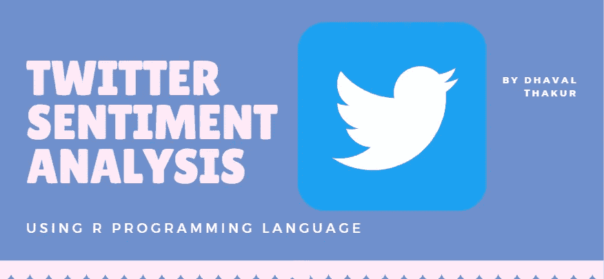

# 使用 R 对任何 Twitter 个人资料进行情感分析

> 原文：<https://blog.devgenius.io/sentiment-analysis-of-any-twitter-profile-using-r-90f0af5bc8?source=collection_archive---------2----------------------->

我通常用 Python 语言写我所有的教程，因为我觉得这很容易。但是很少有数据爱好者知道 R 语言的重要性。因此，我想在 r 中做一个项目。对于文本分析中最常见的主题，也就是情感分析，启动一个简单的项目再好不过了。



图片来源:Dhaval

由于这是投票季节，我想到分析名人发的推文的情绪。因此，我用简单的格式保存了这篇教程。首先，我将讲述什么是情感分析&然后我们将继续编码部分。

# **什么是情感分析？**

情感分析是指使用自然语言处理、文本分析、计算语言学和生物统计学来系统地识别、提取、量化和研究情感状态和主观信息。通俗地说，*情感分析就是判断一篇文章是正面的、负面的、还是中性的* **的过程。**

## 情感分析的业务用例是什么？

情绪分析有助于大型企业中的数据分析师评估公众意见，进行细致入微的市场研究，监控品牌和产品声誉，以及了解客户体验。


图片来源:Dhaval

我将使用 RStudio 作为我的主要 IDE 来编写我的项目。除了安装在你的系统中的 R 编程语言，我还会使用 3 个额外的 R 包，这样我们就可以进一步进入编码部分了。

**使用的软件包:**

1.  雪球 c
2.  铥
3.  推特
4.  修哲特

**安装软件包**

如果您在终端上，请在脚本中一次或逐行运行以下命令。

```
install.packages("SnowballC")
install.packages("tm")
install.packages("twitteR")
install.packages("syuzhet")
```


图片来源:Dhaval

现在，我们已经在系统中安装了所需的包，让我们开始编码部分

**导入包**

```
library("SnowballC")
library("tm")
library("twitteR")
library("syuzhet")
```

现在，接下来要做的重要事情是从 Twitter API 获取访问令牌和消费者密钥，可以从[这里的](https://developer.twitter.com/en/docs/authentication/oauth-1-0a/obtaining-user-access-tokens)获取。

**获取访问令牌和消费者密钥**

现在，一旦您获得了访问令牌和消费者密钥，请将它们存储在变量中，即**消费者密钥、消费者秘密、访问秘密** & **访问令牌**

代码:

```
consumer_key <- 'used the key provided by Twitter '
consumer_secret <- 'used the key provided by Twitter '
access_token <- 'used the key provided by Twitter '
access_secret <- 'used the key provided by Twitter'
setup_twitter_oauth(consumer_key, consumer_secret, access_token, access_secret)
```

我们将使用预定义的函数 setup_twitter_oauth，并将其参数作为所有键。

**获取推特简介**

一旦我们使用我们的密钥和令牌进行了身份验证，我们就必须检索用户的 tweets 档案，以便分析其情感。

我将使用 userTimeline 函数从 TwitteR 库中检索推文。

在这个例子中，我将从 donaldtrump 获取推文，我将分析的推文数量将是 200(我在参数 n =200 中提到过)

```
tweets <- userTimeline("donaldtrump", n=200)
n.tweet <- length(tweets)
tweets.df <- twListToDF(tweets)
head(tweets.df)
```

在这里，我使用了 length 函数来获取 tweet 的长度，并最终将 tweet 转换为数据帧。

**清理推文语料库**

如果我们看到任何 twitter 用户的推文，那个人会使用任何特殊字符，如标签、@等。为了分析推文，我们必须使我们的推文语料库摆脱这些特殊字符。

代码:

```
tweets.df2 <- gsub("http.*","",tweets.df$text)
tweets.df2 <- gsub("https.*","",tweets.df2)
tweets.df2 <- gsub("#.*","",tweets.df2)
tweets.df2 <- gsub("@.*","",tweets.df2)
```

因此，在运行以上几行之后，我们将所有特殊字符或任何超链接替换为" "(意味着从语料库中删除相应的特殊字符)

**获得情绪定义词**

现在，我们将把 tweets 数据帧转换成一个向量，并将情感存储在情感数据帧中。

代码:

```
word.df <- as.vector(tweets.df2)
emotion.df <- get_nrc_sentiment(word.df)
emotion.df2 <- cbind(tweets.df2, emotion.df) 
```

**提取情感分数**

现在每个单词都有一个特定的分数，这个分数可以将它归类为积极或消极的情绪。

**提取正面情感得分**

我将使用 get _ perspective 函数，并将我们的 word 数据框作为参数来获取情感得分。此外，在下面的代码中，我保存了从单词中获得的最大值，并将其存储在另一个变量中。

```
sent.value <- get_sentiment(word.df)
most.positive <- word.df[sent.value == max(sent.value)]
```

类似地，我们也会提取负面情绪的分数。

**提取负面情绪得分**

```
most.negative <- word.df[sent.value <= min(sent.value)]
```

# 提取情感推文

**提取正面情绪推文**

一旦我们计算出分数，就该提取代表特定情绪的实际推文了。

**我们是如何做到的？**

还记得我们在上一节中计算的情感分数吗？我们将过滤掉值大于 0 的分数。

```
positive.tweets <- word.df[sent.value > 0]
```

**提取负面情绪推文**

为了提取负面情绪的推文，我们将过滤具有负面得分的推文。

```
negative.tweets <- word.df[sent.value<0]
```

**附加:让我们提取中性情绪的推文！**

当我说中性情绪时，我指的是那些得分正好为零的推文。因此，代码将非常类似于上面的代码。

```
neutral.tweets <- word.df[sent.value ==0]
```

就是这样！

我已经在我的 Github Repo 上传了这段代码，你可以在这里找到！如果您对代码有任何疑问或建议，请在下面发表评论

**参考文献**

[1][https://en.wikipedia.org/wiki/Sentiment_analysis](https://en.wikipedia.org/wiki/Sentiment_analysis)