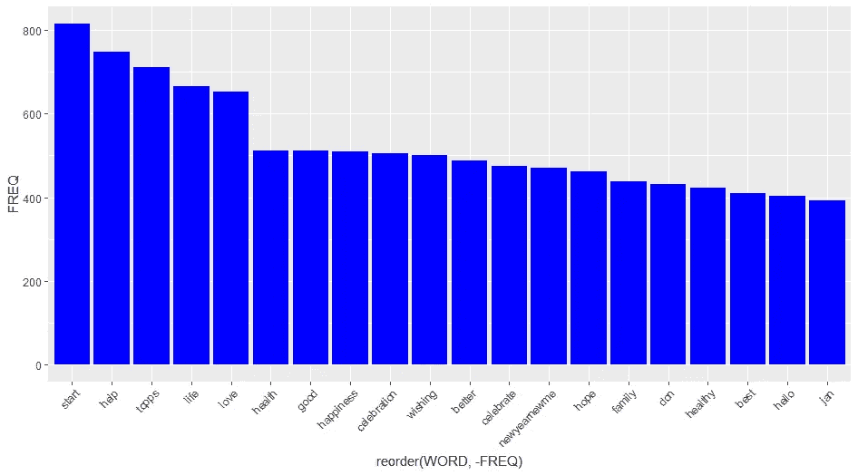
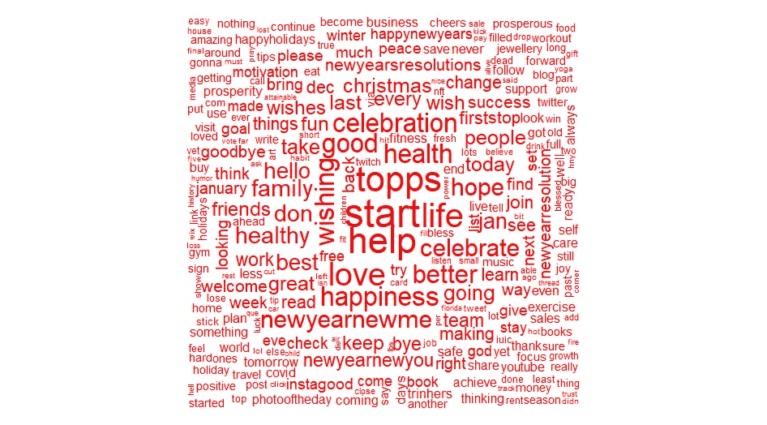
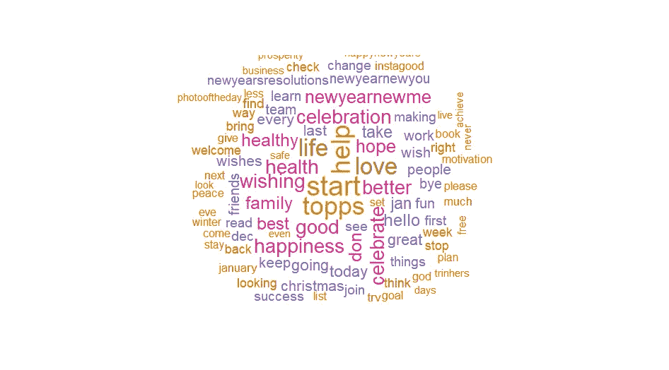
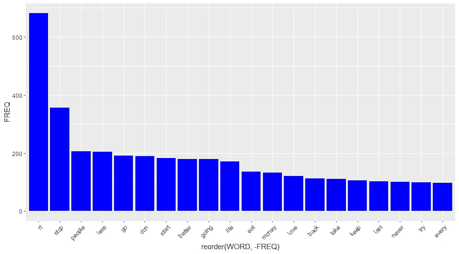
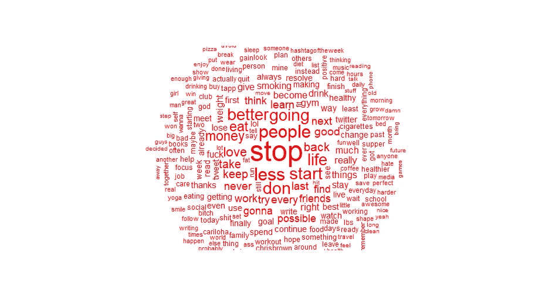
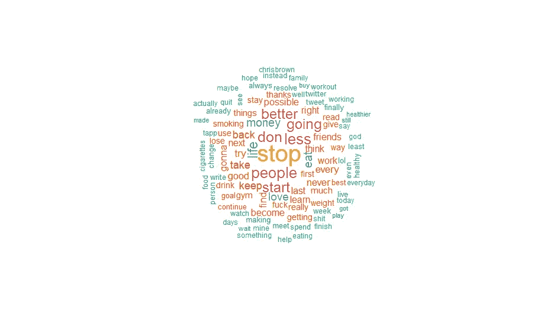
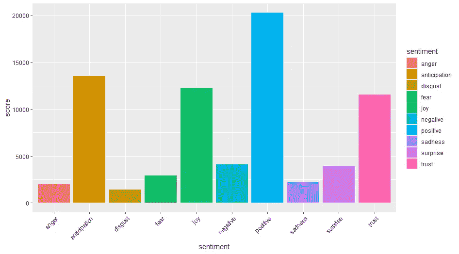
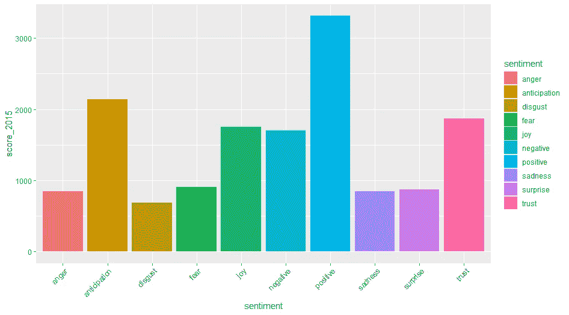

# 使用 Twitter 数据的新年情感分析

> 原文：<https://blog.devgenius.io/sentiment-analysis-of-the-new-year-using-twitter-data-c2e29ece3f8f?source=collection_archive---------9----------------------->

额外:社交媒体文本分析(情感分析)

# 介绍

新年快乐伙计们！虽然我并不特别热衷于购买新年的希望和梦想，以及所有的决心和# newyearnewme 之类的东西。我确实喜欢为自己设定新的一年要实现的目标和一些自我反省。然而，我总是想知道是否每个人都像我在电视上看到的那样为新年大肆宣传，当然只是在 Twitter 上滚动我的时间线。因此，这确实使我产生了疑问:

*   人们对新年有什么感觉？
*   人们计划了什么样的决心？

此外，我还发现了一组 2015 年的新年决心推文。这最终让我分析了 2022 年和 2015 年，试图为这篇博文建立一个比较，所以让我们快速进入这个项目。

# 数据源和工具

# 数据源

# 数据来源于哪里？

2015 年新年决心数据集可从以下网址获取:

 [## 新年的决心

### 5011 条包含新年决心的推文。

www.kaggle.com](https://www.kaggle.com/andrewmvd/new-years-resolutions) 

我自己用 R 编程和 [Rtweet](https://cran.r-project.org/web/packages/rtweet/rtweet.pdf) 包收集了 2022 年的数据集

# 是怎么收集的？

所有的数据都是从 Twitter 上通过网络搜集的。

# 数据集的大小是多少？

2022 数据集:13897 条观察结果(推文)

2015 年数据集:5002 条评论(推文)

# 使用的工具

*   r 编程

# 数据清理

考虑到数据的数据清理，我会说我没有对数据中的其他变量做太多，因为我主要是处理推文中的文本数据。

这主要包括 4 个步骤:

*   删除冗余信息:这包括网址，特殊字符，标点符号和数字
*   将 tweet 文本转换成语料库本质上是一组更结构化的文本。
*   将文本转换为小写
*   删除基本上是常用词的停用词，以提高模型性能。

你可以通过这个网址在我的 Kaggle 笔记本上访问我为这个项目编写的代码:[https://www . ka ggle . com/selvynallotey/Twitter-explorative-情操分析](https://www.kaggle.com/selvynallotey/twitter-exploratory-sentiment-analysis)

# 探索性分析结果

## 2022

**最常用术语柱状图**

查看推文中出现频率最高的单词的柱状图。这确实给人一种印象，人们已经准备好迎接新年了，因为最后最常出现的词是巧合的“你好，简”。如图所示，人们似乎准备在新的一年里“开始”一些事情。我认为帮助应该是人们根据他们的信仰寻求帮助。

“健康”一词也出现了强劲的飙升。好吧，考虑到似乎永无止境的疫情已经存在了近 3 年。健康是最常见的术语之一，这并不奇怪。说真的，这个疫情什么时候会结束？

2022 条推文的词云

看着我生成的单词云，“topps”这个词似乎正在主导对我注意力的竞争。我不知道那是什么，直到我在 Twitter 上直接搜索，它似乎是与体育有关的东西，所以我可能应该把它添加到停用词中。然而，正如你所看到的，其余的都是你每年新年都会期待的重要事情。

《幸福》《新渴望》《繁荣》《更好》。对新的一年很有希望，一厢情愿。以及平常大家在新年伊始似乎都是那么痴迷的“健身房”和“运动”。

我也看到“COVID”设法溜进了单词 cloud，但一般来说，它并不真的那么重要，这可能是一个信号，表明人们不会允许这种病毒从他们身上带走更多的时间。希望这并不意味着他们会忽略它，因为每个人都应该对此负责。

词云 2022(窄)

这是一个更浓缩的词云，缩小一点，但它会出现。前一个在给人们的计划提供一些见解方面做得更好。似乎人们也在寻找爱情，这似乎也很突出，所以我想我们会期待二月会带来什么。

## 2015

而且，看我从 Kaggle 收集的 2015 年的一组数据。

2015 年推文柱状图

考虑到从推文中提取的关键词，与 2022 年的设定相比，它似乎有点悠闲。在我看来，从数据来看，人们似乎希望停止一些事情，而不是实现一些事情。我想你可以说或者像我一样说“更简单的时代”。

词云 2015

此外，看看云这个词，这很有趣，因为在 2015 年，人们希望停止事情，而在 2022 年，人们希望开始事情。此外,“健康”一词的使用量也显著下降，这很有意义，因为我们没有花大部分时间担心病毒，因为病毒的变化速度越来越快。

我也看到克里斯布朗藏在那里，这也是有道理的，因为我相信那是他的好年景。要么是这样，要么是他在追逐一些这个世界不会让他休息的旧东西。

当然，我们有通常的锻炼，也期望在 2022 年看到戒烟，但没有，所以也许人们在 2015 年真的戒烟了？谁知道呢？

2015 词云(窄)

所以我决定也缩小这个词的范围。似乎对停止事情的强调更加突出了。在这个词中，云“开始”似乎也获得了我更多的关注，所以我想它并没有完全不同。虽然“帮助”这个词与 2022 年的版本相比有了很大的下降，但似乎人们现在比以往任何时候都更需要帮助，所以我建议任何阅读这篇文章的人检查一下朋友和家人！

# 情感分析结果

最后，检查两年的情绪。

2022 情感分析

似乎普遍的情绪是积极的，人们相信新的一年。我想这对每个人来说都是一个好的迹象，尽管至少从推特上可以看到一些消极、恐惧和期待的情绪。然而，总的来说，我想说人们都希望这是积极的一年，并抱有美好的希望。

2015 年舆情分析

从情绪图表来看，今年消极情绪似乎与积极情绪相差不远。这有点令人惊讶，因为考虑到各种情况，我预计今年人们会更加消极，除非这是一种已经困扰我们一些人的习得性绝望，我们唯一能做的就是试着积极面对这个疫情。很难说出这些情绪的实际原因是什么，可能需要对这些结果进行更多的诊断分析。