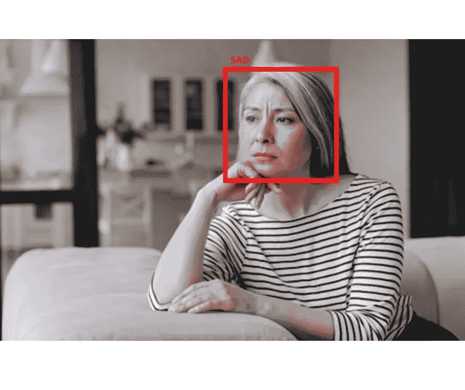

# 利用人工智能技术进行情感分析

> 原文：<https://blog.devgenius.io/sentiment-analysis-using-ai-technology-e586a9ff0c35?source=collection_archive---------12----------------------->

**一个表达不言自明**

一个表情传达了很多东西，无论是大是小，都能成为理解任何一个人真实动机或感情的关键。个人传达的情感和表达是为任何人提供最佳服务的关键。雇用或依赖客户服务的行业数量众多，包括但不限于:零售、电子商务、酒店、高级餐厅等等。这些行业从他们的客户那里受益匪浅，也能从他们的客户那里生存下来，并且可以通过能够帮助他们更好地了解他们的客户的技术得到极大的帮助

**情感分析及其帮助**

[情感分析是一种技术](https://prisma.ai/)，它使用机器学习和图像锐化引擎，以及理解个人不同表情含义的培训，然后检测学习到的表情，记录并存储它们，以便可以用于各种目的。它有自己的好处，有助于更好地理解人们的行为以及他们对任何情况的独特反应。在这种情况下，情绪分析是衡量客户或客人接受服务后的反应和情绪。因此，情感分析可用于零售、电子商务、酒店等行业，这些行业依靠客户评级来维持自身发展。

因此，情感分析在很多方面都很有用:

**客户服务**为了提高向客户提供的服务质量，有效利用客户的投诉和不满来提高自己的服务质量和纠正错误领域。

**业务发展**通过记录客户在接受服务或产品时或离开商店时表达的表情和情绪，记录客户对任何特定产品或服务表达的情绪，并有助于创新。

**心理理解**通过观察各种顾客、客人和访客的情绪和表情，了解什么让他们满意，什么让他们生气/不高兴，这有助于了解人类的基本心理，包括他们为什么会做出这样的反应。

因此，情感分析是一种非常有用的技术，它以自动化的方式检测和存储人们表达的情感，大大有助于理解人们。

**走近不远的未来**

随着情感分析等先进引擎的出现，未来并不遥远，未来将会出现更多类似的先进技术和引擎，甚至能够分析人们的行走模式，以推断他们的目的地。情感分析可以准确地推断出个人正在表达什么，现在已经可以获得并应用于当今世界。

