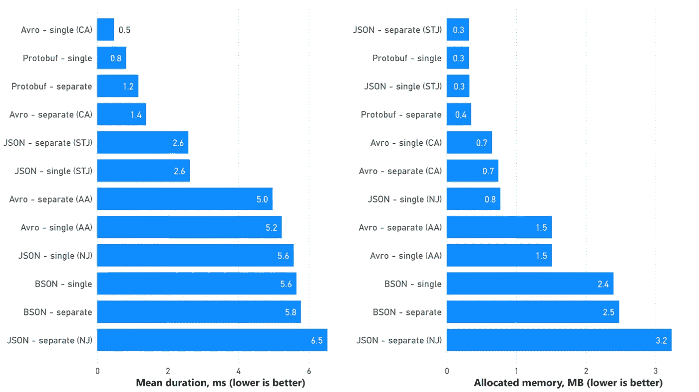

# 中的序列化性能。NET: JSON，BSON，Protobuf，Avro

> 原文：<https://blog.devgenius.io/serialization-performance-in-net-json-bson-protobuf-avro-a25e8207d9de?source=collection_archive---------4----------------------->

作为不同进程运行的组件之间的任何通信都涉及序列化和反序列化。就目前而言，JSON 是跨服务通信最流行的数据格式，但它的性能并不总是足够的，因此有时最好考虑二进制格式，以最小化有效负载大小并改善序列化/反序列化时间。比如 gRPC 用 Protobuf，很多基于 Kafka 的解决方案用 Avro。尽管二进制格式可以极大地提高通信效率，但重要的是要记住，格式本身并不是影响性能的唯一因素——最有效格式的糟糕实现可能会破坏整个想法。让我们运行几个基准来了解哪些流行的格式和它们各自的库值得使用。

我将比较以下格式:

*   JSON —使用 [Newtonsoft。Json](https://www.newtonsoft.com/json) 和标准[系统。Text.Json](https://docs.microsoft.com/en-us/dotnet/api/system.text.json?view=net-6.0)
*   **BSON** —使用 [MongoDB。Bson](https://www.nuget.org/packages/mongodb.bson/)
*   **Protobuf** —使用 [protobuf-net](https://github.com/protobuf-net/protobuf-net)
*   **Avro** —使用 [Apache。Avro](https://github.com/apache/avro) 和 [Chr。Avro](https://github.com/ch-robinson/dotnet-avro)

*该基准的源代码可以在【https://github.com/YuriyIvon/SerializationBenchmark】**找到。***

# *基准条件*

*   *所有基准都是用 [BenchmarkDotNet](https://benchmarkdotnet.org/articles/overview.html) 构建的，在发布模式下编译，并在。Windows 上的. NET 6.0.8。*
*   *主机上的 CPU 是英特尔酷睿 i7–7700 HQ 2.80 GHz(Kaby Lake)。*
*   *用于序列化的[输入数据集](https://github.com/YuriyIvon/SerializationBenchmark/blob/master/SerializationBenchmark/1000%20Sales%20Records.csv)包含 1000 个项目，其中每个项目有 14 个标量类型的字段，包括字符串、双精度、整数和日期/时间(无嵌套对象或数组)。*
*   *对于每种格式及其各自的库，有两个基准—在对序列化/反序列化库的一次调用中处理整个集合，以及分别处理集合中的每个元素。我将把这两种场景类型分别称为“单一”和“独立”。*
*   *基准测试使用最新的库版本。*

# *基准测试结果*

*首先，让我们比较每种格式和场景的序列化大小。我必须包括 Avro 的两个结果，因为这两个库给出的结果略有不同。阿帕奇的结果。Avro 标有“AA”，代表 Chr。Avro —带“CA”。我不知道这个尺寸差异的原因。*

**

*毫无疑问，Avro 是这里最好的，因为它以二进制格式序列化所有内容，并且不存储任何标签或分隔符。Protobuf 的大小稍微大一点，因为它存储字段标签。*

*将整个集合序列化为单个对象和分别序列化每个项之间的差异可以忽略不计。*

*现在我们来看看**序列化基准测试**的结果。对于使用不同库处理相同格式的情况，我使用以下缩写:*

*   *AA —阿帕奇。Avro*
*   *加拿大人权委员会。Avro*
*   *新泽西州—纽顿软件公司。Json*
*   *STJ——系统。文本. Json*

**

*看到 Avro 在光谱的两端是令人好奇的。阿帕奇。Avro 看起来非常低效——在这次测试中，它甚至落后于两个 JSON 库。同时，Chr。当整个集合在一次调用中被序列化时，Avro 是最快的。Protobuf 非常接近它，并且在“单一”和“单独”场景之间显示出很小的差异。标准。NET JSON 库在这个测试中看起来很棒，并且远远胜过其他的“*SON”选项。*

*对于几乎所有的库和格式，单独序列化每个单独的集合项要比一次性序列化整个集合花费更多的时间，这是意料之中的。但是，阿帕奇。Avro 出于某种原因颠倒了这个“规则”，这引起了对其质量的更多关注。另一个有趣的发现是 Chr。Avro 对每个单独的项目进行单独的序列化会在时间上产生相当大的开销，而对于其他库来说，这两种情况之间的差异并不是很大。*

*内存使用与性能多少有些关联，但有趣的是，对于 Newtonsoft.Json，每个集合项的单独序列化会产生大量内存开销。对于所有其他格式和库，“单独”和“单一”场景在内存分配方面没有明显差异。*

*同样值得注意的是阿帕奇。Avro 不支持[逻辑类型](https://marcosschroh.github.io/dataclasses-avroschema/logical_types/)，所以我必须编写一个定制的转换器来处理日期时间字段。转换器不会影响结果——无论我使用 DateTime 还是 long 来表示日期，结果持续时间保持不变。*

*基准的剩余部分是**反序列化**。*

**

*这里的情况有点不同，但领导是一样的——Chr。Avro 擅长反序列化，Protobuf 相比其他“参与者”离它不远。阿帕奇。在这种情况下，Avro 不是最差的，但与替代库的 10 倍差异再次证实了它的低效率。纽顿软件。Json 的性能比标准 JSON 库差得多，并且在“单独”场景中显示出明显的开销。*

*至于内存使用——它也或多或少地与性能相关，但有趣且应该强调的是那个系统。在反序列化基准测试中，Text.Json 是最节省内存的，它的内存使用在“单个”和“单独”场景之间变化不大。*

# *结论*

*   ***。Apache 的. NET 版本。Avro 表现不佳，因此最好避免使用。**它甚至在序列化基准测试中垫底。除了如此糟糕的性能，它不支持 Avro 标准逻辑类型，所以我不得不创建一个自定义的日期/时间转换器。*
*   ***与 JSON 序列化器**相比，BSON 并没有显著的性能提升，而且性能也不如标准。NET JSON 库，所以我看不出有什么好的理由将它作为跨服务通信的 JSON 的替代品。*
*   ***牛顿软件。Json 比标准慢很多。NET JSON 库，**所以我不会在新项目中使用它。它可能比 System 对开发者更友好。Text.Json 并提供了更多处理 Json 有效负载的选项，但是我想不起 Newtonsoft 的任何特性。可以超过使用它的性能“损失”的 Json。当然，在很多情况下，JSON 的有效负载很小，负载不够高，感觉不到差异，但是我会坚持使用。NET 标准库，至少让解决方案更经得起未来的考验。*
*   ***Protobuf。NET library 看起来比 Avro 更成熟，在网上有更多的代码示例和文章。**阿帕奇的主要缺点。文章中已经提到了 Avro，但是除了它们之外，我花了更多的时间来弄清楚如何让两个 Avro 库都工作。*
*   ***如何在 Protobuf 和 Avro 之间选择——取决于情况**，所以我不会在这里陈述任何偏好。如果您需要尽可能减小负载大小，并尽可能减少反序列化时间，Avro 看起来是一个明智的选择。如果 Protobuf 和 Avro 之间的性能和负载大小差异对您的场景来说并不重要，我会使用 Protobuf 作为一个更可预测和易于使用的选项。*