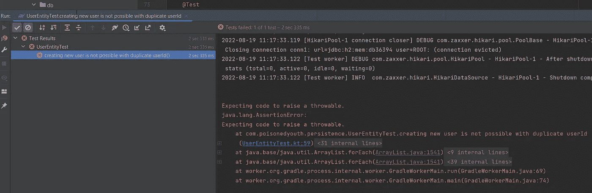

# 系列:用 Ktor 开发 web 应用程序

> 原文：<https://blog.devgenius.io/series-developing-a-web-application-with-ktor-67cdd8e0f73b?source=collection_archive---------4----------------------->


这是我关于用 **Ktor** 开发 web 应用程序系列的第三篇文章。

这些文章将涵盖以下主题:

*   需求规格
*   申请的结构
*   服务器后端应用程序—设置
*   服务器后端应用程序—持久性
*   服务器后端应用程序—业务逻辑
*   服务器后端应用程序— API 接口
*   服务器后端应用程序—身份验证+安全性+用户角色
*   前端 web 客户端—设置+用户界面
*   前端 web 客户端— API 连接+身份验证
*   文档+应用交付
*   结论

在上一篇文章中，我实现了服务器后端应用程序的持久层。这包括数据库表定义、**公开的**实体、创建当前数据库模式版本的机制(使用 **Liquibase** )以及在应用程序启动时连接到数据库的功能。

# 服务器后端应用程序—业务逻辑

**储存库**

在我完成持久层之后，仍然存在一些缺点。在开始实现银行应用程序的业务逻辑之前，我试图删除它们，或者至少最小化它们。

到目前为止，**暴露的**实体是用于持久化数据的接口。从业务服务直接调用它们将导致与**公开的**框架实现的严格耦合，我甚至需要将所有实体调用包装在手动事务块中，以满足**公开的**。还需要将域对象映射到业务服务中的**公开的**实体。这两层之间没有明显的分离。持久层中的低级更改，如添加新列或更改列的数据类型，会导致业务服务的更改。

因此，让我们开始通过引入存储库来增加层的分离。

我为我的**公开的**实体添加了存储库，这些实体包装了所有特定的功能，并提供了与数据库通信的接口，该接口独立于**公开的**的具体实现。为了以后有机会替换**暴露的**作为持久性框架，而不需要更新库，我还引入了 **Koin，**作为依赖注入框架，这使我能够拥有不同版本的库，这些库是可交换的。

我将以下依赖项添加到 *build.gradle.kts* 中:

在应用程序中实现依赖注入的最后一步是安装 **Koin** :

如您所见，我已经通过注入在代码中定义了一个可用的依赖项。我创建了一个接口( *UserRepository* )，它定义了应该可用的方法，还创建了一个实现类( *UserRepositoryImpl* )，如果我需要接口类型的话，它会被注入。为了以后交换存储库实现，我只需添加一个新的实现类并更新 *bankingAppModule 的配置。*就这样。

为了检查一切是否按预期运行，我为 *UserRepository* 类创建了一个集成测试。

正如你所看到的，依赖是通过 *inject()* 函数注入的(该函数在幕后与委托一起工作)。为了在我的测试中使用 **Koin** 依赖注入，我必须注册一个测试扩展，它为注入提供必要的组件。

下一步是最终确定*用户*、*账户*和*交易*的存储库。管理员*的功能*包括存储库，我将在后面的步骤中实现。原因是再次关注一件事。管理员用例与用户用例无关，所以我可以很容易地在以后添加它，并且仍然有一个工作的应用程序。

对于帐户*和*，存储库的实现如下所示:

有一个定义必要方法的接口和一个实现**暴露的**功能的类。存储库的调用者不必处理**暴露的**特定功能，而是直接处理域对象。

用于*事务*和*用户*存储库的代码可以在该项目的 Github 存储库中找到。它没有什么特别的，所以我在这里省略了展示。

既然存储库已经最终确定，是时候将当前的功能与我在第一篇文章中定义的需求进行比较了。

对于所有域对象，UUID 属性应该是唯一的(对于*用户*，*帐户 Id* 对于*帐户*以及*事务 Id* 对于*事务*)。通常情况下，UUID 的创建应该是独特的，当使用

```
UUID.randomUUID()
```

但是数据库的模式直到现在才强制执行这一点。这可以通过测试来验证(以*用户*为例):



插入一个已经存在的用户 Id 为*的用户应该会抛出一个异常，因为违反了约束，但是这并没有发生。所以为了确保表中的列总是包含唯一的值，我必须给列添加一个约束。*

这是用 **Liquibase** 测试模式版本控制机制的好方法。我添加了第二个变更集，用于向列添加 unique 约束。

我还更新了表定义，所以**暴露的**可以强制新的约束。

更新模式版本后，不再可能将重复的*用户 id/帐户 id/事务 Id* 插入数据库。很明显，每个测试用例都涵盖了这些需求。

还有一个额外的需求是当前数据库模式所不能满足的。用户帐户的名称应该是唯一的。因为代码与上面的约束非常相似，所以我省略了代码展示。有兴趣的话可以去 Github 的资源库看看。

我采取以下步骤来满足要求:

*   我还先写了一个测试，验证是否可以为一个同名用户创建 2 个帐户。正如预期的那样，没有抛出异常，并且创建了一个重复的帐户。
*   我将约束添加到 *AccountTable* 定义中。
*   我在 **Liquibase** changelog 中添加了一个额外的变更集，并验证在更新之后，上面的测试场景会抛出一个异常。

当前数据库模式未满足的最后一个数据库模式相关需求是通过*名*、*姓*和*出生日期*对唯一用户的需求。

与上面的其他需求一样，我执行以下步骤:

*   我编写了一个测试来验证需求还没有被满足。
*   我将约束添加到*用户表*定义中。
*   我向 **Liquibase** changelog 添加了一个额外的变更集，并验证了在更新之后测试抛出了一个异常。

通过添加一个 *init{}* 块，可以在 **Exposed** 中为一个表创建一个复合唯一索引，该块为指定的列创建一个 *uniqueIndex* 。

有了这个改变，所有与数据库模式相关的需求都满足了，我可以继续实现业务逻辑了。

从现在开始，我将不再为 **Liquibase** 添加变更集来迁移模式。我想现在用法应该很清楚了吧。

# **应用服务**

应用程序服务包含应用程序的主要业务逻辑。该层完成以下任务:

*   将从请求处理器接收的 DTO 对象映射到域对象。
*   验证 DTO 对象。
*   处理异常(由验证引起或来自持久层)。
*   调用持久层。
*   日志请求流。
*   返回结果(成功或失败)。

因为许多任务都是在这一层完成的，所以我检查了如何在 **Ktor** 中使用日志记录，作为能够在以后跟踪请求的第一步。

默认情况下 **Ktor** 被配置为使用 **logback** (默认配置已经可以通过 facade SLF4J API(log back . XML)获得。更多信息见 [Ktor 测井](https://ktor.io/docs/logging.html)。记录器可以在使用 SLF4J*logger factory*的类中使用。

现在可以使用日志了，我开始为用户域对象实现应用程序服务。

我创建了一个 *UserDto* ，它包含了在数据库中创建用户所必需的属性——名字、姓氏、出生日期和密码。域对象的其余属性具有默认值，并在构造域对象时设置— userId、created、lastUpdated。

作为第一步，*用户服务*正在将*用户数据*映射到*用户*。在映射过程中，检查是否可以从*用户到*创建一个*用户*对象(是否可以将出生日期字符串解析为*本地日期*)并且完成业务验证:

*   *的出生日期*距离当前日期至少是 18 年前吗？
*   *密码*是否满足要求:至少 16 个字符长度，大写+小写字符，数字和特殊字符。

验证在 *init{}* 块中完成，以验证*用户*对象只能用有效输入创建。

因此，也可以为用户类编写单元测试来进行验证。

*用户服务*的下一步是*用户*域对象的持久化，它现在包含一个有效的输入。在数据库模式约束的情况下(例如，通过*名字*、*姓氏*和*出生日期*重复用户)或一般数据库错误(例如，没有可用的连接)，持久性可能会失败。

该服务将结果包装在一个 *ApiResult* 中，该 ApiResult 由一个密封的类表示，该类有两个针对成功和失败情况的实现。*失败*案例还包含一个*错误代码*，该错误代码帮助 API 的消费者稍后更具体地处理异常。

这个通用类用于所有的应用服务，与处理请求的控制器有一个一致的接口，并且不会在处理 http 请求的层中抛出异常。

为了处理可能发生的异常，我通常选择以下选项之一:

*   每个层都将所有可能发生的异常包装在特定的自定义异常类型中。由此，不需要在服务层中处理通用的*异常*类型。将异常类型映射到*错误代码*非常简单。
*   只有服务层在捕捉异常。有必要捕捉通用的*异常*类型，如果多个层抛出相同的异常类型(例如 *IllegalArgumentException* ，则映射到*错误代码*并不容易。

我选择第二个选项是因为对于银行应用程序，不同例外的数量是有限的。

我引入了 *InvalidInputException* ，将所有与输入不匹配要求相关的异常打包到一个异常中。 **Kotlin** 目前不支持多次捕获，因此如果单独捕获异常，会导致多个具有相同内容的捕获块。

为了验证 *UserService* 是否按预期工作，我创建了集成测试来检查每个可能的失败和成功案例。测试设置与存储库测试完全相同。可以看到下面的两个测试用例。

在实现了第一个用例“创建用户”之后，我继续根据需求添加其他用例:更新用户、删除用户、查找用户和更新密码。最终实现如下所示:

用户的用例现在是最终的，我可以继续处理帐户和交易的用例。

由于实现非常简单，并且与 *UserService* 相比没有引入新的概念，因此我省略了显示代码。您可以在相关的 Github 存储库中找到该实现。

现在已经实现了应用程序服务，在继续下一篇文章之前，我将清理现有的代码。对于 **Kotlin** 有一个可用于 IntelliJ 的插件，可以提供静态代码分析—**detect**

该插件可以从市场安装到 **IntelliJ** 上，按照**detect**页面中的步骤在项目中激活(参见[detect plugin](https://plugins.jetbrains.com/plugin/10761-detekt))。

安装和配置后(我使用默认设置)**detect**显示了开放源代码文件中的潜在问题。目前，关于复杂性和重复的问题主要是有趣的，它们给出了一个提示，告诉我应该分析代码中的哪些区域，或者进行重构。

我检查所有现有的代码，并检查是否有相关的问题，我应该修复。这对于保持代码整洁非常有帮助。重要的是要知道， **Detekt** 只是一个可以帮助你并给出提示的工具。修复所有的**检测**问题以获得良好的代码质量并不是我们的目标。一些问题(比如重复)可以被修复，让 **Detekt** 高兴，但是不能提高代码的可读性。

清理之后，我对当前的状态有了更好的感觉，这个系列的这篇文章就完成了。我将在下一篇文章中继续讨论以下主题:

*   为密码添加加密，因此它不再以纯文本形式存储
*   添加 REST API 接口缺少的部分
*   向 REST API 接口添加身份验证机制

服务器后端应用程序的代码可以在 Github 上找到:[https://github.com/PoisonedYouth/ktor-banking-app](https://github.com/PoisonedYouth/ktor-banking-app)