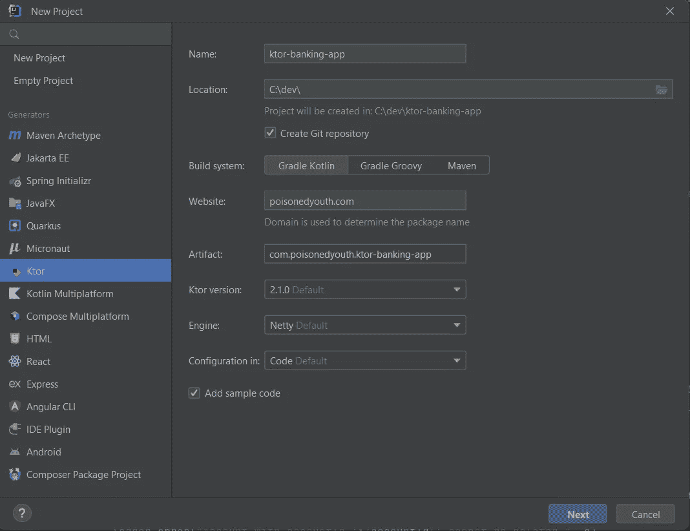
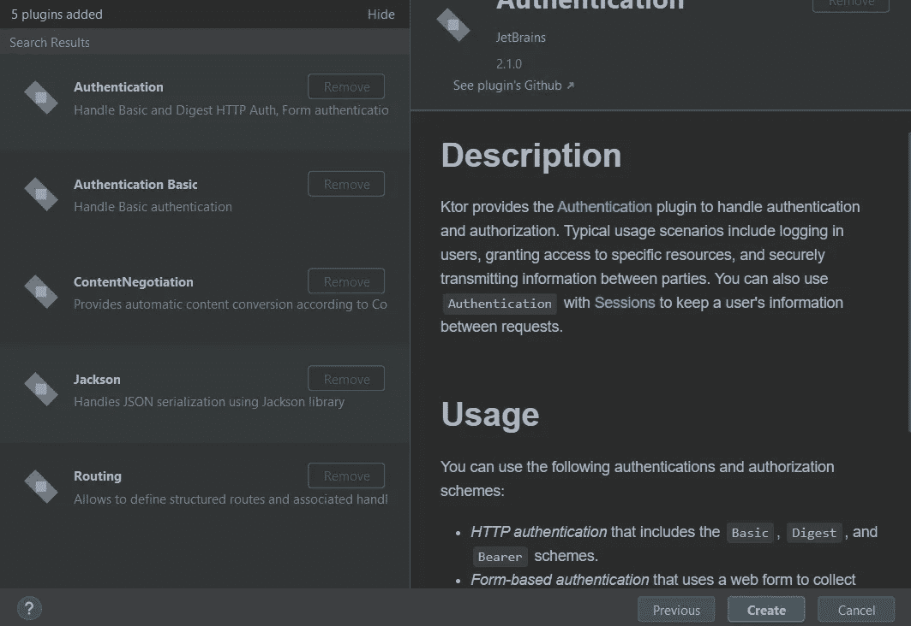

# 系列:用 Ktor 开发 web 应用程序

> 原文：<https://blog.devgenius.io/series-developing-a-web-application-with-ktor-8ea0a9ffa0aa?source=collection_archive---------4----------------------->

这是我关于用 **Ktor** 开发 web 应用程序系列的第二篇文章。

这些文章将涵盖以下主题:

*   需求规格
*   申请的结构
*   服务器后端应用程序—设置
*   服务器后端应用程序—持久性
*   服务器后端应用程序—业务逻辑
*   服务器后端应用程序— API 接口
*   服务器后端应用程序—身份验证+安全性+用户角色
*   前端 web 客户端—设置+用户界面
*   前端 web 客户端— API 连接+身份验证
*   文档+应用交付
*   结论

在上一篇文章中，我详细说明了应用程序的需求，并简要介绍了用于这两种应用程序的 techstack。所以现在是时候动手了，开始开发了。

**那么让我们开始…**

# **服务器后端应用程序—设置**

正如已经写的，后端应用程序的基础是 **Ktor** (我真的很喜欢它，因为它的简单性和可扩展性，与 SpringBoot 相比没有太多的魔力)。另外，我使用了 **Koin** (用于依赖注入)和**Exposed/H2/光/Liquibase** (用于持久性)。

这些框架协同工作良好，是应用程序的稳定基础。

开发的起点始终是 **IntelliJ** 的*新项目*菜单。

我选择**k 或**发电机并插入以下相关数据:

对于必要的插件，我选择了以下几个:

*   *认证*和*认证基础* I 用于为针对服务器后端完成的 http 调用添加认证机制。
*   我需要在我的 REST api 上处理 http 请求。内容将作为 JSON 提供，并且应该自动从类序列化到 JSON，从 JSON 反序列化到类。比起 ktlinx.serialization，我更喜欢 Jackson，因为它不需要注释 dto 类。
*   我需要启用 REST api 请求处理。用于例如创建新用户、编辑账户或创建新交易的 API 端点由此处理。

现在，我点击“ *Create* ”按钮，服务器后端应用程序的基本设置就可以使用了。

# **服务器后端应用程序—持久性**

与每个应用程序一样，我通过定义作为应用程序核心部分的域对象，定义用例所基于的相关对象来开始实现。这有助于我提取建模持久层的必要信息。域对象不一定需要与持久存储到数据库中的实体完全相同。将持久层与业务层分离很重要，这样就不需要在业务服务中处理与持久化相关的数据(例如数据库 id)。

# 领域

为了对领域对象建模，我首先考虑应用程序应该解决的业务案例，关注必要的部分，而不是实现不需要的功能。

*   我有一个用户，可以有几个帐户。一个事务与两个帐户(源和目标)相关。
*   我有一个与其他域对象无关的管理员。

我使用 **Kotlins** 数据类来建模领域对象，因为它给了我以下优势:

*   我有一个不可变的数据结构(这总是一个好的选择)。
*   我已经正确实现了 *equals()* 和 *hashCode()* 功能(在处理集合时尤其重要)。
*   我有一个 *copy()* 方法，它允许我处理不可变的数据结构。

为了让域对象拥有惟一的 ID，我使用 UUID 来比较实例。这给了我一个简单的方法来生成相对唯一的 id。

我对所有属性使用默认值，大多数情况下是在对象创建时设置的。这样，我只需指定创建域对象所需的属性。

第一部分到此结束，我现在对在进一步的实现中需要处理什么样的域对象有了一个清晰的了解。我将在下一步中使用这些知识来设置服务器后端应用程序的持久层。

# 坚持

如果不提供使用域对象的功能，域对象就什么都不是，一方面是操作数据，另一方面是永久保存数据。

所以为了能够处理数据，我从第二个开始，下一步添加持久层。正如关于应用程序结构的本系列第一部分所写的，我使用**暴露+光**和 **H2** 数据库来持久化数据。

很明显， **H2** 数据库应该主要用于测试目的，而不是用于生产，但是对于当前的需求，使用 **H2** 文件数据库完全足够了。稍后很容易用其他数据库提供商来替换它，而不需要太多的努力，因为 H2 的特定功能与持久层的其余部分是分离的。

**是一个轻量级 JDBC 连接池，它易于使用，也是 SpringBoot 应用程序中使用的标准。**

**我首先向 *build.gradle.kts* 文件添加必要的依赖项，如下所示。**

**我从*用户*域对象的持久性功能开始。**

## **用户**

**对于持久用户，我添加了定义用户表列的 *UserTable* 类。 **Exposed** 为主键类型为 Long ( *LongIdTable* )的数据库表提供一个基类。**

***现在我省略了用户密码的处理。我只是以纯文本的形式存储它。密码的正确处理(对于管理员也是如此)将在后面的步骤中完成，因此我现在可以专注于为用户提供基本的功能。这有助于我不必并行处理许多需求。***

****Exposed** 有一个 DAO Api ( [Exposed DAO](https://github.com/JetBrains/Exposed/wiki/DAO) )，为表提供基本的 CRUD 操作。有了这个，我就不必直接处理 ResultRow 了，而且还可以从表中解耦。**

**也可以只使用表定义并手动编写查询，因为在后面的步骤中，我将把它包装在一个存储库层中，以将**暴露的**与应用程序的其余部分完全分离。**

**为了使用 DAO Api，我需要创建一个实体类，它使用属性委托来访问表定义。为了访问 DAO Api 方法，我需要向 *UserEntity* 类添加一个伴随对象。**

**在继续添加更多功能之前，我需要设置一个允许测试用户实体的配置。对于生产代码，我稍后需要一个数据库配置，它在应用程序启动时连接数据库。因此，我在生产代码中添加了一个接口，它提供了一个 *connect()* 方法，该方法将建立一个数据库连接。使用一个接口允许我稍后实现数据库配置以进行生产，并且现在只关注测试。**

**我为测试添加了一个实现，它使用内存数据库。测试后关闭数据源以适当释放资源。**

**测试非常简单，我添加了一个用于创建、更新、删除和查找用户的测试(经典的 CRUD 操作)。**

**在我验证了*用户实体*正在按预期工作之后，我可以继续处理*账户实体*。因为目前不可能用 Exposed(由一个部分持有的关系)建模一对多关系，所以我必须将 *UserEntity* 关系添加到 *AccountEntity* 中。**

**这些测试与 *UserEntity* 测试非常相似，所以我将跳过展示它们。您可以在该应用程序的 Github 资源库中找到它们(参见本文末尾)。**

**对于当前的*用户* — *账户*关系，无法加载用户账户。这可以通过向 *UserEntity* 添加关系来解决，它会在加载用户时自动附加匹配的帐户。**

**现在 *UserEntity* 和 *AccountEntity* 已经可以使用了，我添加下一个实体— *TransactionEntity* 。**

**在完成对*事务实体*的测试后，我通过添加*管理员实体*来完成**公开的**实体的实现。**

**至于用户，暂时忽略管理员的密码处理。**

**现在所有的实体都完成了，我来看看到目前为止我实现的功能。**

**一切都按预期工作，只有一件事是缺少的，这是不可能的加载所有匹配交易的帐户直接从帐户实体，独立的如果来源或目标。这将在以后添加到存储库中。**

**有了这个改变，持久层现在就完成了。为了能够在生产代码中使用实体，我需要添加数据库配置的实现。到目前为止，这只是为了测试。**

****数据库配置****

**我将数据源配置放到了 *application.conf* 文件中。**

**然后我创建一个应用程序配置类，它在应用程序启动时加载设置。这样就没有必要在代码中保存数据库配置，也很容易用一个数据库替换另一个数据库的配置，而无需更改代码。**

**之后，我创建了一个用于生产代码的数据库工厂的实现。**

**作为最后一步，我需要添加一些功能，用于将 *application.conf* 的设置读取到*application configuration*类中，并使用它来设置数据库连接到 *Application.module()* 函数中。**

**为了检查一切是否按预期运行，我启动了应用程序，可以看到数据库已经成功连接(此时还没有创建表)。**

**我在继续下一章之前做了一个改动。到目前为止，我使用**公开的**功能( *SchemaUtils.create(…)* )为测试创建数据库表。这将我的实现严格绑定到我想要阻止的**暴露的**。因此，为了将模式创建从框架中分离出来，我将它移动到一个 sql 文件中，执行该文件来创建模式。此功能也可以在以后的生产中使用，以便在首次启动应用程序时创建初始模式。**

# **模式版本化**

**如今，数据库模式的版本化是您应该经常做的事情。就像 Git 允许您查看源代码的历史，也能够恢复更改一样，模式版本控制为您提供了与数据库模式相同的功能。**

**JVM 生态系统中主要有两种不同的工具用于这项任务。 [**Liquibas** e](https://www.liquibase.org/) 和 [**飞行路线**](https://flywaydb.org/) 。两者都提供了非常相似的功能(使用免费版本)，我选择使用 Liquibase 只是因为我以前在其他项目中使用过它，它满足了我的所有要求。**

**表的创建和模式的版本控制由**L**[**iquibase**](https://www.liquibase.org/)完成。使用迁移模式有两种选择。**

1.  **使用梯度任务**
2.  **使用 Java API**

**因为我不使用管道来部署应用程序，所以我使用 Java API 来迁移模式。每次应用程序启动时，Liquibase 都会检查并执行一个新的迁移脚本。因此，数据库模式总是最新的，无需手动操作。使用 Java API 的代码可以在 Liquibase [文档](https://docs.liquibase.com/workflows/liquibase-community/using-liquibase-java-api.html)中找到。**

**生产代码的模式处理现在在外部文件中处理。为了在测试中使用与生产代码中相同的功能，我更新了 *TestDatabaseFactory.kt* ，不再通过表定义创建模式，而是从文件中读取当前模式。**

**我将当前版本的模式保存在一个 *schema.sql* 文件的资源中。测试在执行之前加载这个模式。为此，我更新了 *SchemaDefinition* 来创建内存数据库的模式。**

**应用程序的持久层到此结束。所以我们来回顾一下我到现在为止都做了些什么。**

*   **我创建了域对象。**
*   **我在资源文件中定义了数据库模式。**
*   **我创建了表定义。**
*   **我为表格创建了**公开的**实体。**
*   **我添加了 L **iquibase** 模式迁移。**
*   **我添加了使用生产模式在内存数据库中运行测试的功能。**

**完成这些后，我可以开始实现业务逻辑，但是在继续当前的实现时，我有一些缺点:**

*   **调用者需要为实体类上的每个调用打开一个事务，还需要访问查询结果的数据(例如结果列表)。**
*   **当使用实体类时，我被直接绑定到 **Exposed** 。**
*   **表约束没有以同样的方式定义，因为我想在域对象中使用它们(因为在**暴露的**中有一对多关系的限制)。**

**这不是很舒服，所以在下一篇文章中，我将在业务服务和实体类之间添加一个存储库层来分离功能。这使得以后在不改变业务服务层的情况下用另一个持久性框架替换暴露的**变得非常容易。****

**服务器后端应用程序的代码可以在 Github 上找到:[https://github.com/PoisonedYouth/ktor-banking-app](https://github.com/PoisonedYouth/ktor-banking-app)**