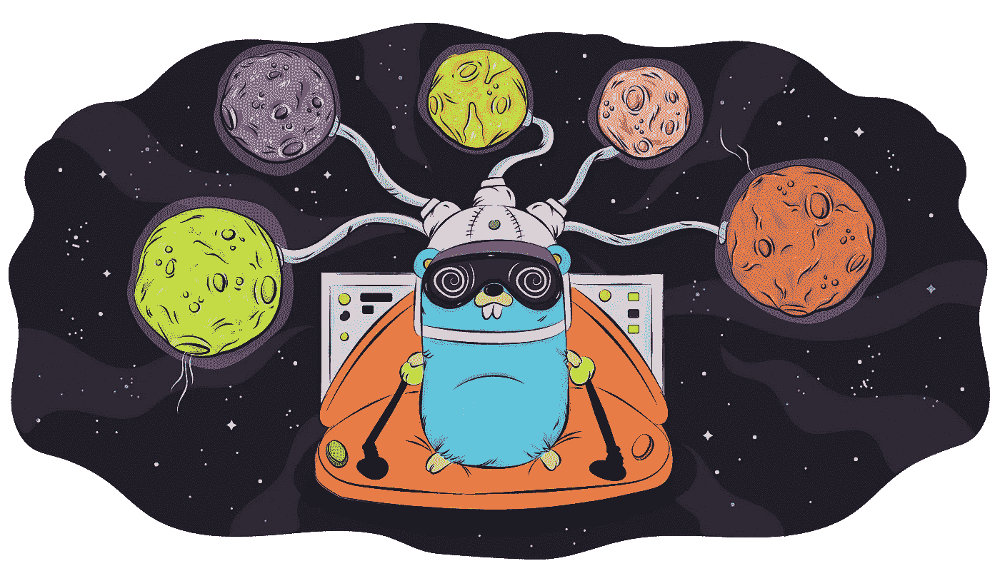
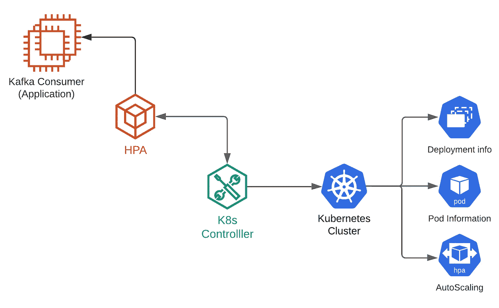

# Golang Kafka 100:Golang Kafka 消费者滞后管理介绍

> 原文：<https://blog.devgenius.io/series-intro-to-managing-golang-kafka-consumer-lag-41b36d3a14b9?source=collection_archive---------8----------------------->

这一系列文章将解释我的团队在 Kafka 的实时过程中导出一个最重要的指标的过程:消费者滞后。

# TL；速度三角形定位法(dead reckoning)

消费者滞后是一个很难在[融合 kafka go](https://github.com/confluentinc/confluent-kafka-go) 包中提取的指标，但我们设计了一种方法来同步我们的消费者/pod 以计算它，并触发一个自定义 HPA，该 HPA 采用该指标并根据我们的负载缩小/扩大我们的消费者。这些都运行在 Kubernetes/On Prem 环境中。

# 介绍

我们的第一篇文章将高度概括我们为什么采用这种方法，解释我们面临的约束以及我们如何设计解决方案。文章的其余部分将包含与所采取的步骤相关的所有代码。

1.  简介:管理戈朗卡夫卡消费滞后
2.  [提取并计算我们的消费滞后](https://javiersotodev.medium.com/golang-kafka-101-extract-and-calculate-our-consumer-lag-40f902158948)
3.  构建和使用我们的定制 HPA
4.  深入了解我们的 Kubernetes 控制器

# 问题是

我们是一个实时处理团队，非常依赖于尽可能快地在我们的 APIs 数据库中反映 Kafka 的这些变化。对于这些，我们有一组用 go 编写的服务，它们消费消息，执行业务逻辑，并将它们插入到我们的数据库中。每个服务都是同一个使用者组的一部分，并且它有多个 pod 在同一个部署(我们的副本集)下运行。为了扩展我们的服务，我们需要检查控制中心，查看我们积压的消息，并相应地增加/减少 pod 计数。正如您可能认为的那样，这一过程是手动的、乏味的，因为我们喜欢创新，尽可能做得最少，所以我们自动化了这一过程。

值得一提的是，由于我们无法控制的限制，我们的空间(公司)没有能力拥有普罗米修斯驱动的 HPA。

# 我们的建筑

为了简化您对我们接下来步骤的理解，我将向您展示并解释我们解决方案的高层次示意图。

从左到右，您会看到我们的摄取服务(我们的消费者群体)和它们各自的副本集。这些服务将有一个反映该 pod(单个消费者)的消费者滞后的端点。适当的函数将只计算分配给该消费者的分区的滞后，而不是消费者组已经分配的所有分区的滞后。解决方法是直接进入我们的每个 pod，汇总所有信息，然后获得消费者群体的总滞后。

为此，您会看到另一个服务充当我们的 kubernetes 控制器，它负责向我们提供 pod IPs，还将在运行时扩展/缩减我们的服务。

总的来说，我们有一组 3 个服务，它们之间将进行交互，管理与我们的负载相关的资源。

# 这个计划

接下来的步骤将是所有人都参与进来，因为我们将实现从我们的服务中提取我们的 lag 的功能，建立我们的 HPA 服务，并且作为一个额外的功能，我们将建立我们的 Kubernetes 控制器。这一切都发生在戈朗。

希望在你读完这一系列文章后，你能更好地理解我们提供的解决方案，以及如果你正在努力应对消费者滞后管理，它能如何帮助你。