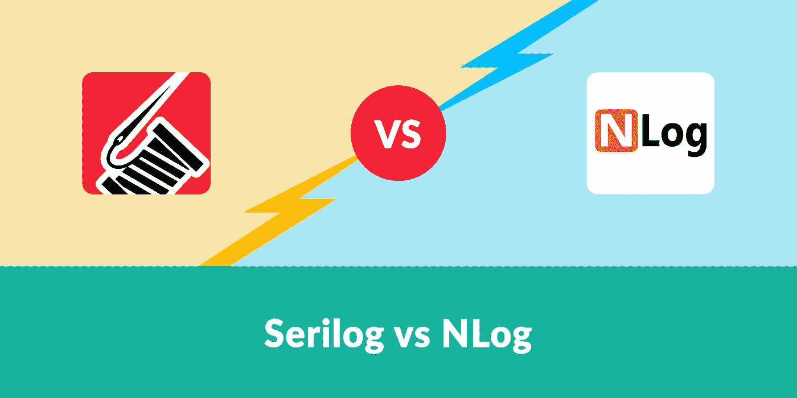

# Serilog vs Nlog

> 原文：<https://blog.devgenius.io/serilog-vs-nlog-7d0a322a4732?source=collection_archive---------1----------------------->

## 编程；编排

Serilog 与 Nlog 之间的基准测试



来自 [elmah.io](https://blog.elmah.io/serilog-vs-nlog/) 的 Serilog vs Nlog

在本文中，我比较了 Nlog 和 Serilog。这些库用于日志记录。它们的目标(控制台、文件、弹性、数据库等。)是相当多样的。

另外，我也做了一个基准测试。我从易用性、日志速度和每总日志中丢失的日志等方面对它们进行了比较。我使用了两个目标控制台和文件。

## Nlog

NLog 是一个免费的日志平台。NET 具有丰富的日志路由和管理功能。它使得为您的应用程序生成和管理高质量的日志变得容易，而不管它的大小或复杂性如何。

它可以处理从任何。NET 语言，根据您的喜好对它们进行格式化，然后将它们发送到一个或多个目标，如文件或数据库。

## Serilog

Serilog 是的诊断日志库。NET 应用程序。它很容易设置，有一个干净的 API，并运行在所有最新的。NET 平台。尽管即使在最简单的应用程序中也很有用，但 Serilog 对结构化日志记录的支持让复杂、分布式和异步的应用程序和系统大放异彩。

## 配置

先说配置差异。两者都有三种类型的配置 xml、json 和编程配置。

## a.XML 配置

**Nlog:**

*   创建 xml 文件。
*   xml 文件名应为“Nlog.config”。如果您想给它一个自定义名称，您必须在配置中提供您的自定义配置名称。
*   配置文件属性必须在“属性”选项卡中设置为“如果更新则复制”或“总是复制”(右键单击您的。并选择属性)。否则，Nlog 日志记录将不起作用。
*   如果要激活“自记录”来记录库错误，应该在配置文件中设置“internalLogToConsole”或“internalLogFile”属性。

Nlog 初始化

Nlog 配置

**系列:**

*   创建 xml 文件。
*   它必须命名为 App.config。
*   如果应用程序配置中缺少“configuration”标记下的“appsettings”标记，则必须创建“appsettings”标记。
*   如果您想要激活“自记录”来记录库错误，您应该在 C#配置中添加硬编码的配置。

串行初始化

串行配置

## b.JSON 配置

**常见的**:

*   创建一个 json 文件。
*   它必须命名为“appsettings.json”。
*   您必须创建一个“IConfiguration”接口，并将其赋予您的记录器配置。
*   如果您不熟悉这个主题，Json 配置可能看起来很复杂。

**Nlog:**

*   您必须在记录器配置中使用“GetSection”方法来读取 appsettings 文件。

Nlog 初始化 V2

Nlog 配置 V2

**系列:**

*   与 Nlog 不同，您不必在配置中使用“GetSection”方法。

Serilog 初始化 V2

串行配置 V2

## c.程序配置

**Nlog:**

*   它不需要任何设置文件。

Nlog 初始化 V3

**系列:**

*   它不需要任何设置文件。
*   Serilog 的编程配置代码比 Nlog 的代码更干净。

Serilog 初始化 V3

## 关于图书馆

**Nlog:**

你需要网络日志。Web.AspNetCore 4.9.2 库。

共有六个日志级别。这些是:

*   非常详细的日志。该日志级别通常仅在开发期间启用。
*   `Debug` -调试信息，不如跟踪详细，通常不在生产环境中启用。
*   `Info` -信息消息，通常在生产环境中启用。
*   `Warn` -警告消息，通常针对非关键问题，可以恢复或者是临时故障。
*   `Error`——错误信息——大多数时候这些都是`Exceptions`
*   `Fatal` -非常严重的错误！

**系列:**

了解汇(目标)是你的优势。您将使用的库将根据您使用的接收器而变化。

例如

*   如果你需要登录到一个文件，你应该使用 Serilog。Sinks.File
*   如果需要登录控制台，应该使用 Serilog.Sinks.Console。

相反，您可以使用单个库。我用过 Serilog。本教程中的 AspNetCore 3.2.0 包。

要读取您的 xml 配置，您必须添加 Serilog。将 Settings.AppSettings 2.2.2 打包到您的项目中。如果使用 json 配置，就不需要这个包了。

共有六个日志级别。这些是:

*   `Verbose` - verbose 是最嘈杂的级别，很少用于生产应用程序。
*   `Debug` -调试用于内部系统事件，这些事件不一定能从外部观察到，但在确定事情是如何发生的时候很有用。
*   `Information` -信息事件描述系统中发生的与其职责和功能相对应的事情。通常，这些是系统可以执行的可观察的动作。
*   `Warning` -当服务降级、濒危或可能表现超出其预期参数时，使用警告级别事件。
*   `Error` -当功能不可用或不符合预期时，使用错误事件。
*   `Fatal` -最关键级别，致命事件需要立即关注。

## 基准

该基准有三个方面，即“易用性”、“日志速度”和“每个日志中的缺失日志”。我已经创建了一个. net core 3.1 控制台应用程序，并使用了下面的库:

对于 NLog，我使用了 Nlog。Web.AspNetCore 4.9.2。对于 Serilog，我使用了 Serilog。AspNetCore 3.2.0。

我已经登录到控制台和一个文件中，使用默认设置的 json 配置，除了在最后一步。

## a.易用性

*   在 Nlog 的 xml 配置上添加额外的属性比 Serilog 的配置更干净。
*   使用 Json 配置几乎是同样的体验。
*   Serilog 的编程配置代码比 Nlog 的代码更干净。

易用性

所以，2 比 2 平了！

## b.对数速度

查看两分钟内的日志总数(非异步日志记录)。

第一次尝试:

```
Serilog total log count in two minutes: 183398
Nlog total log count in two minutes: 275637
```

第二次尝试:

```
Serilog total log count in two minutes: 174372
Nlog total log count in two minutes: 285818
```

第三次尝试:

```
Serilog total log count in two minutes: 141221
Nlog total log count in two minutes: 232180
```

## c.每个日志总数中缺少的日志

在开发任何类型的应用程序时，这一部分都很重要。没有人想错过任何日志。

我使用过异步日志记录。我用过 Serilog。Serilog 的 Sinks.Async 1.4.0 包。不需要为 Nlog 安装任何包。

Nlog 的异步设置如下:

Nlog 配置

以下 Serilog 代码中的异步设置:

```
Serilog.ILogger logger = new LoggerConfiguration()
  .MinimumLevel.Verbose()
  .WriteTo.Async(a => a.File("logs\\Serilog..log", rollingInterval: RollingInterval.Day), blockWhenFull: true)
  .CreateLogger();
```

Nlog 和 Serilog 记录程序都记录了所有数据，没有遗漏任何日志，大约用了 13 秒。Serilog 比 Nlog 快一点。

基准代码如下:

[](https://github.com/eklnc/serilogVSnlog) [## eklnc/serilogVSnlog

### 在 GitHub 上创建一个帐户，为 eklnc/serilogVSnlog 开发做贡献。

github.com](https://github.com/eklnc/serilogVSnlog) 

## 结论

我们讨论了 Nlog 和 Serilog，了解了日志配置，了解了如何使用这些日志程序，并在三个方面对它们进行了比较。

## 如果你喜欢这篇文章，探索我的其他故事！

[](https://link.medium.com/C5oEwJl9w6) [## Amazon MQ 入门

### 一个语言很重要的地方

link.medium.com](https://link.medium.com/C5oEwJl9w6) [](https://link.medium.com/cJ28g6eMI6) [## 如何在亚马逊 CloudWatch 上使用 AWS Lambda 功能？

### 一个语言很重要的地方

link.medium.com](https://link.medium.com/cJ28g6eMI6) 

## 了解更多信息

*   关于 [Nlog](https://github.com/NLog/NLog)
*   关于[系列](https://github.com/serilog/serilog)

特别感谢[费尔哈特·奥兹坎](https://www.linkedin.com/in/ferhatoezkan/)