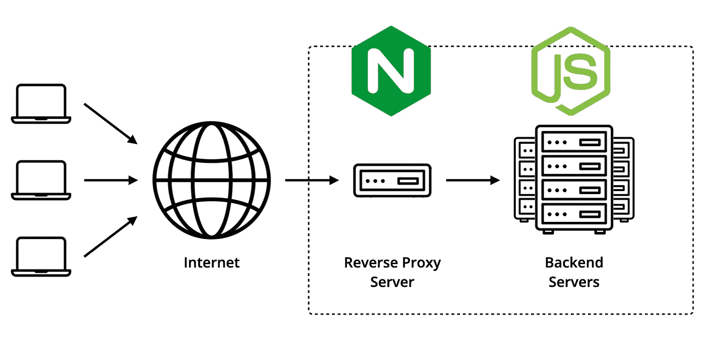

# 用 Node.js 和 Nginx 服务 HTTPS

> 原文：<https://blog.devgenius.io/serve-https-with-node-js-and-nginx-a758bd4be8a1?source=collection_archive---------0----------------------->

🚀 [**打造分层微服务**](https://learnbackend.dev/books/build-layered-microservices) 这本书出来了！现在就在 [learnbackend.dev](https://learnbackend.dev/books/build-layered-microservices) 购买你自己的副本。



使用 Nginx 处理 Node.js 应用程序的 HTTPs 流量

不可否认，Node.js 是创建 web 应用程序的一个很好的工具，现在几乎在所有基于微服务的架构中都有使用。然而，在提供静态内容、跨多个实例的负载平衡、处理快速流量增长或在多个服务之间共享 SSL 证书时，Node.js 显示出一些缺点和漏洞。

在本文中，我们将了解如何利用 **Nginx** (发音为“engine x”)——这是一个由伊戈尔·塞索耶夫创建的免费开源 web 服务器，也可以用作反向代理、负载平衡器、邮件代理和 HTTP 缓存——来处理互联网流量，并通过 HTTPS 将其转发到一个简单的 Node.js 应用程序。

# 简单的 Node.js 应用程序

出于本文的目的，我们将使用下面的 Node.js 服务器，该服务器监听端口`8000`，并实现一个单独的`GET /health`路由，该路由用包含服务正常运行时间和当前日期的 HTTP `200 OK`进行响应。

所以，让我们安装 Express 框架。

```
$ npm install express
```

将这个脚本添加到名为`app.js`的文件中。

```
const express = require('express');

const app = express();

app.get('/health', (req, res) => res.json({
  uptime: process.uptime(),
  timestamp: Date.now(),
}));

app.listen(8000);
```

使用`node`实用程序运行它。

```
$ node app.js
```

并使用下面的 cURL 命令验证服务器是否正常工作。

```
$ curl http://127.0.0.1:8000/health
```

它应该用一个类似的对象来响应。

```
{"uptime":173.158353287,"timestamp":1668018207202}
```

# 关于反向代理服务器

在软件工程中，**反向代理服务器**是一个中介服务器，其作用是将来自多个客户端的请求转发到适当的后端服务器或服务，并返回它们的响应。

这种类型的服务器通常用于:

*   **负载平衡** —这意味着将请求分布在可用的服务器上，以最大化速度，同时确保没有人过载。
*   **Web 加速** —包括压缩数据、缓存经常请求的内容或使用 SSL 加速来加速入站和出站流量。
*   **安全性** —允许多个服务共享并使用相同的 SSL 证书进行数据加密。
*   **匿名**——通过将所有请求指向一个单一的公开地址，使原始服务器看起来像一个整体，从而隐藏原始服务器的特征；这反过来有助于减少安全缺陷和 DoS 攻击。

# 将 Nginx 设置为反向代理服务器

让我们从使用`apt`命令安装 Nginx 开始。请注意，`-y`标志用于自动确认 Nginx 正常运行所需的附加包的安装。

```
$ sudo apt install nginx -y
```

由于我们将使用 Nginx 作为 internet 流量和 Node.js 应用程序之间的中介，我们将对其进行配置，以便在端口 443(HTTPS 使用的默认端口)上发送的任何传入请求都会自动转发到端口 8000(node . js 应用程序正在侦听的端口)。

为此，让我们首先在 Nginx 目录中创建一个名为`ssl`的新目录，它将包含 SSL 证书和私钥。

```
$ sudo mkdir /etc/nginx/ssl
```

让我们使用`openssl`命令生成一个自签名 SSL 证书。

```
$ sudo openssl req -x509 -nodes -days 365 -newkey rsa:2048 -keyout /etc/nginx/ssl/server.key -out /etc/nginx/ssl/server.crt
```

让我们使用 Vim 命令行文本编辑器打开位于`/etc/nginx/sites-available`目录中的默认 Nginx 配置文件。

```
$ sudo vim /etc/nginx/sites-available/default
```

最后，让我们用以下值更新配置文件。

```
server {
  listen 443 ssl;
  server_name _;

  ssl_certificate /etc/nginx/ssl/server.crt;
  ssl_certificate_key /etc/nginx/ssl/server.key;

  location / {
    proxy_pass http://localhost:8000;
  }
}
```

其中:

*   `listen`指令允许端口`443`上的 TLS/SSL 流量。
*   `server_name`指令允许定义服务器块应该应用于哪个域名——在这种情况下，下划线字符充当通配符，允许所有请求。
*   `ssl_certificate`指令指定从哪里加载公共 SSL 证书。
*   `ssl_certificate_key`指令指定从哪里加载私钥。
*   `proxy_pass`指令允许定义传入请求应该被重定向到的地址。

现在，让我们使用`service`命令启动 Nginx 服务器。

```
$ sudo service nginx start
```

并使用下面的 cURL 命令测试我们的设置。请注意，`-k`标志用于在“不安全模式”下运行 cURL，否则它会因为使用自签名证书而抛出错误。

```
$ curl -k https://127.0.0.1/health
```

# 最后的想法

最后，我应该提到，在生产中，自签名 SSL 证书无法工作，需要从可信的证书颁发机构(如 Cloudfare、DigiCert、GeoTrust 等)获取。我还鼓励您查看 Nginx 的官方文档，了解更多关于指令和高级配置的信息。

# 下一步是什么？

👉你喜欢这种内容？在 [https://learnbackend.dev](https://learnbackend.dev/) 查看《如何使用 Express framework 构建生产就绪的分层认证微服务》一书 [**构建分层微服务**](https://learnbackend.dev/books/build-layered-microservices) ，该书从第一行代码到最后一行文档都符合开发实践和软件架构方面的行业标准。