# 在 Nginx 上提供 Python 应用

> 原文：<https://blog.devgenius.io/serve-python-app-on-nginx-6bc57ceaed4c?source=collection_archive---------1----------------------->

读者们好，在这篇博客中，我将使用 flask 框架创建一个 python 应用程序，并将其设置在 Gunicorn 应用服务器上，启动该应用程序并配置 Nginx web 服务器。

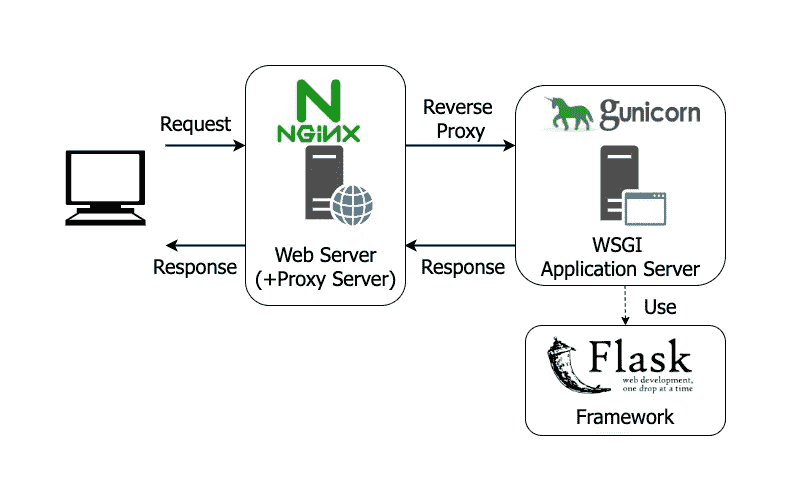

> **第一步:安装 python 虚拟环境的 python pip3 等包。**

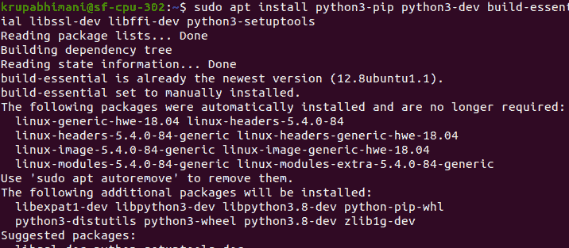

> **第二步:创建 python 虚拟环境**

**什么是 python 虚拟环境？**

*   当您在使用相同包的不同版本的不同 python 项目上工作时，这很有用。因此，在这种情况下，虚拟环境有助于分别维护两个项目的依赖关系。它将创建两个不同的环境，并将每个项目的依赖关系保持在特定环境的范围内。

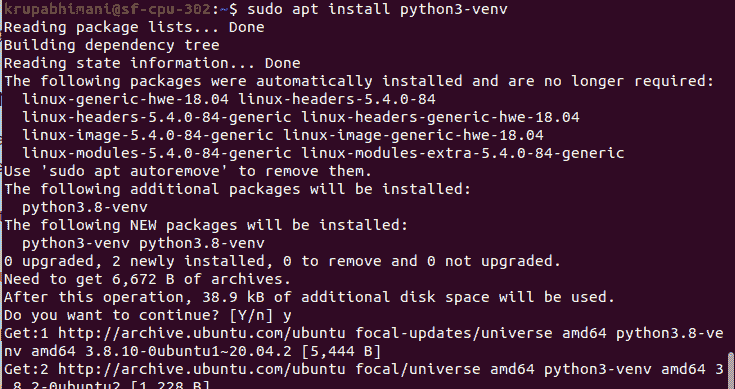

现在创建一个目录并移入目录，在该目录中创建一个虚拟环境来存储 python 项目需求。

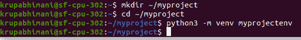

激活环境

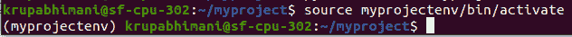

> **步骤 3:设置烧瓶应用程序**

在这里，我们将安装 flask 和 gunicorn，并创建一个简单的应用程序。

**Flask:** 它是 python 的一个 web 框架，用于在 python 中构建 web 应用。

**Gunicorn:** 它是一个纯 python 的 HTTP server WSGI 应用。

**WSGI:** 它是一个 web 服务器网关接口。它用于将来自 web 服务器(如 Apache 或 NGINX)的请求转发到后端 Python web 应用程序或框架。

安装车轮

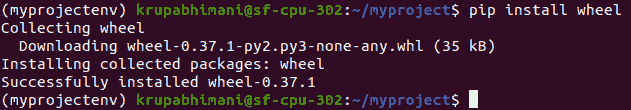

安装喷枪和烧瓶

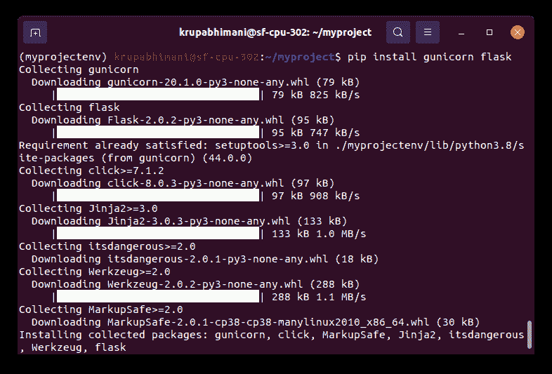

使用 flask 创建一个示例 web 应用程序。

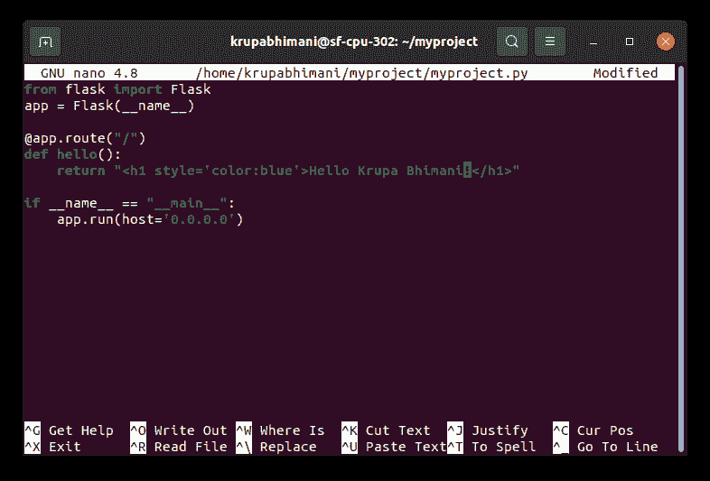

允许接入端口为 5000。

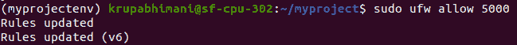

测试应用程序

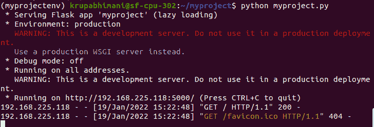

我们可以看到它正在 5000 端口上运行。

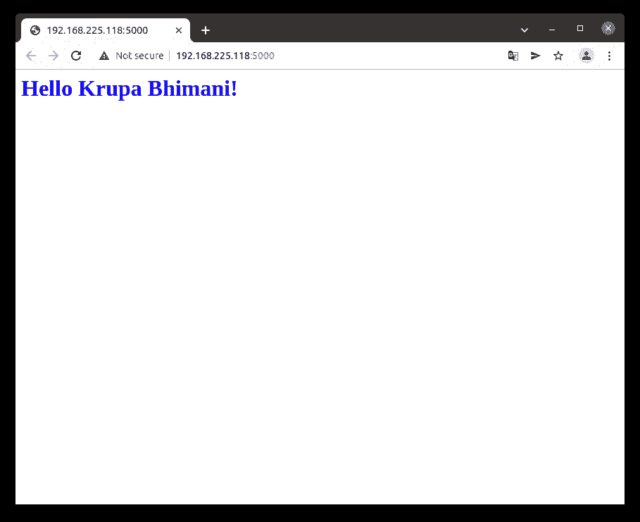

创建 WSGI 入口点

创建一个文件作为应用程序的入口点。

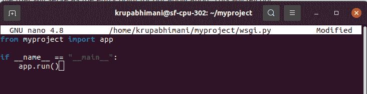

> **步骤 4:配置 Gunicorn**

传递入口点的名称

还要指定要绑定的接口和端口，以便应用程序可以在公共可用的接口上启动。

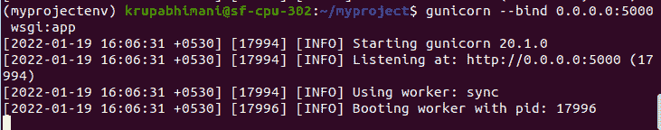

您可以看到它正在使用 Gunicorn 服务器运行

创建 systemd 服务单元文件，以便在服务器重新启动时自动启动 Gunicorn 和 server flask web 应用程序。

**【单元】:**该部分用于指定元数据和依赖关系。

**【服务】:**这个部分将指定我们想要运行的用户和组。

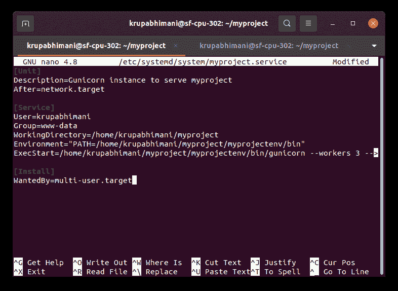

启动并启用服务

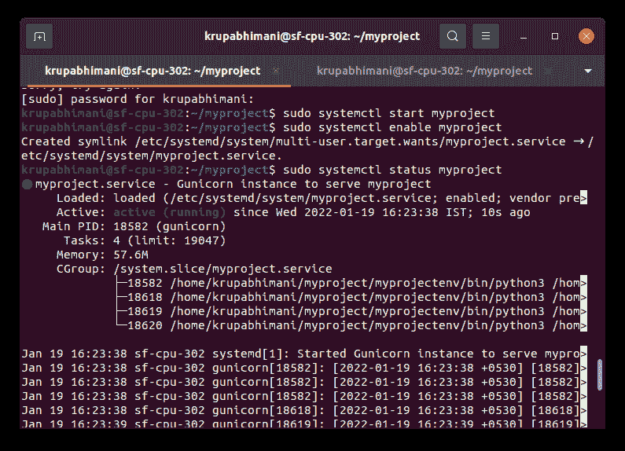

> **步骤 5:配置 Nginx 来代理请求**

在站点可用文件夹中创建一个文件并传递代理

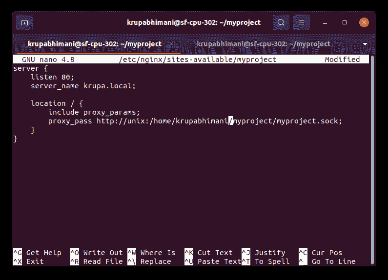

创建一个软链接

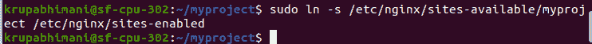

编辑主机文件，并在该文件中为您的域添加主机

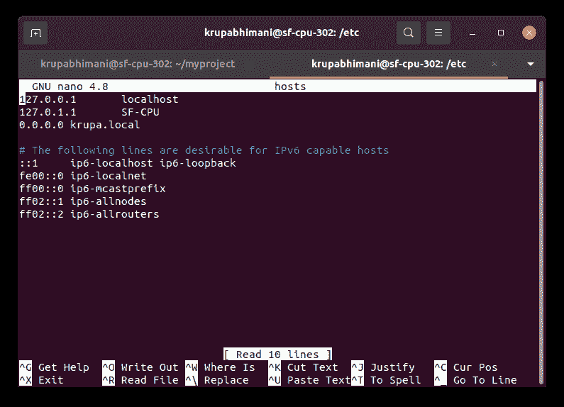

检查 nginx 中的语法

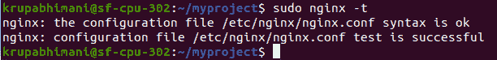

授予对 nginx 的完全访问权限

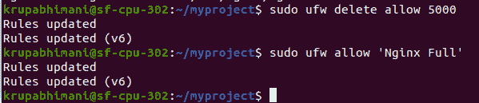

重启 nginx 并在浏览器中输入 krupa.local，它将服务于您的 python 应用程序。

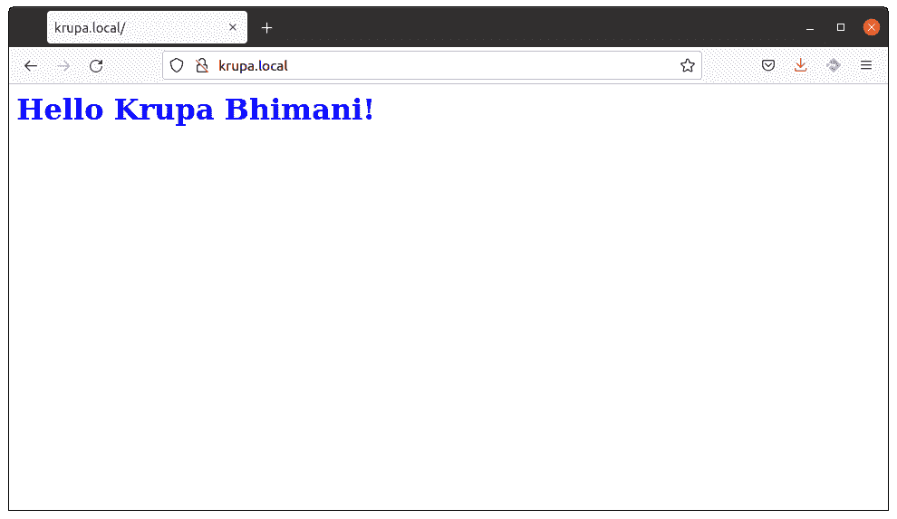

谢谢大家！！！