# 使用 react-query 和 react-bootstrap-table-next 进行服务器端排序和分页(最佳实践)

> 原文：<https://blog.devgenius.io/server-side-sorting-and-pagination-using-react-query-and-react-bootstrap-table-next-best-practice-ce0041f67ed8?source=collection_archive---------0----------------------->

在这篇博客中，我将使用 [react-query](https://react-query.tanstack.com/overview) 和 [react-bootstrap-table-next 介绍服务器端排序和分页。](https://react-bootstrap-table.github.io/react-bootstrap-table2/)

通常，我更喜欢使用 useQuery 从服务器获取数据，

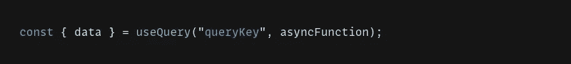

React Query 根据查询关键字管理查询缓存。查询关键字可以像字符串一样简单，也可以像许多字符串和嵌套对象的数组一样复杂。只要查询键是可序列化的，并且对于查询数据是唯一的，就可以使用它。“asyncFunction”负责从服务器获取数据。

这里我们可以从假设用户下一步可以去的场景开始。因此，在这种情况下，如果我可以向用户显示缓存的数据，而不是在获取数据时向用户显示 loader，会怎么样呢？这将增加用户体验。

让我们通过一个例子来理解上面的概念，在表分页中，我可以预测用户可以转到下一页，那么为什么我应该等待用户点击第二页的按钮，然后调用 API。这将导致加载器显示在用户界面上，或者我甚至可以保留前一页的信息，直到我们从 API 获得第二页的数据，如下所示。

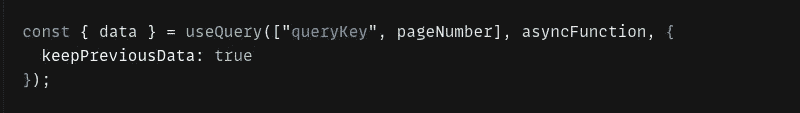

但最后，这需要时间来反映在点击事件后的 UI 上。

所以我将使用 prefetchQuery，它是一个查询客户端的方法，我们从服务器获取数据并将其存储在缓存中。

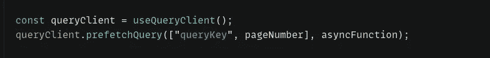

这将使用 asyncFunction 从服务器获取数据，并根据查询键将其存储在缓存中。

现在，让我们从演示开始。

使用[创建反应应用](https://reactjs.org/docs/create-a-new-react-app.html)创建反应应用

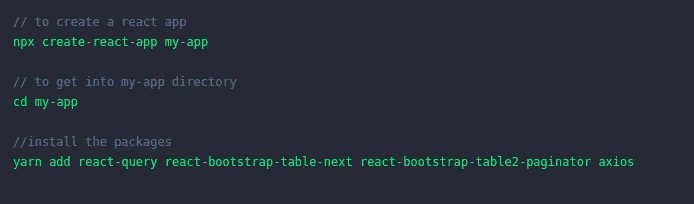

让我们在 app.js 文件中进行更改

使用 QueryClientProvider 组件连接并向我们的应用程序提供 QueryClient，如下所示。

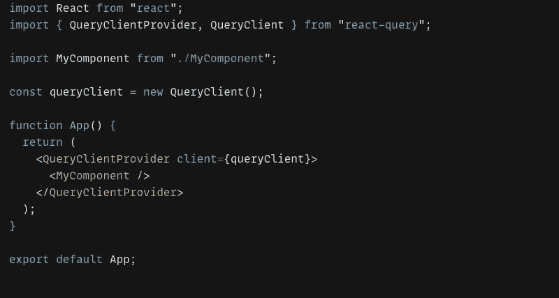

让我们创建自定义表格组件

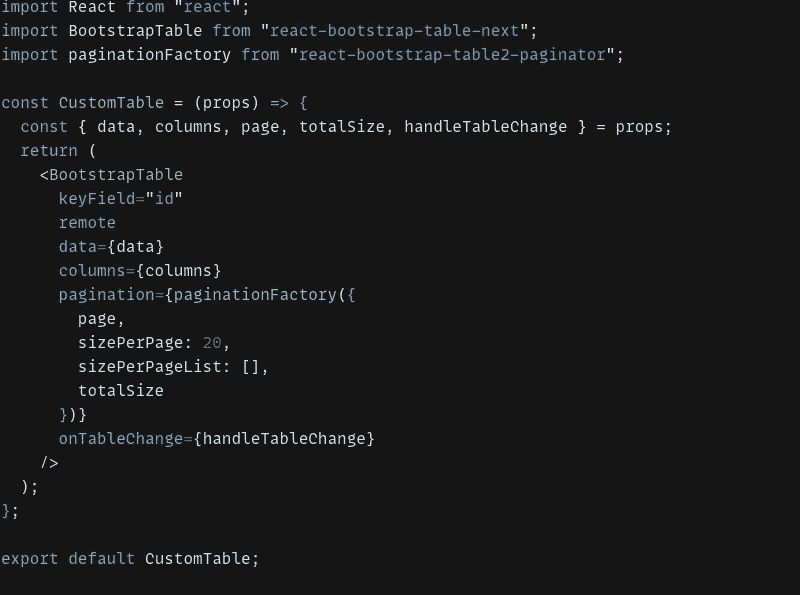

我将道具传递给这个组件，如下所示—

**数据**—API 调用后我们从服务器得到的响应数据。
**列** —是表
**页**的列名—表
**的活动页码 totalSize** —是服务器上存在的记录总数。
**handleTableChange**—处理分页和排序的处理程序，

更多详情请浏览 [**分页**](https://react-bootstrap-table.github.io/react-bootstrap-table2/docs/basic-pagination.html) 。

创建一个控制器。

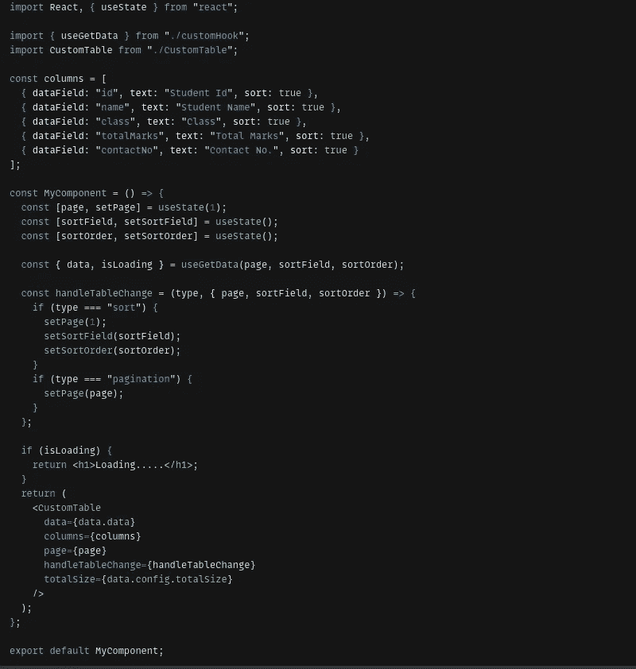

在这里，我使用了三个状态变量——**page**、 **sortField** 、 **sortOrder** 来管理分页和排序。页面的默认值是 1，然后将这些变量传递给我们的自定义钩子，用这些参数调用 API。

我已经析构了响应对象，以便从 useGetData 自定义钩子中获取数据和加载状态。
在这个例子中，数据的结构如下

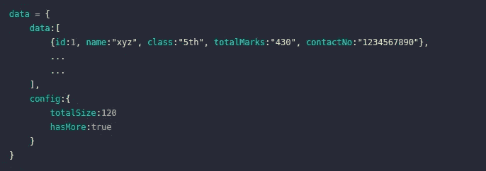

请注意，我在表格插件中添加了一个远程参数，这意味着分页和排序将被远程处理，并创建了一个名为 **handleTableChange** 的句柄函数，它将在每次单击分页和排序按钮时调用。
这个句柄函数接受两个参数—
1。类型—它是一种操作类型。在我们的例子中，要么是分页，要么是排序。对象—它包含某些值，即页面、排序字段和排序顺序。
根据类型，我正在更改导致 API 调用的状态变量，现在让我们来谈谈这个…

这是我定制的钩子

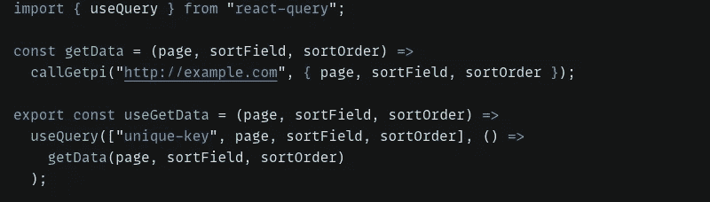

我们知道 [useEffect](https://reactjs.org/docs/hooks-effect.html) 中的依赖数组的行为。同样的想法也适用于这里，我已经将 page、sortField 和 sortColumn 作为查询键的一部分进行了传递，它的行为就像一个依赖数组。这意味着如果这些值中的任何一个发生变化，它将在回调函数的帮助下导致新的 API 调用。

这是使用 react-bootstrap-table-next 和 react-query 的服务器端分页和排序的基本实现。

但这不是解决我们问题的恰当方法。
当用户点击任何分页或排序按钮时，它将导致新的 API 调用，因此 loader 将显示在屏幕上，直到我们得到新的数据响应，是的，我们已经讨论过这一点，我必须稍微修改我们的 useGetData 挂钩如下-

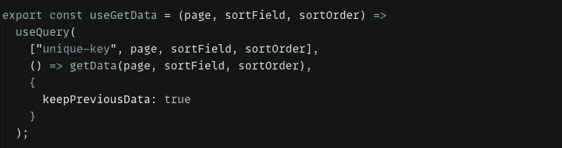

但是正如所讨论的，这将再次花费时间来反映用户点击事件后的用户界面。
现在我将使用 queryClient 的 prefetchQuery 方法对下一个页面进行 APIcall，并将数据存储在缓存中。

为此，我将在我们的自定义钩子中使用 useEffect 钩子，它依赖于我们提供给 useQuery 的所有动态键，我将检查是否有更多的数据，同样，我将处理下一页的 API 调用，如下所示。

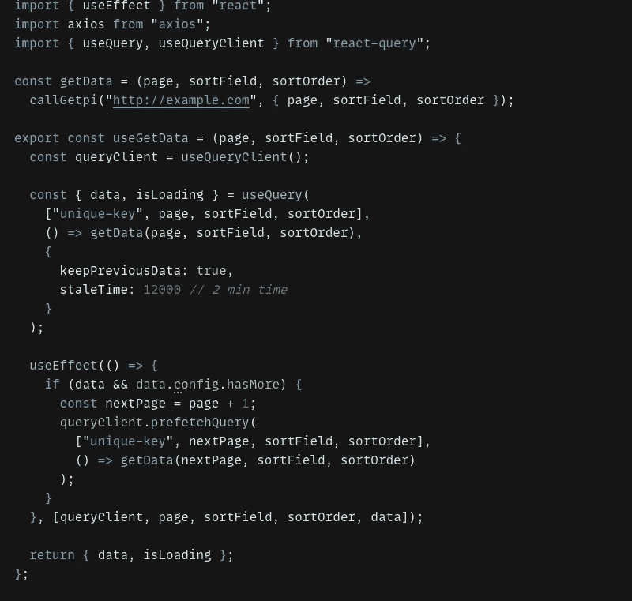

在我的例子中，我将 staleTime 设置为 2 分钟。这意味着在 2 分钟内不会有新的 API 调用使用相同的键，它将从缓存中引用数据。

这就是我们如何预取数据，并以特定的过时时间将其存储在缓存中，这将有助于我们在用户单击下一页时更快地显示数据。

哦，哇，你已经走了这么远了！如果你喜欢这篇文章，也许可以在 LinkedIn 上分享。

谢谢大家！