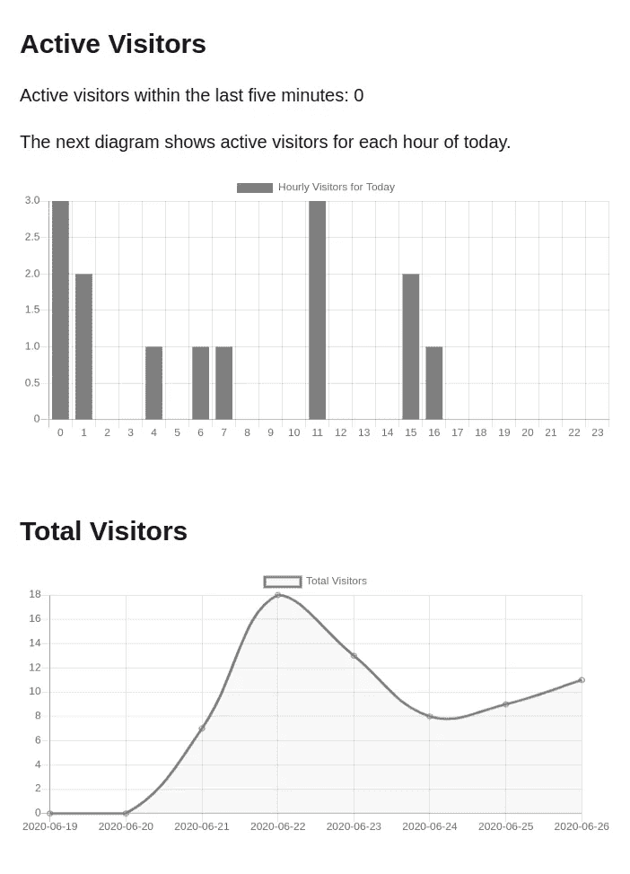

# Go 中没有 Cookies 的服务器端跟踪

> 原文：<https://blog.devgenius.io/server-side-tracking-without-cookies-in-go-44f3703331ba?source=collection_archive---------4----------------------->


图片由 [Unsplash](https://unsplash.com?utm_source=medium&utm_medium=referral) 上的 [Taras Shypka](https://unsplash.com/@bugsster?utm_source=medium&utm_medium=referral) 拍摄

> 本文原载于我的网站:[https://Marvin Blum . de/blog/server-side-tracking-without-cookies-in-go-oxdzmgz 1 bl](https://marvinblum.de/blog/server-side-tracking-without-cookies-in-go-OxdzmGZ1Bl)
> 
> 更新:Pirsch 将成为一个产品！查看 [pirsch.io](https://pirsch.io/) 了解更多信息。

我在寻找谷歌分析的替代品来跟踪网站上的访问者。Analytics(及其大多数竞争对手)以牺牲隐私为代价，提供了详细的信息和实时数据。谷歌可以使用一系列不同的技术，通过他们的 Chrome 浏览器，跨网站追踪你。结合起来，这可以组合成一个详细的配置文件，不仅可以用于跟踪，但也可以用于营销。

我发现了一些类似 [GoatCounter](https://www.goatcounter.com/) 的(开源)替代品，它们匿名收集数据，不会侵犯用户的隐私。但我发现的所有工具要么依赖于 cookies，访问者需要选择加入，要么需要花钱购买服务器端的跟踪解决方案。虽然我愿意为好的软件付费，特别是当它来自一个小团队或只有一个开发人员时，我想知道我是否可以构建一些可以集成到我的 Go 应用程序中的东西。

这篇文章是关于我的解决方案，叫做 *Pirsch* ，这是一个开源的 Go 库，可以集成到你的应用程序中，在服务器端跟踪访问者，不需要设置 cookies。我将写下所使用的技术以及优缺点。

> *TL；博士*
> 
> 侵犯网站访问者的隐私是邪恶的。Pirsch 是一个专注于隐私的 Go 跟踪库，可以集成到您的应用程序中。上[*GitHub*](https://github.com/emvi/pirsch)*看看吧！*
> 
> *你可以在我的网站上找到一个现场演示* [*这里*](https://marvinblum.de/tracking) *还有 GitHub 上的整个东西作为一个* [*样本应用*](https://github.com/Kugelschieber/marvinblum) *。*

# 这个名字是怎么回事？

Pirsch 是德语，指一种特殊的狩猎:*猎人小心翼翼、悄无声息地进入被猎区域，他逆风潜行，以求尽可能靠近猎物而不被发现。*

我发现这非常适合一个不能被访问者阻止的跟踪库。尽管听起来有点偷偷摸摸。这是由[丹尼尔](https://github.com/Motorschpocht)创造的地鼠。


媒体不允许上传 SVG。你可以在我的网站或者这个 GitHub Repo 里面找到一个 SVG:[https://github.com/emvi/gopher](https://github.com/emvi/gopher)

# 它是如何工作的？

稍后我会更详细地介绍每个步骤，但这里是 Pirsch 如何跟踪访问者的高级概述。

一旦有人访问你的网站，HTTP 处理程序调用 Pirsch 来存储一个新的点击，并继续做它想做的任何事情。Pirsch 将尽最大努力过滤掉机器人，计算指纹，并存储页面点击量。您可以在以后分析数据并从中生成统计数据。

该过程必须通过调用`Hit`方法并传递`http.Request`来手动触发。这使您能够决定跟踪哪些流量，不跟踪哪些流量。我通常只对页面访问感兴趣，所以我将在页面处理程序中添加一个对 Pirsch 的调用。资源在不同的端点上提供服务，并且不会以这种方式被跟踪。

# 指纹识别

指纹识别是一种通过结合一些参数来识别单个设备的技术。这些参数通常是显卡 ID 和设备特有的其他变量。由于我们对跟踪网站流量感兴趣，我们无法获得这类信息。相反，我们可以利用 IP 和 HTTP 协议。以下是 Pirsch 用来生成指纹的参数:

*   IP 是最明显的选择。这种情况可能会改变，因为互联网服务提供商只有有限的 IP 地址可供他们使用，但这种情况不应该经常发生
*   用户代理 HTTP 头包含关于访问者使用的浏览器和设备的信息。虽然它可能没有被填满，但通常是这样

为了从这些信息中生成唯一的指纹，我们可以计算一个散列值。Pirsch 将添加当天以防止跨天跟踪用户，并计算 MD5 散列。我发现这是 Go 标准库中最快的算法。这也将使访问者匿名，同时我们不存储 IP 或其他可识别的信息。

这种方法被称为*被动*指纹识别，因为我们只使用我们可以访问的数据。另一种方法叫做*主动*指纹识别，它利用 JavaScript 在客户端收集额外的信息并发送到后端。但是，当我们试图建立一个以隐私为中心的跟踪解决方案时，被动指纹识别是一条出路。

我们稍后将使用指纹来统计不同的访问者。

# 过滤机器人

过滤掉机器人流量很难，因为没有所有机器人的完整列表，它们不会发送任何特殊类型的信息，如*我是机器人*头。我们所能做的就是处理 IP 和用户代理头发送，并做一些假设。Pirsch 将在用户代理头中查找机器人经常使用的术语。如果它包含像 *bot* 或 *crawler* 或 URL 这样的词，点击将被丢弃。还没有实现对 IP 范围的过滤，但是你可以过滤来自流行 IP 范围的点击，比如 AWS。

# 打击

每个页面请求被存储为一个*命中*。命中是可以在以后进行分析的数据点。以下是命中的定义:

```
// I removed some details to make it more readable for this blog post
type Hit struct {
	Fingerprint string
	Path        string
	URL         string
	Language    string
	UserAgent   string
	Ref         string
	Time        time.Time
}
```

hit 包含完整的请求 URL、从 URL 提取的路径、语言、客户端在其相应的头中传递的用户代理和引用以及发出请求的时间。

# 分析

Pirsch 提供了一个*分析器*，可以用来提取一些基本的统计数据:

*   访客总数
*   每天按页面排列的访问者
*   每天每小时的访客数
*   游客使用的语言
*   一段时间内的活跃访客

这些函数中的大多数接受过滤器来指定时间范围。然后可以像在我的[跟踪页面](https://marvinblum.de/tracking)上一样绘制数据。



为了减少需要处理的数据量，每天晚上都要对点击量进行汇总，然后再进行清理。

Postgres 目前被用作存储后端，因为它是一个出色的开源数据库，提供了轻松读取这些统计数据所需的所有功能。如果您愿意，可以从数据库中提取更多的统计数据，比如访问者页面流量。

# 从 JavaScript 跟踪

虽然将跟踪集成到后端很简单，但是如果您运行的是单页面应用程序，那么您可能也想从前端进行跟踪。在这种情况下，您可以向路由器添加一个端点，并使用 Ajax 调用它。通过调用 *HitPage* 而不是 *Hit* 可以在 Pirsch 中手动覆盖该路径。

# 效果如何？

据我目前所知，它工作得很好。我仍然需要收集更多的样本数据，以及一种与谷歌分析进行比较的方法，以便做出更精确的陈述。请记住，虽然分析和其他工具提供了更详细的统计数据，如位置、年龄、性别等，但它们可能会被 uBlock 等工具阻止。Pirsch 不能被客户端屏蔽，因此它可以跟踪你用客户端解决方案都注意不到的访问者。

机器人可能是 Pirsch 目前的弱点，因为过滤它们需要在过滤列表中添加一大堆关键词。

根据您的用例，服务器端跟踪的另一个缺点可能是您无法跟踪您的营销活动。如果你使用 Adsense 进行营销，你可以通过分析来跟踪你的活动表现。这对皮尔希没用。

# 结论

服务器端的跟踪并不难存档，总而言之，我认为这是值得努力的。我希望您对如何利用指纹和 Pirsch 获得了一些见解。我将继续改进 Pirsch，并将其实施到 [Emvi](https://emvi.com/) 中，并将结果与分析结果进行比较。我可能还会为 Pirsch 添加一个用户界面，这样您就可以托管它，而无需将其集成到您的应用程序中，也无需自己生成图表。如果你想给我发送反馈，有问题，或想作出贡献，你可以联系我。