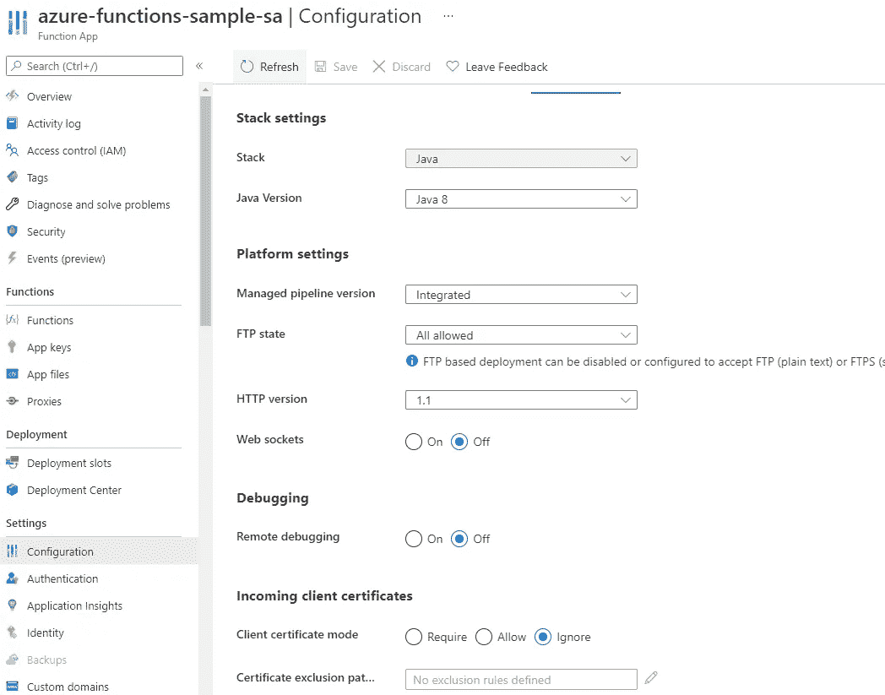
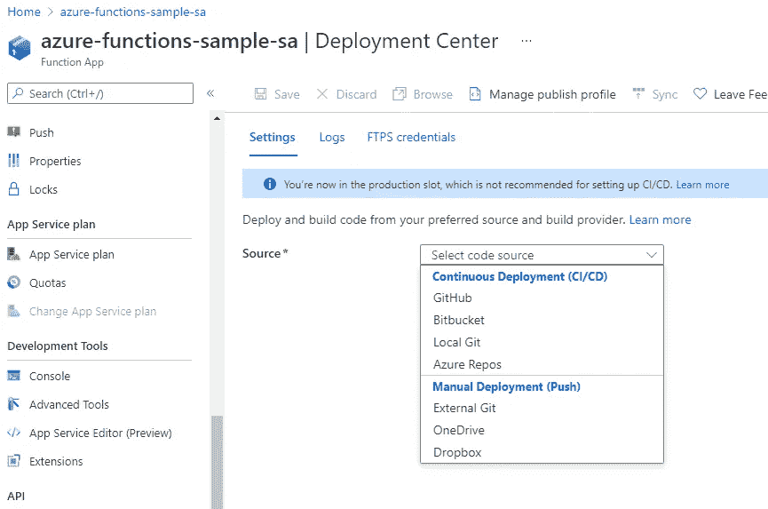

# 无服务器架构

> 原文：<https://blog.devgenius.io/serverless-architecture-1f5aed95c25b?source=collection_archive---------6----------------------->

## 无服务器简介

照片由@krisroller 在 [Unsplash](https://unsplash.com/?utm_source=unsplash&utm_medium=referral&utm_content=creditCopyText) 上拍摄

# 什么是无服务器

无服务器是软件开发中必然被误解的术语之一。这并不意味着没有服务器或者不需要服务器端代码。它真正的意思是

1.开发者不需要担心服务器基础设施。

2.开发人员只需编写代码，剩下的交给云提供商。

3.只要满足“调用”该代码的条件，就会触发其执行。

4.为了按需求扩展，将触发多个实例。

5.硬件、操作系统、安全性、按需扩展等所有后端工作都由云提供。

总结一下它对开发者的无服务器体验和“非无代码”。开发人员可以做他最了解的事情，即编写高质量的代码。

所有主要云服务提供商都有无服务器平台。这包括 AWS(Lambda Function)微软 Azure (Azure Functions)、谷歌云(Google Cloud Functions)和 IBM Cloud (IBM Cloud Code Engine)。AWS 是第一个开始这项工作的供应商。

# 无服务器服务的类型

## 1.功能即服务:FAAS

这是最常见和最流行的无服务器产品。在这种情况下，开发人员只需编写代码，其他一切都由云提供商提供。开发者的责任是

*   选择语言和运行时—例如 java 15
*   需要 RAM 内存
*   创建运行时并部署(就像创建 jar 一样)

配置 Azure 函数

部署选项

FAAS 可以由外部事件触发。这些事件可能就像

*   HTTP 请求
*   存储事件(如在 S3 添加任何东西)
*   将消息添加到事件中心(消息总线或队列)
*   向数据库添加任何内容。

上面列出的触发事件的例子决不是穷尽的。云提供商正在增加越来越多可能触发 FAAS 的事件。

说到执行，对于懂 Java 的人来说，FAAS 就像是课堂上的方法。每次执行它时，它都不会记得以前的执行状态和它已经计算过的内容。它将根据传递的输入进行新的计算。

现在在 Java 中，如果我们想记住状态，我们使用所有对象共享的类变量。在 FAAS 中，这是通过将它们外部存储在 DB 或文件或队列中来支持的(它扮演类变量的角色)。

所以联邦航空局在本质上是短暂的 T2。状态可以保存，但不能以传统方式保存。

大多数云提供商都为单次调用功能的“运行持续时间”配置了一些时间限制。

# 2.后端即服务:BAAS

这提供了后端代码及其部署的构建块。用户可以使用后台服务，专注于构建前端部分。这方面的一个常见用例是 MBAAS-移动后端即服务。

Couchbase、Firebase 和 Oracle Mobile Hub 是 BAAS 的一些流行示例。

以下是一些受欢迎的 BAAS 提供。

 [## 前 14 名后端即服务提供商

### 由凯尔西·泰勒出版的《移动后端即服务》(MBaaS)更出名，后端即服务是一种无服务器的…

www.hitechnectar.com](https://www.hitechnectar.com/blogs/top-14-backend-as-a-service-providers/) 

# 3.无服务器数据库

扩展数据库具有挑战性，甚至比扩展后端服务器更复杂。

垂直可伸缩性有与基础设施相关的限制(即使在云上，即使我们使用 Kubernetes 之类的东西)。

水平可伸缩性需要与分片相关的代码更改。这些分片规则可以为后端所知(静态规则)，也可以存储在后端服务之外(使用一些可用且一致的存储，如 zookeeper)。

不管怎么做，都很复杂。

这就是无服务器数据库出现的原因。用户可以存储数据，而不用担心空间/可用性限制。

无服务器数据库抽象扩展机制，可以处理不可预测的负载和峰值。

*这使得无服务器数据库成为 FAAS 的补充——两者都可以根据需求扩展和缩减，并且我们为我们使用的服务付费。*

无服务器数据库的例子有 DynamoDB、Azure Cosmos DB 和 Google Cloud Datastore。

# PREM vs IAAS vs PAAS vs 联邦航空局

这些首字母缩写有时听起来令人困惑。通过与真实生活经验的比较，我们可以更好地理解这些。

假设我们想开车上下班。我们将汽车租赁和类似的云术语进行粗略的比较。

## 关于 PREM:

买你的车。维护和使用它。

## IAAS:

租一辆汽车。但是你得维护它，驾驶它。

## PAAS:

租一辆汽车。提供商将对其进行维护，除了您必须维护的一些东西(根据协议)。在某一天你需要更多的车，你将不得不多租一辆(可能是短期的)。

## FAAS:

预订出租车。当你需要它的时候，你就打电话给它，并支付使用费。如果在某一天你有更多的出租车，另一辆出租车会在那段时间出现。

PREM 到美国联邦航空局的费用降低了，但所有权也降低了。

为了进一步阅读

 [## 无服务器数据库:好的、坏的和丑陋的

### Renato Losio 是一名学习过的工程师和 AWS 认证专家。雷纳托分享了他关于…的知识和经验

www.alldaydevops.com](https://www.alldaydevops.com/blog/serverless-databases-the-good-the-bad-and-the-ugly)  [## bliki:无服务器

### 无服务器架构是基于互联网的系统，其中应用程序开发不使用通常的服务器…

martinfowler.com](https://martinfowler.com/bliki/Serverless.html#:~:text=Serverless%20architectures%20are%20internet%20based,remote%20procedure%20calls%20%28FaaS%29.) 

**想进一步了解系统设计和深度学习，请关注我的******。****

***更多内容尽在*[*blog . dev genius . io*](http://blog.devgenius.io)*。***