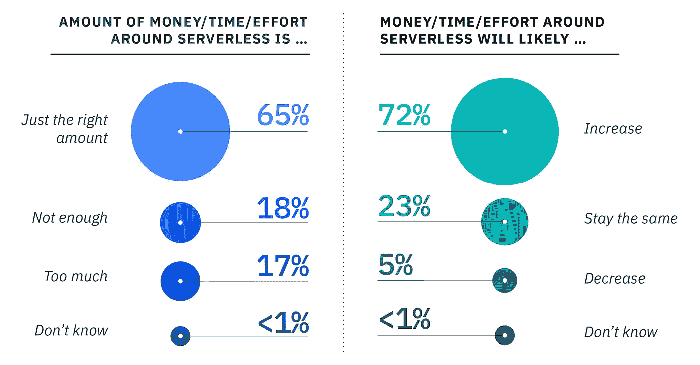
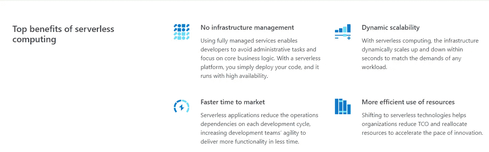
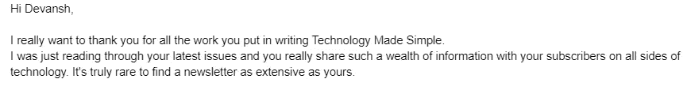

# 无服务器计算 101

> 原文：<https://blog.devgenius.io/serverless-computing-101-4fc24c4bdc59?source=collection_archive---------4----------------------->

## 这是目前计算领域最热门的话题之一。

为了帮助我了解您[请填写此调查(匿名)](https://forms.gle/7MfQmKhEhyBTMDUD7)

[加入我的科技崇拜](https://codinginterviewsmadesimple.substack.com/subscribe)

我们都知道服务器有多烦人，

设置它们是昂贵的。然后，您必须运行它们，这增加了您的运营开销。完美地利用它们是一场噩梦。如果你的服务器被过度利用，那么你的服务将会崩溃([使用 CDNs 进行负载平衡会有所帮助，尽管](https://codinginterviewsmadesimple.substack.com/p/an-introduction-to-cdnssystems-design))。如果它们没有被充分利用，那么我们最终会损失很多钱。两种情况都不好。

但是如果我告诉你有一种方法可以不用服务器呢？一种你不再需要担心那些讨厌的细节的方法。让您的企业变得精简灵活的方法。并利用这里讨论的[客户机-服务模式的所有好处](https://codinginterviewsmadesimple.substack.com/p/fundamental-architectural-patterns)。

***组织将继续投资无服务器。****95%的受访用户计划在下一年保持或增加他们的无服务器投资。* [Source-无服务器上的 IBMs 记录](https://www.ibm.com/cloud/learn/serverless)

想了解更多信息吗？让我们开始吧。

# 突出

1.  **什么是无服务器-** 无服务器是一种云应用程序开发和执行模型，允许开发人员构建和运行代码，无需管理服务器，也无需为闲置的云基础架构付费。
2.  **工作原理-** 你基本上是根据自己的需求向服务器提供商付费。您不必为固定数量的服务器空间支付大量费用，而是为您需要的确切数量付费。
3.  **服务器即服务-** 我们已经谈论了很多“即服务”的方法。这是另一个例子。大型服务器提供商可以提供廉价的空间。小型组织不需要担心成本溢出。每个人都赢了。Yaayy 资本主义。
4.  **AI 中的无服务器-** 说到人工智能、数据科学、机器学习——无服务器计算扮演着非常重要的角色。当你建立大规模的 ML 项目时，你的计算成本变化很大。一旦我建立了一个基本的 ML 管道，我真的只需要付钱就可以让数据进来(并在上面完成推理)。所以你不需要很多服务器空间[，直到你遇到数据漂移](https://youtu.be/qBmAwvGKvas)。在这种情况下，您将需要大量的计算来重新训练您的模型。如果你有一个自动系统来检测数据漂移并自动重新训练(你应该这样)，那么你的计算需求将会有很大变化。使用无服务器计算是一个伟大的方式，不必跟踪每一个微小的变化，并释放大量的精神能量。

[来源——Azure 的无服务器指南](https://azure.microsoft.com/en-us/resources/cloud-computing-dictionary/what-is-serverless-computing/)

云计算是一个需要更多细节的微妙领域。我很快会做更多的细节。盯着它。对于任何对无服务器或云计算感兴趣的人，我有一篇特别的文章链接到下面。

我与 AWS Nordics 的解决方案架构师 [**穆罕默德·赛义德(他的 LinkedIn 在这里)**](https://www.linkedin.com/in/musa/) 进行了一次对话。AWS Nordics 是亚马逊网络服务的分支，在丹麦、瑞典、芬兰、挪威和北欧地区的其他斯堪的纳维亚国家运营。我们谈论了如何在谷歌、亚马逊、Meta、网飞、苹果、微软和其他顶级科技公司找到工作的话题。以及如何进入云计算/新兴领域。如果这是你感兴趣的东西，你应该去看看。

 [## 来自高级亚马逊云解决方案架构师的经验

### 如何进入新兴技术，建立一个惊人的职业生涯，导师的好处等等

blog.devgenius.io](/lessons-from-a-senior-aws-cloud-solutions-architect-335efaead5ee) 

更多这样的文章，请查看我的时事通讯[技术变得简单](https://codinginterviewsmadesimple.substack.com/)。Tech Made Simple 是寻求在技术领域建立惊人职业生涯的人的最佳资源。它将帮助您概念化、构建和优化您的解决方案。**它涵盖了从系统设计、计算机科学概念和 Leetcode 问题解决的技术方面到网络和职业发展的详细指南的所有内容**。*在一个地方找到你所有的需求，节省你的时间、精力和金钱。* [**使用此处的链接可享受 20%的优惠，优惠期长达一整年**](https://codinginterviewsmadesimple.substack.com/subscribe?coupon=1e0532f2) **。**

我创造了[技术，利用通过指导多人进入顶级科技公司而发现的新技术使](https://codinginterviewsmadesimple.substack.com/)变得简单。时事通讯旨在帮助你成功，避免你在 Leetcode 上浪费时间。**我有一个 100%满意的政策，所以你可以尝试一下，不会有任何风险。[您可以阅读常见问题解答，并在此了解更多信息](https://codinginterviewsmadesimple.substack.com/p/faqs-and-about-this-newsletter?r=4tnbw&s=w&utm_campaign=post&utm_medium=web)**

如果你也有任何有趣的工作/项目/想法给我，请随时联系我。总是很乐意听你说完。

以下是我的 Venmo 和 Paypal 对我工作的金钱支持。任何数额都值得赞赏，并有很大帮助。捐赠解锁独家内容，如论文分析、特殊代码、咨询和特定辅导:

https://account.venmo.com/u/FNU-Devansh

贝宝:[paypal.me/ISeeThings](https://www.paypal.com/paypalme/ISeeThings)

# 向我伸出手

使用下面的链接查看我的其他内容，了解更多关于辅导的信息，或者只是打个招呼。另外，查看免费的罗宾汉推荐链接。我们都得到一个免费的股票(你不用放任何钱)，对你没有任何风险。所以不使用它只是在损失免费的钱。

查看我在 Medium 上的其他文章。https://rb.gy/zn1aiu

我的 YouTube:[https://rb.gy/88iwdd](https://rb.gy/88iwdd)

在 LinkedIn 上联系我。我们来连线:[https://rb.gy/m5ok2y](https://rb.gy/f7ltuj)

我的 insta gram:【https://rb.gy/gmvuy9 

我的推特:【https://twitter.com/Machine01776819 

如果你想在科技领域发展事业:[https://codinginterviewsmadesimple.substack.com/](https://codinginterviewsmadesimple.substack.com/)

获得罗宾汉的免费股票:[https://join.robinhood.com/fnud75](https://join.robinhood.com/fnud75/)