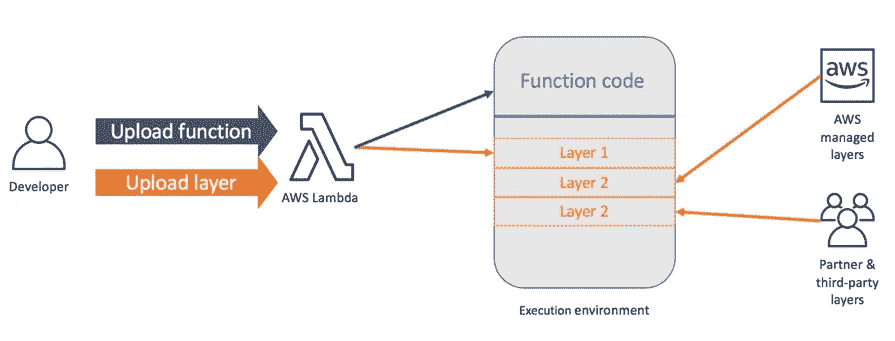

# 使用 AWS Lambda 函数部署无服务器框架

> 原文：<https://blog.devgenius.io/serverless-framework-deploy-using-aws-lambda-function-3fa1b6f5270?source=collection_archive---------27----------------------->

AWS Lambda 是最受欢迎的无服务器计算服务之一。它也是使用无服务器框架的最受欢迎的提供商[。AWS Lambda 是由亚马逊网络服务(AWS)提供的无服务器计算服务。AWS Lambda 的用户创建函数，即以支持的语言和运行时之一编写的自包含应用程序，并将它们上传到 AWS Lambda，后者以高效灵活的方式执行这些函数。](http://entradasoft.com/blogs/serverless-framework-deploy-using-aws-lambda-function) [Lambda 函数](http://entradasoft.com/blogs/serverless-framework-deploy-using-aws-lambda-function)可以执行任何类型的计算任务，从服务网页和处理数据流到调用 API 和与其他 AWS 服务集成。

全文:[http://entradasoft . com/blogs/server less-framework-deploy-using-AWS-lambda-function](http://entradasoft.com/blogs/serverless-framework-deploy-using-aws-lambda-function)

# 为什么使用无服务器？

无服务器使您能够以更高的灵活性和更低的总拥有成本构建现代应用程序。[构建无服务器应用](http://entradasoft.com/blogs/serverless-framework-deploy-using-aws-lambda-function)意味着您的开发人员可以专注于他们的核心产品，而不用担心管理和操作服务器或运行时，无论是在云中还是在本地。这种减少的开销让开发人员可以节省时间和精力，用于开发可扩展且可靠的优秀产品。

## 无服务器有什么好处？

**无服务器管理:**无需供应或维护任何服务器。不需要安装、维护或管理软件或运行时。

**灵活扩展:**您的应用可以自动扩展，或者通过切换消耗单位来调整其容量

**为价值付费:**为一致的吞吐量或执行持续时间付费，而不是按服务器单元付费。

**自动化高可用性:**无服务器提供内置可用性和容错能力。您不需要为这些功能进行设计，因为运行应用程序的服务默认提供了这些功能。

## 为什么 AWS Lambda 是无服务器架构的重要组成部分？

当构建无服务器应用程序时，AWS Lambda 是运行应用程序代码的主要候选之一。通常，要完成无服务器堆栈，您需要:

*   计算服务
*   数据库服务
*   HTTP 网关服务。

Lambda 填补了 AWS 上计算服务的主要角色。Lambda 支持许多最流行的语言和运行时，因此它非常适合各种无服务器开发人员。

# 它是如何工作的？

# 使用 AWS Lambda 的好处

**按需付费:**在 AWS Lambda 中，您只需为您的函数所使用的计算以及生成的任何网络流量付费。这种计费方式通常更具成本效益。

**托管基础设施:**您不需要担心代码在底层服务器上执行，一切都由 AWS 为您管理。

**自动缩放:** AWS Lambda 根据请求创建函数的[实例。同时，无论负载增加或减少，您的功能都是可用的。您只需为每个函数的运行时间付费。](http://entradasoft.com/blogs/serverless-framework-deploy-using-aws-lambda-function)

**与其他 AWS 产品的集成:** AWS Lambda 与 DynamoDB、S3 和 API Gateway 等服务集成，允许您在 Lambda 函数中构建功能完整的应用程序。

# AWS Lambda 最常见的用例？

AWS Lambda 的一些最常见的用例如下

[**可扩展的 API:**](http://entradasoft.com/blogs/serverless-framework-deploy-using-aws-lambda-function)**AWS Lambda 会根据对单个函数的需求自动对其进行扩展，因此您的 API 的不同部分可以根据当前的使用水平进行不同的扩展。**

**[**数据处理:**](http://entradasoft.com/blogs/serverless-framework-deploy-using-aws-lambda-function) Lambda 函数针对基于事件的数据处理进行了优化。例如，每当 DynamoDB 中的一个项目被创建或更新时，您可以使用 Lambda 做一些工作**

**[**实时流处理:**](http://entradasoft.com/blogs/serverless-framework-deploy-using-aws-lambda-function) 您可以使用 AWS Lambda 和 Amazon Kinesis 处理实时流数据，用于应用活动跟踪、交易订单处理、点击流分析、数据清理、指标生成、日志过滤、索引、社交媒体分析以及物联网设备数据遥测和计量。**

**在将数据输入到机器学习模型之前，您可以使用 AWS Lambda 对数据进行预处理。通过 Lambda 访问 EFS，您还可以为您的模型提供大规模预测服务，而无需提供或管理任何基础架构。**

**[**后端:**](http://entradasoft.com/blogs/serverless-framework-deploy-using-aws-lambda-function) 您可以使用 AWS Lambda 构建无服务器后端来处理网络、移动、物联网和第三方应用编程接口请求。利用 Lambda 的一致性能控制，例如多内存配置和预配并发，以任何规模构建延迟敏感型应用程序。**

# **AWS 的局限性**

**虽然 AWS Lambda 有很多优点，但在生产中使用它之前，您应该了解一些事情。**

****冷启动时间:**响应事件启动功能时，事件与功能运行之间可能有少量延迟。**

****执行时间/运行时间:**λ函数运行 15 分钟后超时。没有办法改变这个限额。如果运行您的函数通常需要 15 分钟以上，AWS Lambda 可能不是您任务的好解决方案。**

****可用内存** **至** **功能:**Lambda 功能可用的 RAM 数量选项范围为 128MB 至 3，008MB，步长为 64MB。**

****代码包大小:**压缩后的 Lambda 代码包大小不应超过 50MB，解压缩后的 Lambda 代码包大小不应大于 250MB。**

****有效负载大小:**当使用 Amazon API Gateway 响应 HTTP 请求触发 Lambda 函数时(即构建 web 应用程序时)，API Gateway 可以处理的最大有效负载大小为 10MB。**

****受支持的运行时数量有限:**虽然 AWS Lambda 允许添加自定义运行时，但创建自定义运行时可能需要大量工作。因此，如果 Lambda 不支持您使用的编程语言版本，那么您最好使用 AWS EC2 或其他云提供商。**

**多看:[http://entradasoft.com/blogs](http://entradasoft.com/blogs/)**