# 无服务器框架—开发您的第一个功能即服务

> 原文：<https://blog.devgenius.io/serverless-framework-develop-your-first-function-as-a-service-2339050f7e5b?source=collection_archive---------8----------------------->

## FaaS 的开发和自动化部署


照片由[詹姆斯·庞德](https://unsplash.com/@jamesponddotco?utm_source=medium&utm_medium=referral)在 [Unsplash](https://unsplash.com?utm_source=medium&utm_medium=referral) 拍摄

管理服务器和提供计算资源不可避免地是软件开发的一部分，因为应用程序逻辑需要服务器来运行。“无服务器”带来了革命性的变化，它不仅节省了基础设施管理的大量工作，而且大大提高了开发团队的速度。

> 无服务器是关于开发者将他们的努力集中在为他们的用户提供价值上(而不是在其他事情上浪费时间)——无服务器宣言(【serverless.com】T4)

“按使用付费”的收费模式是另一个绝妙的特色。只为计算资源的实际消耗付费，而闲置资源是免费的，这大大降低了托管成本。在本文中，您将熟悉无服务器应用程序的开发。我将阐述这些概念，并向您展示如何使用 AWS cloud 上的无服务器框架提供的工具构建一个应用程序。

## 什么是无服务器？

无服务器是一个运行应用程序功能的云计算平台，从开发人员的角度来看，没有服务器或操作系统的概念，因为该平台抽象出了底层基础架构组件的复杂性。因此，开发人员可以全心全意地专注于业务功能编码。

# 用例与架构设计

## 用例

首先，通过实例学习是获取新知识和技能的有效方法，所以我制作了这个示例应用程序——产品推广系统。它每天运行批处理过程，分析产品销售并制定产品促销方案。另一方面，它向客户端公开 API 以获取可用促销的列表。

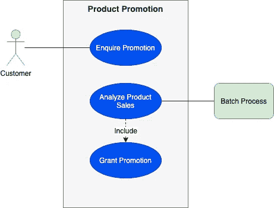

用例

## 无服务器架构设计

将用例转化为技术解决方案，下面的架构设计图由以下模式组成。

*   **Web 服务 API** — API 网关，公开 Web 服务，用于促销记录检索。
*   **调度作业** —调度程序触发 lambda 函数，分析产品销售。
*   **异步作业—** 产品销售分析结果驱动的促销券生成。

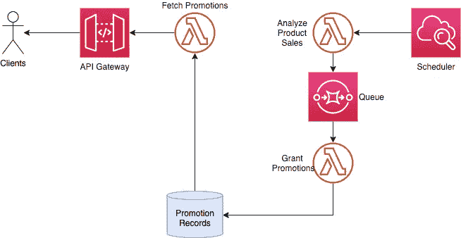

无服务器架构设计

# 基本概念

让我们踏上发展之旅。我们将首先准备好开发工具和库，然后是组件定义设置。

## 关于无服务器框架

没有有效工具的开发，不管想法有多好，都是杂乱无章的。无服务器框架提供了一套有用的工具，大大简化了无服务器解决方案的部署和供应。当您将源代码文件和资源定义输入到工具中时，它通过利用 AWS 云结构使功能更好地组织并自动化部署。

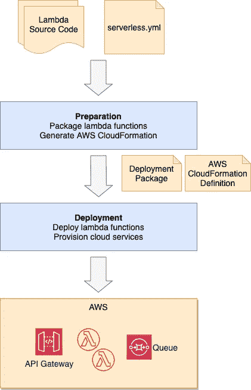

无服务器框架—部署流程

## 让事情开始

当然，你可以用你最喜欢的语言来实现 lambda，比如 Java、Go、Python 等等。在本例中，函数是使用 Node JS 编写的，因此下面列出了需要在开发机器上安装的工具:

*   节点 JS
*   包装经理(NPM)
*   Visual Studio 代码

由于无服务器框架 CLI 利用 AWS 云形成来供应无服务器架构，因此您需要在本地计算机中设置 AWS 凭证文件，以便您可以从本地计算机通过命令行供应云资源。以下是安装程序，供您参考。

[](https://www.serverless.com/framework/docs/providers/aws/guide/credentials/) [## 无服务器框架- AWS Lambda 指南-凭据

### 无服务器框架需要访问您的云提供商帐户，以便能够在您的上创建和管理资源…

www.serverless.com](https://www.serverless.com/framework/docs/providers/aws/guide/credentials/) 

无服务器框架是一个节点 JS 包，您可以使用下面的 NPM 命令行简单地将它安装在您的开发机器上:

```
npm install -g serverless
```

接下来，从这个 git repo 克隆示例应用程序。我将演练配置，并演示如何基于这个示例应用程序构建无服务器架构。

```
[https://github.com/gavinklfong/serverless-demo-app](https://github.com/gavinklfong/serverless-demo-app)
```

## 核心配置的自主性

首先，熟悉 ***serverless.yml*** 是至关重要的，因为它是你的无服务器应用的心脏和灵魂，它包含所有应用资源的定义，并将 lambda 函数粘合在一起形成一个功能服务。无服务器框架命令行依赖于配置云本地服务和部署 lambda 功能

配置文件由 3 部分组成:

*   **提供商** —通用设置，如日志记录和云提供商特定参数，如数据中心区域。
*   **Resources** —基本上是一组云形成定义，用于创建云资源和服务，例如队列和数据存储。
*   **函数** —源代码路径、内存需求、触发事件等函数定义。

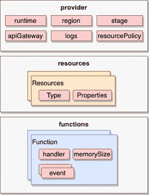

无服务器框架— serverless.yml

这个示例配置文件显示了 provider 部分。在函数部分，有一个函数配置了 SQS 事件，在资源部分也定义了 SQS 资源。

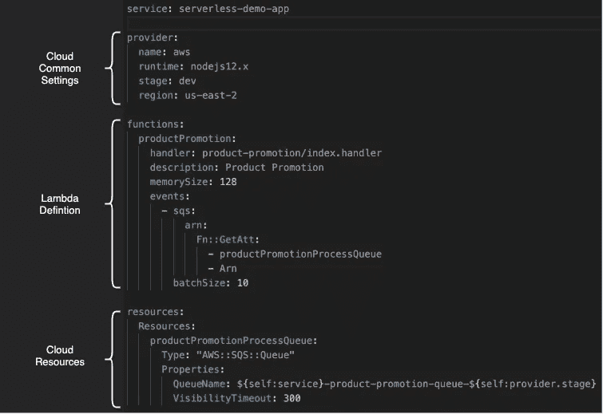

无服务器框架—示例配置

## 文件夹结构

整个应用程序由各个文件夹中的功能组成，其中***server less . yml***位于根文件夹中。下面的文件夹结构列出了每个节点 JS 包的 3 个子文件夹。

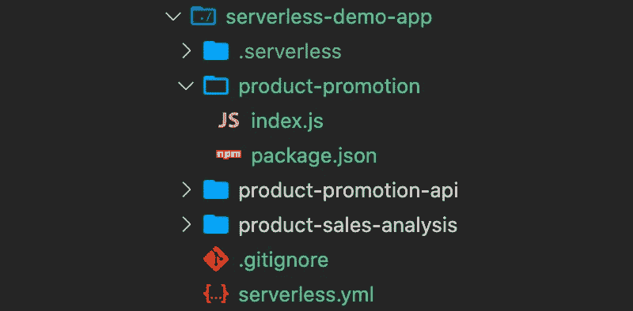

文件夹结构

# 函数定义演练

## 计划作业

后端进程由计划作业启动。比方说，系统每天晚上 10 点运行分析。下面的函数监听由 cron 作业调度发出的事件。除了事件之外，该定义还支持为函数注入环境变量，以指向目标 SQS 队列。

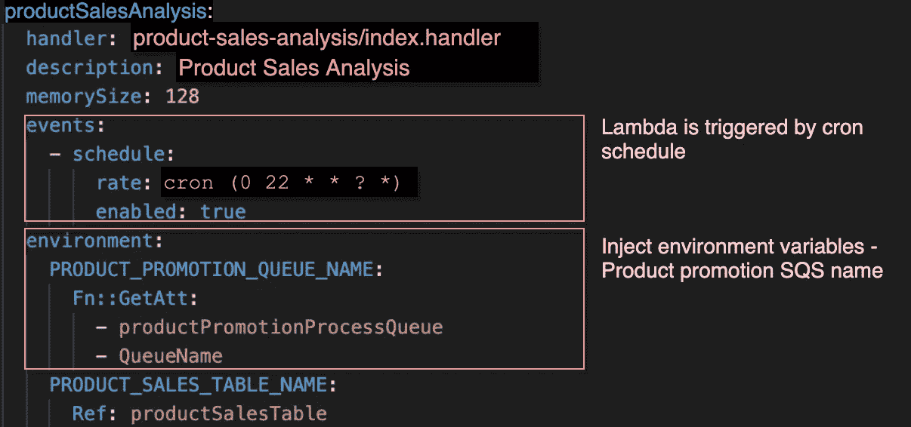

Lambda —调度作业驱动

## 异步作业

对于批处理来说，异步作业是一种常见和流行的设计模式，它运行一系列函数，中间使用队列系统进行消息集成。这种设计通过最小化功能之间的依赖性并允许每个独立功能的可伸缩性，极大地增强了可维护性。

产品推广与 SQS 挂钩，每当目标 SQS 中有 10 个或更多的消息等待处理时，就会调用它。同样，目标 DynamoDB 表名是通过定义中指定的环境配置的。

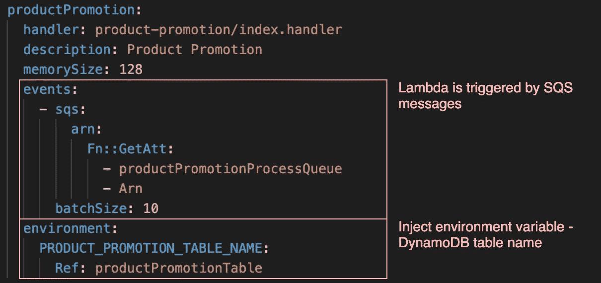

λ—SQS 消息驱动

## Web 服务 API

要将函数公开为 RESTful API，只需在函数定义中用 URI 路径和 http 方法定义 http 事件即可。无服务器框架 CLI 自动为 API express 提供 API 网关。 ***serverless.yml*** 支持额外的配置，如果你对微调 API 网关设置感兴趣，比如节流和使用计划。

部署后，将为下面的示例函数定义生成 API 端点

```
https://<API gateway domain>/product-promotion
```

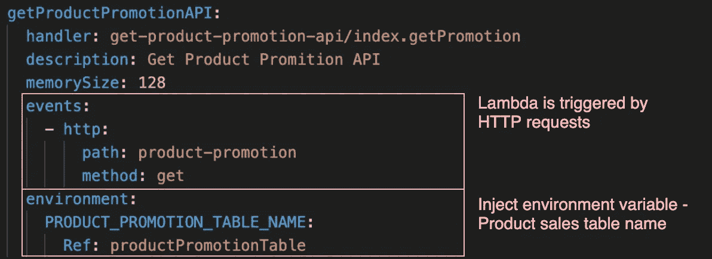

λ—HTTP 请求驱动

# 把所有东西放在一起

## 部署

只需运行此命令来部署应用程序堆栈，它将根据 ***serverless.yml*** 中的定义安装功能和配置资源

```
sls deploy
```

您将看到这个控制台输出，它指示执行进度和结果中新创建的资源列表。

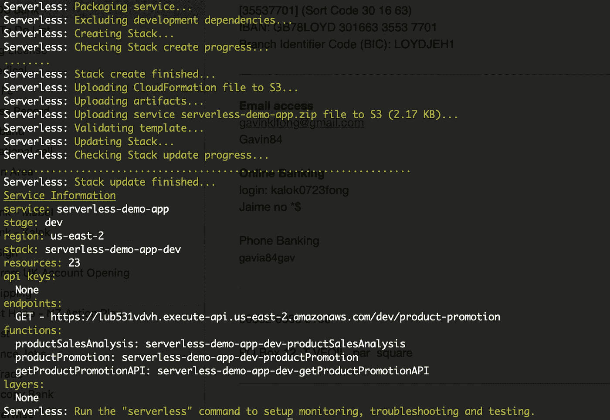

现在，无服务器应用程序已经启动并运行。您还可以在 AWS 控制台中观察到***Lambda>Application>server less-demo-app-dev***类别下的组件列表

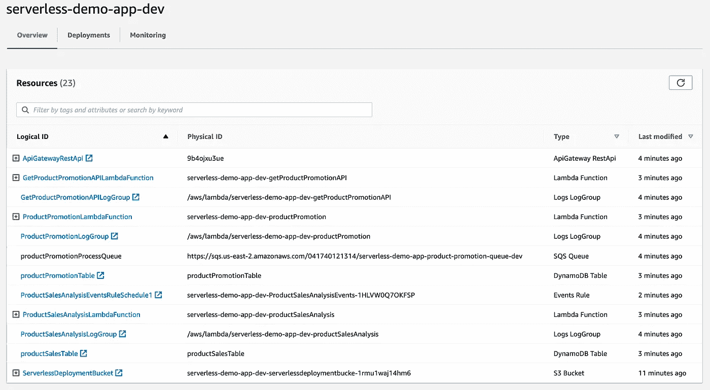

## 运行应用程序

为了验证应用程序部署，您可以通过在 AWS 控制台上使用空的模拟事件数据运行 test 来模拟一个调度作业，然后将生成新的记录并插入到 DynamoDB 中。

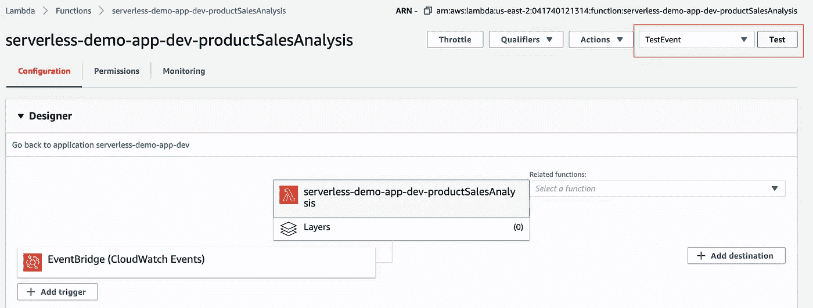

无服务器应用验证

接下来，调用 API 获取促销记录。你会得到一个促销记录列表的响应。

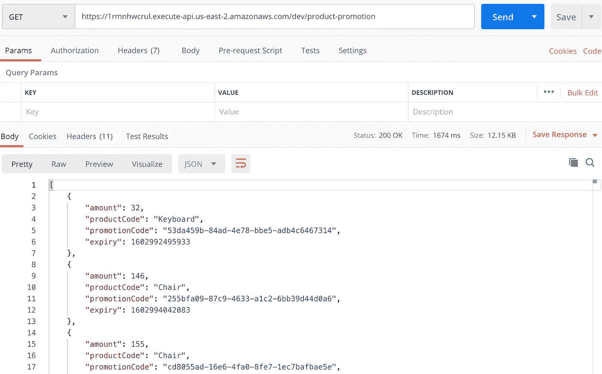

无服务器应用验证结果

## 功能测试

函数只不过是一个事件驱动的函数。如果函数运行不正常，或者您希望在部署之前运行单元测试，那么您可以运行此命令来测试特定的函数:

```
sls invoke local -f <lambda function id> -p <event input file> -e <env variable>=<value>
```

事件输入文件是 JSON 格式，它模拟事件触发。您可以从 CloudWatch 捕获事件数据并编辑数据，以便运行各种测试场景。

## 部署故障排除

部署过程可能会由于各种原因而失败，控制台错误消息会提示您如何解决这些问题。当我日日夜夜与各种部署问题作斗争时，我整理了一份清单。如果您在部署过程中遇到任何问题，我希望它可以节省您的时间:

*   再次重新运行部署命令。
*   您是否在正确的目录下运行命令行？
*   serverless.yml 的格式是否正确缩进？
*   serverless.yml 有错别字吗？
*   您的 AWS 配置文件有足够的权限进行资源调配吗？错误消息将告诉您缺少哪种权限。
*   如果您不知道导致错误的原因，那么尝试从 serverlesss.yml 中删除那些新添加的组件，以便识别和隔离有问题的部分。
*   检查生成的云形成脚本，你通常不需要它。

# 下一步是什么？

无服务器框架是一个强大的工具，使得实现无服务器应用程序更加容易。然而，许多实现仅仅关注 AWS。为了避免供应商锁定的风险，许多企业要求采用对云提供商不可知的解决方案。策略是采用多云部署，也就是说将同一个应用程序部署到多个云提供商，比如 AWS 和 Azure。

好消息！无服务器框架支持多种云。与此同时，其他云提供商，如 Azure，正在积极地为框架做出贡献，如插件开发，以支持无缝集成。让我们在我的下一次分享中探索更多和深入这个话题。

[](https://docs.microsoft.com/en-us/azure/architecture/example-scenario/serverless/serverless-multicloud) [## 采用无服务器框架的多云解决方案——Azure 示例场景

### 这篇文章描述了微软商业软件工程(CSE)团队如何与一家全球零售商合作…

docs.microsoft.com](https://docs.microsoft.com/en-us/azure/architecture/example-scenario/serverless/serverless-multicloud) 

**Git 回购**

请随意克隆这个示例应用程序，并尝试无服务器应用程序部署。

```
https://github.com/gavinklfong/serverless-demo-app
```

## 参考

[](https://dashbird.io/blog/complete-guide-lambda-triggers-design-patterns-part-1/) [## Lambda 触发器和设计模式完全指南(第 1 部分)

### 不久前，我们讨论了 Lambda 支持的调用(触发器)方法以及与…

dashbird.io](https://dashbird.io/blog/complete-guide-lambda-triggers-design-patterns-part-1/) [](https://medium.com/@eduardoromero/serverless-architectural-patterns-261d8743020) [## 无服务器架构模式

### 构建在 AWS 无服务器堆栈之上的云架构模式。

medium.com](https://medium.com/@eduardoromero/serverless-architectural-patterns-261d8743020) [](https://martinfowler.com/articles/serverless.html) [## 无服务器架构

### Mike Roberts Mike Roberts 是 Symphonia 的合伙人和联合创始人，Symphonia 是一家专门研究云架构的咨询公司…

martinfowler.com](https://martinfowler.com/articles/serverless.html)