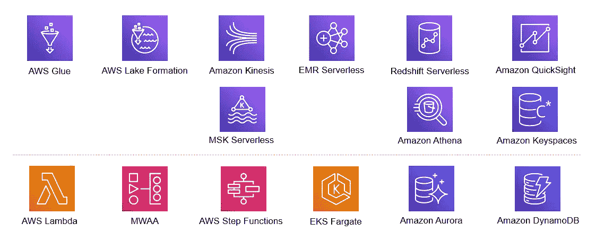

# AWS 中数据平台的无服务器选项

> 原文：<https://blog.devgenius.io/serverless-options-for-data-platform-in-aws-3151fe0d969?source=collection_archive---------8----------------------->

图片来源 google.com

通过无服务器化降低数据平台的运营支出

> 无服务器不代表没有服务器，代表你不管理服务器。

当我们说无服务器时，我们通常指的是服务器管理工作被卸载给第三方，现在主要是云提供商。由于我们不管理服务器，因此我们消除了运营开销并降低了成本。说到数据平台，它们通常是成本的驱动因素。平均而言，数据平台成本约占大中型公司总体基础架构成本的 40%。当工作负载不可预测或不一致时，无服务器化可以降低平台初始阶段的成本。即使在稳定阶段，我们也可以在无服务器平台上卸载临时数据工作负载。与传统的“大数据”平台相比，无服务器解决方案的上市时间更短。

数据平台由许多组件组成，主要组件如下:

> 整合
> 存储
> 目录
> 转换
> 分析

> 无服务器数据平台是无服务器服务的集合，用于操作数据平台的组件。

在这篇博客中，我们将看到 AWS 在数据和分析领域跨这些组件的无服务器产品。

# 数据集成

## 粘合 ETL/Studio/catalog

**AWS Glue ETL** 是一种无服务器的数据集成服务，一旦数据进入数据湖，我们就可以运行 ETL (Spark Code)。

AWS Glue Studio 使我们能够可视化地创建、运行和监控 AWS Glue ETL 作业，从而使这变得更加容易。它是 Glue ETL 的低代码版本，我们可以使用拖放编辑器，AWS Glue 会自动生成相应的 ETL 代码。

**AWS Glue Catalog** 是一项托管服务，允许我们收集数据的元数据，并允许我们在数据之上实施搜索和治理功能。

# 数据湖

AWS Lake Formation 是一项完全托管的服务，可以轻松构建、保护和管理数据湖。AWS 数据湖建立在无服务器对象存储(S3)之上。S3 确保数据的可用性和冗余性。在此基础上，Lake Formation 提供了自己的权限模型，增强了 IAM 权限模型。它使用 Glue catalog 进行元数据收集和搜索功能。为了获得更好的性能，它还使用 Glue ETL 进行转换，比如以列格式存储数据，比如 Parquet 和 ORC。

# 分布式计算

## EMR 无服务器

Amazon EMR Serverless 是 Amazon EMR 中的一项产品，它使我们能够轻松且经济高效地运行使用 Apache Spark、Presto 和 Hive 构建的 Pb 级应用程序，而无需调整、操作、保护、优化或管理集群。有了 EMR 无服务器解决方案，客户再也不用担心运行应用程序所需的资源供应过多或不足。EMR Serverless 会自动调配和增减应用程序所需的计算和内存资源，客户只需为他们使用的资源付费。

## EKS 和法盖特

AWS Fargate 是一个 K8s 部署模型，为容器提供按需、大小合适的计算能力。有了 AWS Fargate，我们无需自行调配、配置或扩展虚拟机组来运行容器。我们也不需要选择服务器类型，决定何时扩展我们的节点组，或者优化集群打包。在最新的版本中，我们可以启动大小为 16 vCPU 和 120 GB RAM 的容器。Fargate 的定价基于请求的 vCPU 和 pod 所需的内存资源。

# 基于 SQL 的查询和分析

## 雅典娜(智慧与技艺的女神)

Amazon Athena 是一种交互式查询服务，它使得使用标准 SQL 直接分析 Amazon 简单存储服务(Amazon S3)中的数据变得很容易。Athena 是无服务器的，所以不需要设置或管理基础设施，只需为运行的查询付费。Athena 自动扩展—并行运行查询—因此即使是大型数据集和复杂查询也能快速获得结果。价格基于扫描的数据量。

## 红移无服务器

Amazon Redshift Serverless 可自动供应和智能扩展数据仓库容量，为最苛刻和不可预测的工作负载提供快速性能，并且您只需为使用量付费。红移价格以每秒的 RPU 小时为单位(最低收费为 60 秒)。数据仓库启动时间不收费。包括自动扩展和全面的安全功能。我们不需要单独为并发扩展和红移频谱付费，因为它们都包含在 Amazon Redshift Serverless 中。

# 流式集成

## 由外界刺激引起的不随意运动

亚马逊 Kinesis 数据流是一种无服务器的流数据服务，可以轻松捕捉、处理和存储任何规模的流数据。Kinesis 数据流[按需]是一种新的 Kinesis 数据流容量模式，能够在没有容量规划的情况下提供每分钟数千兆字节的写入和读取吞吐量。

## 运动学分析

无服务器阿帕奇 Flink & Beam。

## MSK 无服务器

亚马逊 MSK 无服务器是[亚马逊 MSK](https://aws.amazon.com/msk/) 的一种集群类型，使我们可以轻松运行 Apache Kafka，而不必管理和扩展集群容量。MSK 无服务器自动供应和扩展计算和存储资源，因此我们可以按需使用 Apache Kafka，并为我们传输和保留的数据付费。

# 数据库

> Amazon Keyspace (Cassandra) —用于压缩聚集体的长期持久性。
> 
> Amazon Aurora 无服务器—一般 ACID 要求
> 
> 亚马逊 Neptune 无服务器—图形数据库

有关 DB 产品的更多详情，请阅读以下内容:

 [## AWS 上的专用数据库

### 为您的工作负载选择合适的数据库

blog.devgenius.io](/purpose-built-databases-on-aws-7a384f868fd) 

# 管弦乐编曲

## MWAA /阶跃函数

借助**面向 Airflow** 的托管工作流，我们可以使用 Airflow 和 Python 创建工作流，而无需管理底层基础设施来实现可扩展性、可用性和安全性。托管工作流自动扩展其工作流执行能力，以满足我们的需求。

**AWS Step Functions** 是一种无服务器、低代码、可视化的工作流服务，开发者可以使用 AWS 服务来构建数据和机器学习管道。工作流管理故障、重试、并行化、服务集成和可观察性，因此开发人员可以专注于更高价值的业务逻辑。

# 商务智能服务

## 快速瞄准

它是一种云原生 BI 服务，允许我们通过用自然语言提问、通过交互式仪表盘探索或自动寻找由机器学习驱动的模式和异常值来理解我们的数据，而无需任何客户端软件或服务器基础架构。QuickSight 还提供按会话付费的定价，使其对于大规模部署来说更具成本效益。

# 辅助服务

这些服务并不直接链接到数据平台，但在云数据平台的某些方面有所帮助。

> λ
> DynamoDB
> open search

总的来说，AWS 确实在数据部分提供了许多无服务器选项。这些可以结合在一起创建数据解决方案，而不需要管理太多的服务器，专注于核心业务问题。

快乐云数据工程！！