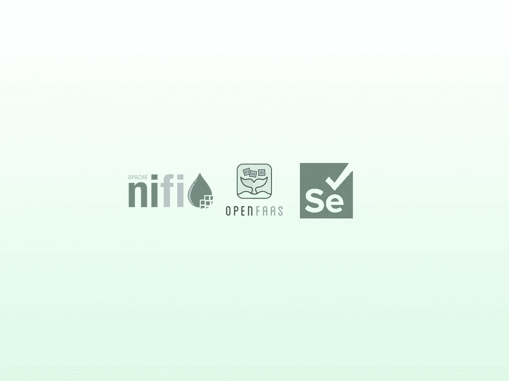
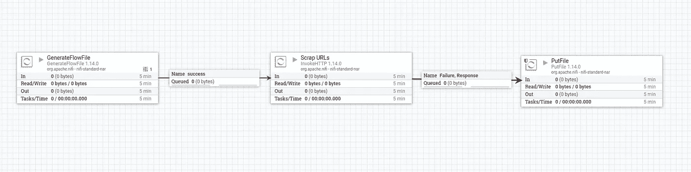
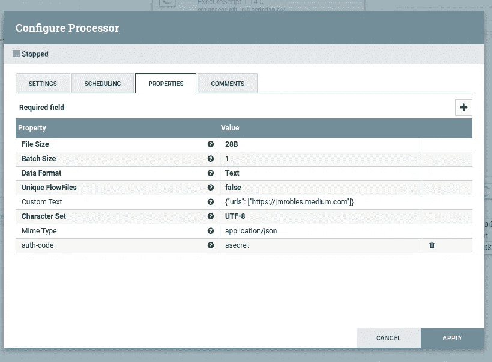
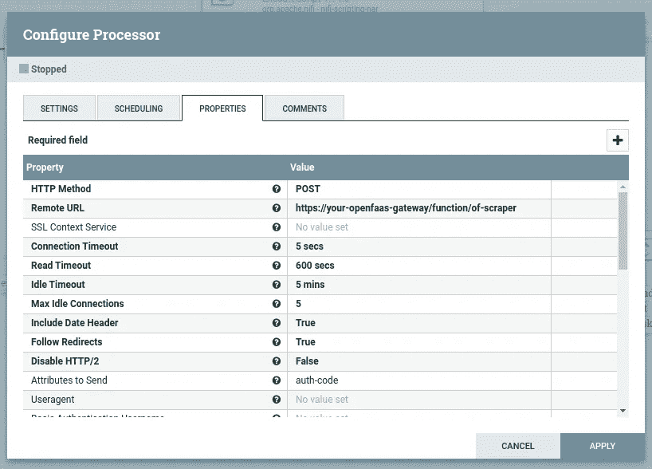

# 使用 NiFi 和 OpenFaaS 的无服务器网络抓取

> 原文：<https://blog.devgenius.io/serverless-web-scraping-with-nifi-and-openfaas-ba7ac675a200?source=collection_archive---------6----------------------->

**TL；DR** :如何创建一个 Selenium 无服务器报废器并将其与 Apache Nifi 集成



NiFi + OpenFaaS + Selenium =无服务器刮刀

# 动机

[OpenFaaS](https://www.openfaas.com/) 是一个很棒的无服务器框架。在我的上一篇文章中，我展示了如何以快速开发周期的方式创建无服务器功能。

[](https://jmrobles.medium.com/develop-openfaas-functions-quickly-with-okteto-ef6a80365b97) [## 用 Okteto 快速开发 OpenFaaS 函数

### 用 Okteto 加速你的无服务器功能开发

jmrobles.medium.com](https://jmrobles.medium.com/develop-openfaas-functions-quickly-with-okteto-ef6a80365b97) 

无服务器模式的一大优势是灵活性。您可以从任何地方调用无服务器功能。

通常你从一个 orchestrator 调用一个无服务器函数，比如 Airflow、Prefetch、Apache Nifi 等等

今天，我们开发了一个无服务器功能，使用 Selenium 和 Chromium 删除 URL 列表的内容。

首先，我们需要创建一个支持 Selenium 的 OpenFaaS 模板。使用我们的新模板，我们创建了一个简单的 web scrapper。最后，我们从 Apache NiFi 调用函数。

# 1.一个新的 Selenium-ready OpenFaaS 模板

你可能知道，有了 OpenFaaS，你可以使用许多不同种类的模板。

模板充当 HTTP 请求和您的“处理程序”函数之间的包装器。

当 OpenFaaS 构建您的无服务器功能时，它会用模板和您的功能代码生成一个 Docker 映像。

对于我们的模板，我们派生出“python3-http”模板。

我喜欢这个模板，因为它基于 Python Flask，我们可以访问请求/响应头。

我们将使用头部来验证函数的使用。

要做的最大改变是包含 selenium 和 chromium 驱动程序的 **apk** 库并安装它们。

您可以从 GitHub 签出模板。

[](https://github.com/jmrobles/python3-http-selenium) [## GitHub-jmrobles/python 3-http-selenium:open FAAS python 3 Flask 模板，支持 Selenium

### 支持 Selenium 的 OpenFaaS Python3 Flask 模板-GitHub-jmrobles/python 3-http-Selenium:open FAAS python 3 Flask…

github.com](https://github.com/jmrobles/python3-http-selenium) 

为了使用它，我们为我们的无服务器项目创建了一个新文件夹，`of-scrapper`,并检查了模板代码

```
faas template pull https://github.com/jmrobles/python3-http-selenium
```

# 2.一个简单的 web scraper 无服务器

有了模板，是时候创建和编码我们的函数了。

```
faas new --lang python3-http-selenium of-scraper
```

前面的命令为我们的函数创建了存根代码。

用以下要点内容替换`handler.py`

我们的报废功能很简单。我们传递一个 URL 列表，该函数打开一个新的 chrome 会话，并为每个 URL 获取一些基本信息:标题、标题、文本内容和图像。

为了防止未经授权使用计算资源，我们添加了一个基于共享机密的简单身份认证。我们传递头“auth-code”来传递我们的授权码。

当工作完成时，它关闭 Chromium 会话并返回所有结果。

这是一个耗时的操作。单个 URL 平均需要大约 1 分钟。因此，我们需要设置所有东西的超时(OpenFaaS 执行器、OpenFaaS 引擎和 Kubernetes 入口)。

我们函数的 YAML 必须类似于下面的要点。

关于 OpenFaaS 引擎中的超时，我们需要更新 pod“gateway”(gateway 和 faas-netes 容器)的环境变量中的 **read_timeout** 、 **write_timeout** 和 **exec_timeout** 。

最后，我们需要添加一些注释来配置入口超时。在 nginx 进入的情况下，`proxy-connect-timeout`、`proxy-send-timeout`和`proxy-read-timeout`。

我们将入口超时设置为“1800”(30 分钟)。

现在，我们只需构建映像并进行部署。

```
$ faas publish --platforms linux/amd64 -f of-scraper.yml
$ faas deploy -f of-scraper.yml
```

# 3.从 Apache NiFi 呼叫

最后但同样重要的是如何从 Apache NiFi 调用我们的新函数。



我们简单的 NiFi 废料管道

为了进行测试，我们添加了以下三个处理器:

*   **生成流文件**:使用“自定义文本”属性，我们设置 JSON 请求和头



*   **InvokeHTTP** :这是对我们的无服务器函数的真实调用。



我们使用“POST”HTTP 动词，并将读取超时修改为一个较大的数字(10 分钟)。

*   **PutFile** :为了检查我们的 scrap 函数是否工作正常，我们将输出写入文件。我们将它们保存到一个临时目录(/tmp/scraped-web)中。您可以通过访问 NiFi 容器并对文件进行“ls/cat”来检查它。
    我们将 InvokeHTTP 的“失败”和“响应”输出链接到这个写文件处理器。

# 仅此而已！

我们在云中有一个强大的网络抓取器。如果需要，我们可以向外扩展。其他可能的解决方案是使用 [Selenium Grid](https://www.selenium.dev/documentation/grid/) ，它允许以批量/并行方式报废(或应用 e2e 测试)。