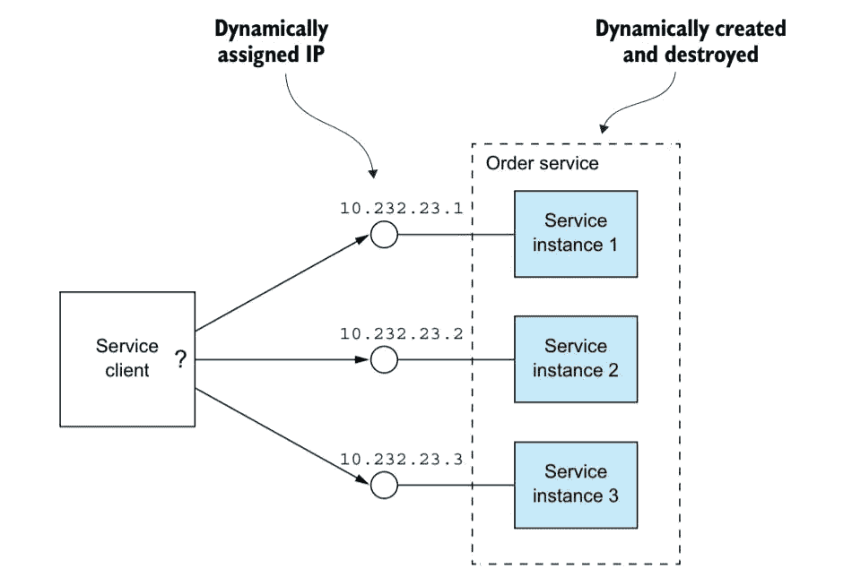

# 服务发现&为什么它在微服务中如此重要

> 原文：<https://blog.devgenius.io/service-discovery-importance-in-microservices-17970569685?source=collection_archive---------0----------------------->

[亨尼斯坦德](https://unsplash.com/@henniestander?utm_source=unsplash&utm_medium=referral&utm_content=creditCopyText)在 [Unsplash](https://unsplash.com/s/photos/discovery?utm_source=unsplash&utm_medium=referral&utm_content=creditCopyText) 上的照片

在一个单片应用中，我们可能都有一些*服务*的概念，比如`User`服务、`Invoicing`服务等等；它们基本上是独立的类/库，存在于相同的代码库中。

假设我们收到一个请求，请求获取特定用户的所有发票。该请求由我们的框架路由，其中**发票**服务可能需要调用**用户**服务来获取用户相关信息。所有这一切都发生在我们的巨石边界内。

## 劈开整块石头

但是，现在如果我们将这个整体应用程序分割成更小的代码块，即`User`服务和`Invoicing`服务，假设我们将它们部署到不同的服务器中，那么我们不能让它们通过简单的函数调用进行通信，因为在这种情况下，`User`和`Invoicing`服务是两个独立的实体，它们驻留在不同的代码库中，或者更具体地说，驻留在不同的应用程序服务和不同的服务器中。但是我们需要`Invoicing`服务调用`User`服务来获取用户相关信息。在这种情况下，我们需要进行 API 调用。

## 如果事情出了差错怎么办？

现在，事情可能会出错，因为当我们进行 API 调用时，有一个额外的事情要考虑。这一次，网络是游戏的一部分，尽管它非常复杂和不可靠。下面我们将讨论服务架构的一些常见的最坏情况。

最坏情况 1。假设，我们调用`Invoicing` 服务，这个服务将调用`User`服务来获取用户相关信息。现在，如果`User` 服务由于某种原因关闭，它将无法满足请求。

最坏的情况 2。为了解决前面的问题，我们现在有了多个`User`服务实例，但是现在我们如何知道哪个是正确的`User` 服务实例来获取数据。

最坏情况 3。如果第一个服务实例出现故障，服务如何向集群宣布已经部署了新的服务，并从第二个服务实例获取数据？

为了解决上述问题，我们使用服务发现模式。

# 什么是服务发现？

服务发现是自动发现哪些服务实例来满足给定查询的模式。服务发现具有自动定位网络的能力，因此不需要长时间的配置设置过程。

服务发现的工作原理是设备通过网络上的公共语言进行连接，允许设备或服务在没有任何人工干预的情况下进行连接。(即 Kubernetes 服务发现、AWS 服务发现)。

# 服务发现的类型

服务发现有两种类型:**服务器端**和**客户端。**

服务器端服务发现允许客户端应用程序通过路由器或负载平衡器来发现服务。服务器端服务发现的优点是，它使客户端应用程序变得更轻便，因为它不必处理查找过程并向路由器发出服务请求。

客户端服务发现允许客户端应用程序通过查看或查询服务注册中心来找到服务，其中服务实例和端点都在服务注册中心内。客户端服务发现的优势在于，客户端应用程序不必通过路由器或负载平衡器进行通信，因此可以避免额外的一跳。

# 服务发现是如何工作的？

服务发现有三个组件:服务提供者、服务消费者和服务注册中心。

1)**服务提供者**在进入系统时向服务注册中心注册，在离开系统时注销。

2)**服务消费者**从服务注册中心(可用服务实例的数据库)获取提供者的位置，然后将其连接到服务提供者。

3)**服务注册中心**需要高度可用并且是最新的，以便客户端可以通过从服务注册中心获得的网络位置。服务注册中心由一个使用复制协议来保持一致性的服务器集群组成。

# 微服务中的服务发现需求？

微服务本质上是动态的。这意味着单个微服务的多个实例可以共存。最有可能的是，服务实例要么有不同的 IP 地址，要么有不同的端口，或者两者都有。之前，我们已经讨论了没有服务发现的微服务的一些最坏情况。简而言之，我们需要服务发现

*   了解任何微服务实例的位置。
*   跟踪所有的实例。
*   选择微服务实例。
*   如果另一个实例由于某种原因而关闭，则重定向到同一服务的另一个实例。

微服务架构发现中的服务发现实施包括以下两个方面:

*   维护地址全局视图的中央服务器(或多个服务器)。
*   连接到中央服务器以更新和检索地址的客户端。

# 服务发现工具

在微服务领域，有许多技术可以用来实现服务发现模式。他们主要是两种类型，1。**通用发现工具**和 2。**单一用途发现工具**。

通用发现工具实际上是通用数据存储。它们通常用于协调。一些通用的发现工具有 Apache ZooKeeper、HashiCorp Consul。

最常见的单一用途发现工具是 Airbnb SmartStack(它是两个定制工具的组合)，即*神经*和*突触*和网飞尤里卡(基于 REST 的服务注册中心)。

这有帮助吗？不要忘记为这个帖子鼓掌，给我们一些灵感！

# 你对全栈开发感兴趣吗？

*我写的是关于 fullstack Web Development REST API、微服务、LinkedIn 中的架构、Medium 的循序渐进的编码教程。* [*这里是我的 Linkedin 简介*](https://www.linkedin.com/in/spsarkar-appxive/) *。*