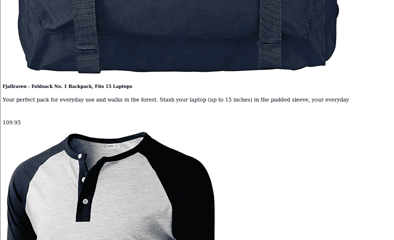
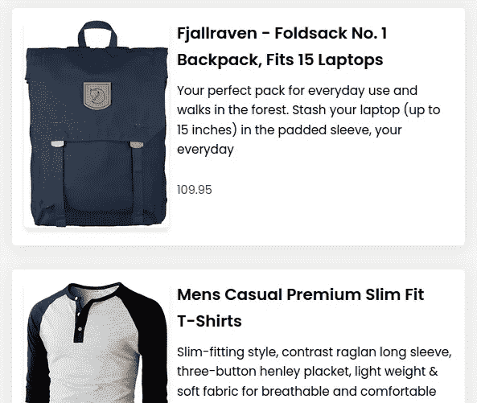

# 在 Go 的原生服务器中提供 CSS 服务

> 原文：<https://blog.devgenius.io/serving-css-in-gos-native-server-8bc58d85d0b2?source=collection_archive---------6----------------------->


照片由[费伦茨·阿尔马西](https://unsplash.com/@flowforfrank?utm_source=medium&utm_medium=referral)在 [Unsplash](https://unsplash.com?utm_source=medium&utm_medium=referral) 拍摄

当我在 Golang 中遇到模板时，我决定尝试一下这个特性，只是为了学习如何使用它。我在一个单独的文件中设计了我的标记，并把它作为一个链接。

一旦我启动了服务器，你可以想象当提供的页面非常普通时会有多惊讶。事实证明，样式表和任何其他静态文件只需要稍微调整一下就可以使用了。本文将研究如何应用这一微小且相当直接的调整。

## 先决条件

要阅读这篇文章，你需要对 Go 有一个基本的了解，更重要的是，你需要了解 Go 内置的模板系统。

## 项目目标

最终目标是将从外部服务器获取的产品列表样式化为卡片列表。

## 服务器设置

初始服务器文件

这是服务器的基本设置，将在 localhost:8080 上为 web 应用程序提供服务。我们将使用标准的 net/http 包。

```
go run server.go
```

上述命令将启动服务器。

## 文件夹结构

```
+-- server.go
+-- views
   +-- products.html
   +-- stylesheets
      +-- products.css
      +-- reset.css
```

假设这是文件夹结构，并且我们已经将 main.css 文件作为链接包含在 index.html 中。

## 获取数据

我们对整个项目有了更广泛的了解，现在我们可以开始设置负责从 API 获取数据的函数。

服务器文件

`getProducts`函数处理从 API 获取数据，并利用已经设置好的`structs`来存储数据和返回数据。

`productsHandler`负责处理产品请求，使用`getProducts`函数获取数据，并为模板提供服务。

产品模板

从上面可以看出，一旦进入模板，我们只需简单地遍历产品列表，并在卡片中列出它们。

## 样式表设置

第一个样式表是一个最小的重置文件，它将为所有浏览器提供公平的竞争环境，并减少不一致性。

重置 css 文件。

我们的大多数样式都可以在 products.css 文件中找到。

产品和产品模板的样式。

## 提供静态文件

如果我们按原样提供应用程序，这是我们将得到的输出，针对上下文进行缩小:



不带样式的教程输出图像

正如我们所见，产品确实已经上市，但没有我们创造的风格。跳到检查器中，在 network 选项卡下，我们可以看到服务器无法定位我们的样式表。


浏览器检查器中的“网络”标签

为了解决这个问题，我们需要显式地服务我们的文件。我们可以做以下修改来服务我们的文件。

对 func() main 的修改

我相信我们熟悉`HandleFunc()`函数，它本质上是将一个 url 匹配到一个处理程序，该处理程序将处理请求并返回一个响应。

从上面可以看出，我们已经在`styles/reset`和`styles/products`路由/模式下为两个样式表定义了显式路由。在`HandleFunc`的第二个参数中，我们有处理函数，其中我们利用了`http.ServeFile`函数来服务特定的文件。

`http.ServeFile`接受三个参数，前两个是 responseWriter 和请求。第三个是我们要提供的文件的路径。需要注意的是，在我们的例子中，路径是相对于`server.go`文件所在的位置的。

上面的方法可以很好地工作，页面的样式如下所示



带样式的教程输出图像

虽然上述方法可行，但对于大量文件来说，它的可伸缩性不是很好。通常将所有样式存储在一个父结构中。因此，这就是为整个目录提供服务的方法出现的地方。

对 func() main 的最终修改

我们用一个单独的路由代替了两个路由，利用`http.FileServer`函数打开了服务整个目录的途径。它接受一个 FileSystem 类型的参数，这实际上是一个接口。因此，我们使用`http.Dir`来类型转换我们的路径，该路径指向我们的文件将被提供的目录。路径可以是绝对的，也可以是相对的。`http.FileServer`返回一个`http.Handler`类型的变量，这个变量一会儿就有意义了。

设置好文件服务器对象后，我们需要为它分配一个路由以供使用。我们将利用带两个参数的`http.Handle`函数。第一个是路由模式，第二个是处理程序。

在这种情况下，我们将对位于`./views/stylesheets`目录中的样式使用`/styles/`模式。

我们将传递上面创建的变量`styles`作为第二个变量，因为`http.FileServer`返回类型`http.Handler`。

然而，无论我们将什么模式作为第一个参数传递，在我们的例子中，`/styles/`都需要从文件处理程序中去除。这是因为我们的文件目录是`./views/stylesheets`，如果我们请求`/styles/reset.css`，服务器会将整个 url 附加到目录中并搜索特定的文件。因此，服务器将尝试为`./views/stylesheets/styles/reset.css`提供服务，这当然是不存在的。

这就是`http.StripPrefix`函数的用武之地。如果我们去掉`/styles/`字符串，应用程序现在会像预期的那样运行。如果使用统一模式`/`作为第一个参数`http.Handle`函数，则无需去除前缀。

## 结论

使用上面的小调整，你可以立刻提供静态文件。

整个项目的代码可以在 Github 上[这里](https://github.com/kiptoo-korir/products-demo)。