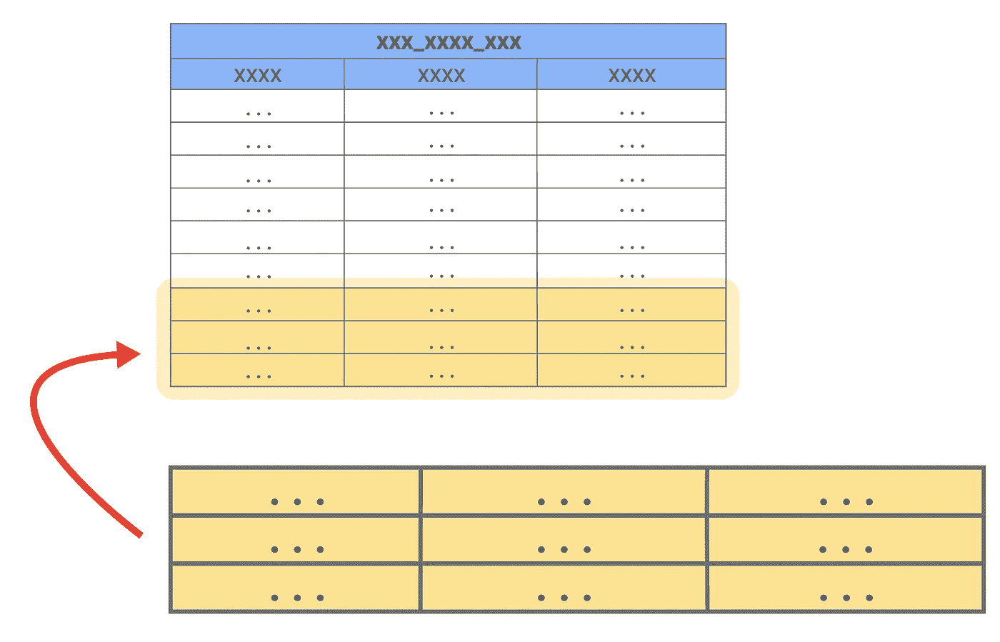
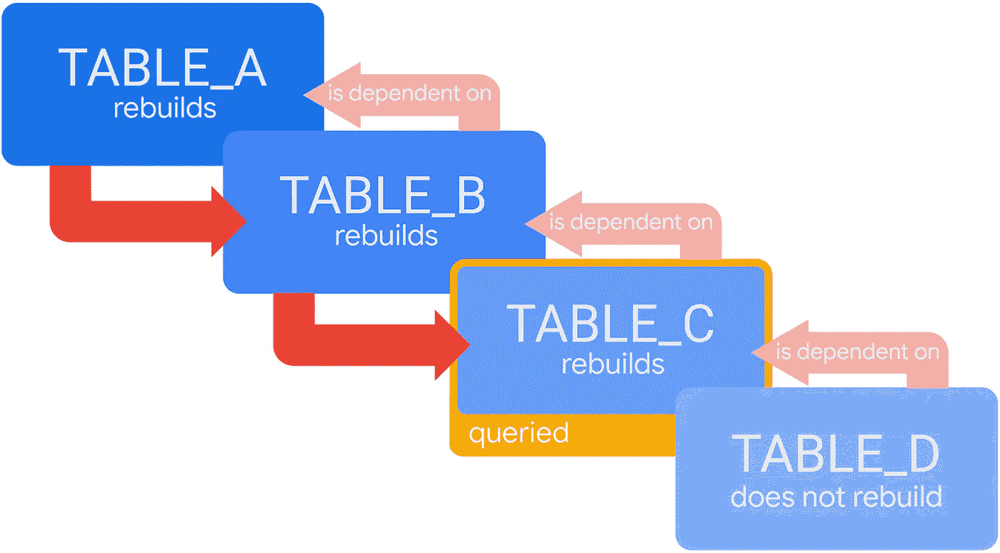

# 会话化增量—管理分区数据增量

> 原文：<https://blog.devgenius.io/sessionized-incrementals-managing-partitioned-data-accretion-77378c329df1?source=collection_archive---------8----------------------->


**简介**:

在各种数据分析中，将原始事件对象转换为经过处理的计算会话具有核心意义。当处理代表跨多个用户项目收集的数据的一组事件时，通常第一件事是将数据分组到单独的会话中。根据标记每个会话的唯一值，分组过程需要在分段中执行计算。

当需要重复计算(对于报告、仪表板等)时，挑战就出现了。).然后，对从时间开始收集的所有数据从头开始重复该过程是繁重且昂贵的。因此，为了避免这个冗余过程，使用了增量持久派生表。

在这篇短文中，我将大致介绍会话化增量的核心方法，并重点介绍我们开发的概念框架，以便实现高效可靠的增量方法。对 Looker 和 bigQuery 实现的技术方面及其引发的相应挑战的深入研究，将在接下来的论文中进行演示，该论文基于我和 Eli Libman 在 Hyro ( [自适应对话式人工智能平台](https://www.hyro.ai/))所做的工作。

**增量 PDT**

持久派生表(PDT)代表在给定触发间隔内更新的物化视图。表更新过程可以是从头开始，删除并创建整个表，也可以是基于时间启发式(增量 PDT)限制到最后记录的压缩更新。应该注意的是，PDT 术语是一个 Looker 本地命名，但在这篇文章中，将从如上所述的更广泛的角度来看待它。

查询将在构建的压缩会话表(*目标表*)上运行，以预先包含相关的计算结果，而不是对表数据的每次使用运行全表扫描查询，执行所有原始的分组转换。

在增量 PDT 中，目的表的一个重要特性是它的更新方案:它不是从头开始构建所有的行，而是在特定的时间范围内从原始表(*源表*)添加相关的内容。该机制将在根据用例需求定义的时间间隔内触发。



用黄色标记的是增加的记录

**增量过程**

为防止重复，增量过程将包括以下步骤:

1.  删除目标表中某个时间(`start_time`)帧的所有行
2.  从用于删除(1)中的行的同一时间段查询源表
3.  将(2)中计算出的查询数据添加到目标表中

**问题**

虽然看起来我们正在删除正在添加的相同数据块，但仔细观察增量边界时会发现一个差异。

在目标表中，我们根据一个聚合时间维度来擦除行，该维度是为一个会话中的多个事件选择的。相反，断言到目的表的数据由每个事件的时间维度查询。

例如，将时间维度确定为会话的第一个事件的时间会打开一个窗口，其中可能会生成潜在的重复。

当擦除在特定时间之后开始的所有会话时，比如说`00:00`，并且添加基于在`00:00`之后创建的事件的会话时，可能会发生重复。对于有两个事件的会话，第一个事件在`23:55`创建，第二个事件在`00:05`创建，该会话不会从目标表中删除(因为其开始时间是`23:55`)，但第二个事件将作为新会话单独添加，从而创建一个重复记录。

另一方面，选择会话的结束时间会导致潜在的事件丢失。回到示例情况，现在，会话将从目的表中删除(因为它的结束时间是`00:05`)，而只有第二个事件将包含在断言中。

因此，为会话选择的任何聚合时间维度，无论是开始、结束还是始终的任何时间，都将在具有来自增量屏障两侧的事件的会话的分组转换中赋予差异。

这适用于回溯 X 偏移(回溯 X 天)，因为删除维度和断言维度之间的差异将导致“尾部”调用这些间隙。

**解决方案**

基本概念是将两个表对齐以进行“通信”:从目标表中删除，并将来自源表的查询投射到同一个键上。此外，事件应该具有每个会话统一的新时间维度(例如`MAX(created_at)`)，以便将它们集中在单个时间点。基于此，会话的所有事件将位于增量障碍的一侧。

从鸟瞰图来看，该过程将包括创建中间增量持久派生表(*中间表*)。该表将是原始源表的一对一副本，但将包含会话中最后一个事件的时间列(`last_event_time_of_session`)。

先决条件是同一会话中事件之间的间隔不长于一个确定的常数(`events_max_gap_minutes`)。该常量不能超过增量窗口，在本例中为 24 小时。这个需求是中间表的基础，所以它不允许相同的会话事件有两个不同的`last_event_time_of_session`。

当从会话中的最后一个事件开始还没有经过所定义的恒定时间(`events_max_gap_minutes`)时，关于会话是否已经结束存在不确定性。在这种情况下，对于该会话中的所有事件，`last_event_time_of_session`将被视为`null`。因此，这种标记将阻止潜在的正在进行的会话限定查询条件并进入目标表。

该维度将表述为:

```
CASEWHEN TIMESTAMP_ADD(MAX(created_at) OVER (PARTITION BY session_id), INTERVAL last_event_time_of_session MINUTE) < CURRENT_TIMESTAMP() THEN MAX(created_at) OVER (PARTITION BY session_id)ENDAS last_event_time_of_session
```

与事件之间的间隔长度相反，会话的绝对长度不受限制。这是因为能够设置增量周期应该返回的偏移量。



中间表包含一个列`last_event_time_of_session`，它表示每个事件会话的最后时间。现在，断言查询将投射到中间表中的`last_event_time_of_session`上。这样，从目标表中删除的每个会话的事件都将包含在恢复的记录中。

回到上面的例子，`23:55`事件和`00:05`事件将具有相同的`last_event_time_of_session`值- `00:05`。因此，确保将为目的表中的单个更新的会话对象查询和计算这两个对象。

新流程如下:

1.  基于事件时间删除中间表中的行(`created_at`
2.  从(1)中用于删除行的相同时间范围查询源表，并将结果插入中间表。在这个阶段，在查询中计算分区的`last_event_time_of_session`列。如上所述，潜在的正在进行的会话将把`last_event_time_of_session`作为`null`。
3.  删除目标表中特定时间(`start_time`)的所有行
4.  从(3)中用于删除行的相同时间范围查询中间表，并将结果插入到目标表中。潜在的正在进行的会话将从查询中排除，因为它们的`last_event_time_of_session`是`null`。

**后记**

创建一个可以与源表和目的表“通信”的表是这个解决方案的秘密所在，这是通过将分散的事件转换为单个时间点来实现的。这个过程能够跨越严格的时间限制将事件收集到会话中。

这些原则和其他原则是 Looker 和 bigQuery 技术实现的核心，这是未来出版物的主题。尽管在当前模型中需要进行调整，但关键的基本要素仍将作为解决方案的主角，并对理解其指导方针和目标至关重要。