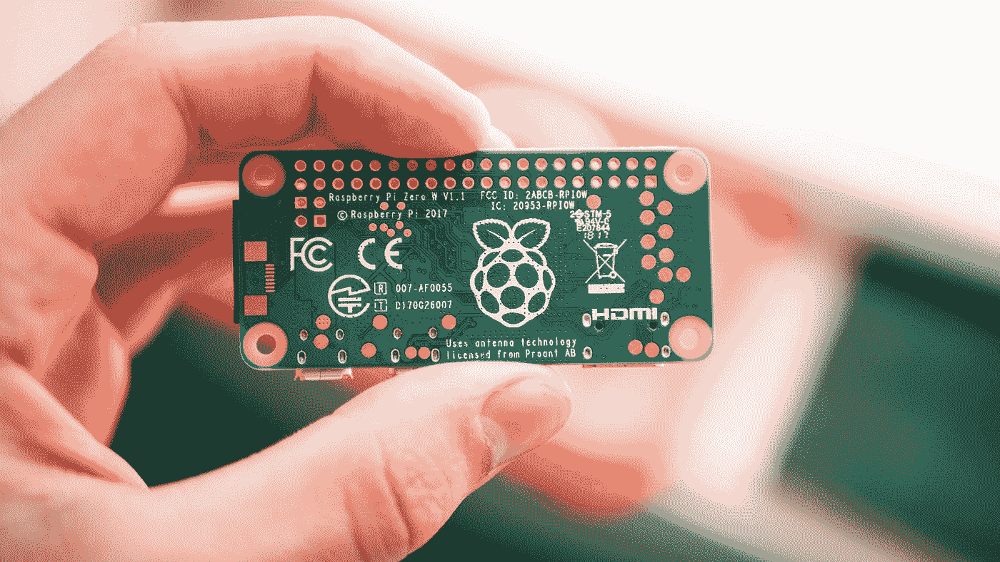
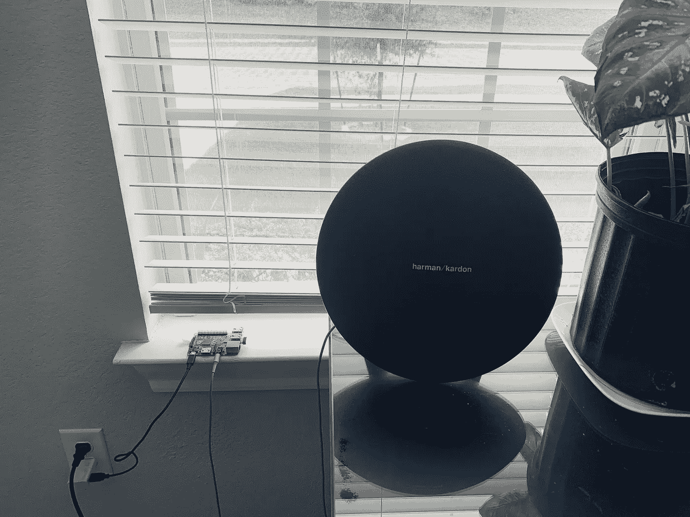
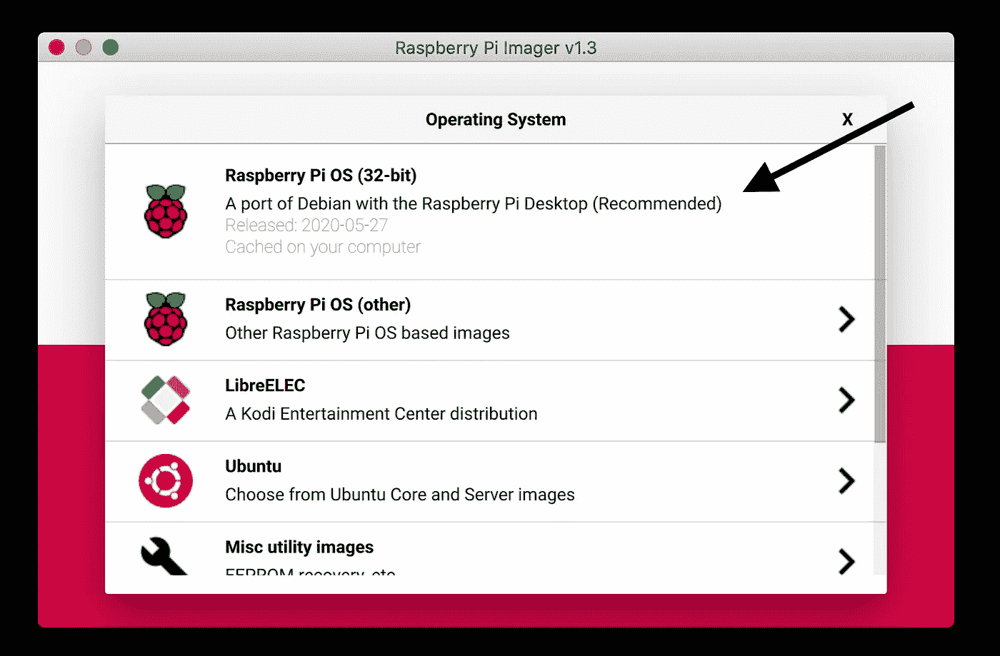
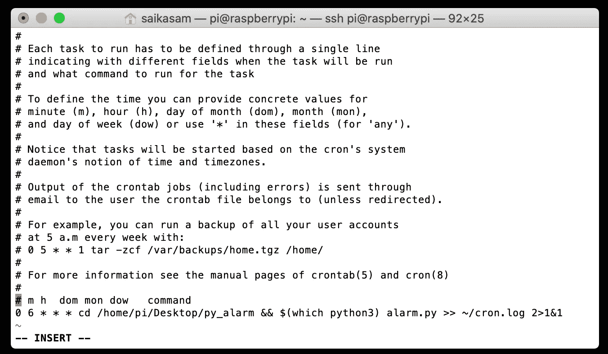

# 使用 Cron Job 设置闹钟，在树莓 Pi 上播放您最喜欢的歌曲

> 原文：<https://blog.devgenius.io/set-an-alarm-that-plays-your-favorite-song-on-a-raspberry-pi-using-cron-cda6554d5e49?source=collection_archive---------6----------------------->

## 家里有备用音箱吗？用它来创建一个响亮的警报与树莓皮！



照片由[哈里森·布罗德本特](https://unsplash.com/@harrisonbroadbent?utm_source=medium&utm_medium=referral)在 [Unsplash](https://unsplash.com?utm_source=medium&utm_medium=referral) 拍摄

## 为什么一开始要用树莓皮做闹钟？

最近，我有一个扬声器，它再也装不下电池了，不得不一直插着电源。这给了我一个想法，用树莓皮设置一个额外的响亮的“闹钟”，播放任何 mp3 文件。使用 Raspberry Pi 的优点是:始终插上扬声器，它很便宜，支持大量定制，并且是未来项目的基础。

这是最后一张图。



连接到扬声器的 Raspberry Pi 2 型号 B

# 概观

为了创建警报，我们将在 Raspberry Pi 上调度一个 cron 作业来运行 python 脚本。这个概念是让 python 脚本在 cron 运行/产生 mp3 文件时播放该文件。因为我们可以为 crontab 设置时间表，所以我们可以设置我们想要闹钟的时间！

您将学习如何:

1.  设置树莓 Pi
2.  使用 SSH(安全外壳)连接到您的 Raspberry Pi
3.  使用 SCP(安全复制协议)远程传输文件
4.  在 Raspbian 上使用 crontab 来调度 python 脚本

您将需要:

*   树莓派
*   扬声器
*   适用于您的 Raspberry Pi 的以太网或 Wifi 适配器
*   辅助电缆或蓝牙适配器
*   虽然理论上你可以在没有显示器的情况下这样做，但是为你的 Raspberry Pi 使用一个显示器会很有帮助。

## Python 脚本

脚本本身很简单。你可以在 Github [这里](https://github.com/TheKasam/Py_Alarm)找到最终文件夹。创建此文件后，将 cd 放入其文件夹中。使用下面的命令检查脚本是否工作，是否正在您的 PC 上播放音频。用你的脚本和 mp3 文件创建一个文件夹。

`python3 filename.py`

## 安装 Raspbian

我们现在的任务是在安装了 Raspbian 的情况下启动并运行我们的 Raspberry Pi。

如果你以前没有用过树莓派，这里的是一个很好的入门指南。要安装 OS，我的建议是使用 [Raspberry Pi 成像仪](https://www.raspberrypi.org/downloads/)，安装推荐的 Raspberry Pi OS。您的 Raspberry Pi 应该会启动到图形桌面。然后按照提示更改密码并连接到互联网，完成设置。



## SSH 到 PI

SSH 是一个软件包，它使我们能够远程连接到我们的 raspberry pi。SSH 在 Raspberry Pi 中是默认禁用的，你必须进入配置菜单才能启用它。这里有一个很好的[指南](https://itsfoss.com/ssh-into-raspberry/)教你如何把宋承宪变成树莓派。

如果你有一台 Mac 或 Linux 电脑，你可以通过你的终端来完成，在 windows 上你可以使用一个 SSH 客户端，比如 Putty。使用您的 Raspberry Pi 的 ip 地址打开一个终端并键入以下命令。

```
ssh pi@192.168.x.x
```

或者

```
ssh pi@raspberrypi
```

## 单细胞蛋白质

在我们计划我们的 python 脚本之前，为了首先把我们的文件夹放到我们的 Raspberry Pi 上，我们可以使用 [SCP](https://www.geeksforgeeks.org/scp-command-in-linux-with-examples/) (安全复制协议)。编辑您的脚本，使用 *mpg123* 而不是 *afplay* ，这样它就可以在 linux 上工作，并使用下面的命令来传输您的文件夹。

```
scp -r ./full_path_to_folder pi@raspberrypi:/home/pi/desktop
```

## 树莓 Pi 上的测试脚本

首先将您的扬声器连接到您的 Raspberry Pi 并将音频输出切换到耳机插孔，然后通过 SSH 连接到它。将 mpg123 和 cd 安装到您的文件夹中，并使用下面的命令运行脚本。我们在这里使用 sudo 来赋予您的脚本管理权限，因为我们在脚本中使用了 os 函数。

安装 mpg123

```
sudo apt install mpg123
```

运行脚本

```
sudo python3 file_name.py
```

如果您的扬声器没有播放声音，请检查此链接[此处](https://www.raspberrypi.org/documentation/configuration/audio-config.md)了解更多信息。

## 计划 cron 作业

一旦你让你的脚本工作，我们必须使用 crontab 按计划运行 python 脚本。[这里的](https://medium.com/@gavinwiener/how-to-schedule-a-python-script-cron-job-dea6cbf69f4e)是获取更多信息的好资源。加文·维纳很好地解释了这一点。

要访问您的 crontab，请使用下面的命令。我们在这里使用 sudo，因为我们的脚本需要管理员权限。

```
sudo crontab -e
```

进入编辑器后，我们需要添加一行来调度 cron 作业。



```
0 6 * * * cd /home/pi/Desktop/folder_name && $(which python3) file_name.py >> ~/cron.log 2>1&1
```

上面的代码行让您在每天早上 6 点运行您的脚本，实际上是在早上 6 点给您一个警报！您可以使用这个[链接](https://crontab.guru/#0_6_*_*_*)格式化您自己的 cron 作业。

如果你想停止脚本，在终端运行:`pgrep -af mpg123`找到 pid 然后:`kill <pid>`

您可以使用命令`sudo amixer cset numid=1 70%`远程[控制音量](http://raspberrypi-aa.github.io/session3/audio.html#:~:text=To%20change%20the%20volume%2C%20run,value%20to%20set%20the%20volume.)

## 后续步骤

这种设置也可以作为将来升级的基础。因为我们已经用我们的树莓派设置了一个扬声器，一个想法是把你的树莓派变成一个 [AirPlay 接收器](https://9to5toys.com/2019/01/03/raspberry-pi-airplay-receiver-setup/)。

目前就这些。永远感谢反馈和想法。独立日快乐！