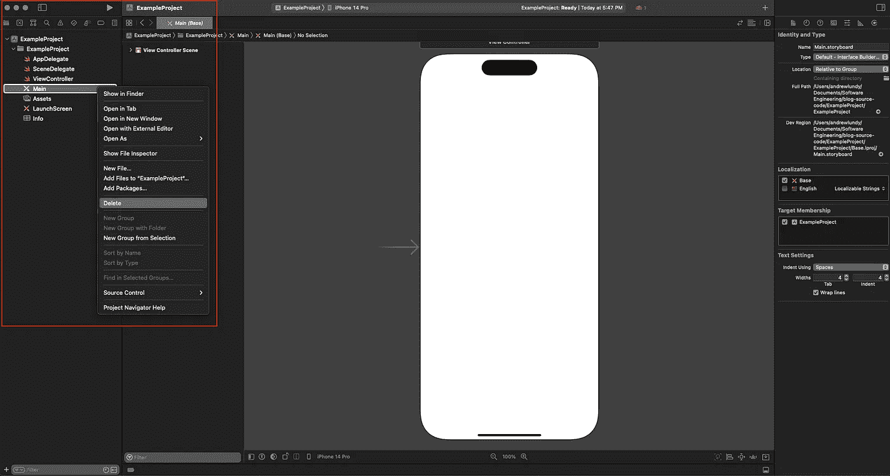

# 建立一个可编程的 UIKit 项目

> 原文：<https://blog.devgenius.io/set-up-a-programmatic-uikit-project-fc201a6a8fe2?source=collection_archive---------2----------------------->


照片由 [Zan](https://unsplash.com/@zanilic?utm_source=unsplash&utm_medium=referral&utm_content=creditCopyText) 在 [Unsplash](https://unsplash.com/s/photos/xcode?utm_source=unsplash&utm_medium=referral&utm_content=creditCopyText)

在 UIKit 中，有几种不同的方法来构建用户界面。通过故事板。xib 文件，或者 100%通过代码。通过使用代码开发用户界面，开发人员可以更好地管理他们的应用程序，因为他们能够控制约束、更改逻辑，并避免使用界面构建器时可能出现的性能低下的问题。

本文使用 Xcode 14。

## 创建项目

在 Xcode 中创建新应用程序。确保你使用的是故事板界面。


## 删除“Main.storyboard”文件

在导航区域，右键点击`Main.storyboard`，然后点击**删除**。



使用⌘ + 0 打开和关闭导航区域。

单击**删除**后，会出现一个警告，询问您是要将故事板文件移动到回收站，还是仅删除对它的引用。两者的区别在于**移动到垃圾桶**会将文件从你的硬盘上完全删除，而**移除引用**只会移除对你的 Xcode 项目中文件的引用，但会将其保留在硬盘上。

选择**移至垃圾箱**，故事板文件将被删除。

## 从 Info.plist 或 Build 设置中删除对情节提要的引用

在`Info.plist`中，有一个名为**主故事板文件库名的键。**将鼠标悬停在按键上时，单击减号即可移除。


在**构建设置**中搜索 **UIKit 主故事板文件库名**也可以得到同样的结果。点击设置名称，然后使用⌘ +删除来删除引用。


参考尚未删除。


参考已删除。

## 从**信息列表**中删除`**UISceneStoryboardFile**` 。

在`Info.plist`中，有一个名为**的键，应用场景清单**；一本字典。通过单击名称左侧的箭头来扩展字典。

这将产生两个项目，**启用多个窗口**和**场景配置**。扩展**场景配置**字典以显示**应用会话角色**数组。

最后，扩展在**应用会话角色**中找到的名为 **Item 0** 的键。您将看到一个名为**故事板名称**的键—单击名称旁边的减号删除该键。


如果您在删除目标的故事板文件和主故事板文件基础名称设置后没有删除**故事板名称**键，应用程序将会崩溃，您将会收到以下错误:

```
Terminating app due to uncaught exception 'NSInvalidArgumentException,' reason: 'Could not find a storyboard named 'Main' in bundle NSBundle.
```

您的“应用程序场景清单”应该如下所示:


## 在 SceneDelegate 中设置根视图控制器

`SceneDelegate`文件负责用户在屏幕上看到的内容。由于这是一个编程式 UI 设置，所以必须设置根视图控制器，否则，应用程序启动时不会出现任何内容。

在`willConnectTo`方法中，更改如下:

```
func scene(_ scene: UIScene, willConnectTo session: UISceneSession, options connectionOptions: UIScene.ConnectionOptions) {
    guard let _ = (scene as? UIWindowScene) else { return }
}
```

对此:

```
func scene(_ scene: UIScene, willConnectTo session: UISceneSession, options connectionOptions: UIScene.ConnectionOptions) {
    // 1.
    guard let windowScene = (scene as? UIWindowScene) else { return }

    // 2.
    let window = UIWindow(windowScene: windowScene)

    // 3.
    window.rootViewController = ViewController()

    // 4.
    window.makeKeyAndVisible()

    // 5.
    self.window = window
}
```

1.  将`UIWindowScene`对象存储在一个变量中。
2.  使用先前存储的`UIWindowScene`创建一个新的`UIWindow`。
3.  设置应用程序的根视图控制器。(这正是它听起来的样子——您的应用程序将视图控制器视为视图控制器层次结构的根)。
4.  将窗口设置为应用程序的主窗口。(这确保该窗口用于在屏幕上显示正确的内容)。
5.  使用`window`属性将新创建的窗口存储在`SceneDelegate`中。(如果不这样做，应用程序将不会使用正确的`UIWindow`对象，因此不会在屏幕上显示正确的内容)。

我已经将 ViewController 的视图背景颜色设置为红色，以表明应用程序运行时显示了正确的 ViewController。

```
import UIKit

class ViewController: UIViewController {

    override func viewDidLoad() {
        super.viewDidLoad()
        // Do any additional setup after loading the view.
        view.backgroundColor = .red
    }
}
```


## 相关内容

*   [iOS 开发基础](/the-basics-of-ios-development-e1874f387fc)
*   [在 UITableView 的单元格之间添加空间](https://andrew-lundy.medium.com/adding-space-between-the-cells-of-a-uitableview-590a0cfd2e22)
*   [核心位置——用 UIKit 设置核心位置](https://levelup.gitconnected.com/core-location-setting-up-core-location-with-uikit-fc7980565b4f)