# React 应用程序中的电子邮件。

> 原文：<https://blog.devgenius.io/set-up-emailjs-in-react-app-from-scratch-42e669efc22a?source=collection_archive---------1----------------------->

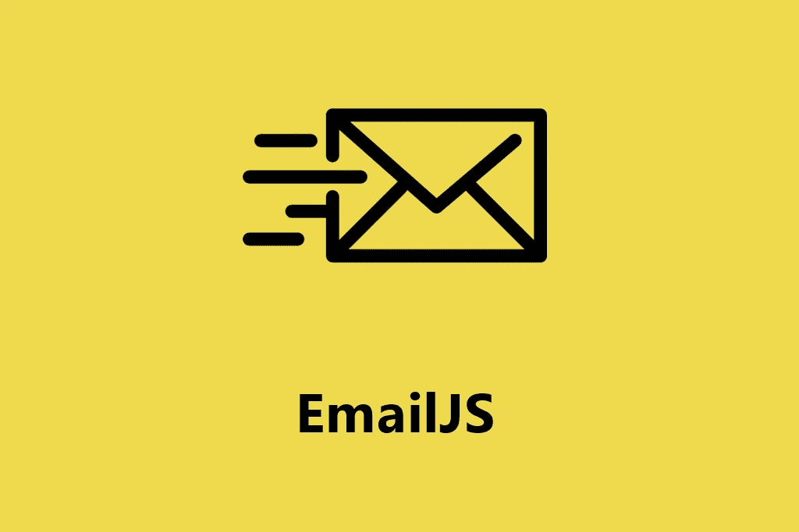

在讨论如何实现之前，让我们先确定什么是 EmailJs。EmailJ 是一个允许你不用后台就能收发电子邮件的平台。该平台有一个友好的用户界面，您可以轻松地创建带有动态参数的电子邮件模板。

你可以用各种方式在你的 React app 里设置 EmailJs 本文将只关注作为依赖项安装的 EmailJs。

# 使用创建-反应-应用程序

什么是 create-react-app？简而言之，它创建了一个样板 React 应用程序，不需要我们进行任何配置，这意味着我们可以立即开始您的项目🙌。

现在是时候打开我们的终端，创建我们的 app 了；完成后，键入以下命令:

```
npx create-react-app your-app **//if you use npm**
yarn creat react-app your-app **//if you use yarn**
```

当我们的终端打开时，将 cd 放入 app 文件夹，然后继续安装以下软件包:

```
cd your-app
npm install emailjs-com **//if you use npm** yarn add emailjs-com **//if you use yarn**
```

接下来，在您选择的 IDE 中打开应用程序目录；我更喜欢 Visual Studio 代码。您的目录应该如下所示:

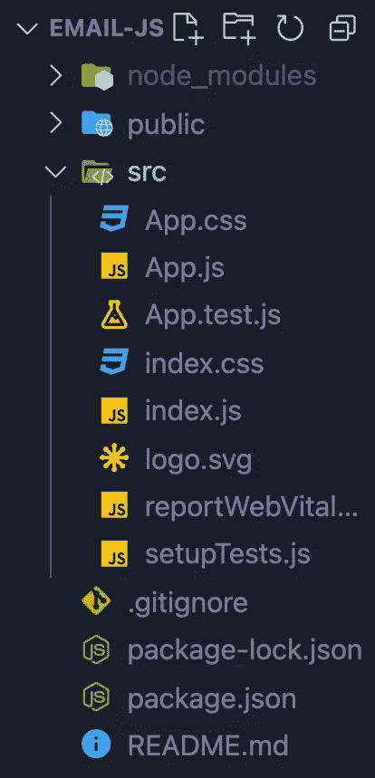

随意探索这个目录，尤其是`README.md`文件；里面有很多有用的信息。目前唯一让我们感兴趣的文件是`src`文件夹中的`app.js`，让我们打开它，去掉里面所有不必要的代码；您应该会看到下面的代码:

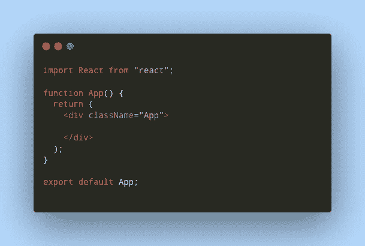

这就是我们 React 应用程序的设置。接下来，我们将深入探讨 EmailJs 的实现以及如何创建电子邮件模板🙂。

# 开始使用 EmailJs。

## 创建一个帐户

首先，我们需要在[email js’](https://www.emailjs.com/)网站上创建一个帐户；一旦完成，我们将需要确认我们的电子邮件，我们准备好下一步。

登录后，您应进入以下页面:

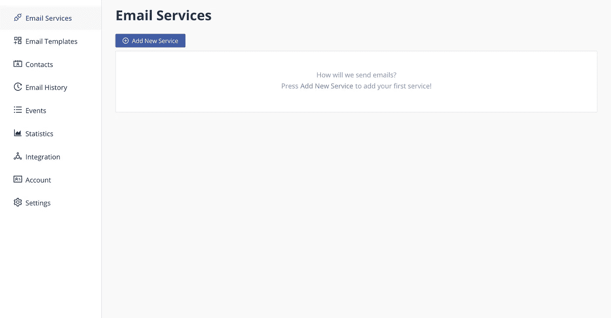

接下来，点击添加新服务，并选择您的电子邮件客户端的选择。

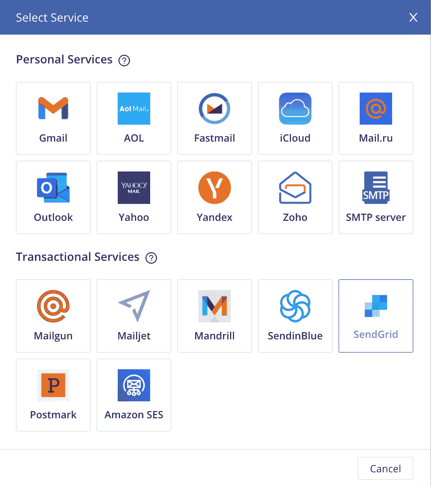

从这里，点击连接帐户；这会将您重定向到您的电子邮件提供商，以确认您希望建立此连接。确保在给出的选项中选择“代表您发送电子邮件”。当您完成两个服务之间的连接后，单击 Create Service 完成此步骤。

现在，您应该会在主页上看到新的电子邮件服务。

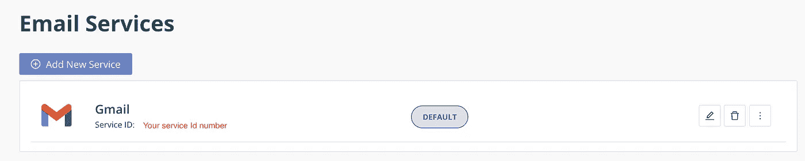

瞧啊。现在，您已经准备好在 React 中处理实现了。

## 履行

你可以在导航栏中链接的精心编写的[文档](https://www.emailjs.com/docs/)中找到一些方便的提示；如果你遇到困难或者想探索更多的选择，一定要去看看。

让我们回到我们的`app.js`开始编码吧！

首先，我们需要导入一些东西，从 React 导入`useRef`，从 EmailJs 包导入`emailjs`。

对于本教程，我们将使用一个基本的`form`和四个`input`字段，如下所示:

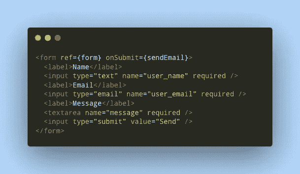

在上面的`form`中有几件事情值得一提:

*   我们使用`required`属性作为基本验证。这意味着在提交`form`之前需要填写这些字段。反过来，它防止用户提交不完整的表单。
*   在`form`的开始标签中，`onSubmit`属性会触发`sendEmail`函数。你也可以注意到`ref`属性；我们很快会谈到这一点。
*   您需要记住您在`input`字段中为每个`name`属性设置的值。
*   `form`需要嵌套在`div.`内

现在您已经完成了表单，我们可以看看`sendEmail`函数了。

我们的功能如下:

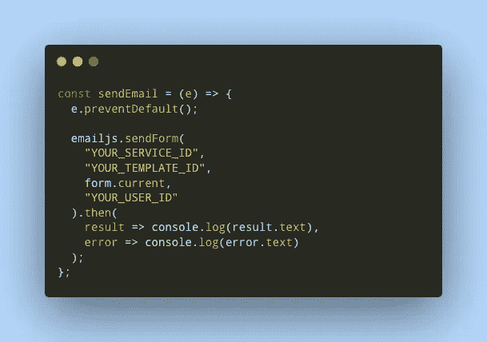

我们可以分解这个函数来更好地理解它:

1.  我们首先传递事件(提交的表单)`e`作为参数。
2.  `e.preventDefault()`会阻止页面在提交时被重新加载。
3.  `emailjs.sendForm()`接受四个参数，一个服务 ID(我们之前创建的)、一个模板 ID(我们将在下一步创建它)、`form.current`(表单的内容)和一个用户 ID(您的 EmailJs ID)。你可以在这里找到更多信息。
4.  由于`emailjs.sendForm()`是异步的，我们需要在它后面加上`.then`。
5.  在`.then`中，如果成功，我们记录结果；如果不成功，我们记录错误。

就在我们的函数上方，让我们添加以下代码行来完成我们的组件:

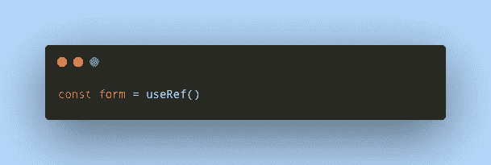

如果你对什么是`useRef`不熟悉，看看这里的。

简而言之:

> `useRef`返回一个可变的 ref 对象，其`.current`属性被初始化为传递的参数(`initialValue`)。返回的对象将在组件的整个生存期内保持不变。

这应该是您最终得到的结果:

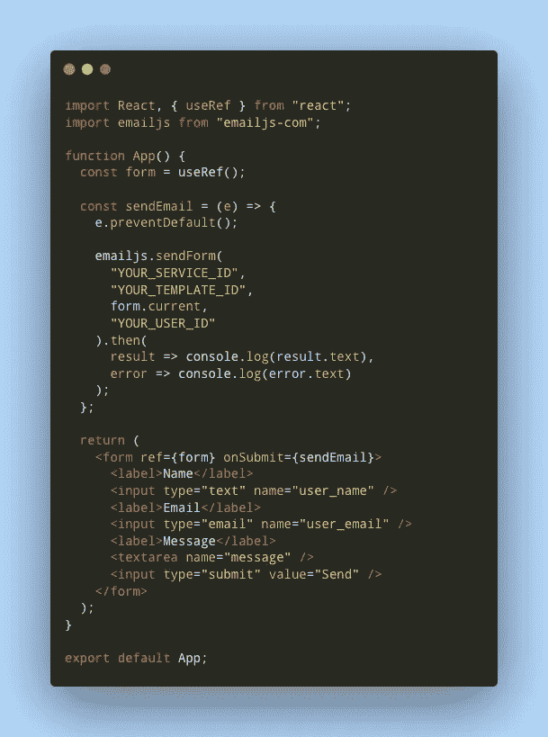

## 电子邮件模板

我们现在将创建两个电子邮件模板；第一个是您为用户收到的电子邮件，第二个是向您的用户确认他们的电子邮件已发送给您。

返回 EmailJS 网站，选择左侧的“电子邮件模板”选项卡，然后单击创建“创建新模板”，您现在应该会看到此页面:

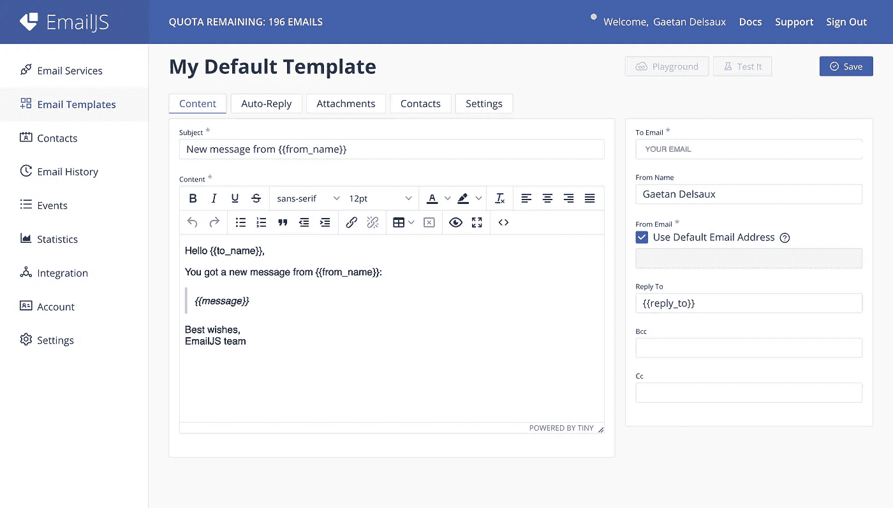

注意到这些花括号了吗？它们将被用作我们的动态参数。为了反映我们发送给 EmailJs 的内容，我们需要用我们在表单中设置的参数(我要求你记住的`name`属性)来更新这些参数的值。我们现在有了更新的模板:

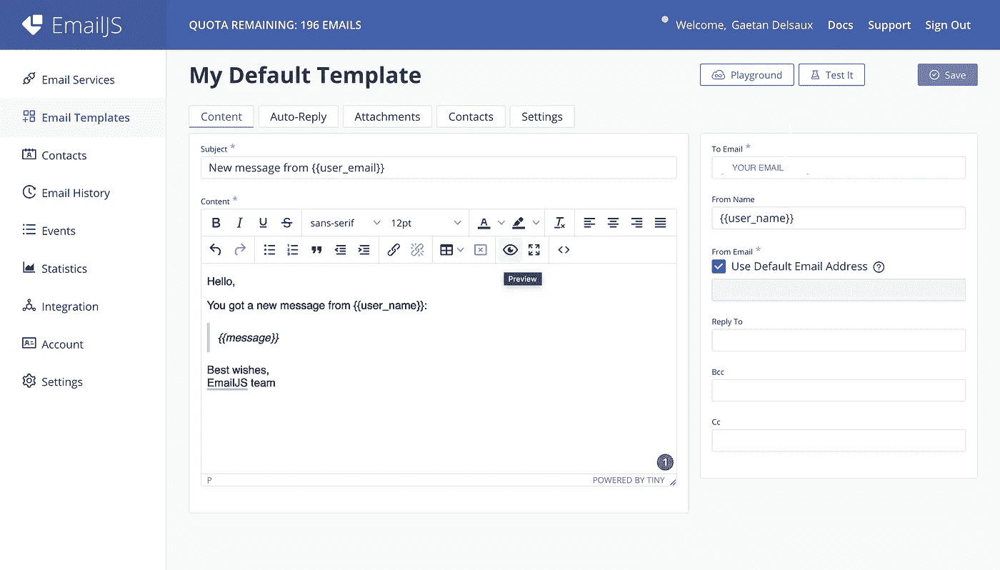

从这里，您可以进入下一个选项卡“自动回复”，并按照您喜欢的方式进行设置；这是一个基本的例子:

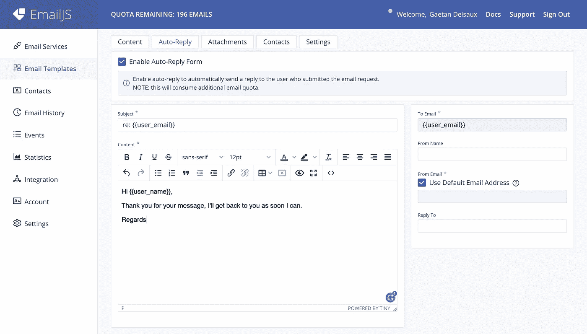

如果您想将回复发送给您的用户，您需要在提及自动回复的框中打勾。

## 。Env 文件

我们需要做的最后一件事就是在`emailjs.sendEmail()`函数中设置变量。

出于安全原因，最好将它们存储在`.env`文件中。在你的根目录下，创建一个文件并命名它`.env`。

创建后，您需要找到以下内容:

*   您的用户标识
*   您的模板标识
*   您的服务标识

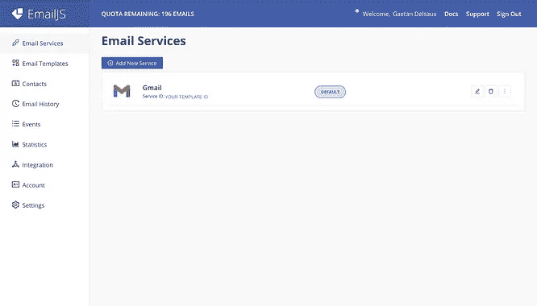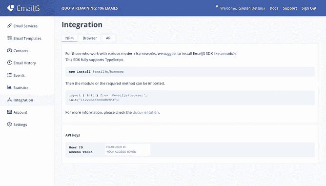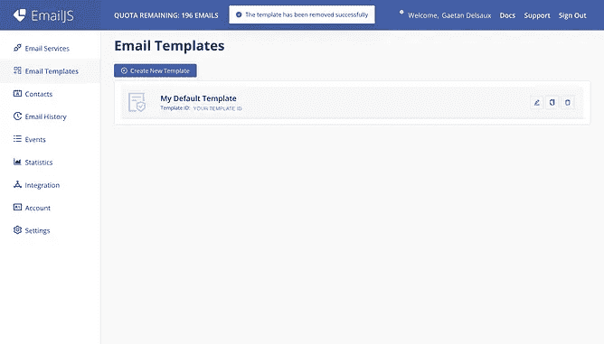

在`.env`文件中键入以下内容:

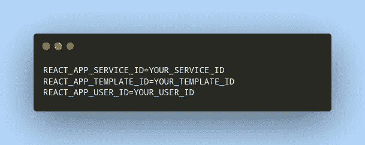

我们现在需要用变量更新我们的函数:

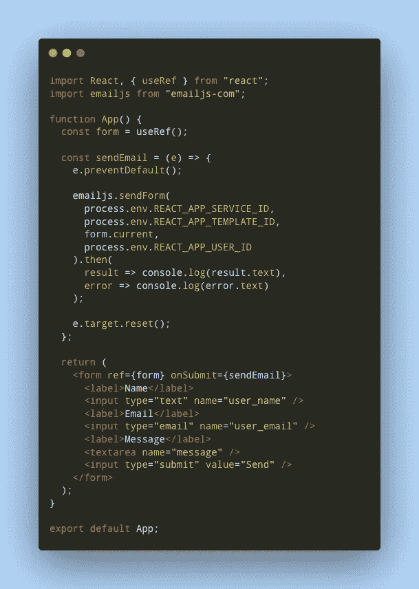

我还增加了`e.target.reset()`来清除发送时的`form`。

请注意，由于我们使用的是`.env`文件中的变量，因此我们的 React 应用程序在此阶段可能无法工作。为了让我们的应用程序正常工作，我们需要重新运行命令`npm start`或`yarn start`。

**就是这样**我们现在不用创建后端就可以直接从我们的应用程序接收电子邮件了！

您可以在下面找到我的链接:

[GitHub](https://github.com/gdelsaux)

[推特](https://twitter.com/delsaux_g)