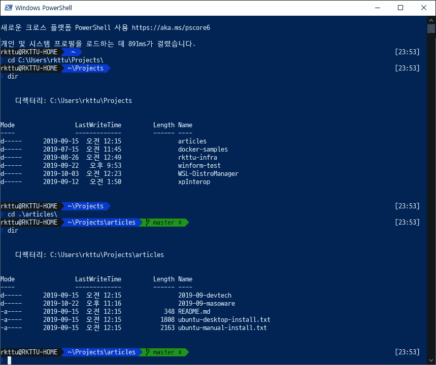
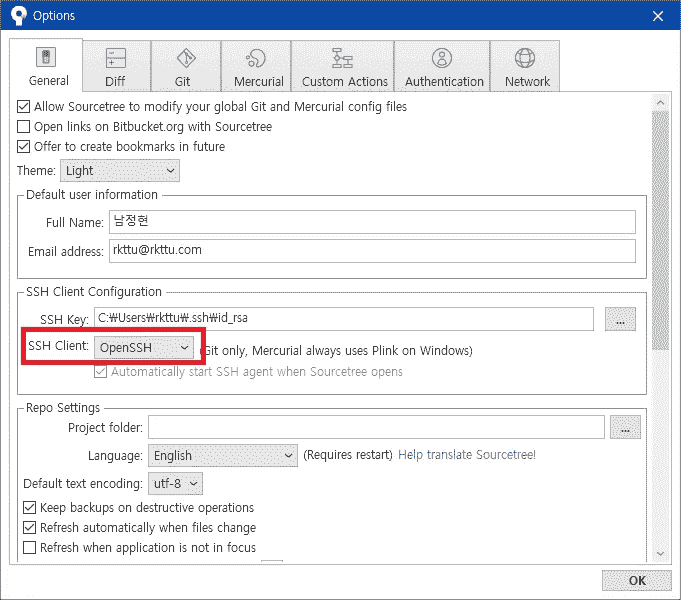

# 配置 SSH 密钥和 Git 与 Windows 10 原生方式的集成

> 原文：<https://blog.devgenius.io/set-up-ssh-key-and-git-integration-in-windows-10-native-way-c9b94952dd2c?source=collection_archive---------0----------------------->


你知道 Windows 10 自带 OpenSSH 客户端吗？

从 Windows 10 秋季创建者更新(1709)开始，OpenSSH 客户端作为 Windows 附加组件包含在内。然而，人们很容易误解它是由不同于 Linux 的不熟悉的用法提供的，或者它仍然没有得到适当的支持。

在这篇文章中，我将看看如何设置 Windows 10 内置的 OpenSSH，并给你一些有用的提示。

# 配置 Windows OpenSSH

以管理员身份启动 PowerShell，并使用下面的 PowerShell 命令添加 Windows 组件。

微软目前安装的 OpenSSH 是一个附加包，按需提供功能，而不是经典控制面板`control.exe`的`Add/Remove Windows Components`对话框中的一个项目。您只能使用以下命令来安装它:

```
$OpenSSHClient = Get-WindowsCapability -Online | ? Name -like ‘OpenSSH.Client*’
Add-WindowsCapability -Online -Name $OpenSSHClient.Name
```

通常，安装后不需要重启系统。

完成安装后，您可以启用 ssh-agent 服务。这项服务以前每次注册都不要求 SSH 密钥密码。最初，该服务被禁用和停止，因此将该服务设置为自动启动并立即启动。

```
$SSHAgentSvc = Get-Service -Name ‘ssh-agent’
Set-Service -Name $SSHAgentSvc.Name -StartupType Automatic
Start-Service -Name $SSHAgentSvc.Name
```

现在，您应该在管理员模式下关闭 PowerShell 窗口，并在 PowerShell 窗口照常打开的情况下工作。

因为我们正在设置一个新系统，所以让我们创建一个新的 SSH 密钥。OpenSSH 客户机包中添加了一些标准实用程序。运行`ssh-keygen`命令并回答问题。

```
ssh-keygen
```

该命令从`$HOME\.ssh\id_rsa`文件和`$HOME\.ssh\id_rsa.pub`文件创建一个密钥对。

现在运行 ssh-add 命令，将这个密钥对添加到 ssh-agent 服务中。

```
ssh-add
```

它会自动注册`$HOME\.ssh\id_rsa`密钥对，现在您可以使用该密钥对进行身份验证。

> *注意:有时系统可能安装了多个* `*ssh.exe*` *二进制文件，并且* `*ssh.exe*` *二进制路径可能在* `*PATH*` *环境变量中重复。要调试此问题，请查看* `*path*` *命令或* `*PATH*` *环境变量的内容，并更改包含要首先使用的* `*ssh.exe*` *二进制文件的文件夹路径，或者只保留一个。*

# 在 Github 上注册 SSH 密钥

您需要将这个 SSH 密钥对的公钥注册到 Github 或您的 Git 存储库中。

输入以下 PowerShell 命令复制公共 SSH 密钥值以注册其他系统。

```
Get-Content -Path $HOME\.ssh\id_rsa.pub | Set-Clipboard
```

用这个命令，公钥自动输入到剪贴板上。

然后输入以下命令打开 GitHub 配置页面。(或者，您可以直接在首选浏览器而不是默认浏览器中打开下面的 URL。)

```
Start-Process ‘https://github.com/settings/ssh/new'
```

之后，从剪贴板粘贴公钥，并通过添加密钥的清晰描述来注册它。

# 安装 Git 客户端和 SSH 客户端

安装 Git 客户端的方法有很多，但是我推荐使用 Chocolatey 包管理器，这是最直观、最简单的方法。

官方的 Git 客户端安装包公开了许多可能导致副作用的选项，因此如果安装不正确，可能会由于意外的功能而遇到困难。

首先，安装 Chocolatey 软件包管理器(如果它不存在的话)。因为这是软件的系统级添加，所以请允许管理员花几分钟时间打开一个新的 PowerShell 窗口。

```
Set-ExecutionPolicy Bypass -Scope Process -Force; iex ((New-Object System.Net.WebClient).DownloadString(‘https://chocolatey.org/install.ps1'))
```

现在输入命令来安装 Git for Windows 客户端。

> *注意:通常情况下，如果 Chocolatey.org 网站进入定期检查期，安装可能无法正常进行。在这种情况下，请检查 Chocolatey.org 网站，稍后再试。*

```
choco install git -y
```

回到常规的 PowerShell 窗口，设置 GIT_SSH 环境变量。您必须指定这个环境变量，以便 Git 客户机能够正确识别 Windows 10 上的 SSH 客户机。

```
$SSHPath = (Get-Command -Name ‘ssh.exe’).Source
[Environment]::SetEnvironmentVariable(‘GIT_SSH’, $SSHPath, ‘User’)
```

# 用 oh-my-posh 驱动 PowerShell

顾名思义，oh-my-posh 是目前在 macOS 和 Linux 上流行的 oh-my-zsh 的 Windows PowerShell 版本。有趣的是，它支持 oh-my-zsh 提供的一些特性。

首先，运行 oh-my-posh 安装脚本。它列在 PowerShell 的官方模块库中，所以命令并不复杂和简单。

```
Install-Module posh-git -Scope CurrentUser
Install-Module oh-my-posh -Scope CurrentUser
```

在 PowerShell Core 6 上，您需要运行以下命令。

```
Install-Module -Name PSReadLine -AllowPrerelease -Scope CurrentUser -Force -SkipPublisherCheck
```

编辑配置文件，以便在 PowerShell 启动时可以加载 oh-my-posh shell。

```
if (!(Test-Path -Path $PROFILE )) { New-Item -Type File -Path $PROFILE -Force }
notepad.exe $PROFILE
```

在脚本的末尾添加以下代码并保存。

```
Import-Module posh-git
Import-Module oh-my-posh
Set-PoshPrompt Paradox
```

作为一个旁注，使用电力线修补的编程字体看起来很漂亮，不会破坏字形。在提升的 PowerShell 中重新运行以下命令，并使用 D2 编码字体更新控制台窗口的字体设置。

```
Import-Module posh-git
Import-Module oh-my-posh
Set-PoshPrompt Paradox
```

当所有的设置都被应用时，您将看到类似下图的内容，如果您将目录移动到 Git 存储库，您将看到分支名称看起来不错。😎



# 附录 1:安装 Windows 终端应用程序

您可以通过在 PowerShell 中运行以下命令直接进入 Windows 终端应用商店页面:众所周知，使用 Windows 终端可以获得现代 CLI 开发环境的所有好处。

```
Start-Process 'https://www.microsoft.com/store/productId/9N0DX20HK701'
```

安装后可以直接用`wt.exe`或者`wt`快捷键启动 Windows 终端 app。也就是在 Windows 上，记住`wt`而不是`cmd`、`powershell`或者`pwsh`。😏

# 附录 2:对于源代码树

不幸的是，SourceTree 使用的 Git 客户机不能与 Windows 提供的 SSH 代理服务一起工作。相反，您可以使用自己创建的密钥。

在 SourceTree 选项窗口中，将 SSH 客户端更改为 OpenSSH，如下所示。



此时，验证 SSH 密钥是否与$HOME 相同。在上一步中创建的 ssh\id_rsa 文件。如果不同，请再次指定。
完成后，按下确定按钮保存设置。

# 附录 3:与 Visual Studio 代码集成

如果正确注册了 GIT_SSH 环境变量，集成就完成了，没有任何特殊的设置。但是，即使您已经完成了配置，如果在执行 git pull 时仍然没有任何消息，您可以运行 ssh-add -l 命令内置终端来检查 ssh-agent 服务的连接状态。

[](https://www.buymeacoffee.com/rkttu)