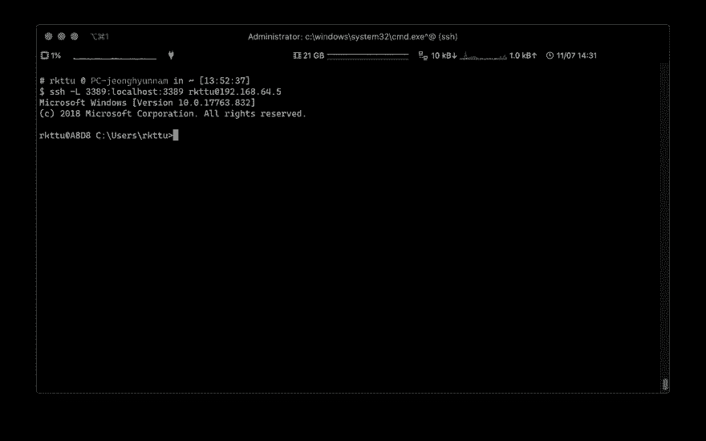
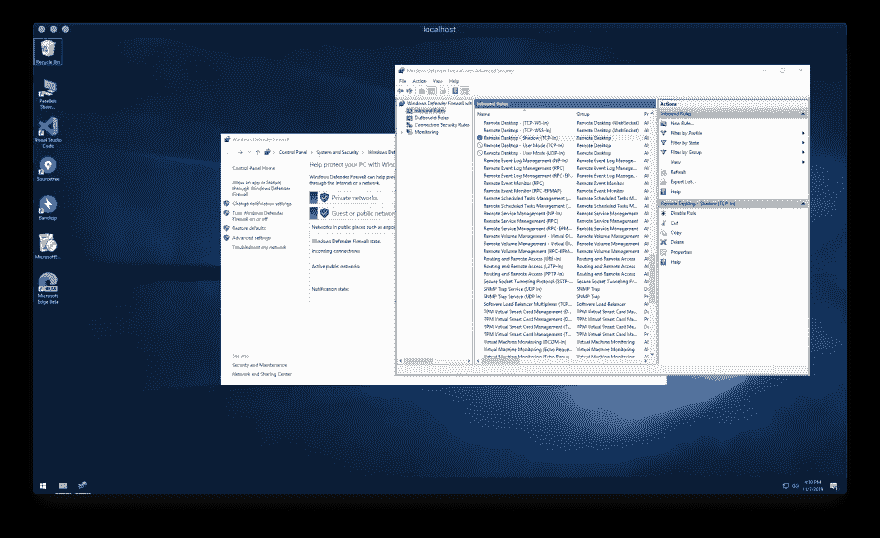
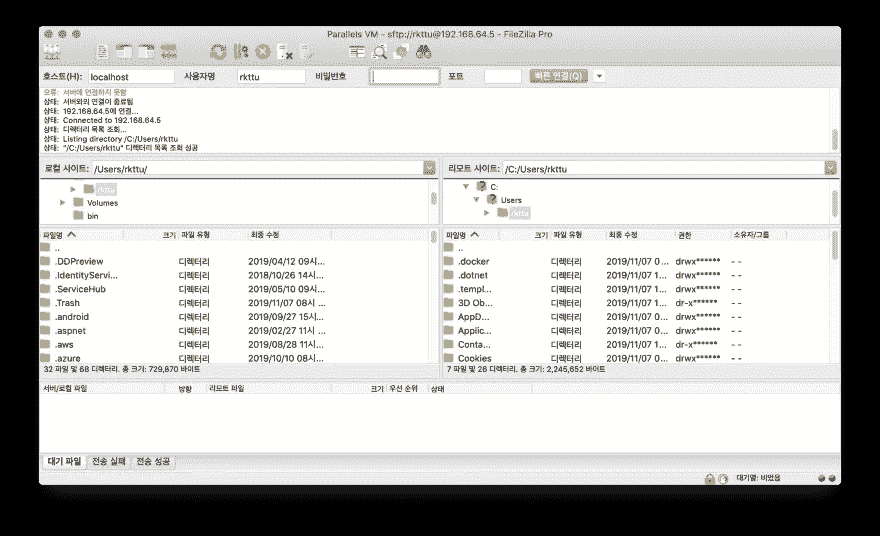

# 用 Windows 10 原生方式配置 SSH 服务器

> 原文：<https://blog.devgenius.io/set-up-your-ssh-server-in-windows-10-native-way-1aab9021c3a6?source=collection_archive---------0----------------------->


C [从上一篇文章](https://medium.com/rkttu/set-up-ssh-key-and-git-integration-in-windows-10-native-way-c9b94952dd2c)开始，我们将看看如何从 Windows 10 和 Windows Server 1709 开始设置一个内置的 SSH 服务器。这种方法允许 Windows Server 使用 SSH 进行远程连接，就像传统的 Linux 服务器一样。我们还将了解如何使用 SSH 端口隧道安全地使用远程桌面，而无需修改防火墙设置。

# 安装和配置 OpenSSH 服务器

您可以像在上一篇文章中安装 SSH 客户机一样安装 OpenSSH 服务器。

```
$OpenSSHServer = Get-WindowsCapability -Online | ? Name -like ‘OpenSSH.Server*’
Add-WindowsCapability -Online -Name $OpenSSHServer.Name
```

安装 OpenSSH 服务器程序后，启动并停止 NT 服务一次，以创建必要的初始配置文件。

```
$SSHDaemonSvc = Get-Service -Name ‘sshd’
Start-Service -Name $SSHDaemonSvc.Name
Stop-Service -Name $SSHDaemonSvc.Name
```

# 应用非对称密钥身份验证

强烈建议使用公共 SSH 密钥身份验证方法并禁用密码身份验证方法，因为它可以通过密码分配来防止攻击。要启用此身份验证功能，请以管理员身份启动 PowerShell，并使用记事本打开以下路径中的文件。(或者您可以使用自己选择的另一个文本编辑器。)

```
notepad.exe $env:PROGRAMDATA\ssh\sshd_config
```

对于以下项目，取消线下的注释，并应用如下值:

*   `PubkeyAuthentication yes`
*   `PasswordAuthentication no`
*   `PermitEmptyPasswords no`

然后选择您喜欢的管理 SSH 公钥的方法。从 Windows Server 2019(或 1809)开始，有两种方法可以描述 SSH 公钥。其中之一是在用户的主目录中创建 authorized_keys 文件的传统方式。

# 使用`$HOME\.ssh\authorized_keys`

若要使用此方法，请在配置文件的底部注释掉以下代码块:

```
Match Group administrators
  AuthorizedKeysFile
  __PROGRAMDATA__/ssh/administrators_authorized_keys
```

然后转到你想登录的用户主目录，创建一个`.ssh`目录。

```
mkdir "$HOME\.ssh"
```

在新创建的目录中创建一个`authorized_keys`文件(不带扩展名),并用您喜欢的文本编辑器打开它。

```
$authorizedKeyFilePath = “$HOME\.ssh\authorized_keys”
New-Item $authorizedKeyFilePath
notepad.exe $authorizedKeyFilePath
```

添加您在这里使用的公共 SSH 密钥值。

保存文件时，您必须按照章节**使用认证密钥信息设置文件权限**中的说明更改文件权限设置。如果缺少此设置，SSH 连接将会失败。

# 使用`administrators_authorized_keys`

该属性是 Windows Server 2019 (1809)中包含的 OpenSSH 使用的默认属性。您可以在一个地方管理您的文件，而不是为每个用户注册一个新的 SSH 密钥。

如果使用这种方法，所有公钥都需要存储在$ env:program data \ ssh \ administrators _ authorized _ keys 文件中，非管理用户(即不属于 administrator s 组的用户)除外。如果你尝试，这个设置将被用来代替你的主目录，所以如果这里没有密钥，连接将失败。

`administrators_authorized_keys`文件默认不存在，已创建。

> 警告:小心运行以下命令。如果您错误地更改了其他系统文件或配置，系统可能会崩溃。

```
$authorizedKeyFilePath = “$env:ProgramData\ssh\administrators_authorized_keys”
New-Item $authorizedKeyFilePath
notepad.exe $authorizedKeyFilePath
```

添加您在这里使用的公共 SSH 密钥。

保存文件时，您必须按照章节**使用认证密钥信息**设置文件权限中所述更改文件权限设置。如果缺少此设置，SSH 连接将会失败。

# 使用身份验证密钥信息设置文件权限

在使用 OpenSSH server for Windows 时，您将面临的一个常见且非常棘手的问题是。SSH 密钥文件权限应该具有正确且有限的文件权限。SSH 的 Windows 版本也遵循这个规则，但是特别是在 Windows 中，配置文件权限可能是不直观的。

根据您在上一步中选择的方法，您必须验证`authorized_keys`文件或`administrators_authorized_keys`文件的路径，并更改权限，以便只有系统帐户可以使用`icacls.exe`实用程序以及`Get-Acl`和`Set-Acl`命令访问它。

> 警告:小心运行以下命令。如果您错误地更改了系统文件的 ACL 配置，系统可能会崩溃。

```
$authorizedKeyFilePath = "..."
icacls.exe $authorizedKeyFilePath /remove “NT AUTHORITY\Authenticated Users”
icacls.exe $authorizedKeyFilePath /inheritance:r
Get-Acl “$env:ProgramData\ssh\ssh_host_dsa_key” | Set-Acl $authorizedKeyFilePath
```

# 更改 SSH 默认 Shell

基本上，出于兼容性的考虑，Windows 操作系统在很长一段时间内都提供了基于 shell 的解释器，可以识别 DOS 命令。但是现在，随着越来越多的功能，PowerShell 正在成为一个不错的选择。

如果需要，您可以将 PowerShell 指定为 SSH 的默认 Shell，而不是 DOS 解释器。但是，这里的设置特定于 SSH 会话，而不是远程桌面或控制台会话。

> 警告:小心运行以下命令。如果您错误地更改了注册表配置，系统可能会崩溃。

```
New-ItemProperty -Path "HKLM:\SOFTWARE\OpenSSH" -Name DefaultShell -Value "$env:WINDIR\System32\WindowsPowerShell\v1.0\powershell.exe" -PropertyType String -Force
```

# 启动 SSH 服务器

您现在已经准备好启动您的 SSH 服务器了。SSH 服务器默认设置为手动运行，以便您可以将启动模式更改为自动。然后开始服务。

```
$SSHDaemonSvc = Get-Service -Name ‘sshd’
Set-Service -Name $SSHDaemonSvc.Name -StartupType Automatic
Start-Service -Name $SSHDaemonSvc.Name
```



恭喜你！从现在起，您可以使用 SSH-key 身份验证连接到 Windows。

# 如何保护远程桌面

与 Linux 不同，Windows 仍然在图形界面上运行大部分系统，而不是在命令行上。因此，如果您尝试使用这样的终端做一些事情，您可能不会像预期的那样有太多事情要做。

然而，众所周知，远程桌面是许多黑客和脚本小子的食物。你可能会遇到在方便和安全之间选择的困境。

幸运的是，SSH 提供了隧道的概念，支持安全地中继其他网络连接的能力。远程桌面连接也可以用这种方式保护，这样您就可以放心地使用它们。

从阻塞 TCP 3389 和 UDP 3389 端口开始。您可以这样做，因为您将仅通过 SSH 隧道来使用远程桌面。

> 警告:小心运行以下命令。如果您错误地更改了防火墙配置，系统可能会变得易受攻击。

```
Set-NetFirewallRule -DisplayName “Remote Desktop - User Mode (UDP-In)” -Action Block
Set-NetFirewallRule -DisplayName “Remote Desktop - User Mode (TCP-In)” -Action Block
```

接下来，您必须更改注册表标志值，以便远程桌面服务器可以接受连接。

> 警告:小心运行以下命令。如果您错误地更改了注册表配置，系统可能会崩溃。

```
Set-ItemProperty -Path ‘HKLM:\System\CurrentControlSet\Control\Terminal Server’ -Name “fDenyTSConnections” -Value 0
```

我现在要解释的部分很酷。正如您在前面看到的，当您连接到 OpenSSH 时，不会要求您输入密码，因此您可以在每次使用时设置一个随机生成的强密码。在系统目录中有一个简单的脚本可以方便地做到这一点。

选择你想要的脚本类型，创建一个名为`ChangePassword.ps1`的文件。为了您的方便，我们将把这个脚本保存在系统目录中。

> 警告:小心运行以下命令。如果您错误地更改了其他系统文件或配置，系统可能会崩溃。

```
$change_pwd_script_path = “$env:WINDIR\ChangePassword.ps1”
Clear-Content $change_pwd_script_path -ErrorAction SilentlyContinue
notepad.exe $change_pwd_script_path
```

# 设置您想要的密码

如下创建`ChangePassword.ps1`文件的内容:

```
$Password = Read-Host -Prompt "Provide your new account password" -AsSecureString
Set-LocalUser -Name "$env:UserName" -Password $Password
Clear-Variable "Password"
Write-Host "Detailed settings such as remote desktop settings, WinRM connection settings, and Windows Update can be controlled using the sconfig command."
```

这个脚本允许您输入密码。但是，除非您更改策略，否则您只能使用通过 Windows Server enhanced 默认密码规则的密码。您必须指定满足以下所有条件的密码。

*   英文大写字母(A 到 Z)
*   小写英文字母(a 到 z)
*   阿拉伯数字(0 到 9)
*   特殊符号(例如！, $, #,%)

# 每次都生成新密码

创建`ChangePassword.ps1`文件的内容如下:

```
Add-Type -AssemblyName System.Web
$Password = [System.Web.Security.Membership]::GeneratePassword(30,10)
Set-LocalUser -Name "$env:UserName" -Password ($Password | ConvertTo-SecureString -AsPlainText -Force)
Write-Host "Your New Password is:`r`n`r`n$Password"
Write-Host "Detailed settings such as remote desktop settings, WinRM connection settings, and Windows Update can be controlled using the sconfig command."
Clear-Variable "Password"
```

这样，每次都可以设置强密码。如果您忘记了密码，您可以放心，您仍然可以使用公钥身份验证作为第二种身份验证方法。

# 尝试使用隧道登录到远程桌面

现在输入下面的命令来运行上面的脚本。之后，只需设置密码并验证远程桌面连接正在工作。

> 警告:小心运行以下命令。如果您丢失了指定的密码，您将无法访问您的系统。

```
ChangePassword
```

要登录到远程桌面，请运行 SSH，如下所示:

```
ssh -L 3389:localhost:3389 <user_id>@<host_address>
```

第一个 3389 是服务器端的端口号，第二个地址是您想在本地使用的端口号。如果您已将 remote desktop 的端口号从注册表更改为服务器上的另一个端口号，您可以输入更改后的端口号，而不是 3389。



如果您试图像以前一样仅使用<host_address>部分连接到远程桌面，防火墙将像以前设置的那样阻止连接。因此，没有人能够直接访问远程桌面，除非用户已经向该服务器注册了与 SSH 密钥相匹配的公钥。</host_address>

# 使用安全文件发送和接收

毫不奇怪，使用基于 SSH 的 SFTP 是可能的。此功能旨在取代远程桌面的文件夹共享功能，安全地处理大型文件传输。



任何支持 SFTP 功能的客户端，如 FileZilla，都是兼容的，并且具有管理优势，因为不需要像传统 FTP 那样应用复杂的防火墙开放策略。

# 总结

本演练让您了解自 Windows 10 版本 1709 以来添加的所有新 SSH 功能。这两篇文章都适用于 Windows 10 和 Windows Server 2019，因此请花点时间设置它们以获得更高的安全性。

# 信用

当我写这篇文章的时候，下面的文章帮助了我。

*   [https://ilovepowershell . com/2018/05/28/awesome-and-simple-way-to-generate-random-passwords-with-powershell/](https://ilovepowershell.com/2018/05/28/awesome-and-simple-way-to-generate-random-passwords-with-powershell/)
*   [https://stack overflow . com/questions/16212816/setting-up-OpenSSH-for-windows-using-public-key-authentic ation](https://stackoverflow.com/questions/16212816/setting-up-openssh-for-windows-using-public-key-authentication)

[](https://www.buymeacoffee.com/rkttu)