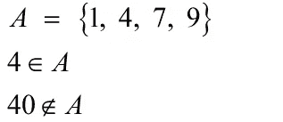
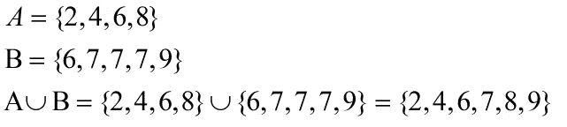
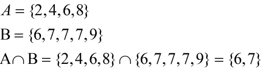
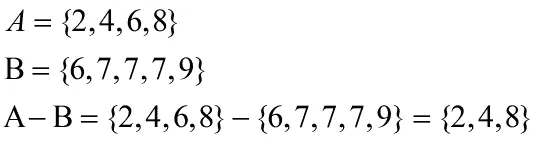
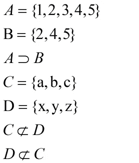
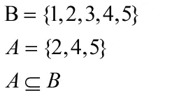

# Python 中的集合

> 原文：<https://blog.devgenius.io/sets-in-python-afcfeba49ebb?source=collection_archive---------13----------------------->

## 集合在数据科学中的应用

集合是唯一且定义明确的元素的无序集合。Set 用大写字母表示，其元素包含在`{}`中。有一个元素的集合称为单音集合，没有元素的集合称为`NULL` 集合。集合论在数据科学和数据分析中有特殊的应用。Set 是 Python 中的内置数据类型，用于存储数据集合。集合中的元素可以是数字、分类或字母数字类型。器械包的主要属性如下所示

*   **无序:**元素没有定义的顺序
*   **不可更改:**创建集合后，您不能更改集合的元素
*   **唯一性:**集合中的元素是唯一的，这意味着重复的值将被删除


[Tom Crew](https://unsplash.com/@tomcrewceramics?utm_source=medium&utm_medium=referral) 在 [Unsplash](https://unsplash.com?utm_source=medium&utm_medium=referral) 上拍照

# 用 Python 创建集合

你可以使用`{}`括号或者`set()`函数在 python 中创建一个集合。

```
A = {1, 1, 1, 1, 2, 2, 2, 2, 5, 7}
B = set([4, 6, 9, 0])print(A)
## {1, 2, 5, 7}print(B)
## {0, 9, 4, 6}
```

**观察:**

*   `Set()`是一个函数，它将一个元素列表或元组作为参数来创建一个集合
*   `A`的重复值已移除。

# 成员资格

例如，我们有一个集合`A = {1, 4, 7, 9}`，我们可以说 4 是`A`的一个元素，但是`40`不是`A`的一个元素。



```
A = {1,2,3,4,5}
4 in A
## True40 in A
## False
```

# 集合的基数

集合中唯一元素的数量称为集合的基数。`len()`是一个 python 函数，用来返回集合的大小。

```
A = {1, 1, 1, 1, 2, 2, 2, 2, 5, 7}
B = set([4, 6, 9, 0])len(A)
## 4len(B)
## 4
```

**观察:**

*   `len(A)`返回集合的唯一值`A`

# 不同类型的集合

器械包可以是任何类型，如`numeric`、`alphabetic`、`alphanumeric` 等。type()是一个 python 函数，用于返回函数的类型

```
N = {'Abdul Ahad', 'Anshrah', 'Hafsa', 'Abdul Rafay'}
N
## {'Anshrah', 'Hafsa', 'Abdul Ahad', 'Abdul Rafay'}
type(N)
## <class 'set'>A = {1, 3, 0}
A
## {0, 1, 3}
type(A)
## <class 'set'>B = {True, False}
B
## {False, True}
type(B)
## <class 'set'>
```

# 访问集合中的元素

集合是元素的无序集合，这就是为什么索引不对集合数据类型进行操作，但是我们可以像下面这样遍历集合的元素

```
N = {'Abdul Ahad', 'Anshrah', 'Hafsa', 'Abdul Rafay'}
for student in N:
  print(student)
## Hafsa
## Abdul Rafay
## Anshrah
## Abdul Ahad
```

# 向集合中添加元素

*   `add()`方法用于向集合中添加一个元素
*   `update()`用于连接两个集合的方法

```
A = {1, 4}
A
## {1, 4}A.add(5)
A.add(10)
A.add(12)
A
## {1, 4, 5, 10, 12}B = {10, 20, 30}A.update(B)A
## {1, 4, 5, 10, 12, 20, 30}
```

**观察:**

*   `A.add(5)`是一个就地方法，我们不需要更新集合`A`
*   `A.update(B)`也是一种就地方法，我们不需要更新集合`A`

# 从集合中删除元素

`remove()`、`discard()`和`pop()`方法用于从集合中移除元素。

*   `remove(x)`如果`x`不属于集合，该函数将给出错误。
*   `pop()`将从集合中移除一个随机数，因为集合是一个无序的元素集合。

```
A = {1, 4, 3, 7, 9}A
## {1, 3, 4, 7, 9}A.pop()
## 1A
## {3, 4, 7, 9}A.remove(7)
A
## {3, 4, 9}A.discard(9)
A
## {3, 4}
```

# 集合联合

两组`A`和`B`的并集用`A∪B`表示。`A∪B`是集合`A`或`B`或集合`A`和`B`中所有元素的集合。



```
A = {2,4,6,8}
B = {6,7,7,7,9}A.union(B)
## {2, 4, 6, 7, 8, 9}
```

# 设置交集

两组`A`和`B`的交集用`A∩B`表示。`A∩B`是来自集合`A`和`B`的公共元素的集合。



```
A = {2,4,6,8}
B = {6,7,7,7,9}A.intersection(B)
## {6}
```

# 设置差异

集合`A`和`B`的集合差用`A-B`表示。`A-B`是集合`A`中不存在于集合`B`中的所有元素的集合。



```
A = {2,4,6,8}
B = {6,7,7,7,9}A.difference(B)
## {8, 2, 4}
```

# 集合互不相交？

如果两个集合`A`和`B`有一些公共元素，那么它们是重叠集合，否则它们是互不相交的集合。

Python 有`A.isdisjoint(B)`方法来检查给定的集合是不相交的还是重叠的。

```
A = {2,4,6,8}
B = {6,7,7,7,9}A.isdisjoint(B)
## FalseC = {'a', 'b', 'c'}
D = {'x', 'y', 'z'}C.isdisjoint(D)
## True
```

# 超集

设我们有两个集合 A 和 B。集合 A 是集合 B 的超集当且仅当 B 的所有元素也是 A 的元素。



```
A = {1,2,3,4,5}
B = {2,4,5}A.issuperset(B)
## TrueC = {'a', 'b', 'c'}
D = {'x', 'y', 'z'}C.issuperset(D)
## False
```

# 子集

集合 A 是集合 B 的子集当且仅当集合 A 的所有元素也是集合 B 的元素。



```
A = {1,2,3,4,5}
B = {2,4,5}B.issubset(A)
## TrueC = {'a', 'b', 'c'}
D = {'x', 'y', 'z'}C.issubset(D)
## False
```

# 设置对称差

python 的`symmetric_difference()`方法返回一个集合，该集合包含两个集合中都不存在的项目的混合

```
A = {1,2,3,4,5}
B = {2,4,5}
B.symmetric_difference(A)
## {1, 3}C = {'a', 'b', 'c'}
D = {'x', 'y', 'z'}
C.symmetric_difference(D)
## {'a', 'x', 'y', 'z', 'b', 'c'}
```

# 结论

在本文中，我们介绍了如何在 python 中创建一个集合，并对两个集合执行不同的基本运算，如并集、交集、集合差、子集、超集等。