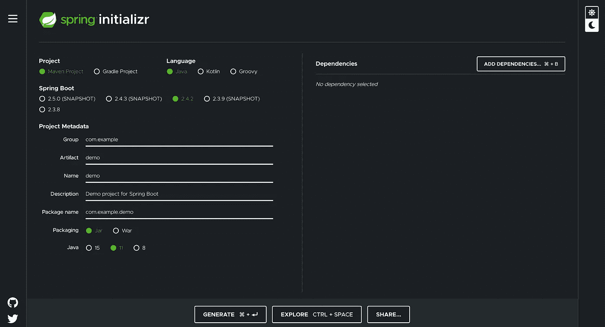
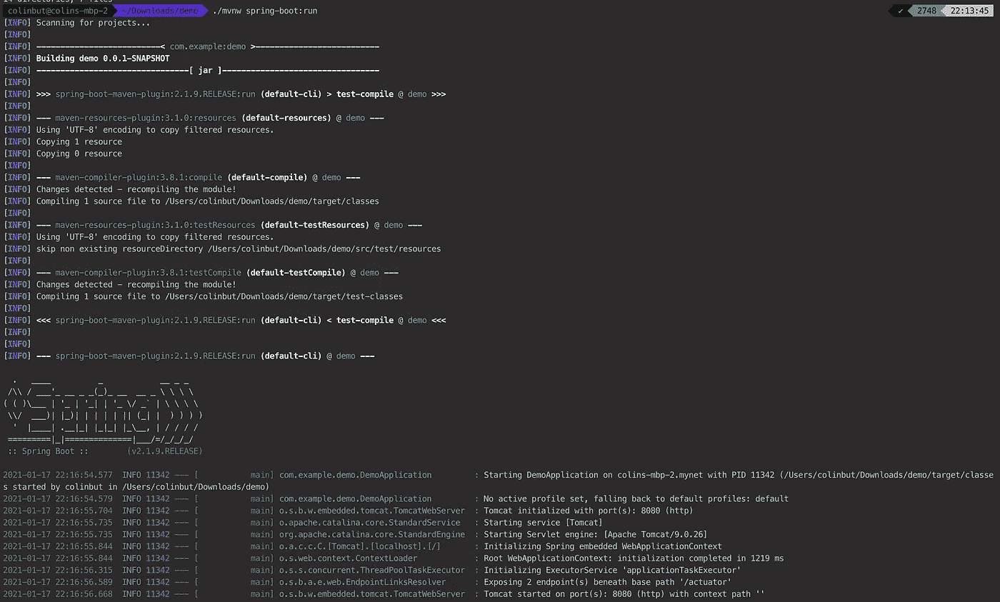

# 在不到 10 分钟的时间内设置一个生产就绪的 Java Web 应用程序！

> 原文：<https://blog.devgenius.io/setting-up-a-production-ready-java-web-app-in-less-than-10-minutes-28c5f79c1a39?source=collection_archive---------6----------------------->

曾经有一段时间，做 Java Web 应用程序开发是缓慢而痛苦的。将应用程序投入生产所花的时间就像一只乌龟跑完一整圈田径跑道所花的时间一样。

要构建一个 Java Web 应用程序，你必须主要使用现在传统的 Java 企业技术平台套件(J2EE/JavaEE)。如果我们只是使用标准 Java 版本(J2SE)，我们将像平常一样构建我们的 Java 应用程序。

然后，我们将应用程序捆绑在一个`war`文件或一个`ear`或`sar`文件中，我们可以将它们部署到 Apache Tomcat 之类的 Servlet Web 容器或 red hat JBoss/wildly、IBM WebSphere 或 Oracle WebLogic 之类的成熟企业应用服务器上。

设置和配置应用基础设施资源(Web 容器/应用服务器)将非常耗时。同样，设置您的应用程序使用 J2EE 技术，如 JSP、JTA、JPA 等。本身也会是一种痛苦。在你的代码中会有太多的配置要写。你要写很多人们称之为“样板”的代码来设置一些东西。

当然，所有这些最初都需要很长时间才能完成。

此外，让应用程序“生产就绪”是一个迟钝的行为。您必须确保您的应用程序具有适当的日志记录设置和所需的指标，以使您的应用程序能够被监控，以便当出现问题或发现应用程序中的异常行为时，您可以轻松地进行故障排除和诊断。

那个时代早已过去。

现在，设置一个完整的 Java Web 应用程序非常容易，最多不超过…我想说…5-10 分钟。

我一点也没有开玩笑。

解决方案是利用 Spring Boot 应用程序框架引导您的 Java Web 应用程序。

Spring 提供了 **Spring Initializr** 项目:

[](https://start.spring.io/) [## 弹簧初始化 r

### Initializr 生成的 spring boot 项目正好是你快速启动所需要的！

start.spring.io](https://start.spring.io/) 

这使您能够轻松地创建一个新的 Spring Boot 项目。



**获得“生产就绪”的 Java Web 应用程序的关键是添加“Spring Boot 执行器”依赖项。**

这种 Spring Boot 致动器依赖关系提供了内置于您的 Spring Boot Java Web 应用程序中的现成可用的“Ops”功能，如健康检查和指标，以便当您将应用程序部署到生产环境时，您可以轻松地对其进行监控。

在 **Spring Initializr** 中为您的 Spring Boot 应用程序选择完您想要的特性之后…

点击“生成”按钮下载项目。

## 项目目录结构

这是您解压缩下载的 zip 文件时的项目目录结构。

```
colinbut@colins-mbp-2 $ /demo tree                                                                                                                                          
.
├── HELP.md
├── mvnw
├── mvnw.cmd
├── pom.xml
└── src
    ├── main
    │   ├── java
    │   │   └── com
    │   │       └── example
    │   │           └── demo
    │   │               └── DemoApplication.java
    │   └── resources
    │       ├── application.properties
    │       ├── static
    │       └── templates
    └── test
        └── java
            └── com
                └── example
                    └── demo
                        └── DemoApplicationTests.java 
```

从上面可以看到；你已经有一个“现成的”项目让你去做。

此外，它可以很容易地在本地启动(您可以在下面看到)，您可以按原样将其投入生产。虽然它没有太多的东西，因为它只是一个样本框架项目。

通过在 CLI/终端上执行以下命令，可以按原样运行生成的项目:

`./mvnw spring-boot:run`

以下是上述命令的输出:



默认情况下，它带有 Maven Wrapper，您可以运行 Maven，而无需首先安装 Maven。

就是这样！