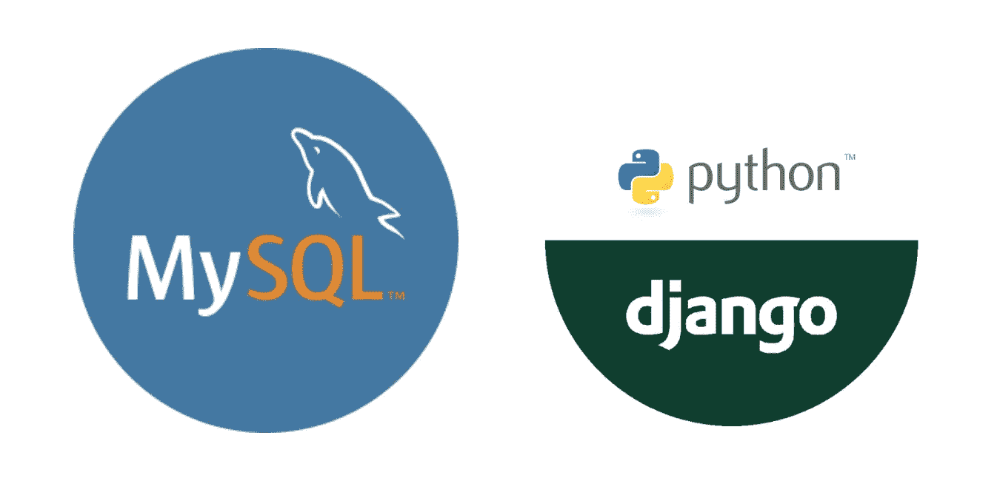

# 使用 MySQL DB 设置 Python Django 项目

> 原文：<https://blog.devgenius.io/setting-up-a-python-django-project-with-mysql-db-f6605e7273d3?source=collection_archive---------4----------------------->



如何建立一个以 MySQL 为数据库的 Python Django 项目？
请按照以下步骤了解更多信息。

# 入门指南

您需要安装最新版本的 python。皮普也是。

[安装 python](https://docs.python-guide.org/starting/install3/linux/)T5[安装 pip](https://linuxize.com/post/how-to-install-pip-on-ubuntu-20.04/)

为您的项目创建一个目录，并放入 cd 中

```
mkdir amal
cd amal
```

# 创建一个虚拟环境。

为了创建一个虚拟环境，您需要有 python 包 virtualenv。您可以使用下面的命令安装它。

```
pip install virtualenv
```

要创建 virtualenv，您可以运行下面的命令

```
virtualenv env
```

要激活 virtualenv，请运行以下命令。

```
source env/bin/activate
```

在这之后，env 的名称将显示在终端中

# 安装 Django。

```
pip install django
```

要验证 django 安装是否成功，请运行下面的命令。如果安装成功，它会显示命令列表。

```
django-admin
```

若要启动项目，请运行下面的命令。

```
django-admin startproject devsearchlive
```

如果需要，可以将 env 文件夹复制到项目文件夹中。您应该在启动 django 服务器之前启动虚拟环境。

要在项目中创建应用程序，请运行以下命令。

```
python3 manage.py startapp projects
```

创建应用程序后，在`INSTALLED_APPS`部分下面的`settings.py`文件中列出下面一行。

```
projects.apps.ProjectsConfig
```

若要运行该项目，请运行以下命令

```
python3 manage.py runserver
```

附加命令

```
python3 manage.py createsuperuser
python3 manage.py migrate
python3 manage.py makemigrations
```

# 安装和配置 MySQL

安装 MySQL

```
sudo apt update
sudo apt install mysql-server
```

检查状态

```
sudo systemctl start mysql.service
sudo systemctl status mysql
```

创建新用户并添加权限

```
sudo mysql_secure_installation
sudo mysql
CREATE USER 'username'@'localhost' IDENTIFIED BY 'password';
GRANT ALL PRIVILEGES ON *.* TO 'username'@'localhost' WITH GRANT OPTION;
FLUSH PRIVILEGES;
```

使用新创建的用户登录 MySQL

```
mysql -u username -p
CREATE DATABASE DB_NAME
USE DB_NAME
SHOW TABLES
```

如果将来出现任何问题，请运行下面的命令

```
ALTER USER 'username'@'localhost' IDENTIFIED WITH mysql_native_password BY 'password';
```

# 用 Django 配置 MySQL

安装 MySQL 客户端。

```
pip install mysqlclient
```

如果失败，运行以下命令。
根据你的版本改变 python 版本。(python3 —版本)

```
sudo apt-get install python3.8-dev
sudo apt-get install mysql-client
sudo apt-get install libmysqlclient-dev
sudo apt-get install libssl-dev
```

尝试使用以下命令重新安装 mysqlclient。

```
pip install mysqlclient
```

成功安装 mysqlclient 后，在 settings.py 中，更改如下所示的行。

```
DATABASES = {
'default': {
'ENGINE': 'django.db.backends.mysql',
'NAME': 'database_name',
'USER': 'username',
'PASSWORD': 'password',
'HOST': 'localhost',
'PORT': '3306',
}
}
```

# 激活 phpmyadmin

首先，[在你的机器上安装 XAMPP](https://vitux.com/ubuntu-xampp/)

然后按照下面的步骤，修改下面提到的 config.inc.php 文件中的行

```
sudo nano /opt/lampp/phpmyadmin/config.inc.php
$cfg['Servers'][$i]['auth_type'] = 'cookie';
$cfg['Servers'][$i]['user'] = 'root';
$cfg['Servers'][$i]['password'] = 'password';
$cfg['Servers'][$i]['host'] = '127.0.0.1';
$cfg['Servers'][$i]['controluser'] = 'root';
$cfg['Servers'][$i]['controlpass'] = 'password';
```

重新启动 xampp

# 停止 Nginx 并启动 xampp

如果您的系统上运行着 Nginx 服务器，那么使用下面的命令停止它并启动 lamp 服务器。

```
sudo service nginx stop
sudo /opt/lampp/lampp start
```

Gitlab 项目回购:[https://gitlab.com/amalragc/django-template](https://gitlab.com/amalragc/django-template)