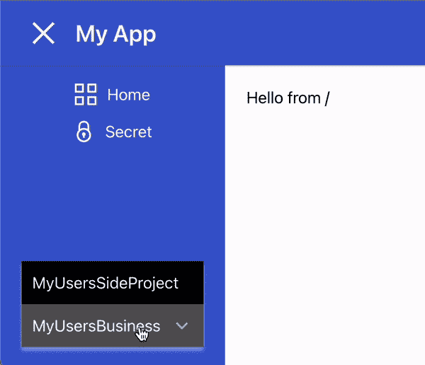

# 使用 Grommet、PropelAuth 和 Next.js 建立响应式 B2B 项目

> 原文：<https://blog.devgenius.io/setting-up-a-responsive-b2b-project-with-grommet-propelauth-and-next-js-2e67d0b0b79b?source=collection_archive---------8----------------------->


[Grommet](https://v2.grommet.io/) 是一个基于 React 的框架，为您提供快速构建响应迅速且可访问的应用程序的工具。它有一些最直观的组件来设置你的产品结构(例如，页眉、页脚、响应侧栏等)。

在本文中，我们将使用 Grommet、PropelAuth 和 Next.js 建立一个新的响应前端。


然后，我们将使侧边栏具有响应性，因此它在较小的设备上显示不同:


最后，我们将添加 B2B 支持，以便我们的用户可以创建/加入组织，并在侧栏中显示信息:



# 使用 Grommet 和 Next.js 创建 AppBar

让我们从创建一个新的 Next.js 应用程序开始。

```
$ npx create-next-app
```

将[索环顶层容器](https://v2.grommet.io/grommet)添加到您的`_app.js`中

然后，我们可以创建一个新文件`components/AppBar.jsx`，其中包含我们的头。这个例子取自 React 的[索环入门指南](https://github.com/grommet/grommet-starter-new-app)，稍作修改。

如果我们转到我们的`index.js`文件并更新它以使用 AppBar:

我们得到:


# 用 Gromment 和 Next.js 创建侧边栏

接下来，让我们使用 Grommet 的[侧栏](https://v2.grommet.io/sidebar)组件创建侧栏:

你可以看到我们创建了两个页面 **/** 和 **/secret** ，我们将它们渲染为 [**链接**](https://nextjs.org/docs/api-reference/next/link) 以获得不同页面之间的平滑过渡。

然后我们只需要在`pages/index.js`接上它


如果你点击 **Secret** ，你会得到一个 404，因为我们还没有创建 **pages/secret.js** 。在我们这样做之前，由于许多逻辑将被重复，让我们花一点时间来创建一个新的有用的组件**components/page wrapper . js**

然后我们的 **pages/secret.js** 看起来就像:

# 应用程序主题化

紫色不适合你？我们可以通过向 **src/_app.js** 中的**索环**组件传递一个**主题**来为整个应用程序设置主题


# 向我们的 AppBar 添加用户验证

我们现在的登录按钮只是为了展示，我们的秘密页面…不是很秘密。PropelAuth 是一个提供托管用户认证的服务。它提供完全托管的用户界面，包括注册、登录和帐户管理。对于 B2B/多租户应用程序，它还提供组织管理/RBAC。

你可以按照[入门指南](https://docs.propelauth.com/getting-started/)来配置你的页面，我们的是这样的:


自从我们打开谷歌登录和神奇链接/无密码登录。

回到我们的 Next.js 文件，让我们把它们连接起来。我们从安装`@propelauth/react`库开始:

```
$ yarn add @propelauth/react
```

并将一个 [AuthProvider](https://docs.propelauth.com/reference/frontend-apis/nextjs/#set-up-authprovider) 添加到我们的`_app.js`中

您可以从您的仪表板获取您的 authUrl。如果你像上面那样使用 env 变量，确保在设置好`.env`文件后重启服务器。

AuthProvider 负责从 PropelAuth 获取当前用户的用户和组织信息。提供者确保获取只发生一次，不管有多少组件/页面需要该信息。

接下来我们将更新我们的**组件/AppBar.jsx** 。我们希望**登录**按钮重定向到一个登录页面，并在他们登录后显示一些关于用户的信息。

我们新的 AuthButtons 有三种状态:

1.  加载当前用户的信息。这仅在初始页面加载时发生一次。
2.  如果他们登录，我们会显示他们的个人资料图片。点击它将会重定向到一个由 PropelAuth 为我们托管的账户页面。
3.  如果他们没有登录，他们可以单击登录按钮重定向到我们的托管登录页面。

如果您登录，您将看到:


或者……不管你用的是不是狗的头像。

# 保护我们的“秘密”页面

我们刚刚从 AppBar 中学到的原则同样适用于我们的页面。我们可以使用 **useAuthInfo** 来确定用户是否登录。

还有一个函数**带有 RequiredAuthInfo** ，您可以使用它来处理大量的加载样板代码:

组件 **SecretBodyInner** 只需要处理用户登录的情况。

# 使我们的侧边栏可折叠

为了让我们的用户打开/关闭侧边栏，我们首先需要一些他们可以点击的东西。在`[hamburger-react](https://hamburger-react.netlify.app/)`的帮助下，让我们在 AppBar 中添加一个汉堡图标

如果你需要能够从任意组件控制侧边栏，你会想要使用一个 [React context](https://reactjs.org/docs/context.html) 来管理它，但是因为我们只需要在 AppBar 和侧边栏中访问它，我们可以从我们的 **PageWrapper** 来管理它:


太好了！现在我们只需要让侧边栏在汉堡包被点击时出现并消失。我将现有的组件 **MySidebar** 重命名为 **MySidebarInner:**

当我们打开/关闭侧边栏时，可折叠允许平滑过渡，就像这样:


# 让我们的侧边栏反应灵敏

在手机上，我们的侧边栏会占据很大的空间。我们可以让侧边栏占据整个屏幕，而不是从屏幕的一侧跳进去。当我们完成时，它将看起来像这样:


Grommet 为我们提供了 **ResponsiveContext** ，它允许我们根据屏幕大小来改变我们渲染的内容。我们将在 [**层**](https://v2.grommet.io/layer) 覆盖组件旁边使用它来显示所有内容上面的侧边栏。

注意，我们还需要添加一个新按钮，这样我们的用户就可以关闭全屏侧边栏。

# 将组织添加到我们的边栏

[组织](https://docs.propelauth.com/overview/organizations/)是将一起使用你的产品的用户组。这可能是一个两个人的创业公司，一个大型企业，或者某个人的副业，他们希望有一天成为一家公司。

PropelAuth 使我们的用户能够管理他们自己的组织(邀请同事、设置角色等。)所以我们所要做的就是在我们的侧边栏中显示它们:

**getSelectedOrg** 和 **selectOrg** 由 [orgHelper](https://docs.propelauth.com/reference/frontend-apis/nextjs/#the-orghelper) 提供，以便更容易在我们的产品中引用单个组织。


仅此而已！我们现在有了一个非常强大的项目框架，可以开始构建 B2B 或多租户应用程序的其余部分了。