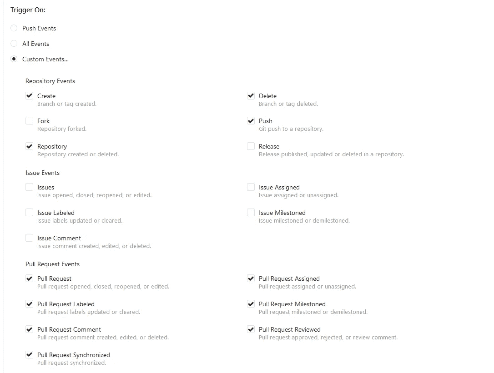

# 与 Django、Gitea、Jenkins，当然还有 Docker 一起建立一个简单的 CI/CD！

> 原文：<https://blog.devgenius.io/setting-up-a-simple-ci-cd-with-django-gitea-jenkins-and-of-course-docker-ab883972efb5?source=collection_archive---------1----------------------->


这是我努力定义一个最小项目和创建一个框架的第 2 部分，这个框架使我能够使用和学习一些 DevOps 工具。下面是第一部分的链接:[https://medium . com/@ parsa . asgari 3264/setting-a-simple-ci-CD-with-django-and-git lab-80ac 3492638 c](https://medium.com/@parsa.asgari3264/setting-up-a-simple-ci-cd-with-django-and-gitlab-80ac3492638c)

# 项目概述:

这个小项目的范围是这样的:拥有一个 dockerized 的小 Django API，并让 Jenkins 通过将它提交给基于 Gitea 的 g it 服务器来构建它。仅此而已。

然而，为了帮助本教程独立存在，我将包括基础知识(像 Docker 的安装材料和任何被认为是这个范围的基础)

请注意，我使用的环境是 Ubuntu 20.04。

# 安装 Docker:

据[https://docs.docker.com/engine/install/ubuntu/](https://docs.docker.com/engine/install/ubuntu/):

```
#### prerequisites
$ sudo apt-get update
$ sudo apt-get install ca-certificates curl gnupg lsb-release#### setup docker apt repository
curl -fsSL [https://download.docker.com/linux/ubuntu/gpg](https://download.docker.com/linux/ubuntu/gpg) | sudo gpg --dearmor -o /usr/share/keyrings/docker-archive-keyring.gpgecho \
  "deb [arch=$(dpkg --print-architecture) signed-by=/usr/share/keyrings/docker-archive-keyring.gpg] [https://download.docker.com/linux/ubuntu](https://download.docker.com/linux/ubuntu) \
  $(lsb_release -cs) stable" | sudo tee /etc/apt/sources.list.d/docker.list > /dev/null#### install docker packages
sudo apt-get update
sudo apt-get install docker-ce docker-ce-cli containerd.io#### test your installation
sudo docker run hello-world
```

# 安装 Gitea:

由于我们使用的是 Ubuntu 20.04，安装 Gitea 的一个直接方法是使用 Ubuntu 的内置软件交付服务 Snap。它安装应用程序，更新应用程序，为应用程序创建服务，并实现简单的管理。你可以使用 Snap 来安装 Gitea。注意，我们必须单独安装一个数据库(MySQL 或 PostgreSQL)。

```
snap install gitea
```

请注意，您可以使用类似下面的命令来管理服务:

```
sudo snap restart gitea.web
```

通过 Snap 安装 Gitea 时，Gitea 的配置文件存储在/var/Snap/Gitea/common/conf/app . ini。

最后但同样重要的是，请注意您可以通过[http://localhost _ or _ your _ local _ IP:3000](http://localhost_or_your_local_ip:3000)访问 Gitea。
(例如“http://192.168.1.140:3000”)

最后一步。为了使 Gitea 能够向 Jenkins 发送有关可能的代码更改的事件，我们必须将我们的 Jenkins IP 列入白名单。为此，我们必须打开下面的文件:

```
sudo nano /var/snap/gitea/common/conf/app.ini
```

并将这些行添加到文件的末尾:

```
[webhook]
 ALLOWED_HOST_LIST = THE_IP_OF_YOUR_JENKINS_INSTANCE
 DISABLE_WEBHOOKS = false 
```

确保重启 Gitea:

```
sudo snap restart gitea.web
```

# 安装 Postgresql 12:

你可以使用 Ubuntu 20.04 的默认库来安装 PostgreSQL 12。对于任何其他版本，您可以访问 PostgreSQL 的网站[并使用提供的文档进行安装。](https://www.postgresql.org/)

现在我们还是坚持 Ubuntu 20.04 的 PostgreSQL 12。

```
sudo apt install postgres-12
```

现在，根据 Gitea 的[数据库准备页面](https://docs.gitea.io/en-us/database-prep/)，登录您的 PostgreSQL 安装并创建一个用户:

```
sudo su -c "psql" - postgres
```

输入上面的命令后，您应该会看到以下提示:

```
psql (10.19 (Ubuntu 10.19-0ubuntu0.18.04.1))Type "help" for help.postgres=#
```

然后，输入这两个命令。

第一个创建一个名为“gitea”的数据库用户，密码为“gitea”。

```
CREATE ROLE gitea WITH LOGIN PASSWORD 'gitea';
```

第二个命令创建一个名为“giteadb”的数据库，以及一些关于编码、整理等的细节。

```
CREATE DATABASE giteadb WITH OWNER gitea TEMPLATE template0 ENCODING UTF8 LC_COLLATE 'en_US.UTF-8' LC_CTYPE 'en_US.UTF-8';
```

您可以通过按 control-D 键或键入“\q”来退出提示。

现在，让我们导航到 PostgreSQL 12 的配置文件夹，帮助 Gitea 正确访问数据库。

```
cd **/etc/postgresql/12/main**
```

让我们打开 postgres.conf:

```
sudo nano postgresql.conf
```

并确保参数被指定为下面定义的值:

```
listen_addresses = 'localhost, 203.0.113.3'
password_encryption = scram-sha-256
```

最后一点，访问和认证。让我们通过以下方式解决这个问题:

```
sudo nano postgresql.conf
```

那么让我们加上这一行:

```
local    giteadb    gitea    scram-sha-256
```

很好。Gitea 现在都准备好了。

# 从 Github 获取 Django 代码:

我已经准备了一个 Django API 示例，它是基于 Dennis Ivy 出色而简洁的教程:

```
cd /home/$USER
git clone [https://github.com/VertigoX64/django_jenkins_gitea_cicd](https://github.com/VertigoX64/django_jenkins_gitea_cicd)
```

# 将 Django 代码输入 Gitea:

1-登录到您为 Gitea 的基本 URL 输入的地址。(例如:“http://192.168.1.140:3000”)

2-创建新的存储库。

3-进入刚刚为 Django 代码克隆了 git 存储库的文件夹，运行以下命令:

```
git remote set-url origin [http://192.168.100.140:3000/YOUR_USERNAME/YOUR_REPOSITORY_NAME.git](http://192.168.100.140/YOUR_USERNAME/YOUR_REPOSITORY_NAME.git)git push origin
```

为了确保代码已经被成功地推送到 Gitea，请查看存储库页面。你应该看看里面的文件。

# 安装 Jenkins:

据 https://www.jenkins.io/doc/book/installing/linux/的[:](https://www.jenkins.io/doc/book/installing/linux/)

```
curl -fsSL https://pkg.jenkins.io/debian-stable/jenkins.io.key | sudo tee \
  /usr/share/keyrings/jenkins-keyring.asc > /dev/null
echo deb [signed-by=/usr/share/keyrings/jenkins-keyring.asc] \
  https://pkg.jenkins.io/debian-stable binary/ | sudo tee \
  /etc/apt/sources.list.d/jenkins.list > /dev/null
sudo apt-get update
sudo apt-get install jenkins fontconfig openjdk-11-jre
```

请注意，Jenkins 需要 Java 运行时环境(JRE)才能运行。您可以使用 Oracle 的 JRE 或 OpenJDK 的。在这里，我已经根据上面的 bash 脚本安装了 OpenJDK 11。

现在你可以通过访问这个网址来访问 Jenkins:[http://](http://192.168.1.52:8080)[localhost _ or _ your _ local _ IP](http://localhost_or_your_local_ip:3000)[:8080](http://192.168.1.52:8080)

它会提示您找到它的秘密密码来解锁:

```
sudo cat /var/lib/jenkins/secrets/initialAdminPassword
```

然后，您可以选择**安装建议的插件。**根据您的互联网连接，安装插件可能需要一些时间。

# 在 Jenkins 中配置基于 Gitea 的管道:

将 Django 代码推送到本地 Gitea 之后，这一步的概述如下:

*   在 Jenkins 中安装 Gitea 的插件
*   在 Jenkins 中注册 Gitea，并确保 Gitea 的 webhook 功能正常工作，并且 Jenkins 正确管理这些功能。
*   在詹金斯内部建立一个组织渠道。
*   通过对我们的存储库进行更改来测试管道。

## 在 Jenkins 中安装 Gitea 的插件:

导航到**管理 Jenkins = >** **管理插件**。

选择了可用的选项卡**后，在过滤区输入 *Gitea 插件*。点击*立即下载，重启后安装。***

重启 Gitea 的服务:

```
sudo snap restart gitea.web
```

## 在詹金斯注册 Gitea:

导航至**管理詹金斯= >配置詹金斯**。

找到**吉泰服务器**部分，然后添加一个新的吉泰服务器:

*   命名服务器(任何名称都可以)
*   您的本地 Gitea 服务器的网址
*   检查管理挂钩的勾号。它会要求您提供 Gitea 凭据。您可以通过点击**添加**按钮并选择**詹金斯**来添加一个(这意味着它会自动将其定位到詹金斯— [更多关于詹金斯证书定位](https://www.jenkins.io/doc/book/using/using-credentials/))。
*   如果您输入的凭据正确，Jenkins 应该能够显示您的 Gitea 版本。
*   在网页的最后，点击**应用**和**保存**完成这里的修改。

## 在詹金斯内部创建组织管道。

导航至**管理詹金斯= >新项目**。然后:

*   命名项目。
*   选择**组织文件夹。**
*   点击网页末尾的**确定**。

选择管道会将我们带到管道配置页面。要设置一个简单的**组织文件夹管道**，您只需要将项目资源库的来源设置为 **Gitea 组织**。然后:

*   确保您的 Gitea 服务器选择正确。检查它的 IP 和端口以匹配它的 URL。
*   选择您在上一步中创建的凭据(在 Jenkins 注册 Gitea)。
*   将**所有者**设置为您的吉泰*用户名/吉泰组织名称*。(警告:如果没有正确输入所有者姓名，管道将无法工作)
*   继续**应用**和**保存。**

好吧。所以，如果你进入你创建的组织文件夹(当然是通过点击**仪表盘**中的名称！)并点击**扫描吉泰组织现在** 按钮，那么魔法就发生了。您可以导航至**扫描吉泰组织日志**查看其状态。如果是绿色的，你们都准备好了。

您可以进入管道，进入**状态**=>"**您的 _repository"** 。可以在管道页面中执行相同的扫描并查看日志操作。重点是确保 Jenkins 已经在您提供的 Gitea 存储库中找到了它的 Jenkinsfile。

此外，您可以进入管道，进入**状态** == > " **您的 _repository_branch"** 以检查 Jenkins 的上次构建状态。由于所提供的 Jenkins 文件包含两个阶段(构建和部署)，因此您应该看到两个阶段的成功状态。

以下是 Jenkinsfile 供参考:

## 通过对存储库进行更改来测试管道:

继续对存储库中的一个文件进行更改。如果一切都设置正确，Gitea 应该通知 Jenkins 这个新的提交，因此，Jenkins 将尝试进行新的构建和部署。

这个阶段唯一可能发生的情况是 Gitea(由于 webhook 不工作)不会通知 Jenkins 它的事件。如果这是问题所在:

*   转到您的 Gitea 实例并访问您的存储库
*   进入**设置** == > **网页挂钩**
*   点击注册的 webhook 或者小笔打开 webhook 编辑页面(如果有注册的 webhook。如果没有，请继续阅读。)
*   转到页面末尾，检查**最近交付的**状态。如果它们是红色的，那么通过点击递送并查看响应及其错误来检查原因。

**如果没有注册 webhooks，使用这些参数注册一个:**

*   目标 URL:[http://Jenkins-IP:Jenkins-Port/gitea-web hook/post](http://192.168.100.146:8085/gitea-webhook/post)
*   HTTP 方法:POST
*   帖子内容类型:应用程序/JSON
*   对于“开启触发器”,请参考此图像的设置参数:



*   分支过滤器:*
*   确保您已经正确配置了 ALLOWED_HOST_LIST(如上所述)。

# 结束了

我希望这个指南能帮助揭开 Devops 工具的神秘面纱。关于你遇到的问题，请随意发表意见。