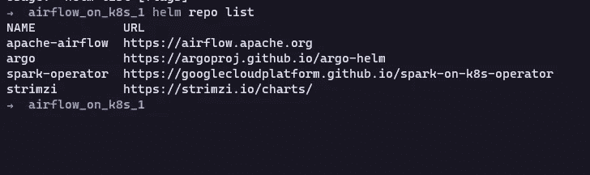

# 使用 GitSync 在 Kubernetes 上设置 Apache 气流

> 原文：<https://blog.devgenius.io/setting-up-apache-airflow-on-kubernetes-with-gitsync-beaac2e397f3?source=collection_archive---------0----------------------->


当我第一次开始学习数据工程时，我对运行数据管道所需的工具和技术感到不知所措。仅仅学习这些工具是不够的:对于每一个可用的工具，人们必须知道如何设置，这可能就像它看起来那样令人讨厌。

获取正确的环境变量，以不会崩溃的方式匹配每个组件版本，不断更新您的。jars 文件和依赖项…嗯，这是一个可以马上吓到新人的任务。

但是随着问题的出现，解决方案也随之出现。对我来说，解决方案是容器化的应用程序，更确切地说，是 ***Kubernetes。*** 当我第一次开始学习 Kubernetes 的时候，我真的被设置一个应用程序并开始运行它是如此的简单所打动。

只需**一行代码，**你就可以安装和运行大量的应用程序，而不用担心环境变量和依赖性。一旦你开始使用它，你会想你过去怎么能做不同的事情。

因此，今天，我想展示如何在 Kubernetes 集群中使用 GitSync 设置 airflow(数据管道的头号编排工具),这将使您能够将代码存储库(如 GitHub)中的 Dag 与 airflow 同步，这样您就不需要在每次更新或创建新 Dag 时构建一个 docker 映像。

## 安装舵和 Kubectl

首先，您需要一个 Kubernetes 集群。对于这个演示，我使用的是 [minikube](https://minikube.sigs.k8s.io/docs/start/) ，但是您可以使用任何其他 Kubernetes 集群，比如 [kind](https://kind.sigs.k8s.io/) 、 [micro k8s](https://microk8s.io/) ，或者像 GKE 这样的基于云的集群。

第二，你需要两样东西:

*   Kubectl CLI 与您的集群进行交互；
*   掌舵管理您的图表，并以一种简单的方式安装气流。

要在 Linux 上安装 kubectl，您可以在命令行中运行以下命令:

```
curl -LO "https://dl.k8s.io/release/**$(**curl -L -s https://dl.k8s.io/release/stable.txt**)**/bin/linux/amd64/kubectl"
```

在那之后:

```
sudo install -o root -g root -m 0755 kubectl /usr/local/bin/kubectl
```

如果你运行的是 Windows 或者 Mac，可以在这里参考文档页[。](https://kubernetes.io/docs/tasks/tools/)

要安装 helm，您可以简单键入:

```
brew install helm
```

如果你没有安装 brew，我绝对推荐你安装！你可以在这里了解如何在 Linux [上安装 brew。你也可以用不同的方式安装 helm，所以查看一下](https://docs.brew.sh/Homebrew-on-Linux)[文档](https://helm.sh/docs/intro/install/)页面。

## 使用舵安装气流

既然你安装了头盔，我们就安装气流！首先，您需要使用以下命令将 airflow helm 存储库添加到您的 helm repo 列表中:

```
helm repo add apache-airflow https://airflow.apache.org
```

为了检查你添加的是否正确，使用命令 ***helm repo list*** 来显示你拥有的所有库。



您可以检查您是否有如上所示的 apache-airflow 存储库。

在安装 airflow 之前，在您的 Kubernetes 集群中创建一个**名称空间**来分隔您的部署是一个很好的实践。

> 在 Kubernetes 中，*名称空间*提供了一种在单个集群中隔离资源组的机制。资源的名称在一个名称空间内需要是唯一的，但在不同的名称空间之间不需要。基于命名空间的作用域仅适用于命名空间对象*(如部署、服务等)*，不适用于集群范围的对象*(如存储类、节点、持久卷等)*。

您可以使用 kubectl CLI 创建一个名称空间:

```
kubectl create namespace airflow
```

在上面的代码中，我创建了一个名为 *airflow* 的名称空间，因此这个名称空间中的所有内容都与我的 airflow 部署相关。这样做有助于我们保持房子整洁。

现在我们已经创建了名称空间，是时候部署应用程序了。要在 Kubernetes 集群中部署气流，您只需键入:

```
helm install airflow apache-airflow/airflow --namespace airflow
```

就这样，您安装了 airflow 及其运行所需的所有依赖项和变量！简单吧？

只是解释一下语法，通常是这样的:helm install[name][chart][flags]。因此，在这种情况下，我们使用“apache-airflow”图表(我们刚刚安装的图表)和标签“airflow”安装了一个名为“airflow”的应用程序。我们还指定了名称空间“airflow ”,以将我们的部署组织到一个独立的组中。

要检查气流是否正在运行，可以使用***ku bectl get pods****命令:*

```
*kubectl get pods -n airflow*
```

*只需记住指定您希望在哪个名称空间中获得 pod(使用-n)。如果安装正确，您会看到如下内容:*

**

*在 Kubernetes 中使用 airflow 的神奇之处在于，每个 airflow 组件(如 Redis、scheduler、webserver 等)都有自己的 pod，并且已经配置好了。您不需要配置任何东西，它已经启动并运行了。*

*当您在 Kubernetes 上部署 airflow 时，您将 web 服务器作为一项服务部署在集群中。要检查您的服务，您可以使用***kubectl get services****命令:**

```
**kubectl get services -n airflow**
```

****

**如您所见，您有一个名为 airflow-webserver 的服务，它有一个 cluster-IP 并运行在端口 8080/TCP 上。要在浏览器中打开 airflow webserver，您可以使用***ku bectl port-forward***命令，并将 8080 端口绑定到本地主机中的一个端口:**

```
**kubectl port-forward svc/airflow-webserver 8080:8080 -n airflow**
```

**当您运行上面的命令时，您将转发连接**，该连接将锁定您的终端**，如下所示:**

****

**如果你不想继续打开终端只是为了端口转发你的服务，有一个叫做 [Kube forwarder](https://kube-forwarder.pixelpoint.io/) 的工具可以帮助你以一种简单的方式管理你的端口转发，所以别忘了看看！**

**现在，您正在转发您的 airflow-web 服务器，您可以在您的 ***localhost:8080/*** 中访问它，并使用管理员/管理员用户和密码登录:**

****

**就是这样！现在，您可以访问 Kubernetes 集群中运行的气流了！你开始掌握 Kubernetes 的力量了吗？**

**现在你已经启动并运行了 airflow，接下来是最不可思议的部分:自动将代码库中的 DAG 同步到 airflow DAG 的文件夹**中**。**

## **创建私有 git 存储库并建立连接**

**要同步您的 Dag，您需要创建一个代码存储库来存储您在本地工作的 Dag。你可以使用任何你想要的代码库，但是我将用 GitHub 展示它。**

**首先，创建一个私有存储库来存储您的 Dag。一旦完成，您将需要为您的存储库创建一个部署密钥，这样您就可以使用 SSH 来访问它。要创建 ssh 密钥，您需要使用 ssh-keygen，如下所示:**

```
**ssh-keygen -t rsa -b 4096 -C "*your_email@example.com*"**
```

**一旦按下 enter 键，系统将提示您输入保存密钥的文件。写入的目录。ssh 文件夹(通常在/home/[用户名]/中)。ssh)并为您的密钥选择一个名称(在本例中为 airflowsshkey):**

****

**现在你已经创建了你的 keygen，你需要进入你的 GitHub 库，点击设置并找到“部署密钥”:**

****

**要添加新的部署密钥，您将需要刚刚生成的 keygen 中的内容。它存储在 ***/home/【用户名】/中。ssh/[您的密钥名称]。pub*** 。复制 pub 密钥并将其粘贴到 GitHub 中，以创建您的部署密钥:**

****

**确保勾选了“写权限”。创建部署密钥后，您需要在集群中创建一个 kubectl 秘密。为此，请运行以下命令:**

```
**kubectl create secret generic airflow-git-ssh-secret \
  --from-file=gitSshKey=/path/to/.ssh/airflowsshkey \
  --from-file=known_hosts=/path/to/.ssh/known_hosts \
  --from-file=id_ed25519.pub=/path/to/.ssh/airflowsshkey.pub \
  -n airflow**
```

**运行 create secret 命令后，您可以通过键入以下命令来检查您的机密:**

****

## **编辑气流舵 YAML 文件以配置 GitSync 功能**

**现在，您已经使用 kubectl CLI 创建了一个带有 deploy 键和 Kubernetes 秘密的 git 存储库，是时候编辑用于配置气流部署的 YAML 文件了。**

**转到您选择的文件夹，运行以下命令:**

```
**helm show values apache-airflow/airflow > values.yaml**
```

**当您执行该命令时，您将创建一个名为 **values** 的 YAML 文件，其中包含气流部署的所有信息。如果你愿意，你可以在这里定制很多东西。欲了解更多信息，请查阅气流的[舵图表文件。](https://airflow.apache.org/docs/helm-chart/stable/index.html)**

**我们需要做的是向下滚动文件的底部(使用您选择的任何代码编辑器),直到这一行:**

****

**要设置 GitSync，您需要将'**使能**切换到**真**，并更改回购和分支类型，如下所示:**

****

**如上图所示，您需要取消对 **credentialsSecret** 和 **sshKeySecret** 的注释。对于 sshKeySecret，只需输入您刚刚用 kubectl CLI 创建的秘密名称。**

**要应用更改，只需运行以下命令:**

```
**helm upgrade --install airflow apache-airflow/airflow -n airflow -f values.yaml**
```

**该命令将使用 values.yaml 文件中的配置设置来部署气流。**

**就是这样！每当您在本地更改 DAG 并提交到 git 存储库时，airflow 会自动应用 airflow DAGs 文件夹中的更改。漂亮的 CICD 就在这里！**

**Kubernetes 是一个非常棒的大数据工具，我真的希望你今天能意识到这一点。我将在这里张贴更多的文章，在 Kubernetes 中运行 bath 和流数据管道，所以我希望你喜欢它，并继续关注下一篇文章！**