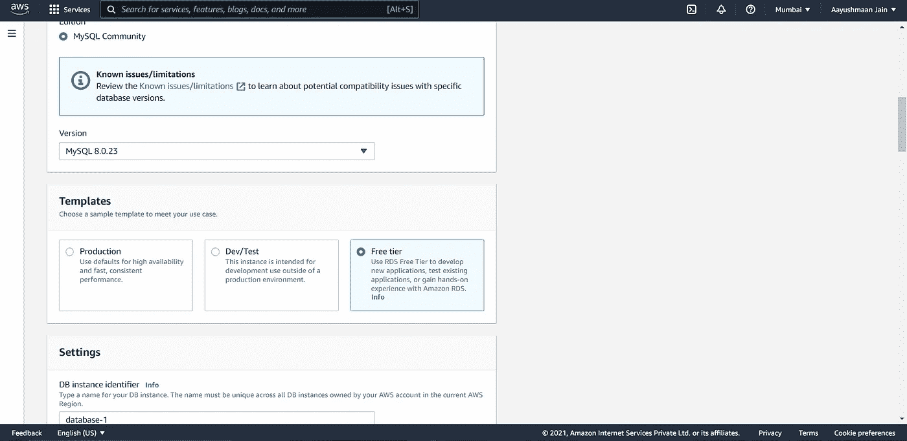

# 在 AWS 上为端到端项目设置组件

> 原文：<https://blog.devgenius.io/setting-up-components-for-an-end-to-end-project-on-aws-b362d5d9fa0c?source=collection_archive---------9----------------------->

在本地机器上进行端到端的机器学习项目可能是一项伟大的成就，但与他人共享并在云上托管它也同样重要，这里我将向您展示如何设置云上端到端机器学习项目最需要的组件。


为了这个项目的目的，我将使用 AWS 的免费层服务，步骤几乎与其他云提供商类似，所以请随时跟随。

如果您没有 AWS 帐户，我们来设置一个。创建 AWS 帐户的步骤与任何其他云服务提供商类似，我们只需填写一些细节，验证我们的电子邮件，并在 AWS 上设置一张卡进行支付。

创建 AWS 帐户后，让我们设置控制台

首先，让我们选择一个更接近我们的目标受众的地区，因为作为开发人员，我们可以容忍滞后，但这对我们的用户来说不会是一个愉快的体验，大多数情况下，我们所在的地区和我们的用户所在的地区是相同的，但在某些情况下，我们可能要考虑这一点。

为了配置区域，我们需要单击右上角的下拉菜单，选择离我们的用户最近的区域。因为我在孟买，所以我会选择孟买


选择区域

在我们创建任何组件之前，让我们设置一些安全组，我们可以使用它们来管理对组件的访问，并避免对组件的不必要的访问。

我们可以通过为我们的资源创建一个安全组来做到这一点。安全组是一组 IP 地址，它们被允许访问我们在云中的资源的特定端口。这样做是为了规范对我们资源的访问，并避免我们资源上不必要的流量。我们正在使用一个安全组，因为它是可重用的，我们可以为许多其他项目使用相同的安全组

为了使本文简单，我只包括了运行文件的服务器和后端数据库的设置

要设置安全组，请在搜索栏中搜索 VPC 服务，打开 VPC 控制台，然后单击安全组按钮


VPC 控制台

然后在安全组控制台中，单击右上角的创建安全组按钮


创建安全组按钮

在创建安全组控制台中，填写必要的详细信息


创建安全组控制台

然后在入站规则选项卡中填写可能的入站规则。在这里，我们必须填充我们可能希望在我们的资源上允许的可能流量


在我们的安全组中添加所需的入站规则

然后点击右下角的创建安全组按钮

# 组件 1 —服务器

要设置服务器，请在搜索栏中搜索 EC2，然后单击 EC2 打开 EC2 控制台

在 EC2 控制台中，单击右上角的启动实例按钮


EC2 控制台

然后为您的服务器搜索所需的操作系统，并确保它有免费层以避免费用，您可能希望根据您的要求和预算进行扩展


为我们的服务器选择所需的操作系统

然后为您的服务器选择配置，并确保选择符合免费层条件的配置，以避免费用


选择服务器的配置

如果要将服务器链接到域，请确保选中“启用基于资源的 IPV4 DNS (A 记录)请求”


如果我们想将我们的服务器链接到一个域，请选中此选项

并确保所有这些选项都没有被选中，以避免费用


选择最小配置以避免费用

然后添加一些存储，但确保您添加的存储在可用层存储限制内


添加存储

你可能想添加一些标签，如果你有任何标签，但因为我没有标签，所以我会留为空白


添加标签

最后，也是设置任何资源的最重要的方面，我们将配置安全组

在这里，我们将单击“use existing security group ”,并选择我们刚刚创建的组


添加安全组

然后点击查看并启动

当系统提示您输入密钥时，如果您有一个现有的密钥，您可以使用它，也可以创建一个新的密钥并下载它。如果您在 windows PC 上有多个安全和权限驱动器，请确保将其保存在 C 驱动器上，或者您可能会更改 Linux 或 Mac 上 chmod 命令的安全权限


选择一把钥匙

然后等待实例启动。一旦实例启动，您可能希望在 VS 代码上运行它，或者使用适当的 SSH 命令将它 SSH 到 int 中

要在 VS 代码中运行它，请遵循以下步骤

下载远程 SSH 扩展

打开命令托盘，键入 Open SSH 配置文件，打开配置文件，并在配置文件中输入以下行


配置文件

然后点击图标，在新窗口中连接到主机


那就跑

```
sudo vim /etc/sysctl.conf
# Then enter 
fs.inotify.max_user_watches=524288# This avoids the max watch limit error on linux
# Then press esc and enter :wq to exit vim 
# Then run 
sudo sysctl -p 
# To save the changes 
```

现在，我们已经设置好了服务器，我们将编辑 VPC 安全组的入站规则，以允许从服务器访问 MySQL。

为此，首先，我们将通过在 EC2 控制台中单击服务器实例来复制服务器的 IPV4 地址


复制我们服务器的公共 IPV4 地址

为此，我们将再次转到 VPC 控制台，从那里我们将打开安全组控制台，我们将单击我们已创建的安全组，然后在入站规则部分，我们将单击编辑入站规则


编辑我们的安全组的入站规则

然后，我们将在安全组中添加一个新的入站规则，并保存更改


添加新规则

# 组件 2 —数据库

为了创建数据库，我们将在搜索栏中搜索 RDS，并打开 RDS 控制台，然后单击右上角的“创建数据库”按钮

然后，我们将单击“standard create ”,因为我们希望在数据库上配置空闲层，我们将选择我们希望使用的数据库引擎。在我的例子中，因为我安装了 MySQL workbench，所以我将使用 MySQL


选择数据库引擎

然后，我们将选择我们想要的版本，在我的情况下，我选择了最新的版本，但如果您有任何特定的版本要求，您可以更改版本。然后点击免费层，以避免任何费用



配置 MySQL 的版本

然后配置管理员用户名和密码，在 db-identifier 下，您可以随意命名您的数据库


配置 RDS 实例的用户名和密码

然后在 DB Instance 类下，选择适合您需求的最小配置，并在 Storage 下，确保 enable autoscaling 按钮未被选中，以避免任何费用


配置我们数据库的存储

在“connectivity”部分，检查 VPC 和子网组，并确保公共访问已启用。然后在“VPC 安全组”下，单击“选择现有的”并选择您已创建的安全组


配置安全组

在身份验证下，单击密码身份验证


密码认证

在“additional configuration”下，确保“enable automated backups”处于禁用状态，以避免额外费用。如果您有自定义参数组，可以在此处进行设置


禁用自动备份

在维护部分，确保禁用自动次要版本更新和删除保护，以避免任何可能的费用


禁用版本更新和删除保护

然后点击创建数据库按钮。

用 MySQL workbench 连接数据库

创建数据库后，单击该数据库，然后复制端点


复制端点

然后在 MySQL workbench 的主机名中输入该端点


键入密码并测试连接


如果连接成功，那么工作台应该是这样的

您可能希望删除不使用的资源，以避免额外费用

[网站](https://aayush1036.github.io/)

[GitHub 简介](https://github.com/aayush1036)