# 使用 Github 和 Godaddy VPS(虚拟专用服务器)设置 Git

> 原文：<https://blog.devgenius.io/setting-up-git-with-github-and-a-godaddy-vps-virtual-private-server-f74f7cf64429?source=collection_archive---------12----------------------->

让你在你的开发机器、Github 和 VPS 之间设置和运行 git 的快速指南。

Yancy Min 关于 Unsplash.com 的图片

所以我不必担心 Git 的核心，以及如何在我的日常工作中真正建立一个 Git 存储库，因为其他开发人员会处理这些任务。最近，我发现自己在搜索和寻找关于如何在我的本地机器上建立 Git 存储库以进行开发，在 Github 上托管它，以及在我的 Godaddy VPS 上获取和运行生产代码的答案。我到处寻找答案，还买了一本书。我终于明白了这一点，并决定将这篇文章整理成一篇简短的参考文献，供刚开始使用 Git 的人参考。

**安装 Git**

**Linux:** 如果您遵循本文的内容并使用 VPS 来托管您的应用程序/网站，您很可能需要在机器上安装 Git，并且 99%的时间，这台机器将是 Linux。像大多数 linux 发行版一样，安装非常简单。在终端窗口中使用下面的命令将安装 Git。

**Sudo apt-get 安装 git**

**Windows:** 对于 Windows 用户来说，安装步骤比基于 Linux 的用户多一些。

*   在你选择的网络浏览器中，前往 https://git-scm.com/download/win 的
*   几乎所有人都会选择“用于 Windows 安装的 64 位 Git”

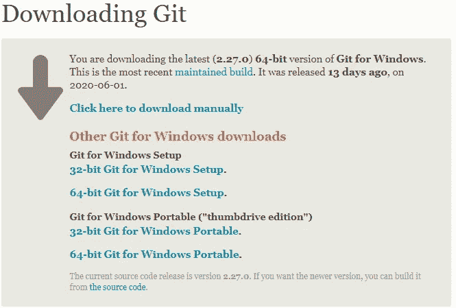

*   下载选定的文件后，运行安装过程。如果你想使用所有的默认设置，你需要点击“下一步”很多次。让安装完成。
*   安装完成后，您可以通过打开命令提示符并键入“git”+Enter 来确认安装。这将向您显示输出。

现在装置已经结束了，我们来看看好东西！

**初始化 Git:**

让我们创建一个文件夹，你可以随意命名。对于本文，我将把文件夹命名为“Git-Test”。

现在打开一个终端，浏览到那个文件夹。一旦你在一个终端的文件夹中，输入“git init”。windows 输出将类似于下面的代码片段。

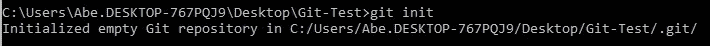

初始化 git 储存库

对于本文，我将使用 Jetbrain 的 Pycharm 在文件夹中创建一个 flask 项目来创建一些文件。不要担心这一步。您可以根据需要创建自己的文件。

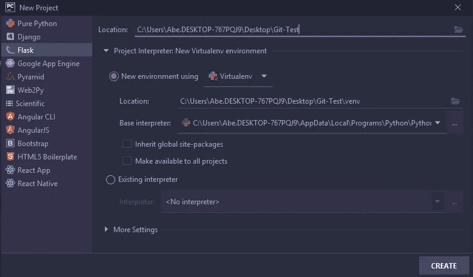

有两种方法可以向 git 添加文件。您可以在创建它们时使用“git add‘fileName’”或“git add”来单独添加它们。句点告诉 git 将目录中的所有文件添加到 git 中进行跟踪。

当您准备好将文件添加到您的 git 存储库时，键入“git add”。

现在我们需要提交文件。但是如果我们现在运行它，我们将得到一个错误。因此，首先我们需要让 git 知道我们的用户名和电子邮件地址，然后才能进行提交。下图显示了设置用户名和电子邮件地址的错误和命令。

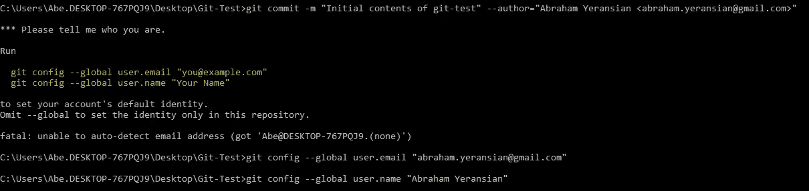

我们需要在提交时添加注释。为此，我们在命令中添加-m，并在命令后面加上双引号。

**注意:**在下图中，我正在将虚拟环境文件夹中的文件与所有其他文件一起提交。这通常是我们要添加的文件目录。gitignore 但是对于这个例子，我将只提交 venv 文件夹和所有其他的文件夹。

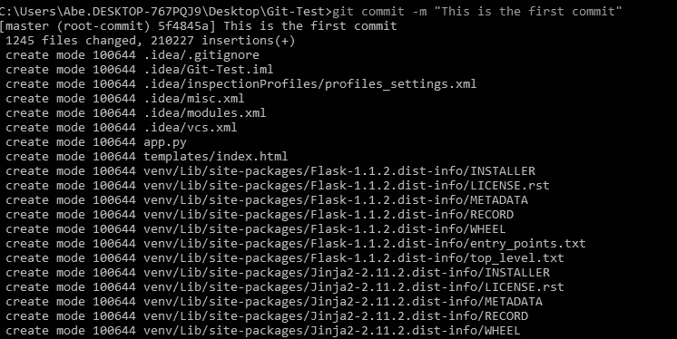

现在转到你的 github 账户，在你的存储库页面点击“新建”。我将把它命名为我在本地开发机器上创建的文件夹的名称，但是你可以随意命名它。

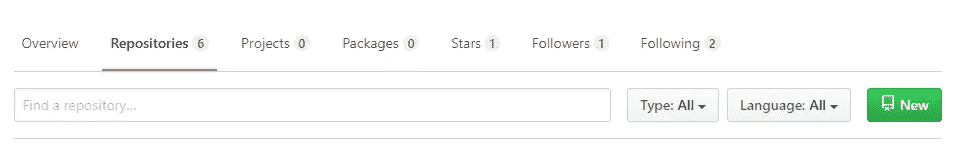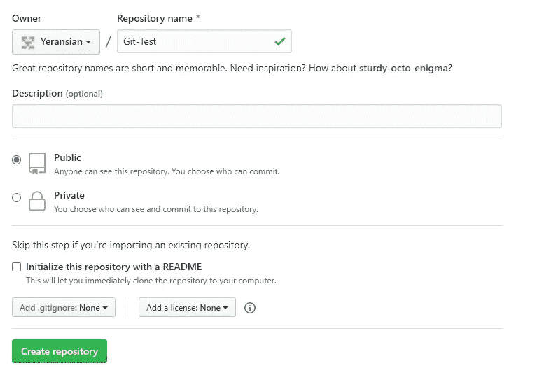

当你创建了你的 github 库之后，回到你的本地机器终端，在我们创建的保存内容的文件夹中。

现在我们将运行下面的命令，但是用你的替换我的 github 库的链接。您可以通过转到您创建的 github 存储库并复制 URL 来获得这个链接。

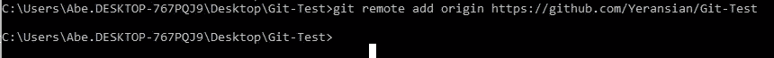

现在我们可以推送我们在 Github 上的远程存储库了。当我们运行“git push -u origin master”时，我们会得到一个弹出提示，要求向我们的 github 帐户提供凭证。输入它们并按回车键。您将输出类似于下面的输出，让您知道一切顺利。

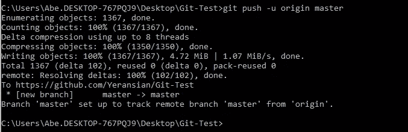

如果您没有 VPS，只想使用 github 来托管您在自己的机器上开发的代码，那么您就大功告成了。但是对于那些对 VPS 代码感兴趣的人，我们继续。

使用 SSH 登录到您的 VPS。我将在本教程中使用 Godaddy 托管的 VPS。我将使用 PuTTY 作为我的 SSH 客户端。

登录后，我们将创建项目文件夹，文件将放入其中。同样，我将称之为“Git-Test”。一旦我们创建了文件夹，我们就用“cd”移入它。

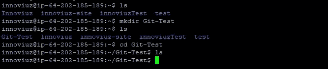

如果您还没有安装 git，那么您必须使用“sudo apt-get install git”在 VPS 上安装 git。

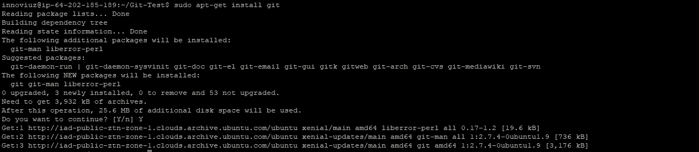

现在，我们将再次在我们的文件夹中创建一个本地 git，并将我们的 Github 存储库作为 git 的源添加到这个文件夹中。

" git 初始化"

git remote add origin“指向 github 存储库的 URL”

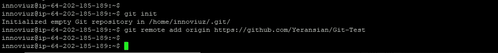

现在，我们将从刚刚设置的远程源中提取主分支。

" git 拉原始主机"

之后，我们运行“ls”命令来检查目录中的文件。我们走吧！我们现在有来自 Github 的文件。

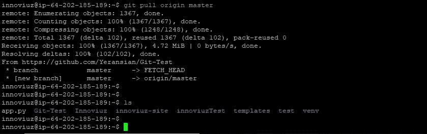

对我来说，我在我的机器上开发，提交更改，推送到 Github repo，当我准备将新版本推送到生产时，我从我的 VPS 内的主分支中拉出。我希望这对所有读者都有用。

如果你想阅读关于 git 的更深入的文章，请前往 [Gen_Yap](https://medium.com/u/4ed81169c83c?source=post_page-----f74f7cf64429--------------------------------) 。他也为 Dev Genius 写文章，并且在 Git 上有非常好的文章。

感谢您的阅读。