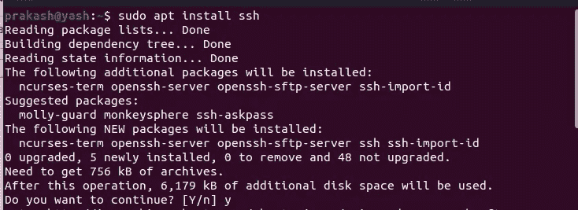
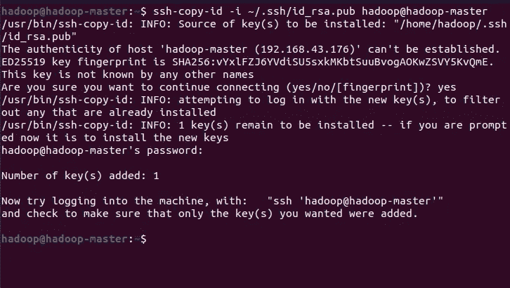

# 在 Ubuntu 上设置 Hadoop 多节点集群

> 原文：<https://blog.devgenius.io/setting-up-hadoop-multi-node-cluster-on-ubuntu-multiple-devices-637f539ce73a?source=collection_archive---------2----------------------->


**在本文中，我们将为两个设备设置 Hadoop 多节点集群，其中一个将是我们的主节点，另一个将是从节点**

# **先决条件:**

Ubuntu 作为双重引导安装在两台设备上。

# **对主节点和从节点执行以下步骤**

# **第一步:**

我们将使用以下命令安装 **SSH** :

```
sudo apt install ssh
```



# **第二步:**

现在使用以下命令创建一个新密钥:

```
ssh-keygen -t rsa -P “”
```

每次需要的时候按回车键就可以了。


# **第三步:**

现在我们将使用以下命令将公钥复制到***authorized _ keys***文件中:

```
cat ~/.ssh/id_rsa.pub >> ~/.ssh/authorized_keys
```

# **第四步:**

现在让我们通过使用以下命令连接到 ***本地主机*** 来验证 SSH 配置:

```
ssh localhost
```

需要时，只需键入“yes”并按回车键。


输出将如下所示。

# **第五步:**

现在，让我们安装 JAVA。我们将使用以下命令安装 Java 8:

```
sudo apt install openjdk-8-jdk
```


# **第六步:**

现在我们将下载 Hadoop。我们可以使用以下命令下载它:

```
sudo wget -P ~ [https://dlcdn.apache.org/hadoop/common/hadoop-3.3.4/hadoop-3.3.4.tar.gz](https://dlcdn.apache.org/hadoop/common/hadoop-3.3.4/hadoop-3.3.4.tar.gz)
```


(如果链接不起作用，可以访问 hadoop 的 [*官方网站，查看更新链接。复制最新 hadoop 版本的**二进制下载**链接)*](https://hadoop.apache.org/releases.html)


如果上面的命令因为代理或者什么原因不起作用，只需要使用浏览器从官方 [*网站*](https://hadoop.apache.org/releases.html) 手动下载最新 hadoop 版本的 [***hadoop 二进制版本***](https://hadoop.apache.org/releases.html) 。

# **第七步:**

现在转到下载该 hadoop 文件的文件夹，并应用以下命令:

```
tar xzf hadoop-3.3.4.tar.gz
```

# **第八步:**

现在，我们将把 **hadoop-3.3.4** 文件夹名改为 **hadoop** 以便于我们使用。当位于下载 hadoop 的同一文件夹中时，使用以下命令:

```
mv hadoop-3.3.4 hadoop
```


# **第九步:**

在 nano 编辑器中打开 **hadoop-env.sh** 文件(同目录)。

```
nano hadoop/etc/hadoop/hadoop-env.sh
```

将这一行粘贴到文件中以配置 JAVA_HOME:

```
export JAVA_HOME=/usr/lib/jvm/java-8-openjdk-amd64/
```


# **第十步:**

将 hadoop 文件夹目录更改为 **/usr/local/hadoop** (同样在同一个终端中):

```
sudo mv hadoop /usr/local/hadoop
```

# **第十一步:**

使用以下命令打开环境文件:

```
sudo nano /etc/environment
```

然后，在下一行中添加以下行:

```
JAVA_HOME=”/usr/lib/jvm/java-8-openjdk-amd64/jre”
```


# **第十二步:**

现在，我们将添加一个名为 hadoop 的用户，并设置其配置:

```
sudo adduser hadoop
```

设置密码，其余部分可以留空，只需按回车键。


现在运行这些命令，授予这个新用户某些权限:

```
sudo usermod -aG hadoop hadoop
sudo chown hadoop:root -R /usr/local/hadoop/
sudo chmod g+rwx -R /usr/local/hadoop/
sudo adduser hadoop sudo
```


# **一旦添加了用户，在运行以下命令后运行所有剩余的命令(对于两台机器):**

```
su hadoop
```

这将把您的用户更改为 hadoop 用户。


# **第十三步:**

现在打开**。bashrc** 文件在根目录下使用以下命令:


在文件末尾添加以下几行:

```
#Hadoop Related Options
export HADOOP_HOME="/usr/local/hadoop"
export HADOOP_INSTALL=$HADOOP_HOME
export HADOOP_MAPRED_HOME=$HADOOP_HOME
export HADOOP_COMMON_HOME=$HADOOP_HOME
export HADOOP_HDFS_HOME=$HADOOP_HOME
export YARN_HOME=$HADOOP_HOME
export HADOOP_COMMON_LIB_NATIVE_DIR=$HADOOP_HOME/lib/native
export PATH=$PATH:$HADOOP_HOME/sbin:$HADOOP_HOME/bin
export HADOOP_OPTS="-Djava.library.path=$HADOOP_HOME/lib/native"
```


为了将更改应用到环境中，请运行以下命令:

```
source ~/.bashrc
```


# **第十四步:**

现在，我们将把机器**的 ip 地址**添加到两个节点的主机文件中。使用以下命令获取每台机器的 ip 地址。

**确保两台机器在同一个网络上**

运行以下命令获取机器的 ip 地址:

```
ip a
```


正如你在上面看到的，我的 IP 地址是 **192.168.43.176**
记下你的两台机器(主机和从机)的 IP 地址。

# **第十五步:**

现在我们将把这些 IP 地址记在***hosts***文件中。在两台计算机上运行以下命令:**

```
**sudo nano /etc/hosts**
```

**现在，记下主节点和从节点的 IP 地址，如下所示:**

****

# ****第十六步:****

**现在在两台机器上打开主机名文件。将机器分别重命名为****Hadoop-master***和 ***hadoop-slave*** 如图所示。***

****

**对于主节点(hadoop-master)**

**同样地在 slave 节点中输入 ***hadoop-slave。***
保存文件。
**现在，重启设备以应用更改****

# ****第十六步:****

**现在，在**主节点**中，应用以下命令:**

```
**ssh-keygen -t rsa**
```

****

**现在，运行以下命令:**

```
**ssh-copy-id -i ~/.ssh/id_rsa.pub hadoop@hadoop-master
ssh-copy-id -i ~/.ssh/id_rsa.pub hadoop@hadoop-slave**
```

********

# **为了加快处理速度，对主节点和从节点执行以下步骤**

**其他教程中提到的过程只在主节点中进行更改，并将所有文件复制到从节点中，这将花费大量时间。**

# **第十七步:**

**现在，使用以下命令打开 core-site.xml 文件:**

```
**sudo nano /usr/local/hadoop/etc/hadoop/core-site.xml**
```

**如图所示，添加以下配置:**

```
**<configuration>
<property>
<name>fs.defaultFS</name>
<value>hdfs://hadoop-master:9000</value>
</property>
</configuration>**
```

****

# ****第十八步:****

**现在，使用以下命令打开 hdfs-site.xml 文件:**

```
**sudo nano /usr/local/hadoop/etc/hadoop/hdfs-site.xml**
```

**如图所示，添加以下配置:**

```
**<configuration>
<property>
<name>dfs.name.dir</name><value>/usr/local/hadoop/data/nameNode</value>
</property>
<property>
<name>dfs.data.dir</name><value>/usr/local/hadoop/data/dataNode</value>
</property>
<property>
<name>dfs.replication</name>
<value>2</value>
</property>
</configuration>**
```

****

# **第十九步:**

**现在，使用以下命令打开 mapred-site.xml 文件:**

```
**sudo nano /usr/local/hadoop/etc/hadoop/mapred-site.xml**
```

**如图所示，添加以下配置:**

```
**<configuration>
<property>
<name>mapred.job.tracker</name>
<value>hadoop-master:9001</value>
</property>
</configuration>**
```

****

# **第二十步:**

**现在，在 **hadoop-master** 上，让我们打开工人文件:**

```
**sudo nano /usr/local/hadoop/etc/hadoop/workers**
```

**添加如下所示的行:(从属名称)**

```
**hadoop-slave**
```

****

# **第二十一步:**

****现在，如果您没有按照从节点的步骤操作，并且想要将文件复制到从节点，请跳过这一步。****

**使用以下命令复制文件:**

```
**scp -r /usr/local/hadoop/* hadoop-slave:/usr/local/hadoop**
```

# ****第二十二步:****

**现在，在 **hadoop-slave** 上，使用以下命令打开 yarn-site.xml 文件:**

```
**sudo nano /usr/local/hadoop/etc/hadoop/yarn-site.xml**
```

**添加以下配置:**

```
**<configuration>
<property>
<name>yarn.resourcemanager.hostname</name>
<value>hadoop-master</value>
</property>
</configuration>**
```

****

# ****第二十三步:****

**现在我们需要格式化 HDFS 文件系统。在**主节点**上运行该命令:**

```
**hdfs namenode -format**
```

**输出将如下所示:**

****

# **第二十四步:**

**现在，在 **hadoop-master** 上，我们将使用以下命令启动 HDFS 网络:**

```
**start-dfs.sh**
```

****

**通过在两台机器上应用以下命令来验证输出:**

```
**jps**
```

**对于 hadoop-master，输出如下:
**:****

****

****hadoop-master****

****对于 hadoop-slave:****

****

****hadoop-slave****

# **第二十五步:**

**现在，通过进入 **hadoop-master** 中的***localhost:9870***来验证一切是否正常**

**摘要中必须显示 1 个活动节点:**

****

**本地主机:9870**

****

# **第二十六步:**

**现在，在 **hadoop-master** 上，让我们开始 yarn。使用此命令:**

```
**start-yarn.sh**
```

**使用以下方法验证输出**

```
**jps**
```

****对于 hadoop-master:****

****

****hadoop-master****

****对于 hadoop-slave:****

****

****hadoop-slave****

# **第二十七步:**

**现在去 **hadoop-master** 中的***localhost:8088***验证一切是否顺利**

**你会发现网络的细节。**必须有一个活动节点。****

****

****本地主机:8088****

# **第二十八步:**

**现在，为了停止网络，只需在主节点上使用以下命令:**

```
**stop-all.sh**
```

# ****第二十九步:****

**下一次，无论何时你想再次启动这个网络，只要更新 **/etc/hosts** 文件中的 **ip 地址**(在两台机器中)就可以了！！**

****要启动网络，只需在主节点上应用以下命令:****

```
**start-all.sh**
```

# **希望这篇文章能帮助你设置 Hadoop 多节点集群**

**如果你有任何错误，再试一次，你会成功的！！**

****谢谢！！****