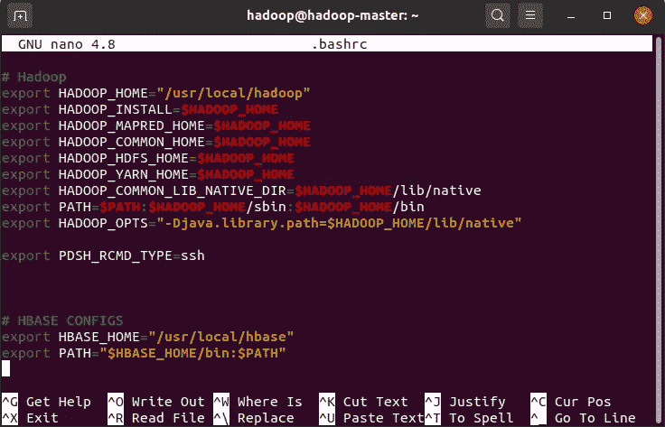
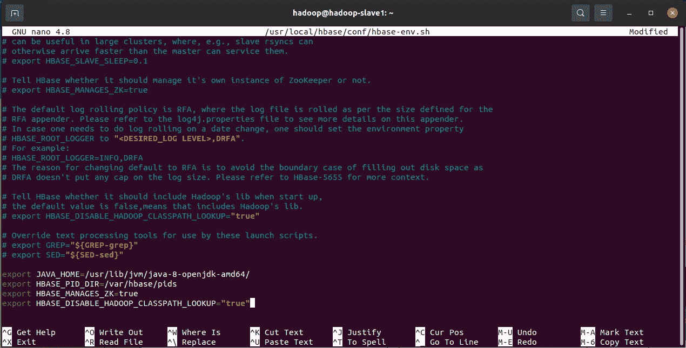
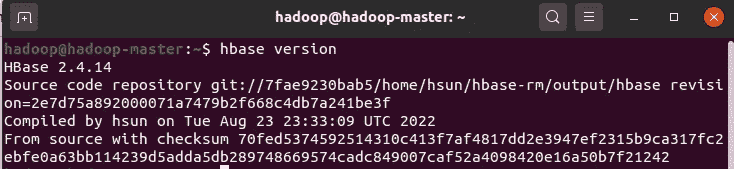
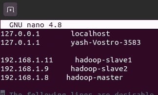
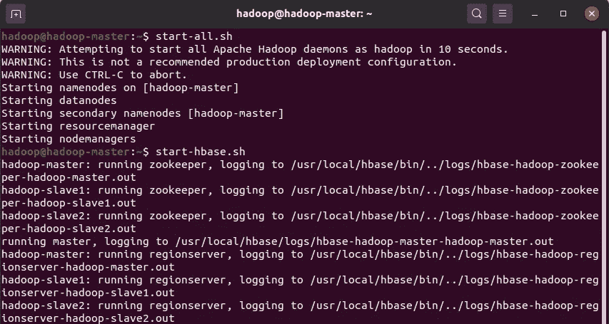
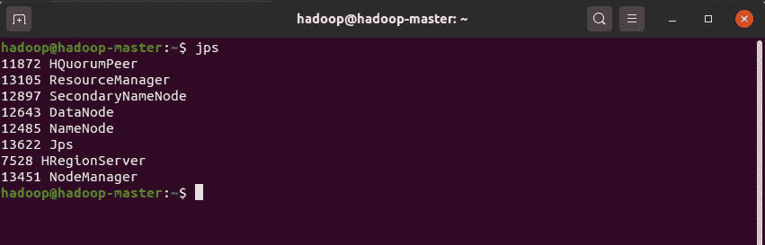
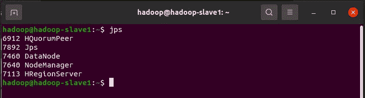

# 在 Ubuntu 的 Hadoop 多节点集群中设置 HBase

> 原文：<https://blog.devgenius.io/setting-up-hbase-in-hadoop-multi-node-cluster-setup-96b6f05d558?source=collection_archive---------2----------------------->


**在本文中，我们将在 Hadoop 的多节点集群中设置 HBase。**

关于设置 Hadoop 的集群，可以参考我之前的文章《[设置 Hadoop 多节点集群](/setting-up-hadoop-multi-node-cluster-on-ubuntu-multiple-devices-637f539ce73a)

# 先决条件:

ubuntu 中的 Hadoop 多节点集群设置，带有 **1 个主节点和 2 个从节点。**

# 在所有机器上执行以下步骤

# 步骤 1:下载 HBase

从以下链接下载 HBase 的二进制版本:

```
[http://www.apache.org/dyn/closer.cgi/hbase/](http://www.apache.org/dyn/closer.cgi/hbase/)
```

或者直接使用以下命令:

```
sudo wget -P ~ [https://dlcdn.apache.org/hbase/stable/hbase-2.4.14-bin.tar.gz](https://dlcdn.apache.org/hbase/stable/hbase-2.4.14-bin.tar.gz)
```

# 第二步:

进入下载上述文件的文件夹。
打开终端所在的文件夹，运行以下命令解压文件:

```
tar xzf hbase-2.4.14-bin.tar.gz
```

# 第三步:

现在，我们将使用以下命令将上述文件夹移动到`/usr/local/hbase`:

```
sudo mv hbase-2.4.14 /usr/local/hbase
```

# 第四步:

在根目录下打开一个新的终端，运行以下命令打开`.bashrc`文件，并在该文件中添加以下行。

```
#HBASE CONFIGS
export HBASE_HOME="/usr/local/hbase"
export PATH="$HBASE_HOME/bin:$PATH"
```

保存并退出



运行以下命令将更改保存到环境中:

```
source ~/.bashrc
```

# 第五步:

现在，我们将对`hbase-env.sh`文件进行修改。运行以下命令:

```
sudo nano /usr/local/hbase/conf/hbase-env.sh
```

如下所示，在文件末尾添加以下几行:

```
export JAVA_HOME=/usr/lib/jvm/java-8-openjdk-amd64/
export HBASE_PID_DIR=/var/hbase/pids
export HBASE_MANAGES_ZK=true
export HBASE_DISABLE_HADOOP_CLASSPATH_LOOKUP="true"
```



保存并退出

# 第六步:

运行以下命令验证 HBase 安装:

```
hbase version
```



# 第 7 步:仅在主节点中执行此步骤

运行以下命令:

```
sudo nano /usr/local/hbase/conf/hbase-site.xml
```

添加以下几行:

```
<configuration>
<property>
    <name>hbase.rootdir</name>
    <value>hdfs://hadoop-master:9000/hbase</value>
  </property><property>
    <name>hbase.cluster.distributed</name>
    <value>true</value>
  </property><property>
    <name>hbase.zookeeper.property.dataDir</name>
    <value>hdfs://hadoop-master:9000/zookeeper</value>
  </property><property>
    <name>hbase.zookeeper.quorum</name>
    <value>hadoop-master, hadoop-slave1, hadoop-slave2</value>
  </property><property>
    <name>hbase.zookeeper.property.clientPort</name>
    <value>2181</value>
</property>
</configuration>
```

保存并退出

# 步骤 8:仅在从属节点中执行此步骤

运行以下命令:

```
sudo nano /usr/local/hbase/conf/hbase-site.xml
```

更新以下行:

```
<configuration>
  <property>
    <name>hbase.rootdir</name>
    <value>hdfs://hadoop-master:9000/hbase</value>
  </property>

  <property>
    <name>hbase.cluster.distributed</name>
    <value>true</value>
  </property>
</configuration>
```

保存并退出

# 步骤 9:仅在主节点中执行此步骤

运行以下命令

```
sudo nano /usr/local/hbase/conf/regionservers
```

添加以下几行:

```
hadoop-master
hadoop-slave1
hadoop-slave2
```

保存并退出。

# 第十步:

使用以下命令将从机重命名为`hadoop-slave1`和`hadoop-slave2`:

```
sudo nano /etc/hostname
```

将名称分别更新为`hadoop-slave1`和`hadoop-slave2`。重启机器。

以类似的方式将主机重命名为`hadoop-master`。

# 第十一步:

使用以下命令更新文件`/etc/hostname`中所有机器的`ip address`:

```
sudo nano /etc/hostname
```



# 第十二步:

在**主节点**中，运行以下命令:

```
sudo nano /usr/local/hadoop/etc/hadoop/workers
```

用以下内容更新文件:

```
hadoop-master
hadoop-slave1
hadoop-slave2
```

保存并退出。

# 第十三步:

在所有计算机上运行以下命令以授予权限:

```
chmod 777 /usr/local/hbase
chmod 777 /usr/local/hbase/
chmod 777 /usr/local/hbase/*
chmod 777 /var
chmod 777 /var/
chmod 777 /var/*
```

# 第十四步:

在**主节点**中，运行以下命令启动 hadoop 集群:

```
start-all.sh
```

要启动 HBase 集群，请使用以下命令:

```
start-hbase.sh
```



使用以下命令验证该步骤:

```
jps
```

**在主节点中，输出将是:**



主节点中的 HBase 集群输出

**在从节点中，输出如下:**



从属节点中的 HBase 集群输出

# 第十五步:

现在，为了停止 HBase，在主节点上使用以下命令:

```
stop-hbase.sh
```

# 第十六步:

下一次，当你想再次启动网络时，确保你更新了前一篇文章中讨论的 ip 地址。

# 我希望本文能帮助您在 Hadoop 多节点集群中设置 HBase。

**如果您遇到任何错误，请随时联系**

**谢谢！！**