# 使用 JetStream Auth 设置 Laravel 8.x

> 原文：<https://blog.devgenius.io/setting-up-laravel-8-x-with-jetstream-auth-84bbeafc0cd3?source=collection_archive---------0----------------------->

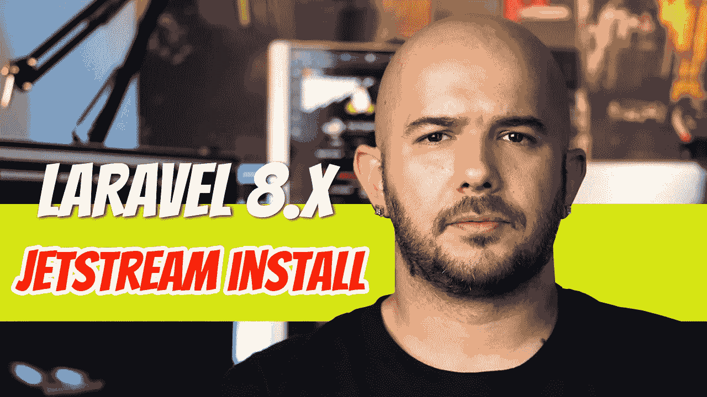

如果你还不熟悉的话，Laravel 8 已经脱离了 auth 脚手架，取而代之的是 JetStream 包。在使用 JetStream 身份验证之前，您需要确保您的系统上安装了最新版本的 *PHP、composer、*和 *laravel* 安装程序。

## 服务器端编程语言（Professional Hypertext Preprocessor 的缩写）

确保你已经安装了最新版本的 PHP。在我写这篇文章的时候，Laravel 需要 7.3 以上的 PHP 版本。请访问 Laravel 官方文档，查看最新要求。

 [## 装置

### Laravel 框架有一些系统需求。所有这些要求都由拉勒维尔家园满足…

laravel.com](https://laravel.com/docs/8.x) 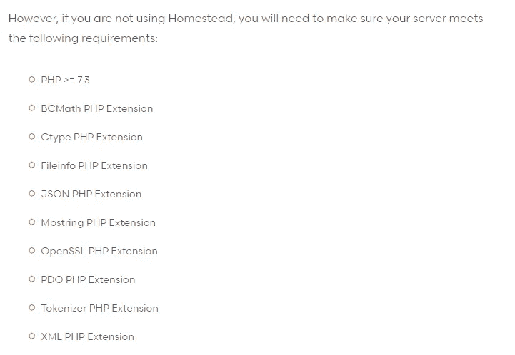

既然有这么多的方法可以把 PHP 安装到你的系统上，我就让你自己去谷歌如何把你的 PHP 升级到最新版本。对于 Windows 用户，你最有可能使用 WAMP 或 XAMPP(如果你不使用 Homestead)。搜索如何升级到 PHP 的最新版本，然后搜索如何编辑环境变量以将最新版本添加到路径中，以便可以在 CMD 中访问它。你可以在这里阅读我的文章:

[](https://medium.com/@dinocajic/add-xampp-php-to-environment-variables-in-windows-10-af20a765b0ce) [## 在 Windows 10 中将 XAMPP PHP 添加到环境变量中

### 如果你在你的 Windows 10 机器上使用 XAMPP，并想添加 php 命令，以便它可以在命令中使用…

medium.com](https://medium.com/@dinocajic/add-xampp-php-to-environment-variables-in-windows-10-af20a765b0ce) 

对于 MAC 用户来说，这里有几页可以帮助你入门:

[](https://stitcher.io/blog/php-74-upgrade-mac) [## 用 Mac - stitcher.io 上的 Homebrew 升级到 PHP 7.4

### Brent 2019 年 11 月 28 日回写首先确保 brew 是最新的:brew 更新接下来，升级 PHP…

stitcher.io](https://stitcher.io/blog/php-74-upgrade-mac) [](https://stackoverflow.com/questions/41872645/updating-php-version-on-mac/41872735) [## 在 mac 上更新 php 版本

### 感谢贡献一个堆栈溢出的答案！请务必回答问题。提供详细信息并分享…

stackoverflow.com](https://stackoverflow.com/questions/41872645/updating-php-version-on-mac/41872735) 

## 设计者

根据您使用的操作系统，以及您是在全局还是本地安装了 composer，composer 更新过程会有所不同。如果你运行的是 Windows，去 https://getcomposer.org/download/[下载最新的可执行文件。](https://getcomposer.org/download/)

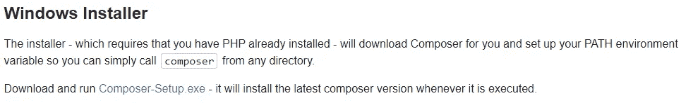

按照提示运行，您将安装最新版本。

MAC 用户请阅读文档:[https://get composer . org/doc/03-CLI . MD # self-update-self update-](https://getcomposer.org/doc/03-cli.md#self-update-selfupdate-)。如果您全局安装了 composer，请运行以下命令:

```
> sudo -H composer self-update
```

请确认您拥有最新版本的 composer。你可以去[https://getcomposer.org/](https://getcomposer.org/)看看最新版本。

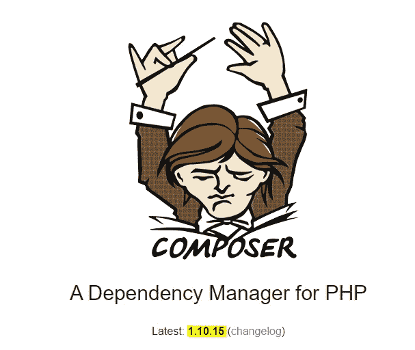

在您的终端中键入 *composer - version* 以查看最新版本。

```
composer --version
```

## laravel 安装程序

如果您没有安装 laravel 安装程序，请运行:

```
composer global require laravel/installer
```

您可以通过在终端中键入以下命令来验证 laravel 安装程序是否已经全局安装:

```
laravel --version
```

有几种方法可以更新你的 *laravel* 安装程序。第一个选项是运行更新命令:

```
composer global require "laravel/installer:^4.0"
```

如果您检查版本，它仍然不是最新的版本，您可以卸载并重新安装全局安装程序。

```
composer global remove laravel/installer
composer global require laravel/installer
```

如果你不知道 *laravel* 安装程序的最新版本，你可以随时访问 laravel/installer GitHub 页面查看。

[](https://github.com/laravel/installer) [## laravel/安装程序

### 安装 Laravel 的文档可以在 Laravel 网站上找到。感谢您考虑为……

github.com](https://github.com/laravel/installer) 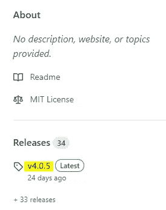

## 验证最新版本

现在是时候通过键入以下内容来验证一切正常了:

```
laravel new --help
```

您应该会看到类似这样的内容:

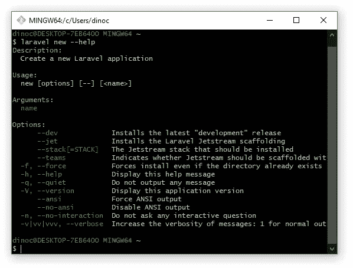

如果你看到 *- jet* 命令，你就在一个好地方。

## 选项 1:使用 JetStream 身份验证创建一个新的应用程序

是时候用- jet 标志创建一个新项目了。

```
laravel new test --jet
```

如果你看到这个屏幕，你可能正在 Windows 中使用 CMD，或者它可能会发生。它将不允许您继续操作，并自动中止。

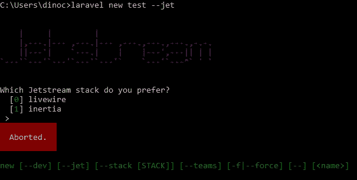

如果你是 Windows 10 用户，试试 Git-Bash；它应该会自动安装在您的操作系统上。只需搜索 Git Bash。

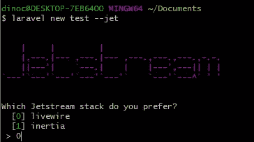

您现在可以选择您想要的版本；我更喜欢 livewire，所以我会坚持。为团队功能输入*是*或*否*并点击回车。

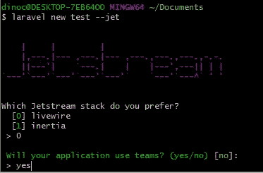

现在将安装带有 JetStream 身份验证的 Laravel 应用程序。

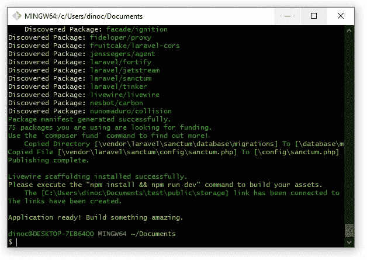

*CD* 到您新创建的文件夹中。

是时候运行以下命令了:

```
npm install
npm run dev
```

我分别运行这两个命令，因为我在尝试运行时收到了错误:

```
npm install && npm run dev
```

如果您没有收到任何错误，您可以用一个命令运行它们。如果有，运行一个而不是另一个。

现在是时候做一些标准的东西了。在编辑器中打开应用程序。创建数据库并更新您的*。env* 文件。是时候进行迁移了。

```
php artisan migrate
```

根据您的设置，可能会出现以下错误:

```
SQLSTATE[42000]: Syntax error or access violation: 1071 Specified key was too long; max key length is 1000 bytes (SQL: ...)
```

如果需要，请从 app/Providers/AppServiceProvider . PHP 打开 AppServiceProvider，并将以下代码添加到 *boot()* 方法中:

```
use Illuminate\Support\Facades\Schema;public function boot()
{
    **Schema::defaultStringLength(191);**
}
```

可能已经添加了一些表，所以运行:

```
php artisan migrate:fresh
```

您应该看到所有内容都被正确填充:

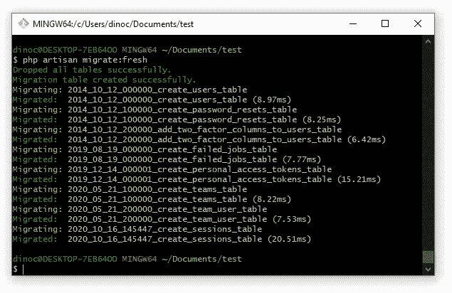

## 选项 2:创建一个新应用程序，然后添加 JetStream 身份验证

通过运行以下命令创建新的应用程序:

```
laravel new test2
```

*CD* 到新创建的文件夹中，并在编辑器中打开它。创建数据库并更新您的*。env* 文件。

接下来，使用 composer 获取 JetStream:

```
composer require laravel/jetstream
```

如果您使用的是 Windows，并且使用的是 Git-Bash，您可能会注意到 composer 有时无法识别，即使您已经全局安装了它。只需切换到 CMD 并在那里运行命令。完成后，是时候用 Livewire 或 Intertia 选项安装 JetStream 了。

```
*// LIVEWIRE
// Install JetStream with the Livewire stack without teams*
php artisan jetstream:install livewire*// Install JetStream with the LiveWire stack and teams*
php artisan jetstream:install livewire --teams // INERTIA
*// Install JetStream with the Inertia stack without teams*
php artisan jetstream:install inertia*// Install Jetstream with the Inertia stack and teams*
php artisan jetstream:install inertia --teams
```

接下来，使用以下命令构建您的资产:

```
npm install
npm run dev
```

同样，如果没有任何问题，您可以将这两个命令作为一个命令运行:

```
npm install && npm run dev
```

最后，运行迁移:

```
php artisan migrate
```

同样，如果您碰巧收到一个错误，指出*最大密钥长度为 1000 字节*，请从 app/Providers/AppServiceProvider . PHP 打开 AppServiceProvider，并将以下代码添加到 *boot()* 方法中:

```
use Illuminate\Support\Facades\Schema;public function boot()
{
    **Schema::defaultStringLength(191);**
}
```

可能已经添加了一些表，所以运行:

```
php artisan migrate:fresh
```

您应该看到所有内容都被正确填充。

## 验证安装

是时候验证应用程序是否具备所有功能了。从项目的根文件夹中运行 serve 命令:

```
php artisan serve
```

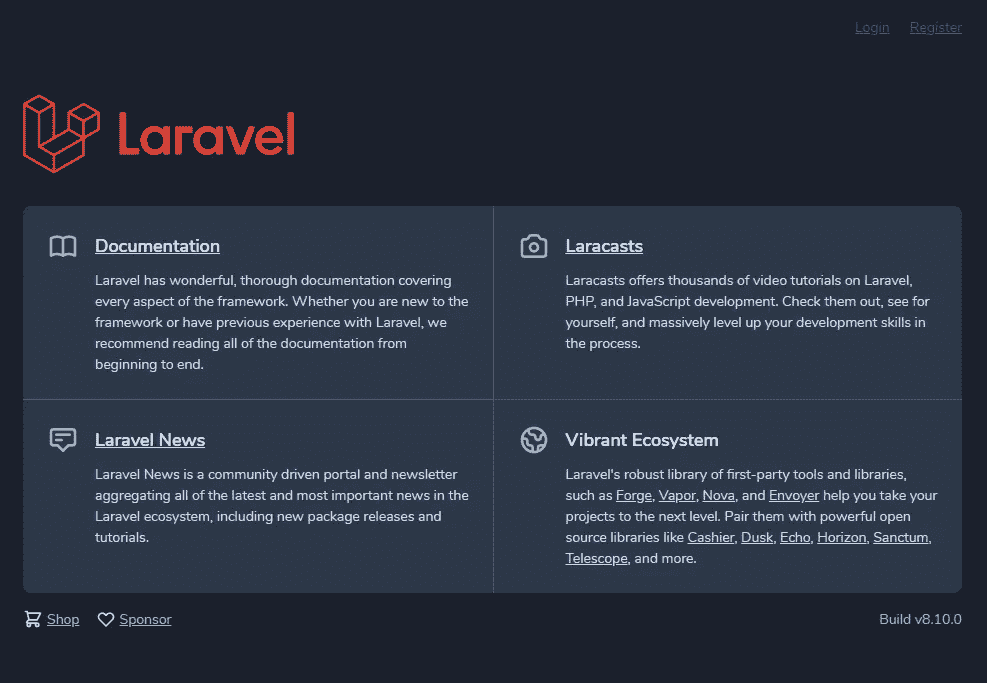

就是这样。您已经安装了功能完整的 Laravel/JetStream 身份验证。您可以单击“注册”来注册用户。

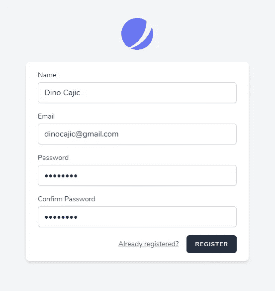

注册后，您可以使用您的用户凭据登录。

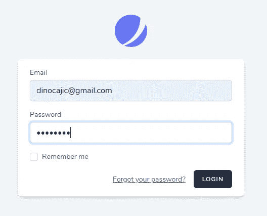

登录后，您将看到您的控制面板。在右上角，如果你点击你的名字，你会看到几个选项。如果您未启用团队，则团队选项可能不存在。

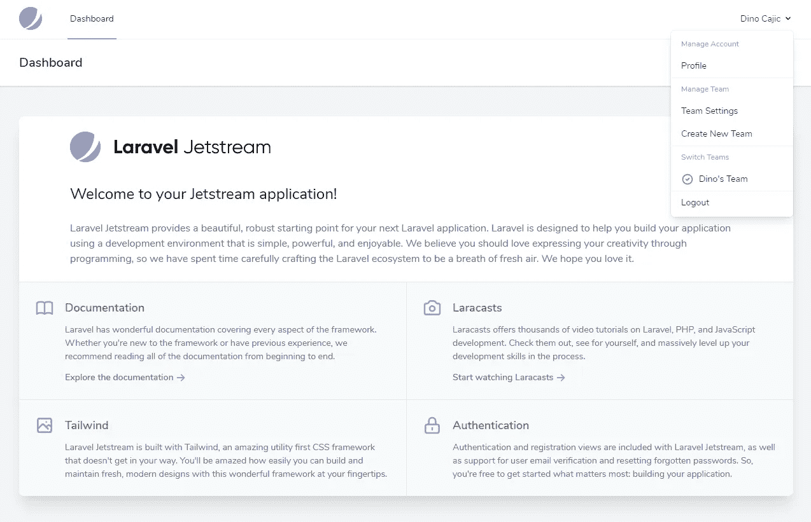

仅此而已。我想我已经介绍了在 JetStream 中安装 Laravel 时可能会遇到的大多数错误。


Dino Cajic 目前是 [LSBio(寿命生物科学公司)](https://www.lsbio.com/)、[绝对抗体](https://absoluteantibody.com/)、 [Kerafast](https://www.kerafast.com/) 、[珠穆朗玛生物科技](https://everestbiotech.com/)、[北欧 MUbio](https://www.nordicmubio.com/) 和 [Exalpha](https://www.exalpha.com/) 的 IT 负责人。他还担任我的自动系统的首席执行官。他有十多年的软件工程经验。他拥有计算机科学学士学位，辅修生物学。他的背景包括创建企业级电子商务应用程序、执行基于研究的软件开发，以及通过写作促进知识的传播。

你可以在 [LinkedIn](https://www.linkedin.com/in/dinocajic/) 上联系他，在 [Instagram](https://instagram.com/think.dino) 上关注他，或者[订阅他的媒体出版物](https://dinocajic.medium.com/subscribe)。

阅读 Dino Cajic(以及 Medium 上成千上万的其他作家)的每一个故事。你的会员费直接支持迪诺·卡吉克和你阅读的其他作家。你也可以在媒体上看到所有的故事。