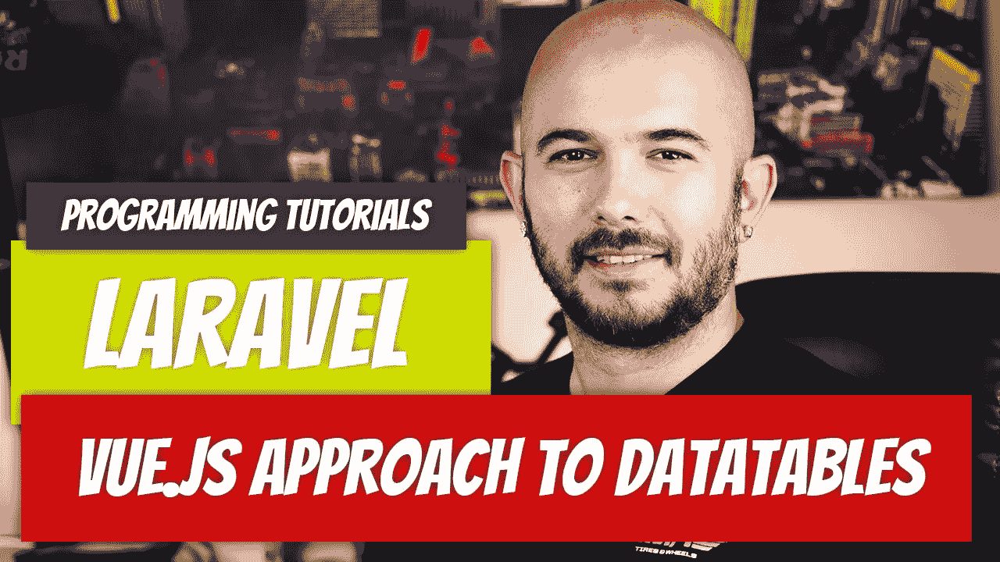
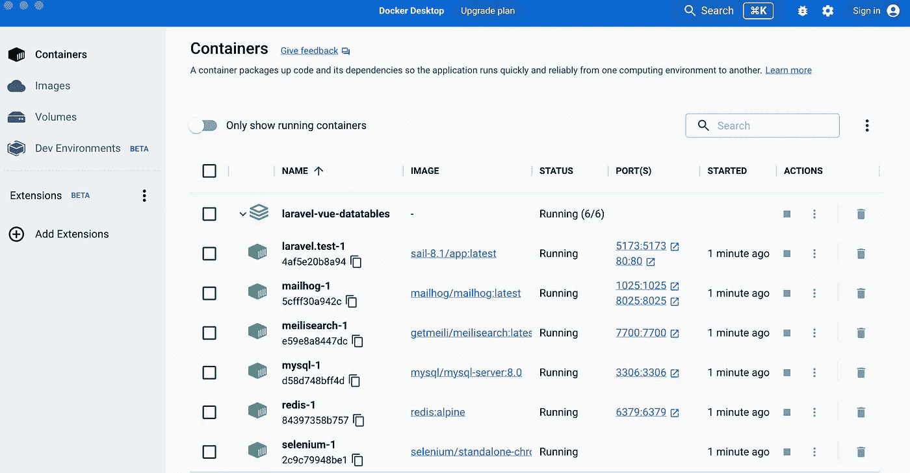
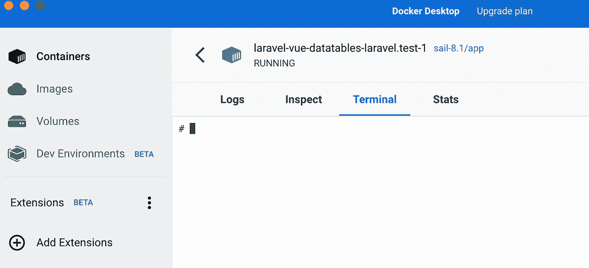
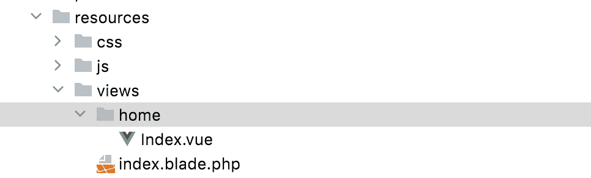
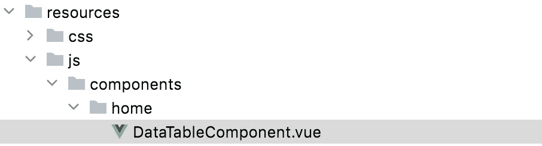
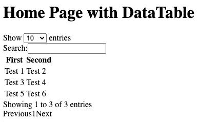
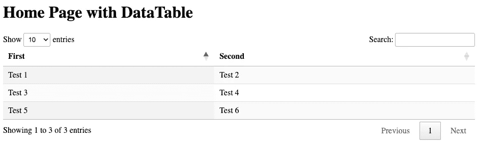
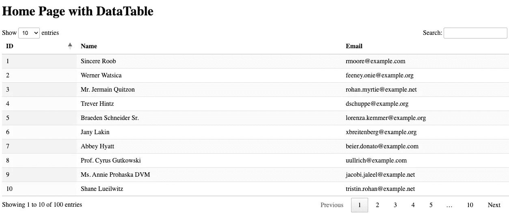
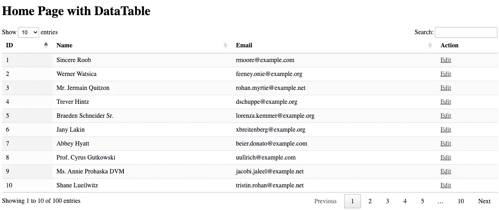

# 使用 Vue.js 和数据表设置 Laravel 9.x 方法)

> 原文：<https://blog.devgenius.io/setting-up-laravel-9-x-with-vue-js-and-datatables-the-vue-approach-fb52dfc74f36?source=collection_archive---------0----------------------->



上次我们看了使用数据表 CDN 设置数据表。如果你阅读 DataTables Vue 文档，那不是它所说的。为了尽可能全面地介绍这个主题，我决定也展示这种方法。要阅读 CDN 方法，请查看下面的文章。

[](https://medium.com/geekculture/laravel-9-x-with-vue-js-and-datatables-b1299d0e6f09) [## 带有 Vue.js 和数据表的 Laravel 9.x

### 到目前为止，我所看到的关于如何设置数据表的一切都没有产生我需要的那种结果。我想要一个…

medium.com](https://medium.com/geekculture/laravel-9-x-with-vue-js-and-datatables-b1299d0e6f09) 

对于这篇文章，我认为从头开始会比较好。没有假设。让我们用全新安装的 Laravel 9.x 来安装它。我们将完成设置 Vue.js，然后用服务器端支持设置数据表。

# 假设

你的设备上安装了 Docker 桌面和 PHP。我运行的 PHP 版本是:

```
PHP 8.2.0 (cli) (built: Dec  9 2022 16:55:44) (NTS)
Copyright (c) The PHP Group
Zend Engine v4.2.0, Copyright (c) Zend Technologies
    with Zend OPcache v8.2.0, Copyright (c), by Zend Technologies
```

# 拉勒韦尔装置

建立一个新的项目。我在 Mac 上使用 Docker，所以我的安装非常简单。

```
curl -s "https://laravel.build/laravel-vue-datatables" | bash
```

安装完成后，将 cd 放入您的目录并运行`./vendor/bin/sail up`来启动您的项目。

打开 Docker 桌面，查看项目运行情况。



在我们继续之前，点击`laravel.test-1`打开容器，然后点击`terminal`标签。从现在开始，这是我们输入所有命令的地方。



# vitejs/plugin-vue

为了使用 Vue，我们需要安装 vite vue 插件。打开名为`laravel.test-1`的 docker 容器，进入终端(如果您在上一节中没有这样做的话)。

键入以下命令:

`npm i vue@next`

安装完成后，再运行一个命令来安装 vue 插件:

`npm i @vitejs/plugin-vue`

# vite.config.js

你主目录下的`vite.config.js`文件需要修改。我们需要从插件中导入`Vue`，并在`plugins`下注册。您的文件现在应该如下所示:

```
import { defineConfig } from 'vite';
import laravel from 'laravel-vite-plugin';
import Vue from '@vitejs/plugin-vue';

export default defineConfig({
    plugins: [
        laravel({
            input: ['resources/css/app.css', 'resources/js/app.js'],
            refresh: true,
        }),
        Vue({
            template: {
                transformAssetUrls: {
                    base: null,
                    includeAbsolute: false,
                }
            }
        }),
    ],
});
```

# resources/js/App.vue

创建`App.vue`文件的时间到了。只要你知道这是入口点，你可以给它起任何你喜欢的名字。我将从包含一个`h1`标签的简单文件开始。

```
<template>
    <h1>DataTables Example</h1>
</template>

<script>
export default {
    name: 'App',
    components: {},
}
</script>

<style>

</style>
```

# 资源/js/app.js

接下来，我们需要修改我们的`app.js`文件。它目前正在从同一个目录导入`bootstrap.js`，但是我们需要它实际导入我们的`App.vue`。我们还需要来自`vue`的`createApp`，这样我们可以在`resources/views/index.blade.php`内将内容挂载到`#app` id 上。我们还没有这样做，但我们接下来会这样做。

您的`resources/js/app.js`文件应该是这样的。

```
import { createApp } from "vue";
import App from "./App.vue";

createApp(App).mount("#app");
```

# resources/index.blade.php

创建一个新的`index.blade.php`视图，并添加以下代码。确保在`index.blade.php`中包含`app.js`文件。我们可以用`vite`做到这一点。当你这样做的时候，你也可以包括`app.css`资源。

```
<!DOCTYPE html>
<html lang="{{ str_replace('_', '-', app()->getLocale()) }}">
    <head>
        <meta charset="utf-8">
        <meta name="viewport" content="width=device-width, initial-scale=1">

        <title>Laravel Vue.js DataTables</title>

        <!-- Fonts -->
        <link href="https://fonts.bunny.net/css2?family=Nunito:wght@400;600;700&display=swap" rel="stylesheet">

        @vite(['resources/js/app.js', 'resources/css/app.css'])
    </head>
    <body class="antialiased">
        <div id="app"></div>
    </body>
</html>
```

我们还没有修改`routes/web.php`文件，但是我们会在安装`vue-router`后修改。

# 安装 Vue 路由器

我们需要首先安装依赖项。转到 Docker 容器，使用以下命令安装`vue-router`依赖项:

```
npm install vue-router
```

# routes/web.php

现在是修改`web.php`路线文件的时候了。我们可以添加一条新路由来处理我们所有的 vue 路由器路由。如果我们不这样做，就会导致 vue 路由器出错。

```
<?php

use Illuminate\Support\Facades\Route;

Route::get('/{all}', function () {
    return view('index');
})->where("all", ".*");
```

# 创建主视图:resources/views/home/Index.vue

让我们为主页创建一个新的 Vue 文件。该页面将包含数据表。

```
<template>
    <h1>Home Page with DataTable</h1>
</template>

<script>
export default {
    name: 'Home',
    components: {},
}
</script>

<style>

</style>
```



# 资源/js/router/index.js

是时候创建我们的路径文件了。这将处理我们所有的路线，而不是`web.php`。对于该文件，我们需要:

*   从`vue-router`导入`createRouter`和`createWebHistory`
*   导入任何我们需要定义路径的页面组件，比如`Home`
*   创建我们的路由常量并将组件绑定到它
*   创建我们的`router`并将`history`和`routes`绑定到它
*   导出路由器

```
import {createRouter, createWebHistory } from "vue-router";
import Home from "../../views/home/Index.vue";

const routes = [
    {
        path: "/",
        name: "home",
        component: Home,
    },
];

const router = createRouter({
    history: createWebHistory(import.meta.env.BASE_URL),
    routes,
});

export default router;
```

# 资源/js/app.js

导出的`router`现在需要导入。它需要导入到我们的`app.js`文件中。一旦进口，我们需要`use`它。在我们`mount`我们的 app 之前添加`use(router)`功能。

```
import { createApp } from "vue";
import App from "./App.vue";
import router from "./router/index";

createApp(App)
    .use(router)
    .mount("#app");
```

# 修改 resources/js/App.vue

最后，我们需要修改`App.vue`文件，使其包含路由器文件返回的内容。我们将把`<router-view />`添加到我们的模板中。

```
<template>
    <router-view />
</template>

<script>

export default {
    name: 'App',
    components: {},
}
</script>

<style>

</style>
```

在我们开始使用数据表之前，请确保它能够工作。回到容器中运行`npm run dev`。如果您还没有配置您的`hosts`文件，您可能会访问`http://0.0.0.0`来查看它的运行。


# 数据表准备

我们将显示的数据来自 users 表。为什么是用户的表？因为它已经存在，我们可以快速运行播种机播种。

打开您的`database/seeders/DatabaseSeeder.php`文件，取消对`User`工厂代码的注释。把`10`换成`100`，这样我们就有更多的玩法了。

```
<?php

namespace Database\Seeders;

// use Illuminate\Database\Console\Seeds\WithoutModelEvents;
use Illuminate\Database\Seeder;

class DatabaseSeeder extends Seeder
{
    /**
     * Seed the application's database.
     *
     * @return void
     */
    public function run()
    {
         \App\Models\User::factory(100)->create();

        // \App\Models\User::factory()->create([
        //     'name' => 'Test User',
        //     'email' => 'test@example.com',
        // ]);
    }
}
```

接下来，回到 Docker 容器并停止应用程序的运行，如果你还没有使用`CTRL+C`。运行您的迁移并播种表格:

```
php artisan migrate --seed
```

```
# php artisan migrate --seed

   INFO  Preparing database.  

  Creating migration table ............................................................. 26ms DONE

   INFO  Running migrations.  

  2014_10_12_000000_create_users_table ................................................. 43ms DONE
  2014_10_12_100000_create_password_resets_table ....................................... 24ms DONE
  2019_08_19_000000_create_failed_jobs_table ........................................... 26ms DONE
  2019_12_14_000001_create_personal_access_tokens_table ................................ 36ms DONE

   INFO  Seeding database. 
```

一旦完成，就该转到数据表了。

# Vue3 的数据表

请访问官方文档以获得更多项目的完整说明。我们要从这里提取最重要的信息。

首先，安装软件包。打开 Docker 容器并运行:

```
npm install --save datatables.net-vue3
```

安装到此为止。我们现在需要开始使用它。为了尽可能真实，我将为我们的主页创建一个 DataTable 组件。我们可以在主页 vue 文件中完成所有这些工作，但是我们将创建一个 DataTable 组件并将其导入主页。

# 数据表组件

我将在`resources/js`下创建一个名为`components`的新目录，并将我的所有组件放在那里。因为这是专门针对主页的，所以我将在 components 下创建一个子目录`home`并将`DataTableComponent.vue`文件放在那里。



该文件将以与我们所有其他 Vue 文件相同的框架开始:

```
<template>
    <!-- DataTable -->
</template>

<script>
export default {
    name: 'DataTableComponent',
    components: {},
}
</script>

<style>

</style>
```

我们现在只需要将它导入到我们位于`resources/views/home/Index.vue`的 Home vue 中。

```
<template>
    <h1>Home Page with DataTable</h1>
    <DataTable />
</template>

<script>
import DataTableComponent from "../../js/components/home/DataTableComponent.vue";

export default {
    name: 'Home',
    components: {DataTableComponent},
}
</script>

<style>

</style>
```

# resources/js/components/home/datatable component . vue

是时候开始构建我们的`DataTable`组件了。Vue 指令声明我们应该将以下内容添加到我们的`script`标签中。我们需要将`DataTable`注册为我们的组件之一，这样我们就可以开始使用它了。

```
import DataTable from 'datatables.net-vue3'
import DataTablesLib from 'datatables.net';

DataTable.use(DataTablesLib);
```

```
<template>
    <!-- DataTable -->
</template>

<script>
import DataTable from 'datatables.net-vue3'
import DataTablesLib from 'datatables.net';

DataTable.use(DataTablesLib);

export default {
    name: 'DataTableComponent',
    components: {DataTable},
}
</script>

<style>

</style>
```

让我们确保它有效。将下表添加到您的`template`标签中。

```
<template>
    <DataTable class="display">
        <thead>
            <tr>
                <th>First</th>
                <th>Second</th>
            </tr>
        </thead>
        <tbody>
            <tr>
                <td>Test 1</td>
                <td>Test 2</td>
            </tr>
            <tr>
                <td>Test 3</td>
                <td>Test 4</td>
            </tr>
            <tr>
                <td>Test 5</td>
                <td>Test 6</td>
            </tr>
        </tbody>
    </DataTable>
</template>

<script>
import DataTable from 'datatables.net-vue3'
import DataTablesLib from 'datatables.net';

DataTable.use(DataTablesLib);

export default {
    name: 'DataTableComponent',
    components: {DataTable},
}
</script>

<style>

</style>
```

在 Docker 容器中键入`npm run dev`命令，并确保它能够工作。您应该会看到无样式的数据表。



# 添加数据表样式

根据官方文档，对数据表进行样式化需要两行代码。首先，在 Docker 容器中运行以下命令:

```
npm install --save datatables.net-dt
```

接下来，将导入添加到您的`DataTablesComponent` `style`标签中。

```
<style>
@import 'datatables.net-dt';
</style>
```

通过再次从 Docker 容器运行`npm run dev`并访问主页，确保它能够正常工作。



# 服务器端

这很好，但是我们希望能够从服务器端检索数据。这有很大的依赖性，使得从我们的`API`返回数据表的数据变得极其简单。

[](https://github.com/yajra/laravel-datatables) [## GitHub-yajra/Laravel-DataTables:用于 Laravel 4|5|6|7|8|9 的 jQuery DataTables API

### Laravel 包，通过 AJAX 选项使用雄辩的 ORM 处理数据表 jQuery 插件的服务器端工作…

github.com](https://github.com/yajra/laravel-datatables) 

要安装它，请从 Docker 容器中运行以下命令:

```
composer require yajra/laravel-datatables-oracle:"^10.0"
```

这位于文档中。确保再次运行您的开发环境:`npm run dev`。

# routes/api.php

是时候将我们的路线添加到`api.php`文件中了。既然已经安装了`datatables`全局函数，我们将使用它。

```
<?php

use Illuminate\Http\Request;
use Illuminate\Support\Facades\Route;

/*
|--------------------------------------------------------------------------
| API Routes
|--------------------------------------------------------------------------
|
| Here is where you can register API routes for your application. These
| routes are loaded by the RouteServiceProvider within a group which
| is assigned the "api" middleware group. Enjoy building your API!
|
*/

// ...

Route::get('/users', function() {
    $users = \App\Models\User::select('id', 'name', 'email');

    return datatables($users)->make(true);
});
```

在我们生成想要传递给`datatables`的查询后，我们将把它作为一个参数传递。确保你不是真的在自己检索内容；换句话说，不要在你的语句末尾加上`->get()`。

# 检索 resources/js/components/home/datatable component . vue 中的数据

我们终于成功了。是时候进行修改并查看来自`users`表的数据了。

```
<template>
    <div class="p-6">
        <DataTable
            class="display"
            :columns="columns"
            ajax="api/users"
            ref="table"
            :options="{
              select: true,
              serverSide: true,
        }"
        >
            <thead>
            <tr>
                <th>ID</th>
                <th>Name</th>
                <th>Email</th>
            </tr>
            </thead>
            <tbody>
            </tbody>
        </DataTable>
    </div>
</template>
```

让我们浏览一下`DataTable`组件的重要方面。

*   我们将`:columns`绑定到我们的`data()`，我们还没有定义它，但是我们会的。
*   我们使用`ajax`属性来点击我们的`api/users`路线。这将从我们的 api 中检索数据。
*   在`:options`中，我们添加了`serverSide`属性，并将其设置为`true`。这将允许我们在服务器端处理请求。

我们需要将`data()`方法添加到脚本中。

```
export default {
    name: 'DataTableComponent',
    components: {DataTable},
    data(){
        return {
            columns: [
                {"data": "id"},
                {"data": "name"},
                {"data": "email"},
            ],
        }
    },
}
```

我们在那里添加`columns`的原因是为了给数据表添加额外的特性。例如，如果我们不希望名称是`sortable`，我们可以添加一个`sortable`属性并将其设置为`false`。

```
export default {
    name: 'DataTableComponent',
    components: {DataTable},
    data(){
        return {
            columns: [
                {"data": "id"},
                {"data": "name", "sortable": false},
                {"data": "email"},
            ],
        }
    },
}
```

你的`DataTableComponent`文件应该是这样的。

```
<template>
    <div class="p-6">
        <DataTable
            class="display"
            :columns="columns"
            ajax="api/users"
            ref="table"
            :options="{
                select: true,
                serverSide: true,
            }"
        >
            <thead>
            <tr>
                <th>ID</th>
                <th>Name</th>
                <th>Email</th>
            </tr>
            </thead>
            <tbody>
            </tbody>
        </DataTable>
    </div>
</template>

<script>
import DataTable from 'datatables.net-vue3'
import DataTablesLib from 'datatables.net';

DataTable.use(DataTablesLib);

export default {
    name: 'DataTableComponent',
    components: {DataTable},
    data(){
        return {
            columns: [
                {"data": "id"},
                {"data": "name", "sortable": false},
                {"data": "email"},
            ],
        }
    },
}
</script>

<style>
@import 'datatables.net-dt';
</style>
```

大考时间到了。如果 Docker 容器中还没有运行`npm run dev`，请输入并访问主页。



不骗你，我开始有点紧张它是否会起作用。

# 向表格中添加按钮

打开您的`resources/js/components/home/DataTableComponent.vue`文件。让我们在表和脚本中添加一个新列。我将把它命名为`Action`，并将`{ “data”: “action” }`对象添加到我们的`columns`属性中。

```
<template>
    <div class="p-6">
        <DataTable
            class="display"
            :columns="columns"
            ajax="api/users"
            ref="table"
            :options="{
                select: true,
                serverSide: true,
            }"
        >
            <thead>
            <tr>
                <th>ID</th>
                <th>Name</th>
                <th>Email</th>
                <th>Action</th>
            </tr>
            </thead>
            <tbody>
            </tbody>
        </DataTable>
    </div>
</template>

<script>
import DataTable from 'datatables.net-vue3'
import DataTablesLib from 'datatables.net';

DataTable.use(DataTablesLib);

export default {
    name: 'DataTableComponent',
    components: {DataTable},
    data(){
        return {
            columns: [
                {"data": "id"},
                {"data": "name"},
                {"data": "email"},
                {"data": "action", "sortable": false},
            ],
        }
    },
}
</script>

<style>
@import 'datatables.net-dt';
</style>
```

接下来我们需要修改 API 路由来返回一个列。

```
Route::get('/users', function() {
    $users = \App\Models\User::select('id', 'name', 'email');

    return datatables($users)
        ->addColumn('action', function($row) {
            return '<a href="/users/' . $row['id'] . '/edit">Edit</a>';
        })
        ->rawColumns(['action'])
        ->make(true);
});
```

刷新您的页面，您应该会看到类似这样的内容:



# 关系呢？

假设您的用户模型与其他模型有一个`belongsTo`关系，比如一个`Profile`。我们可以想象`Profile`模型有一个与之相关联的`image`。`User`模型将具有带有关系的`profile`方法。

```
<?php

namespace App\Models;

// use Illuminate\Contracts\Auth\MustVerifyEmail;
use Illuminate\Database\Eloquent\Factories\HasFactory;
use Illuminate\Foundation\Auth\User as Authenticatable;
use Illuminate\Notifications\Notifiable;
use Laravel\Sanctum\HasApiTokens;

class User extends Authenticatable
{
    use HasApiTokens, HasFactory, Notifiable;

    // ...

    public function profile() {
        return $this->belongsTo(Profile::class);
    }
}
```

如果我们通过侧写，我们会在另一边收到一个对象。换句话说，我们不能简单的用`with`。

```
Route::get('/users', function() {
    $users = \App\Models\User::with(['profile'])->select('id', 'name', 'email');

    return datatables($users)
        ->addColumn('action', function($row) {
            return '<a href="/users/' . $row['id'] . '/edit">Edit</a>';
        })
        ->rawColumns(['action'])
        ->make(true);
});
```

我们必须创建一个新的列。我将调用它`profile-image`来获得`Profile`图像。它将从`profile`关系中返回`image`。

```
Route::get('/users', function() {
    $users = \App\Models\User::select('id', 'name', 'email');

    return datatables($users)
        ->addColumn('action', function($row) {
            return '<a href="/users/' . $row['id'] . '/edit">Edit</a>';
        })
        ->addColumn('profile-image', function($row) {
            return $row->profile->image;
        })
        ->rawColumns(['action', 'profile-image'])
        ->make(true);
});
```

我们需要调整我们的`DataTableComponent.vue`,通过将它添加到我们的表和我们的`columns`属性中来查看它。

```
<template>
    <div class="p-6">
        <DataTable
            class="display"
            :columns="columns"
            ajax="api/users"
            ref="table"
            :options="{
                select: true,
                serverSide: true,
            }"
        >
            <thead>
            <tr>
                <th>ID</th>
                <th>Name</th>
                <th>Email</th>
                <th>Profile Image</th>
                <th>Action</th>
            </tr>
            </thead>
            <tbody>
            </tbody>
        </DataTable>
    </div>
</template>

<script>
import DataTable from 'datatables.net-vue3'
import DataTablesLib from 'datatables.net';

DataTable.use(DataTablesLib);

export default {
    name: 'DataTableComponent',
    components: {DataTable},
    data(){
        return {
            columns: [
                {"data": "id"},
                {"data": "name"},
                {"data": "email"},
                {"data": "profile-image", "sortable": false},
                {"data": "action", "sortable": false},
            ],
        }
    },
}
</script>

<style>
@import 'datatables.net-dt';
</style>
```

现在，您将能够看到指向您的个人资料图像的链接…如果您有这种类型的关系设置。

就是这样。下次见。我必须继续写我的 Laravel 系列:我们刚刚进入刀片模板引擎。

如果你想要上面提到的代码，那就给你。

[](https://github.com/dinocajic/laravel-vue-datatables) [## GitHub-dinocajic/laravel-vue-数据表

### Laravel 是一个 web 应用程序框架，具有丰富、优雅的语法。我们相信发展必须是令人愉快的…

github.com](https://github.com/dinocajic/laravel-vue-datatables) 

Dino Cajic 目前是 [Absolute Biotech](http://absolutebiotech.com/) 的 IT 负责人，该公司是 [LSBio(寿命生物科学公司)](https://www.lsbio.com/)、 [Absolute 抗体](https://absoluteantibody.com/)、 [Kerafast](https://www.kerafast.com/) 、 [Everest BioTech](https://everestbiotech.com/) 、 [Nordic MUbio](https://www.nordicmubio.com/) 和 [Exalpha](https://www.exalpha.com/) 的母公司。他还担任我的自动系统的首席执行官。他拥有计算机科学学士学位，辅修生物学，并拥有十多年的软件工程经验。他的背景包括创建企业级电子商务应用程序、执行基于研究的软件开发，以及通过写作促进知识的传播。

你可以在 [LinkedIn](https://www.linkedin.com/in/dinocajic/) 上联系他，在 [Instagram](https://instagram.com/think.dino) 上关注他，或者[订阅他的媒体出版物](https://dinocajic.medium.com/subscribe)。

阅读 Dino Cajic(以及 Medium 上成千上万的其他作家)的每一个故事。你的会员费直接支持迪诺·卡吉克和你阅读的其他作家。你也可以在媒体上看到所有的故事。