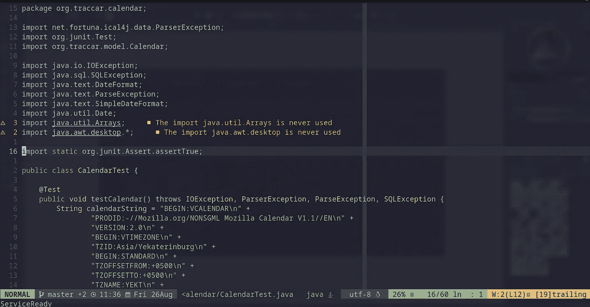
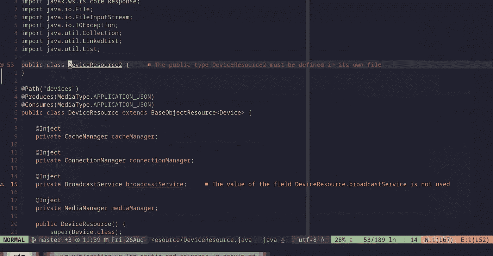
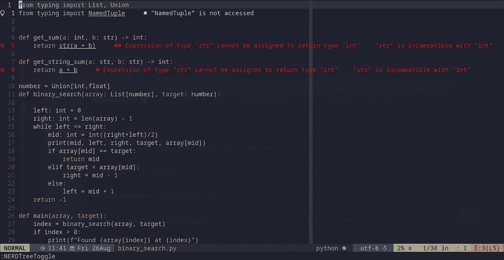

# 在 Neovim 中设置 LSP 配置，以便进行漂亮的错误诊断

> 原文：<https://blog.devgenius.io/setting-up-lsp-config-in-neovim-for-beautiful-error-diagnostics-26d40bbe40a2?source=collection_archive---------0----------------------->


# 什么是 LSP？

> 语言服务器协议(LSP)是 IDEs 代码编辑器和服务器之间的通信协议，提供编程语言特定的功能，如代码完成、重构(重命名变量)或导航到符号定义等。

# LSP 解决的问题

有很多代码编辑器像 vim，VSCode，Atom，PyCharm 等。我们对 ide 有所期待:每种语言都有代码完成、导航到定义等特性。在 LSP 出现之前，每个 IDE/代码编辑器都需要添加自己的特定于语言的特性的实现。大多数语言都绑定到一个给定的 IDE 或编辑器上。如果开发了一个新的编辑器，它需要为每种语言实现重命名变量或显示可能出错的曲线等功能。如果一种新的语言出现，它很难被所有现有的编辑支持。

现在，我们有了语言服务器协议，我们有了两个代理:一个编辑器(客户机)和一个语言服务器(服务器)。服务器提供了特定于语言的特性，如定义、查找引用、悬停、完成、重命名、格式化、重构等。，使用语义整体项目分析。客户端或编辑器执行以下操作:

*   与服务器就功能进行交流(例如，客户机和服务器能做代码片段吗？)
*   发送请求并处理响应(例如，当程序员按住 ctrl 键单击 python 文件中的某个符号时，客户端会要求 pyright 查找该符号定义的文件和行号，在 pyright 做出响应后，编辑器会带您查看该定义。并且进行定义已经完成)
*   处理服务器发送的通知(例如，错误诊断:在有错误或警告的代码下显示曲线)

所有这些通信都遵循语言服务器协议。因此，任何新的编辑器都可以使用任何复杂的语言服务器。任何参与开发新编程语言的程序员都可以让现有的编辑器使用该语言的服务。这就是 Neovim 可以使用 VSCode 的语言服务器(CoC)的原因，因为它们都支持 LSP。

> LSP 最初是由微软为 VSCode 开发的，现在是一个开放标准

# 现在我们对 LSP 的工作原理有了一些了解，让我们开始为 Neovim 设置 LSP 配置。

这些可以分为三个部分:

*   安装 nvim-lspconfig
*   在您的路径上安装语言服务器
*   告诉 Neovim 使用语言服务器

# 安装 nvim-lspconfig

首先，我们需要安装 nvim-lspconfig 插件，它为 Nvim LSP 客户端提供配置。根据 TJ Devries 的说法，你在技术上并不需要这个插件，因为 Neovim 已经内置了 LSP 客户端，但是它可以帮助你更容易地管理和连接到 LSP 服务器。它为不同的语言服务器提供了配置，使连接和管理它们变得更加容易。

要使用 VimPlug 安装，

*   将`Plug 'neovim/nvim-lspcnofig'`添加到您的 vimrc 中

```
call plug#begin('~/.config/nvim/plugged')
...
Plug 'neovim/nvim-lspconfig' " Configuration for Nvim LSP
...
call plug#end()
```

*   重启 vim 或使用`source %`激活 vimrc
*   键入`:PlugInstall`命令，这将安装 nvim-lspconfig。

# 在您的路径上安装语言服务器

因为我使用 python、typescript 并涉猎 Java。我将为这些设置 LSP。

*   为 python 安装 pyright LSP 服务器。

```
npm install -g pyright
```

*   为 typescript 安装 typescript-language-server

```
npm install -g typescript typescript-language-server
```

*   安装 Eclipse JDT 语言服务器 for java

```
yay -S jdtls
```

> 注意:我使用 yay 来安装 jdtls。点击[这里](https://github.com/eclipse/eclipse.jdt.ls)了解更多关于安装 eclipse jdtls 的信息。

# 告诉 Neovim 使用语言服务器

最后，您必须为 LSP 提供的功能类型指定所需的键映射，并将它们附加到 vimrc 文件中的每个语言服务器上。

*   在您的 vimrc 中，添加以下代码

# 结果呢

现在，您可以转到 python 或 typescript 或 java 项目，您将看到错误诊断。这么🎉🎉🎉



Java 未使用的导入



带 Java 的 LSP



使用 python 的 LSP