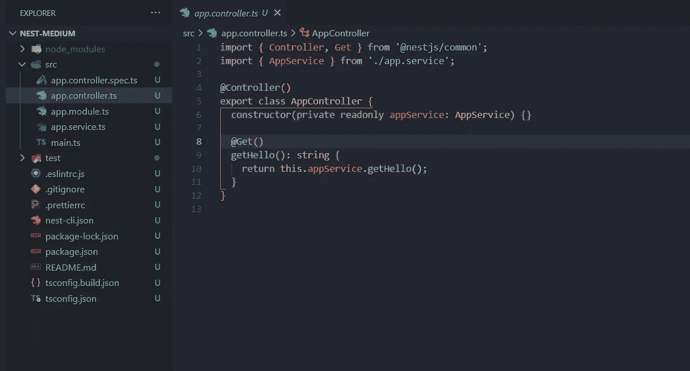
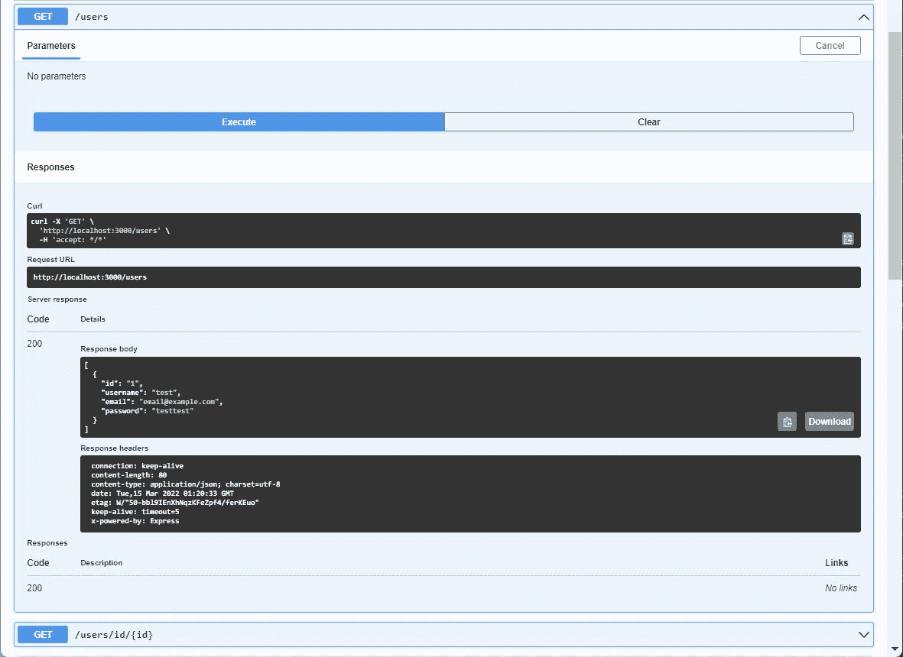
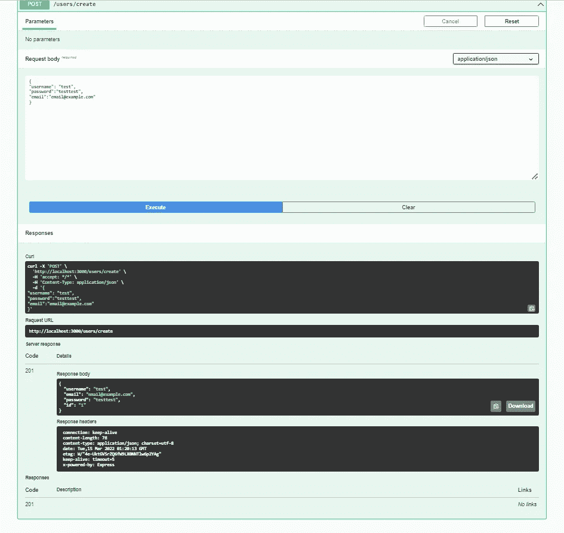
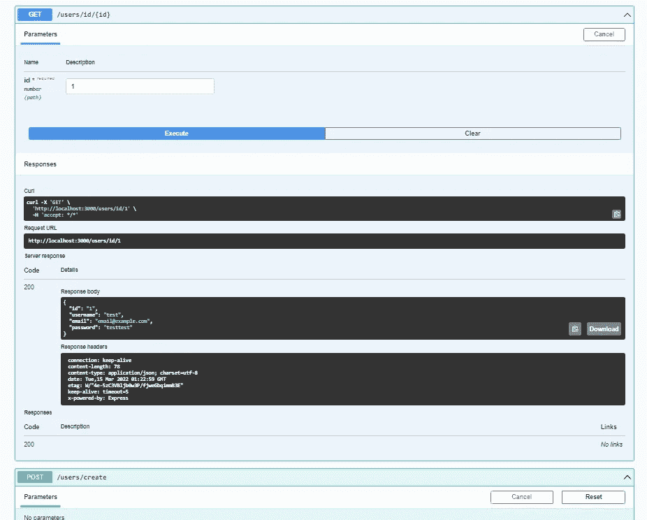

# 使用 PostgreSQL 设置 Nestjs

> 原文：<https://blog.devgenius.io/setting-up-nestjs-with-postgresql-ac2cce9045fe?source=collection_archive---------0----------------------->


卡斯帕·卡米尔·鲁宾在 [Unsplash](https://unsplash.com?utm_source=medium&utm_medium=referral) 上的照片

NestJS 是一个用于创建服务器端 NodeJS 应用程序的框架。我最近开始使用 NestJs，我想分享一下如何将一个简单的服务器端应用程序与一个正在运行的 PostgreSQL 数据库连接起来。我们还将创建路由来运行 post 并从我们的数据库中获取请求。你可以在这里查看完整的 [GitHub 代码](https://github.com/DorcasOJ/nestjs-with-progreSQL)。

PostgreSQL 是测试和部署阶段使用的流行 SQL 之一。如果你还没有安装 PostgreSQL，请点击下载它。安装后，你将提供一个新的服务器和数据库，但你需要为这个项目创建一个新的数据库。

## 如何在 Postgres 中创建新数据库的步骤

*   首先，打开 pgAdmin(这是一个随 PostgreSQL 安装的 GUI)，当打开服务器时，会提示您输入服务器的密码，请确保您记住了密码。
*   然后在你当前运行的服务器上创建一个新的数据库，姑且称之为 *work_db* ，默认的数据库是 *postgres* ，但是你必须把它改成 work_db
*   要更改它，右击服务器，点击*断开服务器*并按照提示操作。
*   然后再次右键单击并单击*属性，*转到*连接*选项卡并将*维护数据库*字段编辑为 *work_db* 或新数据库的名称，并单击保存
*   最后，再次右键单击服务器，并单击*连接服务器*

现在 PostgreSQL 设置已经完成，我们需要设置 NestJs。

一、首先下载并安装 [NodeJs](https://nodejs.org/en/download/) 。这也将安装节点包管理器(npm ),我们将使用它来安装 NestJs 和其他包。

二。在命令行界面中，使用以下代码安装 NestJs，根据您的喜好替换 project-name

```
npm i -g @nestjs/clinest new project-name
```

我们将很快安装我们需要的其他软件包

三。要启动服务器，在 vs 代码中打开您的新项目，导航到终端，确保您在项目目录中并键入

```
npm run start:dev
```

注意:在本教程中，我们将使用 typescript。

让我们快速理解 NestJs 中的几个概念。这些对于理解项目至关重要。

# 控制器

控制器负责接收来自客户的请求，并根据编程给出响应。它们用于路由、用资源定义端点、用参数定义路由、重定向、为不同的端点定义状态代码等等。要在 typescript 中使用控制器，您需要使用嵌套控制器 decorator @Controller()及其关联的类，您还可以向控制器添加一个可选的路由路径，例如@Controller('users ')。一个控制器可以有尽可能多的端点或资源。例如，我们可以使用附加到一个方法的 Get decorator 来获取数据库中的所有客户，并使用端点为 *create* 的 post decorator 来创建一个新用户。

```
@Controller(‘users’)export class UsersController { constructor(private readonly userService: UsersService) {} @Get() 
getUsers() { return this.userService.getUsers(); }@Post('create')  
createUsers(@Body() createUserDto: CreateUserDto) { return this.userService.createUser(createUserDto); }}
```

关于控制器的更多信息在 NestJs 文档中[这里](https://docs.nestjs.com/controllers)。

# 提供者

大多数情况下，提供者是类，可以作为对其他类(如控制器类)的依赖注入。它们被用作控制器资源的服务。在上面的代码中， *UserService* 被注入到用户的控制器中，这充当了用户控制器的依赖项，因此我们可以在控制器的类中使用 *userService* 方法。

# DTOs

dto 是短数据传输对象。它们可以是接口对象，决定如何在 post 请求体和响应中发送数据，从而为代码添加结构。在上面的代码中，*createuserdo*用于构造 *create* 端点的请求体。

# 配置

NestJs 配置模块的工作方式与 NodeJs dotenv 包非常相似。它帮助您对敏感数据使用环境变量。它使您能够创建一个*。env* 文件，您可以在其中存储敏感变量并在代码中使用它们。你得加上*。env* 到*的路径。g it 忽略*文件，然后将其推送到您的 git 存储库。

# 字体

TypeOrm 是一个对象关系映射器(Orm)类型脚本包，允许您使用 SQL，如 PostgreSQL、MySQL 和 NoSQL 数据库。关于 typeorm 的更多信息在它的[文档](https://typeorm.io/#/)中。

# 模块

两个控制器都是在模块中定义的提供者类。您可以决定为不同的功能创建不同的模块，例如，为所有用户功能*创建*用户模块*。*这些子模块将被导入到应用程序模块，这是我们项目的主要应用程序模块。其他需要的模块也导入到 *module.ts* 文件中，如 typeorm 模块、配置模块等。

到目前为止，您应该已经创建了 PostgreSQL 数据库并运行了 NestJS 项目。

在 [GitHub 代码](https://github.com/DorcasOJ/nestjs-with-progreSQL)中，创建了两个模块，用户模块和客户模块。但是在本文中，我们将创建一个模块，*用户模块*，它将拥有我们即将创建的数据库表。然后，我们将定义函数，通过我们的服务(提供者)类型脚本文件从数据库发送和获取信息，并将它们注入控制器。最后，您应该有一个正常运行的数据库设置，以及发布和获取结构化信息的路径。

# 逐步指南

这是在创建 NestJs 项目后，您的代码将如何构建

```
nest new project-name
```



vscode nestjs 设置

如果你有这样的事情，那么你可以遵循这个循序渐进的程序。不要忘记启动您的 NestJs 服务器

```
npm run start:dev
```

**1。重构您的代码——在您的项目目录中删除和添加需要的文件**

我们将创建一个包含控制器和服务的新模块，因此删除 *app.controller.ts、app.controller.spec.ts* 和 *app.service.ts*

确保*src*文件夹中的 *app.module.ts* 文件如下所示

在您的 nestjs-postgress 应用程序中，您的 src 文件夹中的 app.module.ts 文件应该与此完全一样，删除所有其他不在此处的导入

然后在 vscode 终端中，移动到项目目录并运行下面的每一行代码。

```
nest generate module usersnest g controller users/controllers/usersnest g service users/services/users
```

如果您在您的 *src* 目录中检查您的 *app.module.ts* ，您将会看到 *usersModule* 已经被添加到您的导入中。使用命令行可以确保完成所有必要的导入。

nestjs-post gress app . module . ts-update

**2。使用 typeORM** 连接到 PostgreSQL

在我们的 app.module.ts 中，我们需要导入 typeOrmModule，但在此之前，我们必须设置 dotenv 文件，为此，请在您的终端中安装以下内容。

```
npm install @nestjs/config
```

在项目的目录中添加一个*。env* 文件并以此格式添加数据库变量。确保变量符合您在 pgAdmin 中的设置。这是您使用在 pgAdmin 中设置的密码的地方。

这个 dotenv 文件应该在您的项目目录中

然后将 ConfigModule 添加到您的 *app.module.ts* imports 中，不要忘记导入它。

nestjs-postgres app . module . ts-update

*ConfigModule.forRoot()* 将加载并解析您的*。env* 文件。设置 *isGlobal: true* 会自动将 ConfigModule 导入所有其他模块，这意味着您不需要在 *Users.module.ts* 文件中导入它。我们不使用 process.env.variableName，而是使用

```
configService.get(‘VariableName’)
```

然后，让我们前进到 typeorm，在您的终端中安装下面陈述的包。

```
npm install @nestjs/typeorm typeormnpm install pg
```

TypeOrm 连接配置选项包括:

键入 ORM-配置-选项

在上面的代码中， *type* 指定您要使用什么类型的数据库， *host* ， *port* ， *username* ， *password* 和 *database* 都是关于您需要提供的数据库的查询。*实体用于*创建从项目到数据库的表格，*同步*帮助您将代码中的更改立即应用到数据库中。但是，您需要在生产过程中关闭它。现在让我们在 *app.module.ts* 中导入 TypeOrmModule。

nestjs-postgres app . module . ts-update

我们可以使用 TypeOrmModule.forRoot({…})并输入配置选项，但是因为我们是从*加载环境变量。env* 文件我们需要先导入 ConfigModule 并注入 ConfigService。我们还没有定义任何实体，所以现在让它为空。如果你没有得到错误，你可以进入下一步或者检查 GitHub 库。

**3。创建表格或实体**

我们将使用@ Entity decorators 创建表类。在你的 *src* 目录下创建一个名为 *typeorm* 的新文件夹，然后创建一个用户实体文件 *user.entity.ts*

使用@Entity decorator 为 work_db 数据库创建用户表

该实体将创建一个包含四列的用户表，一个名为 *user_id* 的主生成 Id，类型为 *bigint、* username、email 和 password，可空选项为 *false* ，默认设置为空字符串。

然后创建一个索引文件并导出*用户*和*实体*。我们需要*实体*是一个实体数组。

在您的 src 目录中创建一个文件夹 typeorm，并添加一个 index.ts 文件

我们现在可以用上述的*实体*替换 app.module.ts 中的*实体*选项。

nestjs-post gress app . module . ts-update

**4。从表中过账和获取数据**

在这里，我们将把用户表连接到用户模块。

在 *users.module.ts* 导入中，*添加 TypeOrmModule.forFeature(【用户】)。*这将允许我们*到*使用 typeOrmModule 以及该模块中的用户表。*用户*实体有其内置的存储库，我们可以访问它来发送和获取数据库表中的信息。

在用户模块中，将 type ORM . for 特性添加到导入中

我们还需要为我们的用户端点请求主体创建一个 d to。在 users 目录下，创建 dto 文件夹，其中有一个名为 *users.dtos.ts.* 的文件，然后安装 class-validator。

```
npm install class-validator 
```

创建用户 dto 以向用户发布请求正文添加结构

Nestjs 允许我们为 dto 使用验证装饰器，比如@IsNotEmpty，@IsEmail，这个类验证器将作为请求体和响应的验证。

既然 typeOrm 已经添加到用户模块中，我们现在可以访问*用户*存储库，在 *users.service.ts* 文件(在您的服务/用户目录下)中从我们的*用户*表中发送和获取数据。

用户/服务/用户目录中的 users.service.ts 文件

这个服务注入类可以作为依赖项添加到我们的 controller.ts 文件的类构造函数中，因此我们可以在 *controller.ts* 中使用 *UserService* 中指定的方法。

最后，在 *users.controller.ts*

用户/控制器/用户目录中的 users.controller.ts 文件

在上面的代码中， *UsePipes* decorator 是一个可注入的工具，它允许您将输入数据转换并验证为您想要的格式。 *ValidatePipe* 允许我们验证我们的请求体，确保我们的 json 数据采用*createuserdo*格式。

要获取请求的属性，例如请求体，您需要从请求中指定属性(即 request.body ),但是 nestjs 有专用的装饰器，您可以使用，比如@Param()、@Body()。这些允许我们获取和解析特定于我们请求的信息。

# 结果



获取/用户



帖子/用户/创建



获取用户/:id

我希望你学到了一些东西。如果你遇到任何错误或者需要在你的项目中增加一个模块，你可以[检查 GitHub 库](https://github.com/DorcasOJ/nestjs-with-progreSQL)。

你也可以在 [LinkedIn](https://www.linkedin.com/in/dorcas-olajide-a914b814b) 或 [Twitter](https://twitter.com/Aydorcas/) 上与我联系。

请留下掌声或评论。

上帝保佑！

# 参考

NestJs 教程系列—[https://youtube.com/playlist?list = PL _ cuvd 4 qzbkw-phjgk 2 QQ 0 nqig 6 GW 1 ckk](https://youtube.com/playlist?list=PL_cUvD4qzbkw-phjGK2qq0nQiG6gw1cKK)

NestJs 文档—[https://docs.nestjs.com/](https://docs.nestjs.com/)